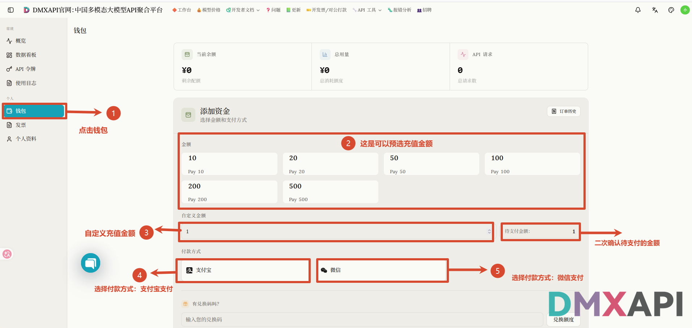
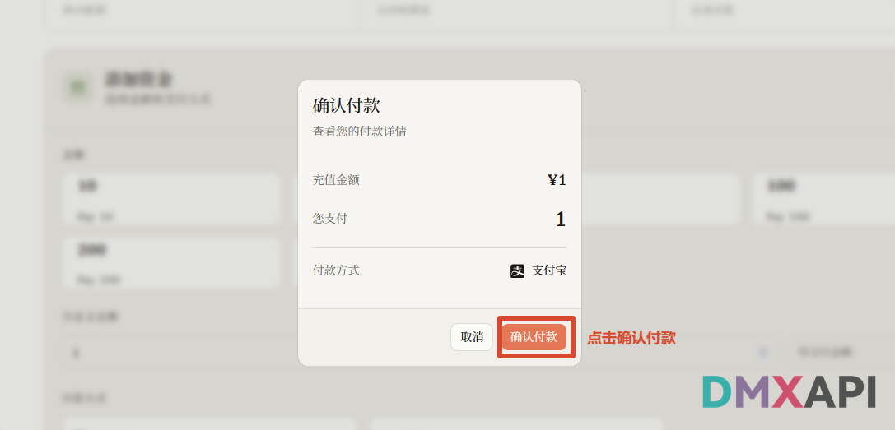
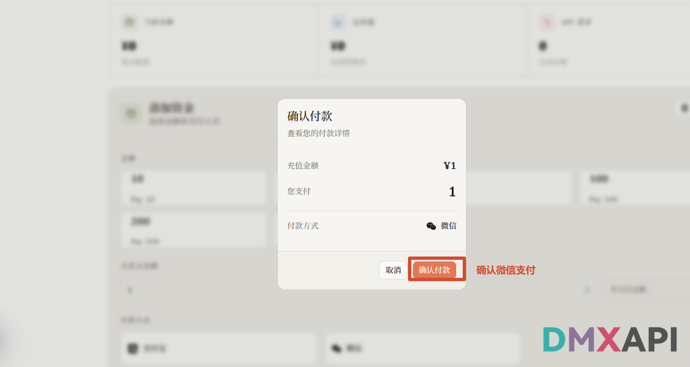

# DMXAPI 新用户充值教程

本文介绍在 DMXAPI 工作台通过钱包充值的完整流程，支持支付宝、微信两种付款方式

:::warning 注意
本教程仅适用于**电脑端**，手机端无法进行充值，请使用电脑浏览器打开充值地址操作。
:::

## 充值地址

https://www.dmxapi.cn/wallet

## 充值方法

### 1. 进入钱包，选择金额与付款方式

在电脑浏览器打开充值地址 [https://www.dmxapi.cn/wallet](https://www.dmxapi.cn/wallet)（或登录官网进入工作台，点击左侧菜单的「钱包」），按图中编号操作：

1. 点击左侧菜单的「钱包」；
2. 在「添加资金」区域选择预设充值金额（10 / 20 / 50 / 100 / 200 / 500）；
3. 也可以在「自定义金额」中输入任意充值金额，并在右侧「待支付金额」处二次确认；
4. 付款方式选择「支付宝」支付；
5. 或选择「微信」支付。

### 2. 支付宝付款确认

选择支付宝后，会弹出「确认付款」窗口，核对充值金额与付款方式，点击「确认付款」，然后完成扫码支付即可。

### 3. 微信付款确认

选择微信后，同样核对「确认付款」窗口中的充值金额与付款方式，点击「确认付款」，然后完成扫码支付即可。

---

  <small>© 2026 DMXAPI 充值教程</small>

