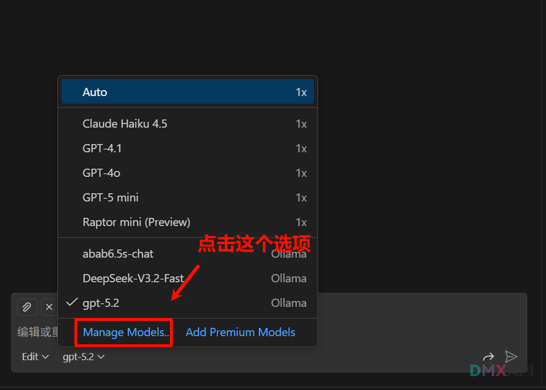
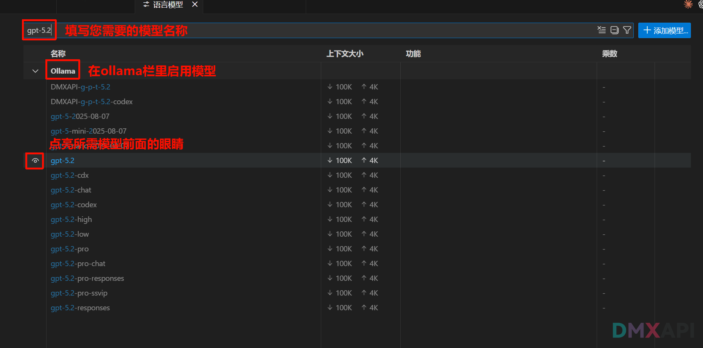
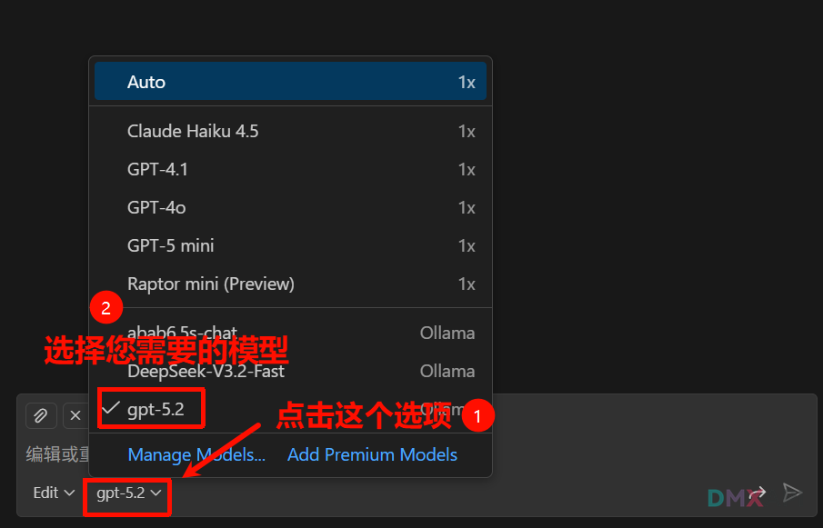
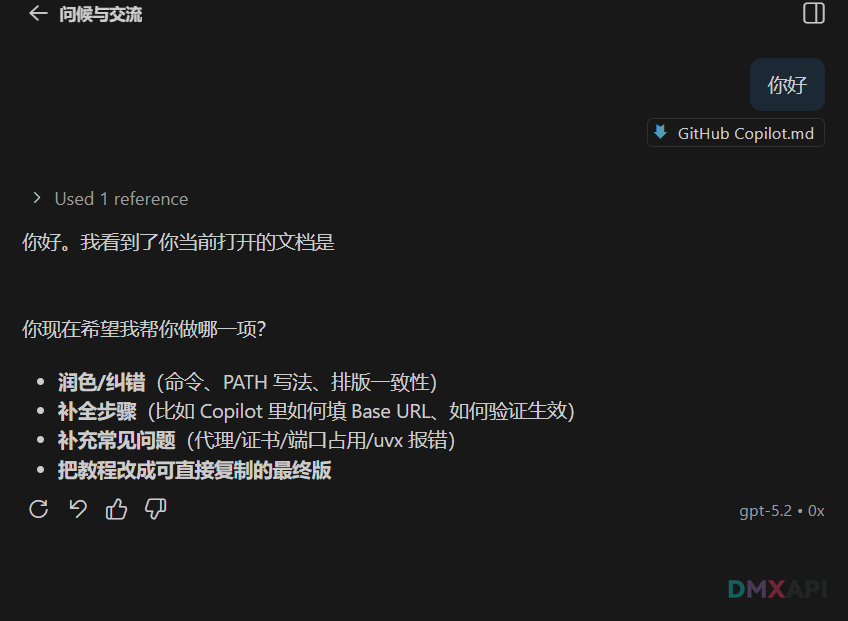

# GitHub Copilot 配置 自定义 API 教程


## 第一步：安装 UV 工具

### 1. 执行安装命令

```bash
powershell -ExecutionPolicy ByPass -c "irm https://astral.sh/uv/install.ps1 | iex"
```

### 2. 添加到 PATH

选择以下任一方式（替换 `你的用户名` 为实际用户名）：

**CMD:**
```cmd
set Path=C:\Users\你的用户名\.local\bin;%Path%
```

**PowerShell:**
```powershell
$env:Path = "C:\Users\你的用户名\.local\bin;$env:Path"
```

### 3. 验证安装
显示版本号即安装成功

```bash
uv -V
```


### 4. 修改存储路径（可选但推荐）

默认路径在 C 盘用户目录下，可改到其他盘。

#### 查看当前路径

```bash
uv cache dir    # 缓存目录
uv python dir   # Python 目录
uv tool dir     # 工具目录
```

#### 设置新路径

右键「此电脑」→「属性」→「高级系统设置」→「环境变量」

在「系统变量」区域点「新建」，添加以下变量：

| 变量名 | 示例值 |
|:------:|:------:|
| UV_CACHE_DIR | D:\uv_cache |
| UV_PYTHON_INSTALL_DIR | D:\uv_python |
| UV_TOOL_DIR | D:\uv_tools |

### 5. 验证配置生效

重启终端后执行：

```bash
uv python dir
uv cache dir
uv tool dir
```

确认输出为新设置路径。


## 第二步：运行转换程序

> **注意**：替换 `your_api_key` 为您的密钥，并保持终端运行

```bash
uvx oai2ollama --api-key your_api_key --base-url https://www.dmxapi.cn/v1
```


## 第三步：配置 VSCode

1. 在 VSCode 中打开 Copilot 聊天页面

   

2. 配置您需要的模型

   

3. 选择您需要的模型

   

4. 发送「您好」进行测试

   


<p align="center">
  <small>© 2026 GitHub Copilot 配置 自定义 API 教程</small>
</p>
