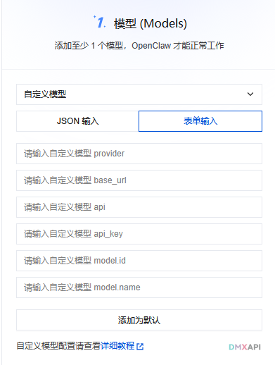
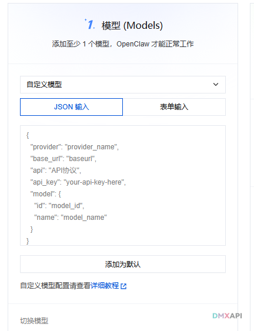
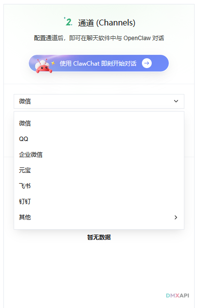
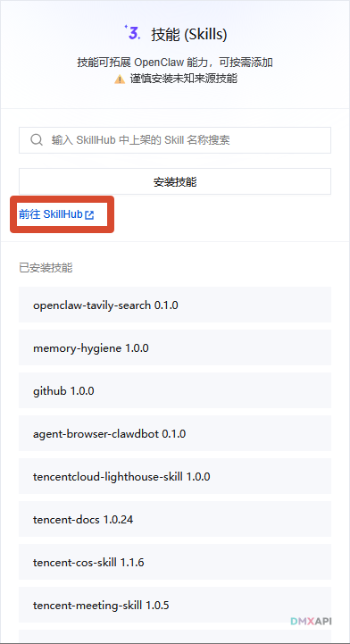
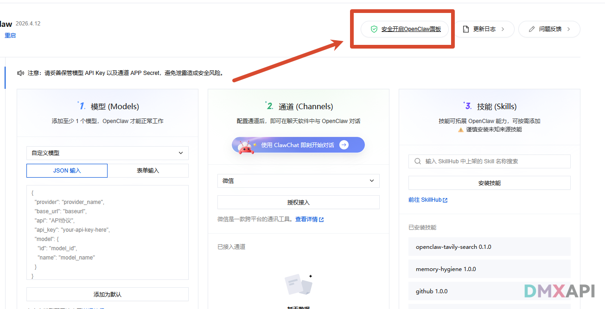
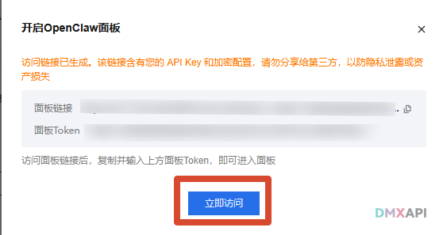
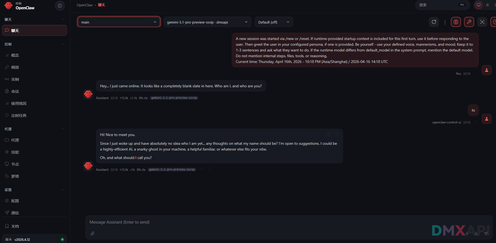

# 腾讯云OpenClaw 配置 DMXAPI 使用教程

## 第一步：配置模型

OpenClaw 需要至少添加 1 个模型才能正常工作。在「自定义模型」中选择输入方式，支持**表单输入**（配置单个模型）和 **JSON 输入**（一次配置多个模型）两种方式。

---

### 方式一：表单输入（单个模型）

逐项填写各字段，完成后点击「添加为默认」保存：



- **provider**：填写 `dmxapi`

- **base_url**：根据你的账号类型填写对应地址：

  | 账号类型 | base_url |
  |---------|---------|
  | cn站用户 | `https://www.dmxapi.cn/v1` |
  | com站用户 | `https://www.dmxapi.com/v1` |
  | ssvip站用户 | `https://ssvip.dmxapi.com` |

- **api**：根据所配置的模型类型选择协议：
  - OpenAI 模型、Gemini 模型及其他兼容 OpenAI 格式的模型 → 填写 `openai-completions`
  - Claude 模型 → 填写 `anthropic-messages`

- **api_key**：填写你的 DMXAPI 密钥，可在 DMXAPI 工作台 → API 令牌页面获取。

- **model.id / model.name**：两个字段填写相同的模型名称（如 `gpt-5.4`、`claude-opus-4-6`）。请先在网站顶部模型价格页面确认模型存在后再填写。

---

### 方式二：JSON 输入（多个模型）

切换到 **JSON 输入**标签，`model` 字段改为数组形式，可一次添加多个模型：



```json
{
  "provider": "dmxapi",
  "base_url": "https://www.dmxapi.cn/v1",
  "api": "openai-completions",
  "api_key": "your-api-key-here",
  "model": [
    { "id": "model1", "name": "model1" },
    { "id": "model2", "name": "model2" },
    { "id": "model3", "name": "model3" },
    { "id": "model4", "name": "model4" }
  ]
}
```

- **base_url**：根据你的账号类型填写对应地址：

  | 账号类型 | base_url |
  |---------|---------|
  | cn站用户 | `https://www.dmxapi.cn/v1` |
  | com站用户 | `https://www.dmxapi.com/v1` |
  | ssvip站用户 | `https://ssvip.dmxapi.com` |

- **api_key**：填写你的 DMXAPI 密钥，可在 DMXAPI 工作台 → API 令牌页面获取。

- **api**：该字段决定该组所有模型使用的请求协议，同一组内的模型必须协议一致：
  - 填写 `openai-completions` → 所有模型须兼容 OpenAI 格式（适用于 OpenAI、Gemini 及其他兼容模型）
  - 填写 `anthropic-messages` → 只能配置 Claude 模型


## 第二步：配置通道

模型配置完成后，可以将 OpenClaw 接入各类聊天软件，实现在对话平台中直接使用 AI。支持接入的平台如图所示，具体接入方式请参考官方文档进行配置。



## 第三步：安装 Skill

点击图中蓝色文字链接，按照官方指引安装所需的 Skill。



## 第四步：开始使用

模型、通道、Skill 配置完成后，点击右上角「安全开启 OpenClaw 面板」按钮。



弹窗中会生成面板链接和面板 Token，复制并输入 Token 后点击「立即访问」进入聊天面板。



进入聊天页面，发送消息测试，AI 正常回复即表示配置成功，可以开始使用了。



<p align="center">
  <small>© 腾讯云OpenClaw 配置 DMXAPI 使用教程</small>
</p>


