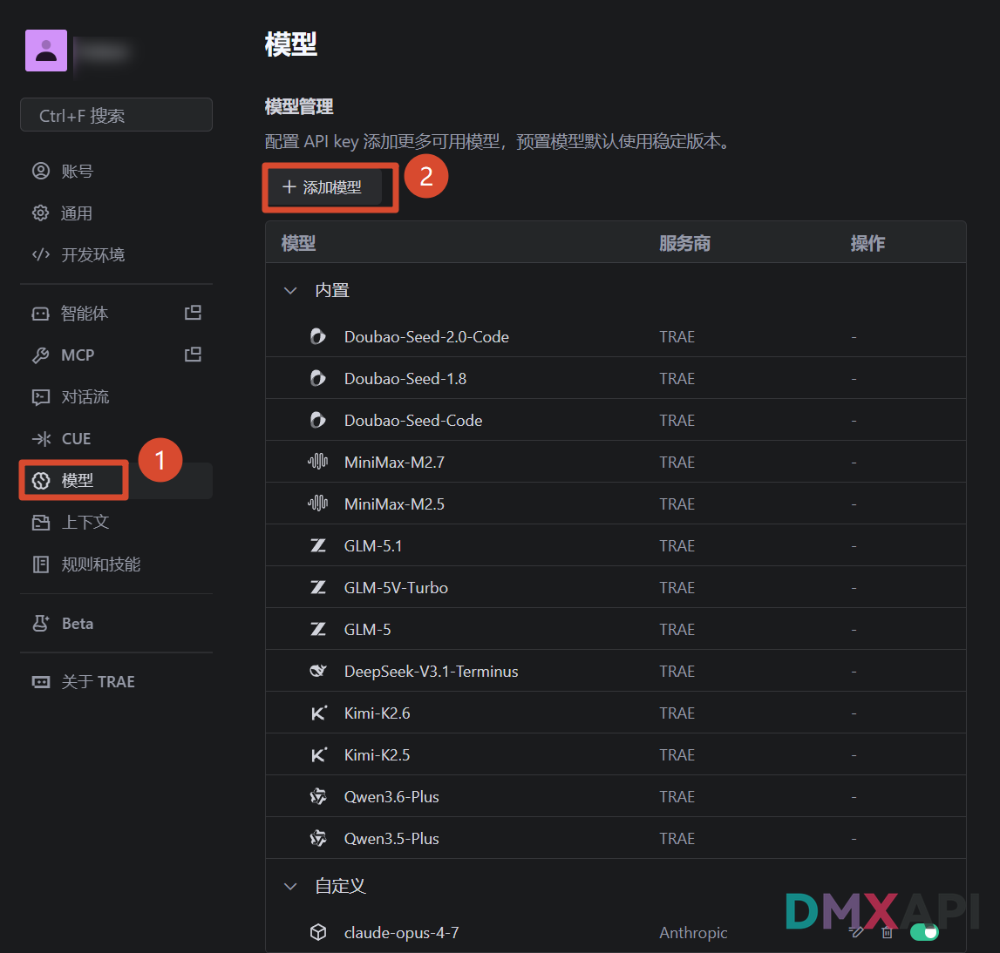
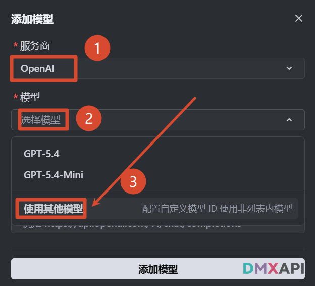
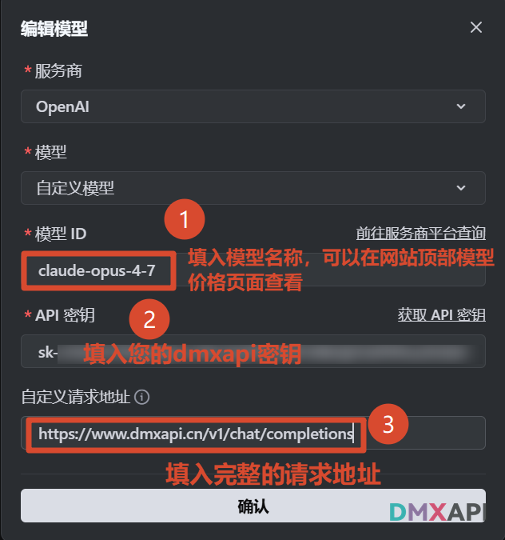
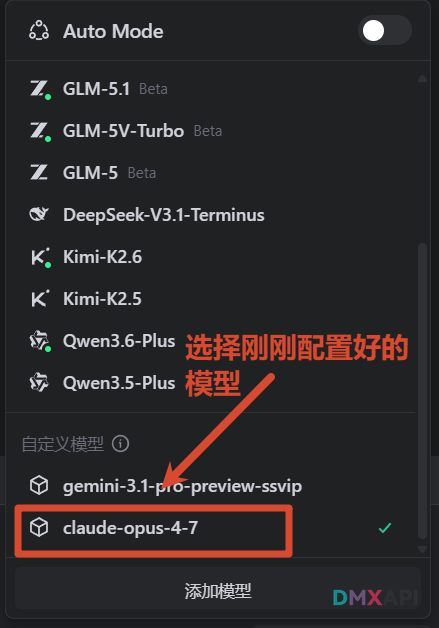
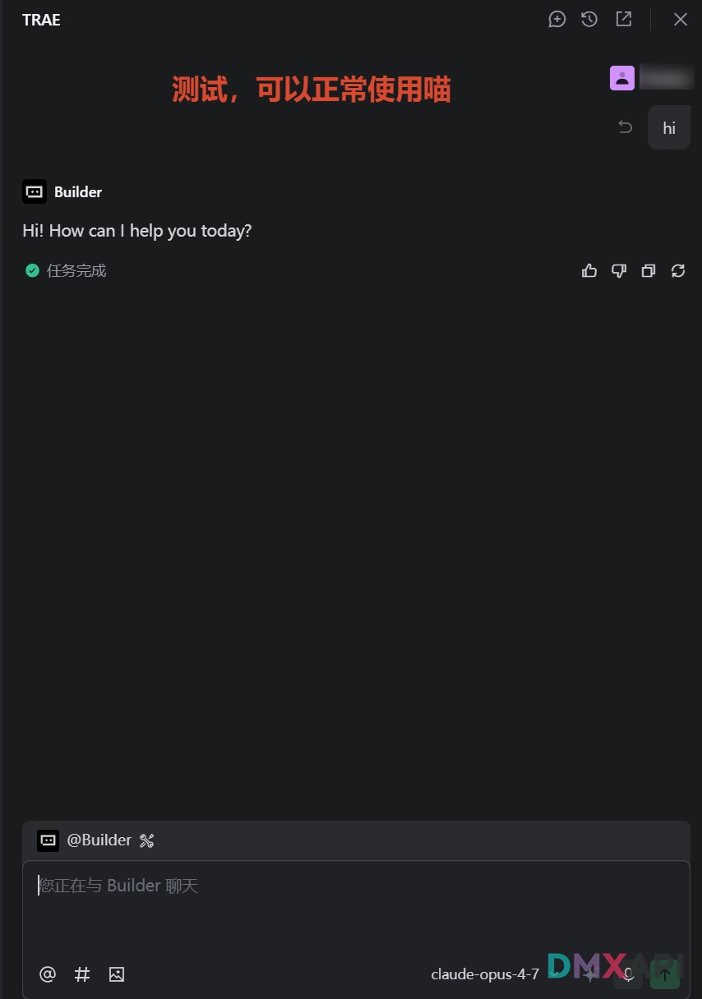

# Trae 客户端配置方法

Trae 是一款 AI 驱动的编程工作台（IDE / 编码助手），内置 Builder 智能体、对话流、MCP 等功能，支持通过「自定义模型」接入任意 OpenAI 兼容的 API 服务。

::: tip
编程类应用 tokens 消耗量较大，请留意 tokens 消耗。
:::

## 第一步 进入模型管理，点击「添加模型」

在 Trae 左侧菜单中选择「模型」进入模型管理页面，点击顶部的「+ 添加模型」按钮。

## 第二步 选择服务商并点击「使用其他模型」

在「添加模型」弹窗中：服务商选择 `OpenAI`，展开「模型」下拉后，选择底部的「使用其他模型」以配置自定义模型 ID。

## 第三步 填写模型 ID、API 密钥与请求地址

在「编辑模型」页面按以下信息填写：

- **模型 ID**：填入您需要使用的模型名称（如 `claude-opus-4-7`），可在 DMXAPI 网站顶部的「模型价格」页面查看并复制
- **API 密钥**：填入您的 DMXAPI 密钥
- **自定义请求地址**：根据您所使用的站点填写**完整**的请求路径
  - cn 站：`https://www.dmxapi.cn/v1/chat/completions`
  - com 站：`https://www.dmxapi.com/v1/chat/completions`
  - ssvip 站：`https://ssvip.dmxapi.com/v1/chat/completions`

填写完成后点击「确认」保存。

## 第四步 在对话界面选择配置好的模型

回到对话界面，点击输入框右下角的模型选择下拉框，在「自定义模型」分组中选中刚刚配置好的模型。

## 第五步 发送消息测试

在 Builder 对话中发送一条测试消息（如 `hi`），收到模型正常回复即表示配置成功，可以开始愉快地使用 Trae 进行 AI 编程。

  <small>© 2026 DMXAPI Trae 客户端配置教程</small>

