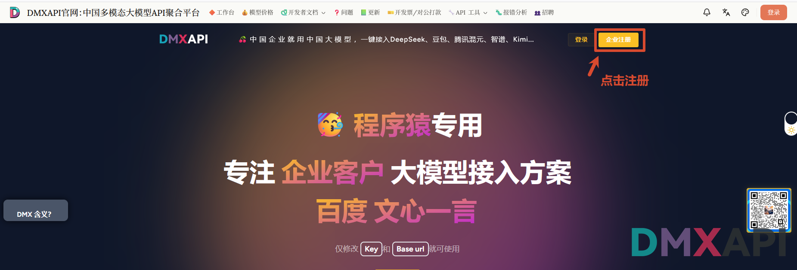
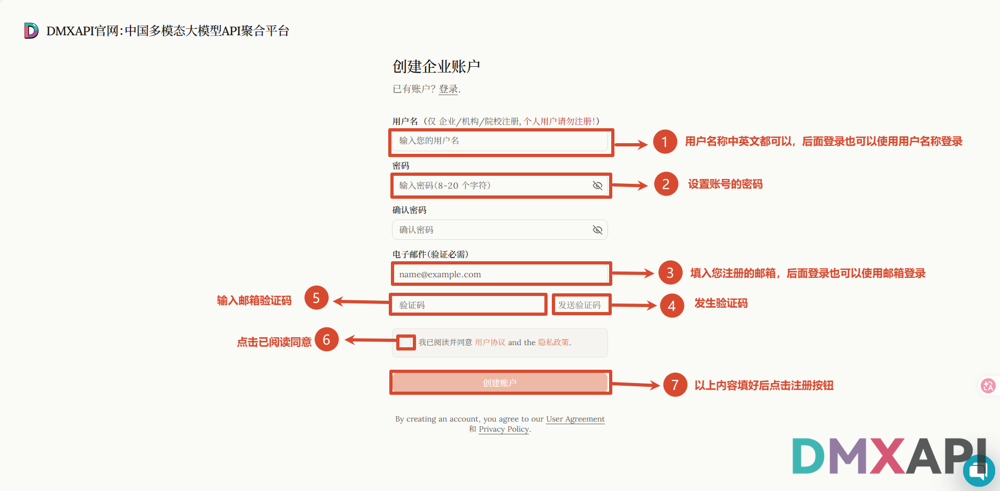
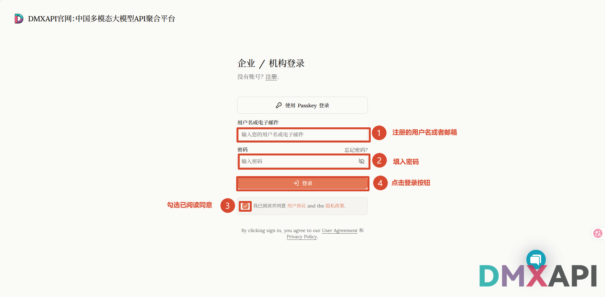
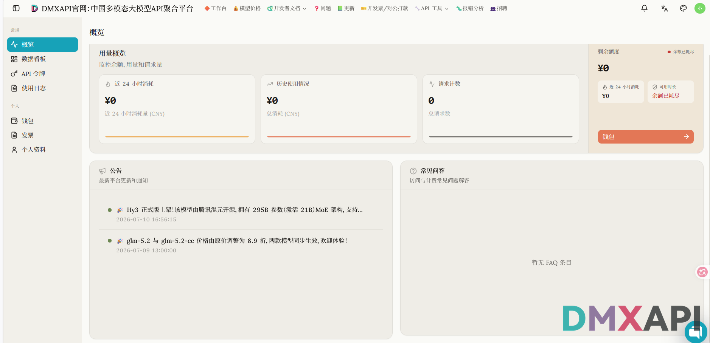

# DMXAPI 新用户注册教程

本文介绍在 DMXAPI 官网注册企业账户并登录工作台的完整流程。

## 网址

https://www.dmxapi.cn/

## 注册方法

### 1. 打开官网，点击「企业注册」

打开 [DMXAPI 官网](https://www.dmxapi.cn/)，点击右上角的「企业注册」按钮。

### 2. 填写注册信息

进入「创建企业账户」页面，按图中编号依次填写：

1. **用户名**：中英文都可以，后面登录时也可以直接使用用户名登录（仅限企业/机构/院校注册，个人用户请勿注册）；
2. **密码**：设置账号密码（8-20 个字符），并在「确认密码」中再次输入；
3. **电子邮件**：填入您的注册邮箱，后面登录时也可以使用邮箱登录；
4. 点击「发送验证码」，系统会向该邮箱发送验证码；
5. **验证码**：输入邮箱收到的验证码；
6. 勾选「我已阅读并同意用户协议和隐私政策」；
7. 以上内容填好后，点击「创建账户」完成注册。

### 3. 登录账户

注册完成后进入「企业 / 机构登录」页面：

1. 输入注册的用户名或者邮箱；
2. 填入密码;
3. 勾选「我已阅读并同意用户协议和隐私政策」；
4. 点击「登录」按钮。

### 4. 进入工作台，注册完成

登录成功后进入工作台，可以查看用量概览、剩余额度等信息。注册完成，充值、申请 Key 以后就可以使用了。

---

  <small>© 2026 DMXAPI 注册教程</small>

