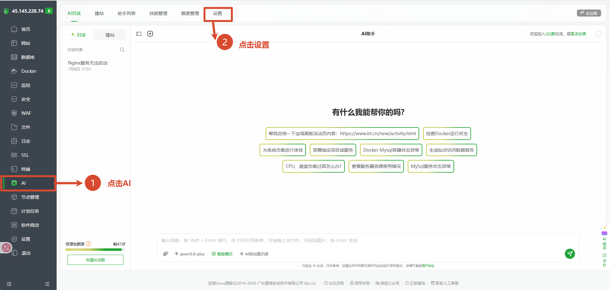
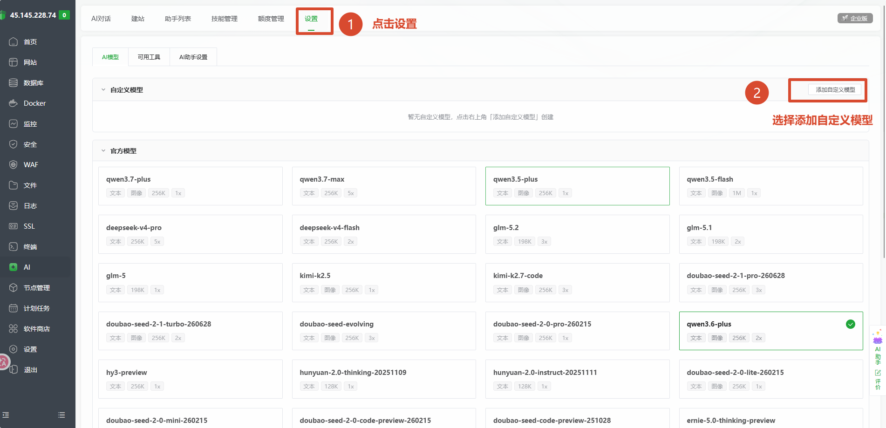
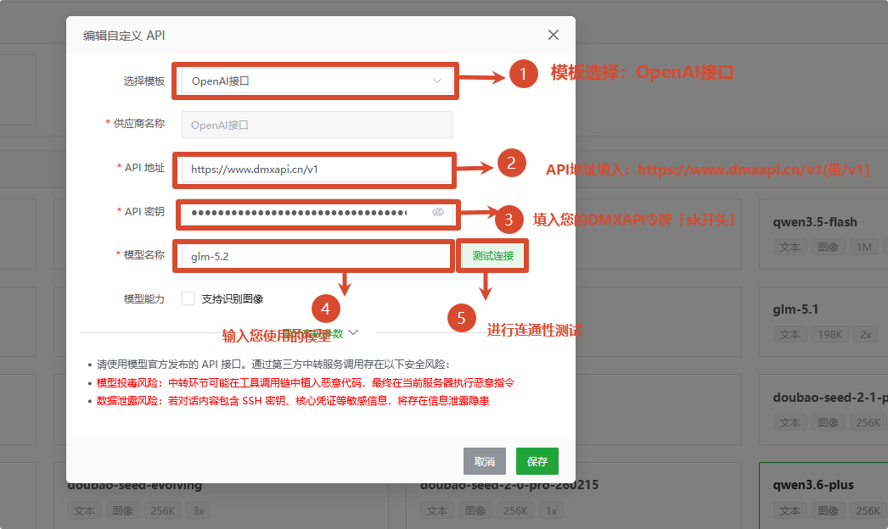
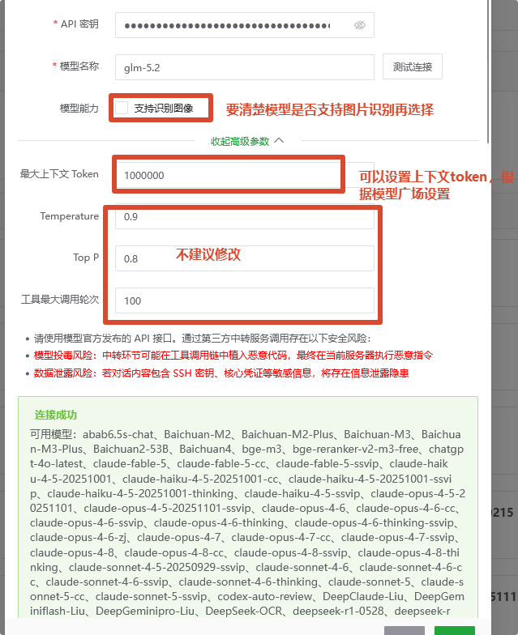
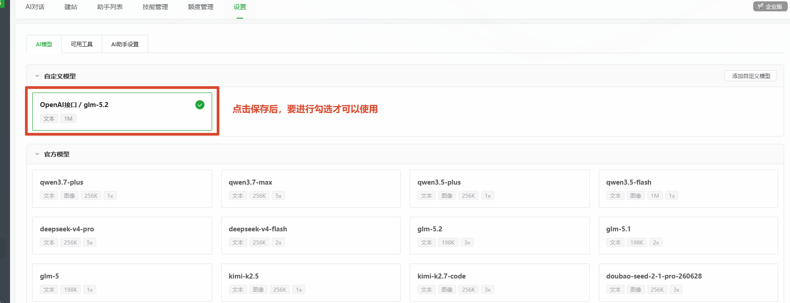
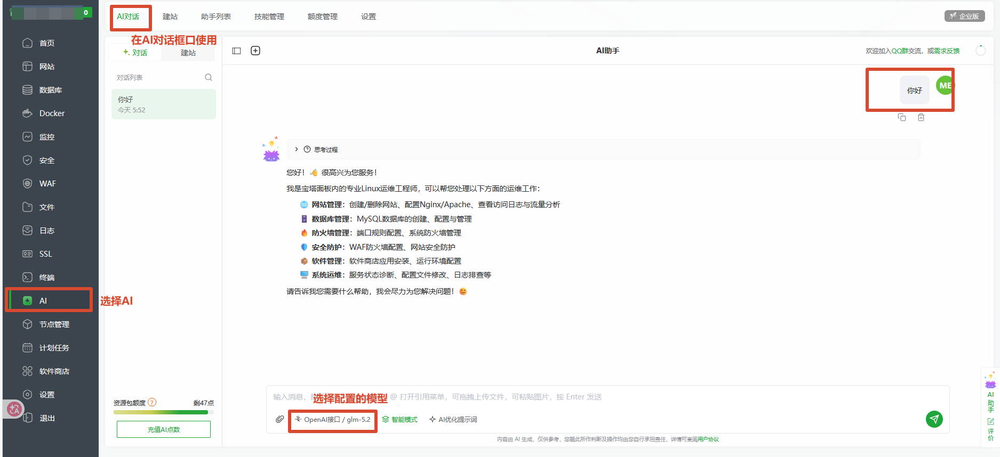

# 宝塔 AI 对话配置 DMXAPI 教程

宝塔面板（BT Panel）是一款广受欢迎的服务器运维管理面板，内置的 **AI 助手** 可以协助完成网站管理、数据库管理、防火墙配置、系统运维等工作。本文介绍如何通过「添加自定义模型」，将 DMXAPI 的模型接入宝塔 AI 对话中使用。

## 环境准备

在开始之前，请先完成以下准备：

- 已安装并登录 **宝塔面板**（左侧导航栏带有 **AI** 功能入口的版本）。
- 准备一个 DMXAPI 令牌（API Key），可在 [DMXAPI 控制台](https://www.dmxapi.cn/keys) 的「API 令牌」页获取。
- 在 [DMXAPI 模型广场](https://www.dmxapi.cn/rmb) 确认您要使用的模型名称及其上下文长度。

## 配置步骤

### 步骤 1：进入 AI 功能页面

登录宝塔面板，按截图中的编号操作：

- ① 点击左侧导航栏的 **「AI」**
- ② 点击顶部的 **「设置」** 选项卡

### 步骤 2：添加自定义模型

进入设置页面后，默认停留在 **「AI模型」** 子选项卡：

- ① 确认顶部已切换到 **「设置」**
- ② 点击「自定义模型」区域右上角的 **「添加自定义模型」**

### 步骤 3：填写自定义 API 信息

在弹出的「编辑自定义 API」窗口中按编号依次操作：

- ① **选择模板**：选择 **OpenAI接口**
- ② **API 地址**：填入 `https://www.dmxapi.cn/v1`（注意带 `/v1`）
- ③ **API 密钥**：填入您的 DMXAPI 令牌（`sk` 开头）
- ④ **模型名称**：输入您要使用的模型，例如 `glm-5.2`
- ⑤ 点击 **「测试连接」** 进行连通性测试

### 步骤 4：配置模型能力与高级参数

继续在同一窗口中完成以下配置：

- **模型能力**：勾选「支持识别图像」前，请先确认所选模型是否支持图片识别，再决定是否勾选
- **最大上下文 Token**：可根据 [模型广场](https://www.dmxapi.cn/rmb) 中该模型的上下文长度设置，例如 `1000000`
- **Temperature、Top P、工具最大调用轮次**：保持默认即可，不建议修改

测试连接通过后，窗口底部会显示 **「连接成功」** 及当前令牌的可用模型列表，确认无误后点击 **「保存」**。

### 步骤 5：勾选启用自定义模型

点击保存后，「自定义模型」区域会出现刚添加的模型卡片（如 `OpenAI接口 / glm-5.2`）：

- 需要 **勾选** 该模型卡片才可以使用，勾选成功后卡片右上角会显示绿色对勾

### 步骤 6：开始使用

回到 AI 对话界面进行验证：

- ① 点击左侧导航栏的 **「AI」**，切换到顶部的 **「AI对话」** 选项卡
- ② 在输入框下方的模型选择处，选择刚配置的模型（如 `OpenAI接口 / glm-5.2`）
- ③ 发送消息测试，模型正常回复即配置成功

  <small>© 2026 DMXAPI 宝塔 AI 对话教程</small>

