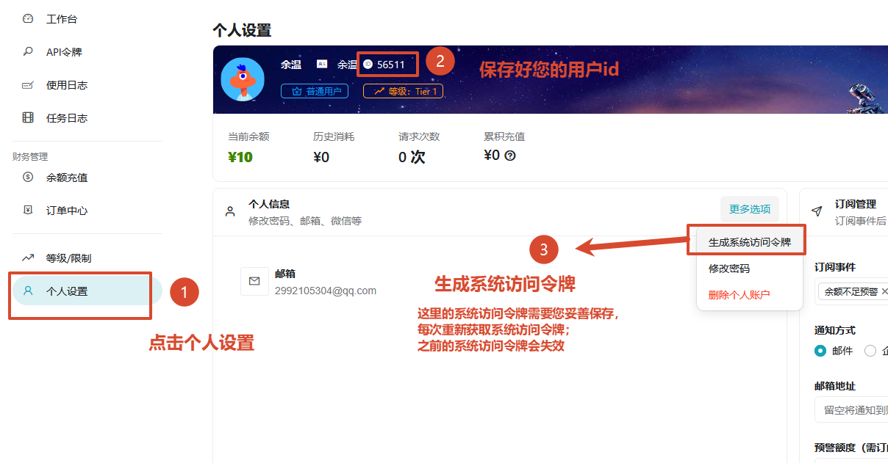
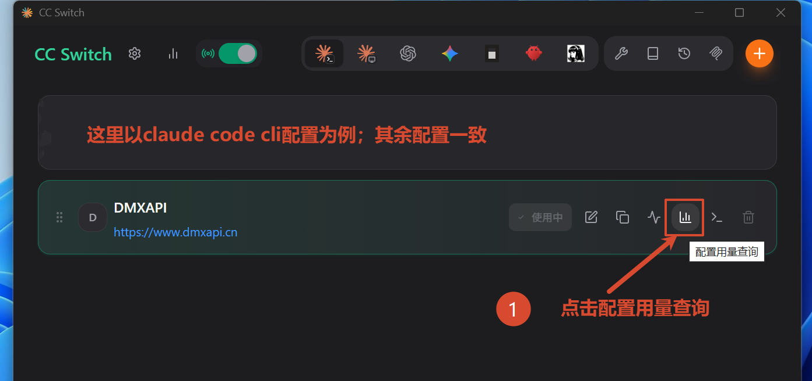
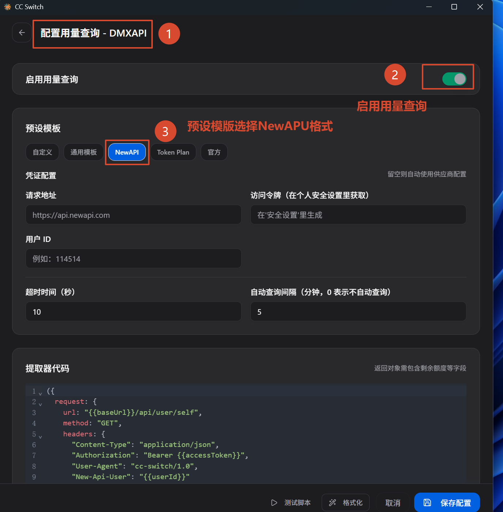
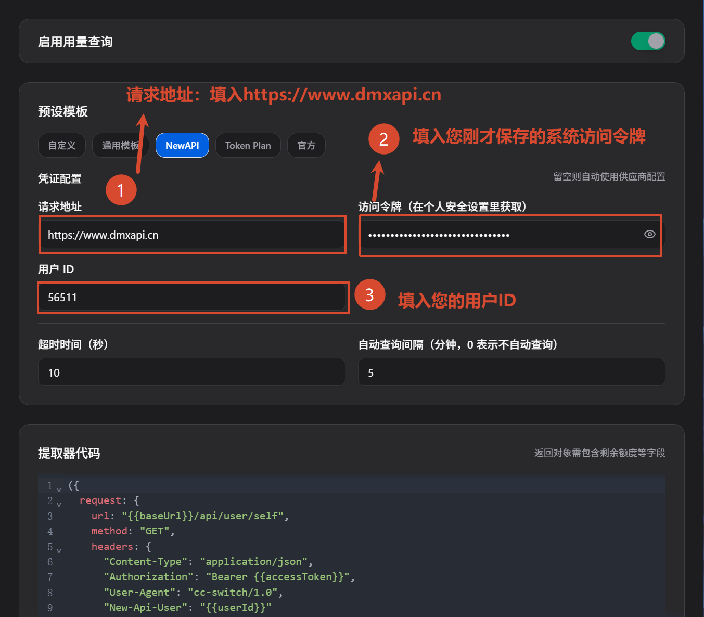
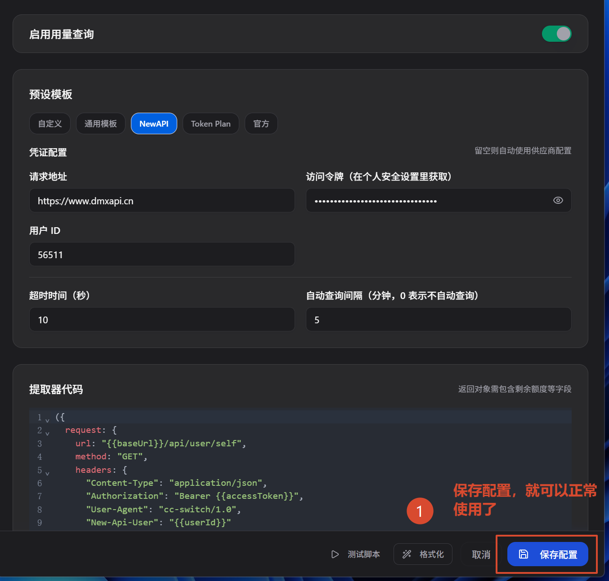
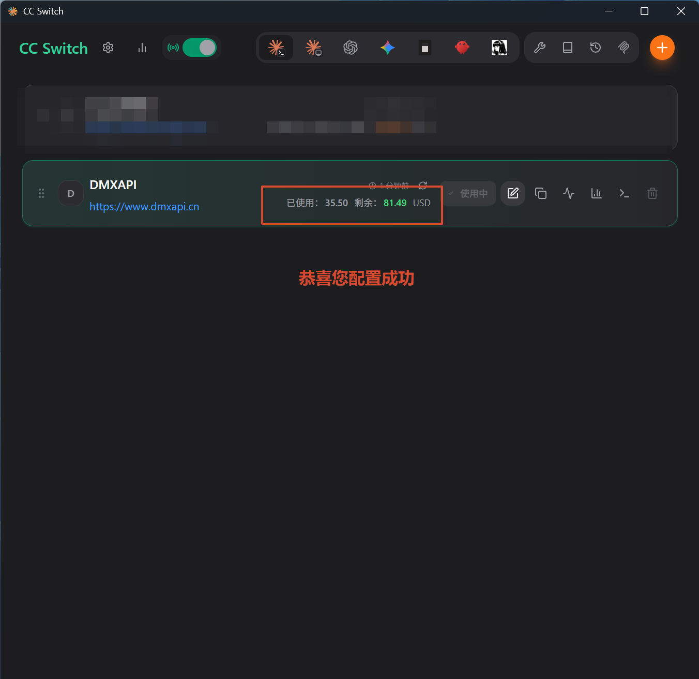

# CC Switch 余额查询教程

CC Switch 内置「配置用量查询」功能，接入 DMXAPI 后可在供应商卡片上实时查看账户的已用额度与剩余额度。本文介绍如何在 CC Switch 中配置 DMXAPI 的用量查询。

## 环境准备

在开始之前，请先完成以下准备：

- 下载 **CC Switch** 工具：前往 [CC Switch 项目仓库](https://github.com/farion1231/cc-switch) 下载并安装。
- 拥有一个 **DMXAPI 账户**：前往 [DMXAPI 官网](https://www.dmxapi.cn) 注册登录。

## 配置用量查询

### 步骤 1：获取用户 ID 与系统访问令牌

登录 [DMXAPI 官网](https://www.dmxapi.cn)，进入「个人设置」页面，按截图中的编号操作：

- ① 点击左侧菜单的 **「个人设置」**
- ② 记下页面顶部的**用户 id**（如截图中的 `56511`），稍后需要填入
- ③ 点击右侧 **「更多选项」→「生成系统访问令牌」**，并妥善保存生成的令牌

::: warning 注意
系统访问令牌请妥善保存，**每次重新获取都会使之前的令牌失效**。
:::

### 步骤 2：打开配置用量查询

打开 CC Switch，在 DMXAPI 供应商卡片上：

- ① 点击卡片右侧的 **「配置用量查询」**（柱状图）图标

> 本文以 Claude Code CLI 的配置为例，其余客户端的配置方式一致。

### 步骤 3：启用并选择预设模板

进入「配置用量查询 - DMXAPI」页面后：

- ① 打开 **「启用用量查询」** 开关
- ② 预设模板选择 **NewAPI** 格式

### 步骤 4：填写凭证配置

在「凭证配置」区域按编号填写：

- ① **请求地址**：填写 `https://www.dmxapi.cn`
- ② **访问令牌**：填写步骤 1 中保存的系统访问令牌
- ③ **用户 ID**：填写步骤 1 中记下的用户 id

### 步骤 5：保存配置

- ① 点击右下角的 **「保存配置」** 按钮

### 步骤 6：查看余额，配置完成

保存成功后，DMXAPI 供应商卡片上会显示 **「已使用 / 剩余 USD」** 的额度信息。恭喜你完成配置！

  <small>© 2026 DMXAPI CC Switch 余额查询教程</small>

