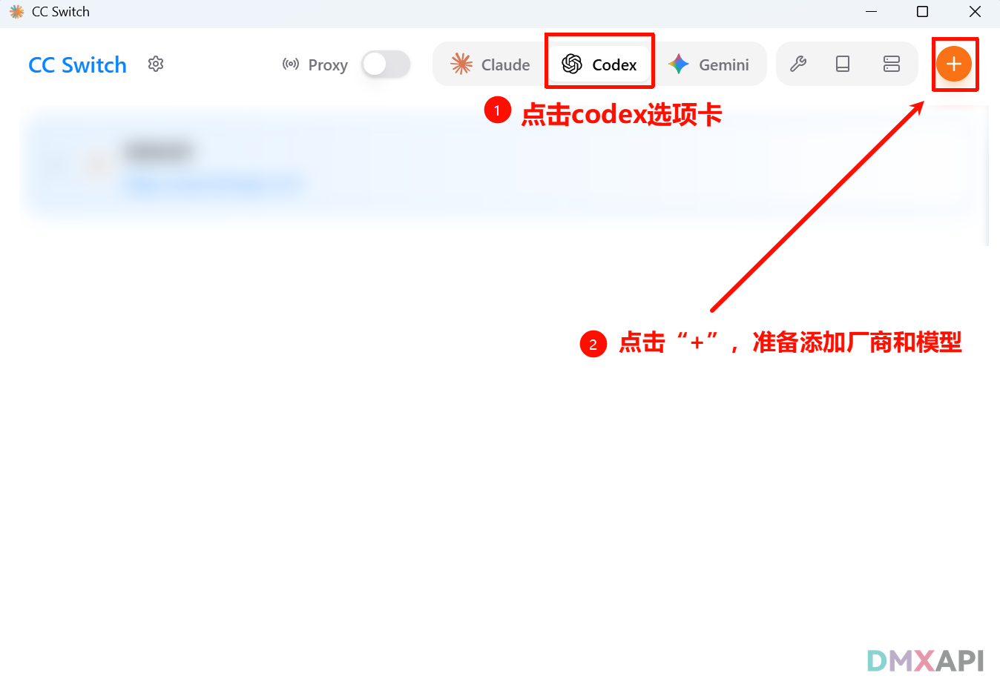
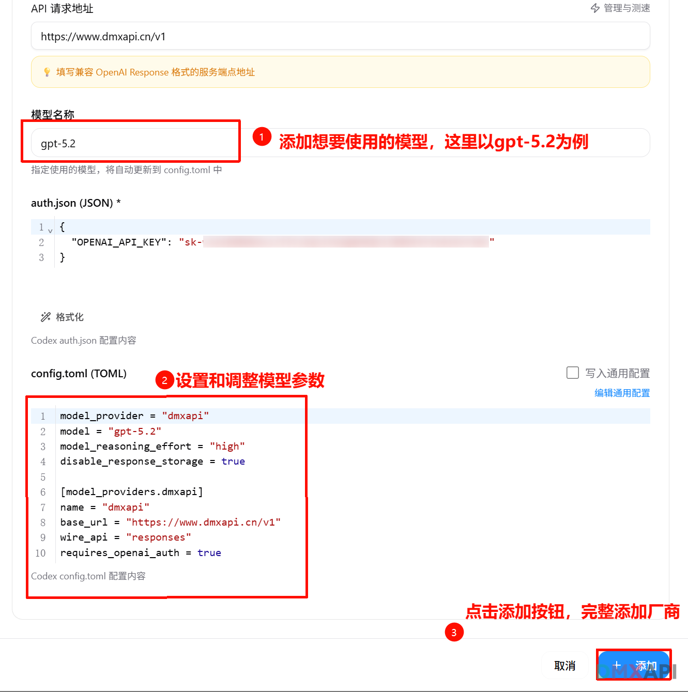
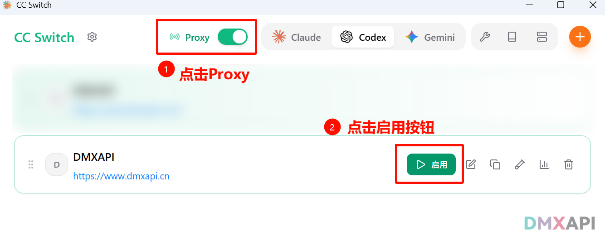
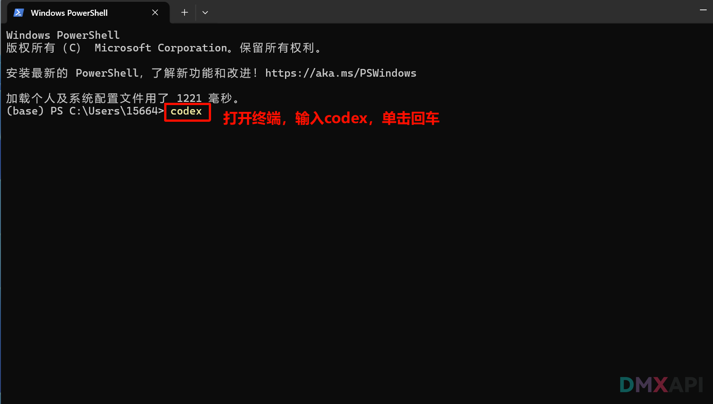
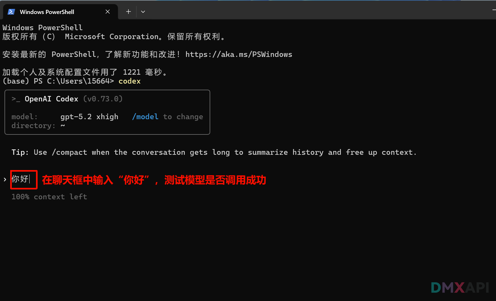
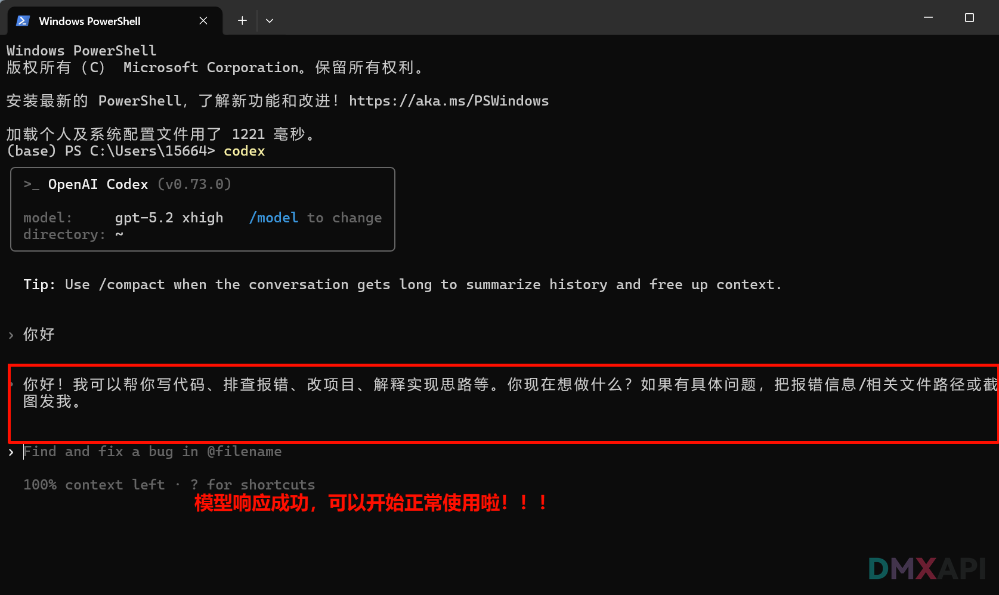

# cc-switch 配置codex教程

CC-Switch 是一款面向企业与开发者的高性能交换与流量调度组件，旨在为数据中心、边缘节点及云环境提供稳定、可扩展的网络转发能力。它支持多端口交换、VLAN 隔离、链路聚合与 QoS 策略，可按业务优先级进行带宽分配与拥塞控制，保障关键应用低时延运行。CC-Switch 兼容主流管理与自动化体系，提供可视化监控、告警与日志追踪，便于快速定位故障并优化网络。通过灵活的策略配置与模块化架构，CC-Switch 能在复杂拓扑中实现高可靠转发与弹性扩容，降低运维成本，提升整体网络效率。

## 下载与安装

下载地址：[cc_switch](https://github.com/farion1231/cc-switch)

## 配置 Codex

### 步骤 1：打开软件

选中 **Codex** 选项卡，点击 `+` 添加供应商。

### 步骤 2：选择模型厂商，配置 URL 和 Key

### 步骤 3：配置模型和模型参数

  

### 步骤 4：启动供应商

### 步骤 5：在终端打开 Codex

### 步骤 6：测试模型调用

### 步骤 7：开始使用

