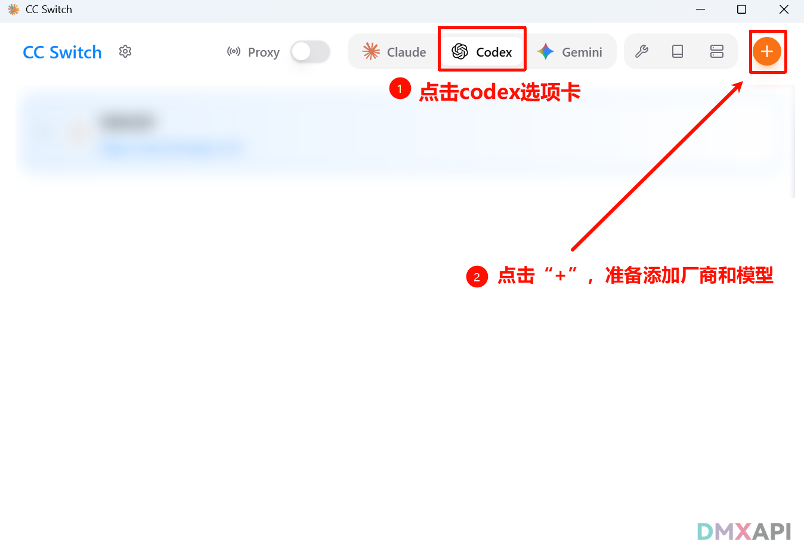
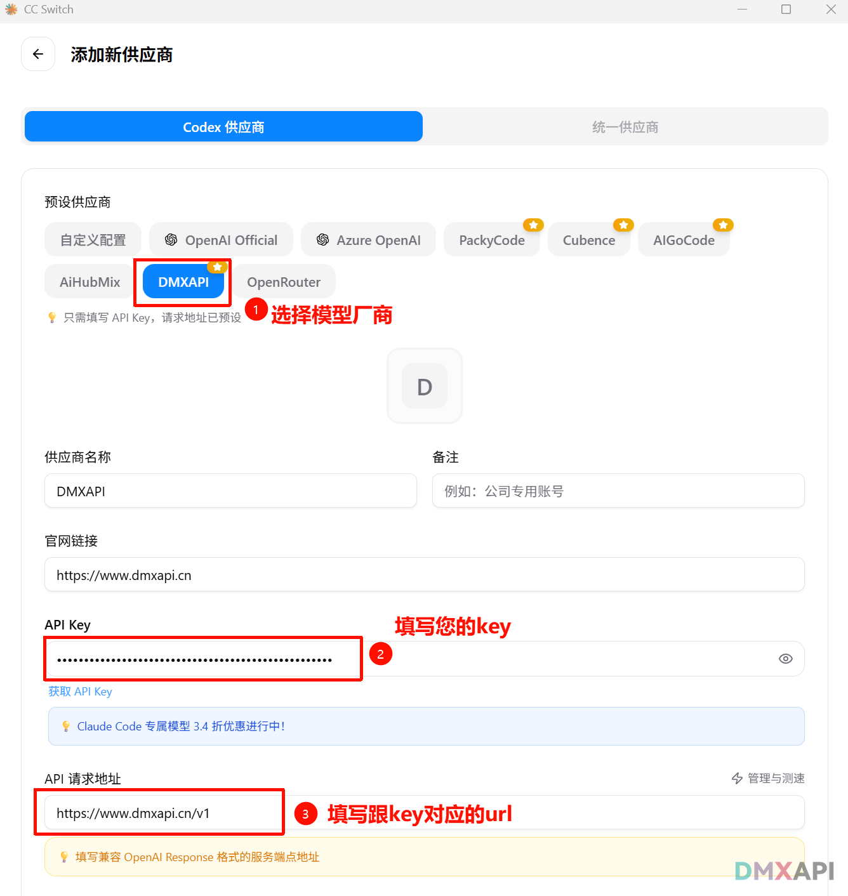
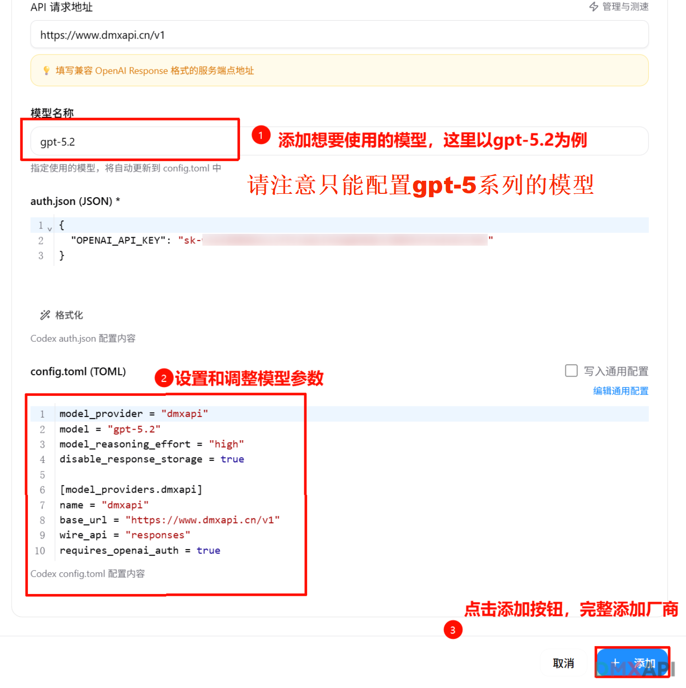
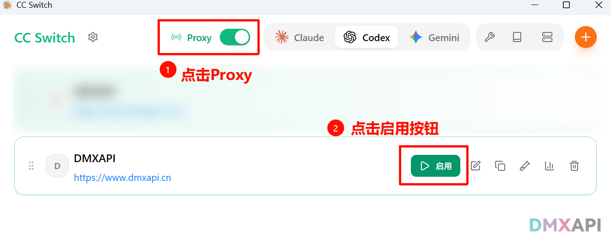
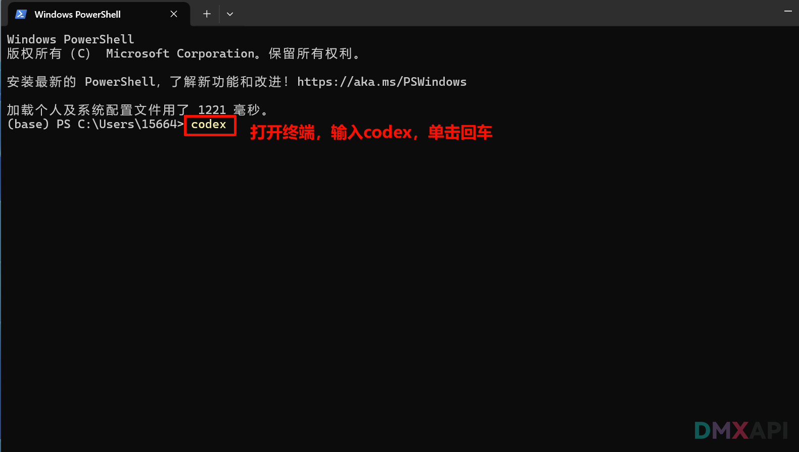
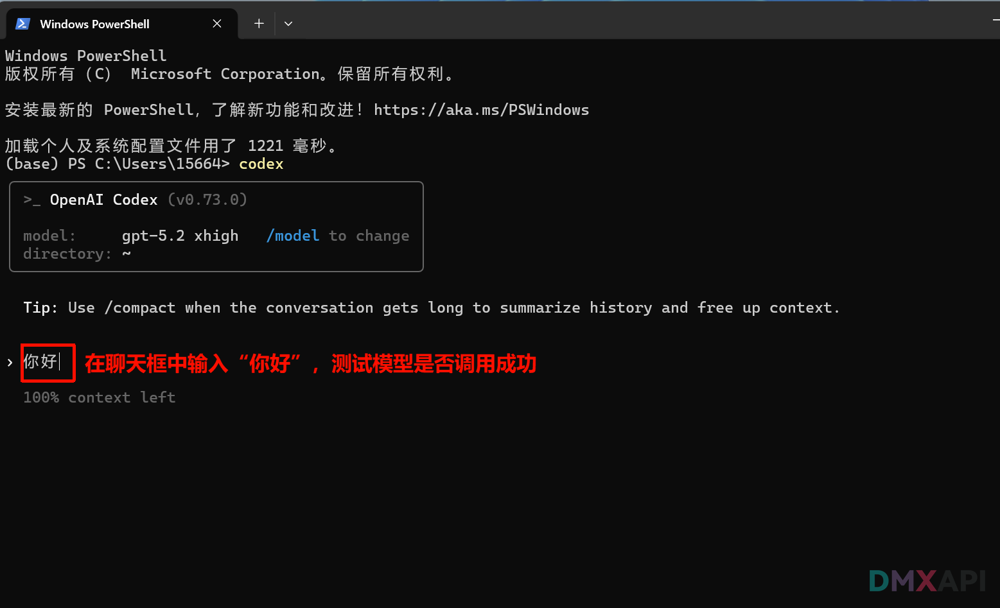
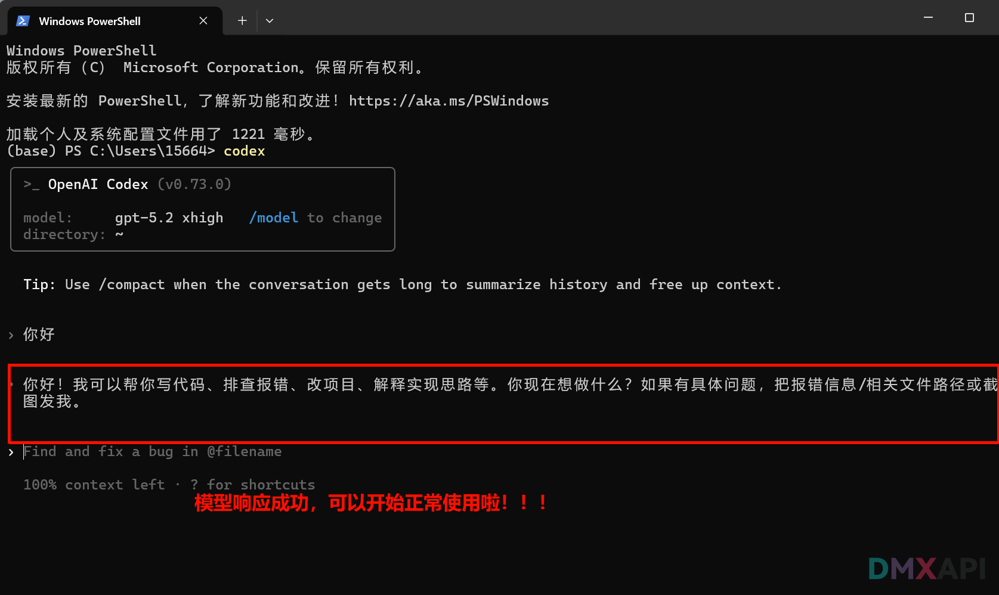

# cc-switch 配置codex教程

CC-Switch 是一款面向企业与开发者的高性能交换与流量调度组件，旨在为数据中心、边缘节点及云环境提供稳定、可扩展的网络转发能力。它支持多端口交换、VLAN 隔离、链路聚合与 QoS 策略，可按业务优先级进行带宽分配与拥塞控制，保障关键应用低时延运行。CC-Switch 兼容主流管理与自动化体系，提供可视化监控、告警与日志追踪，便于快速定位故障并优化网络。通过灵活的策略配置与模块化架构，CC-Switch 能在复杂拓扑中实现高可靠转发与弹性扩容，降低运维成本，提升整体网络效率。

::: warning 注意
Codex 仅支持配置 **GPT-5 系列** 模型（如 `gpt-5.5`），请勿填写其他系列的模型，否则将无法正常调用。
:::

::: tip 建议
为防止 Codex 在使用过程中调用到非用户想定系列模型，建议前往 DMXAPI 控制台编辑您的令牌，**启用「模型限制」并选定 `gpt-5.5`**（或其他 GPT-5 系列模型）。
:::

## 创建带模型限制的令牌（推荐）

按照以下步骤创建一个仅允许调用 GPT-5 系列模型的专用令牌，避免 Codex 误调用其他模型造成意外消费。

**1. 进入 API 令牌页面**

登录 [DMXAPI 控制台](https://www.dmxapi.cn/)，进入左侧菜单的「API 令牌」页，点击「添加令牌」按钮。

**2. 填写基本信息**

在弹出的「创建新的令牌」对话框中：

- ① 自定义令牌名称（例如 `codex测试`），方便后续识别。
- ② 选择令牌过期时间（如「永不过期」、「一个月」等，按需选择）。
- ③ 令牌渠道分组保持默认的 `default` 即可。

**3. 启用模型限制并提交**

继续在同一对话框中下滑到「安全设置」：

- ① 按需设置令牌额度（不需要可保留默认 `∞`）。
- ② 按需设置令牌次数限制。
- ③ **勾选「启用模型限制」**，在下方搜索并选定 `gpt-5.5`（Codex 仅支持 GPT-5 系列模型）。
- ④ 点击「提交」按钮保存。

**4. （可选）为已有令牌补充模型限制**

如果不想新建令牌，也可以在令牌列表中点击已有令牌的编辑按钮，在弹出的「更新令牌信息」对话框中同样勾选「启用模型限制」并选定 `gpt-5.5`，然后点击「提交」保存即可。

创建或更新完成后，将该令牌的 Key（`sk-...`）填入下文 cc-switch 的供应商配置中即可。

## 下载与安装

下载地址：[cc_switch](https://github.com/farion1231/cc-switch)

## 配置 Codex

### 步骤 1：打开软件

选中 **Codex** 选项卡，点击 `+` 添加供应商。

### 步骤 2：选择模型厂商，配置 URL 和 Key

### 步骤 3：配置模型和模型参数

  

### 步骤 4：启动供应商

### 步骤 5：在终端打开 Codex

### 步骤 6：测试模型调用

### 步骤 7：开始使用

