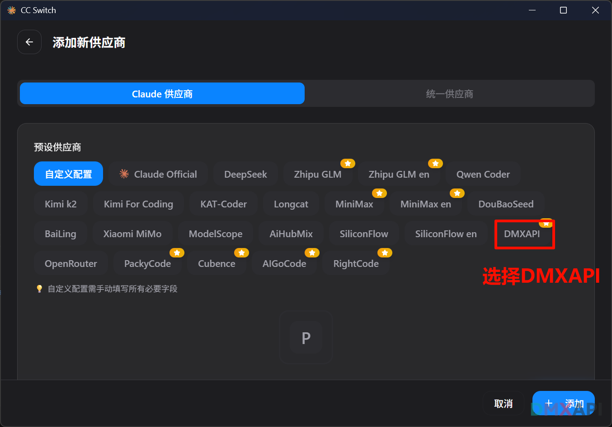
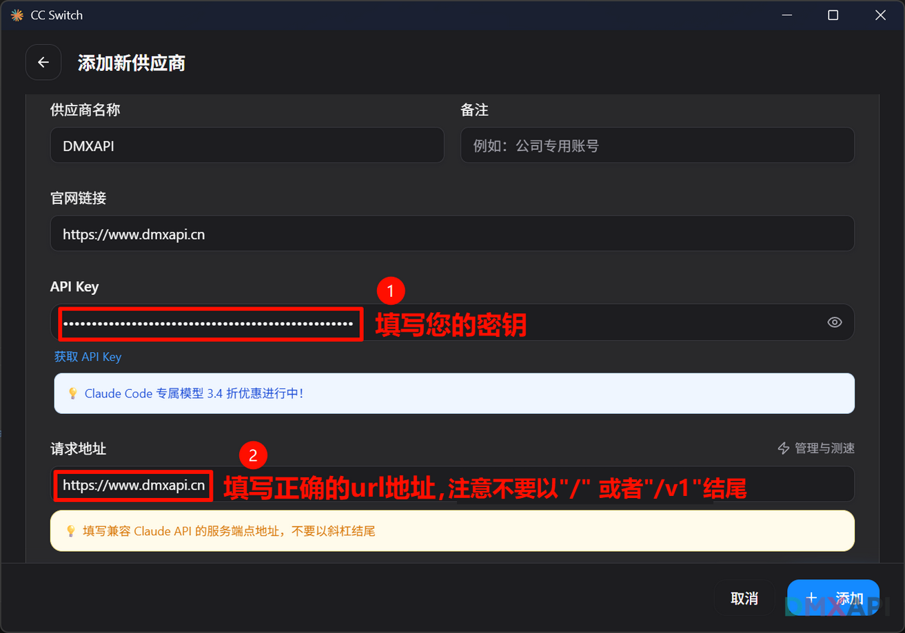
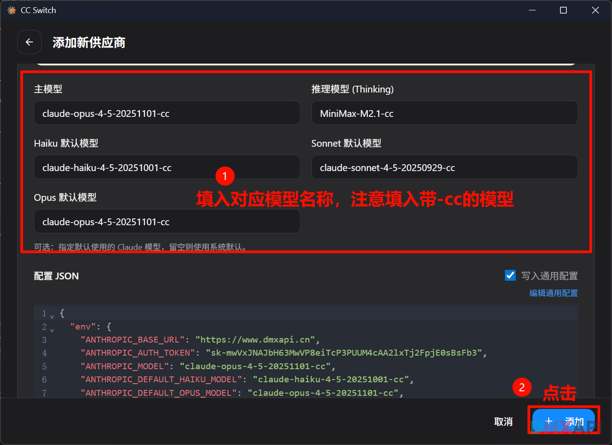
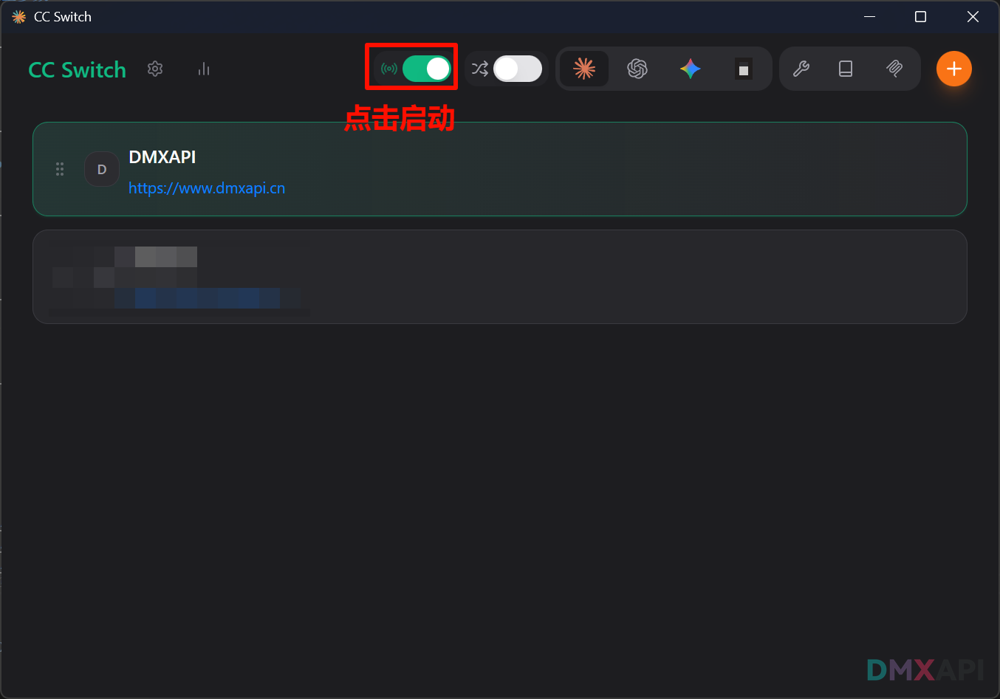
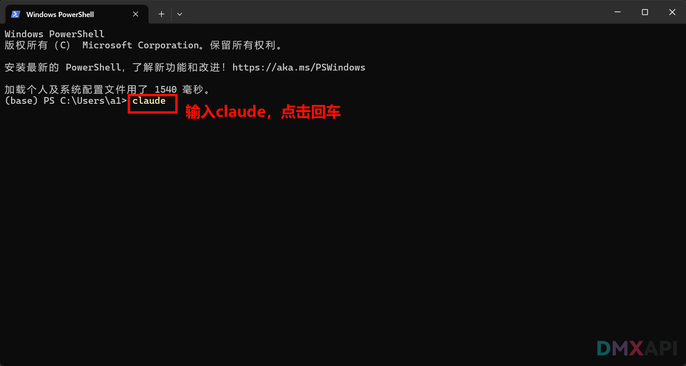
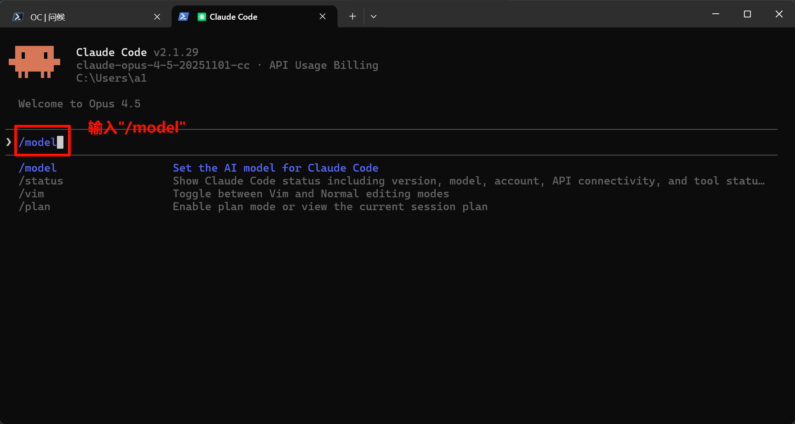
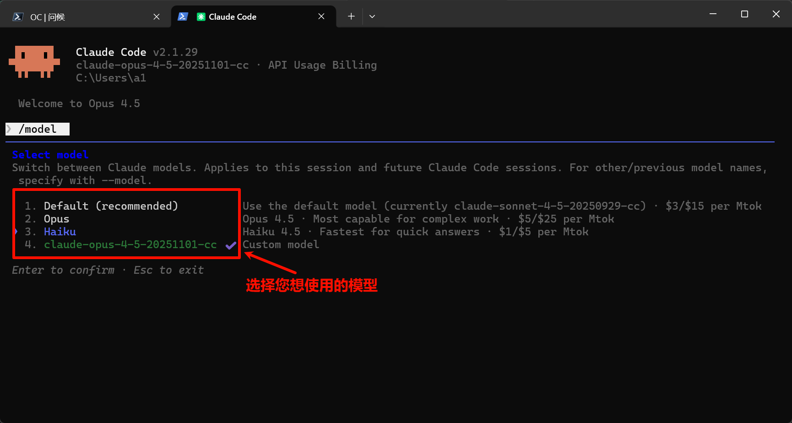
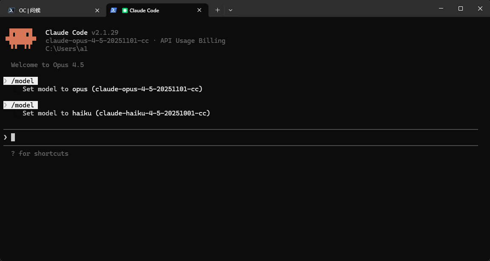

# CC Switch 配置claude code教程
CC-Switch 是一款面向企业与开发者的高性能交换与流量调度组件，旨在为数据中心、边缘节点及云环境提供稳定、可扩展的网络转发能力。它支持多端口交换、VLAN 隔离、链路聚合与 QoS 策略，可按业务优先级进行带宽分配与拥塞控制，保障关键应用低时延运行。CC-Switch 兼容主流管理与自动化体系，提供可视化监控、告警与日志追踪，便于快速定位故障并优化网络。通过灵活的策略配置与模块化架构，CC-Switch 能在复杂拓扑中实现高可靠转发与弹性扩容，降低运维成本，提升整体网络效率。

## 环境准备
在开始之前，请先安装并验证以下基础环境：

- Node.js（含 `npm`），推荐 `v18+`：<https://nodejs.org/>
- Git（建议 `v2.40+`）：<https://git-scm.com/>

验证安装是否成功：

```bash
node -v
npm -v
git --version
```


## 安装 Claude Code

```bash
# windows 建议在 管理员权限PowerShell 里使用
npm install -g @anthropic-ai/claude-code
# 查看版本 验证安装成功
claude --version
```

## 配置 claude code

### 步骤 1：选择 claude，点击 `+` 添加供应商


### 步骤 2：选择 DMXAPI 选项卡



### 步骤 3：填写 API Key 和 URL


### 步骤 4：配置模型名称
::: tip

claude code 只能添加模型广场claude code 专区中以-cc结尾的模型，这部分模型我们做了适配。
[详情点击查看](https://www.dmxapi.cn/rmb)

:::



### 步骤 5：启动服务



### 步骤 6：在终端中使用 claude code



### 步骤 7：测试连接

输入 `你好`，模型返回内容，配置成功！


### claude code中切换模型的方法

#### 聊天框里输入 `/model`


#### 选择模型


#### 切换模型后的页面



<p align="center">
  <small>© 2026 DMXAPI CC Switch配置claude code教程</small>
</p>