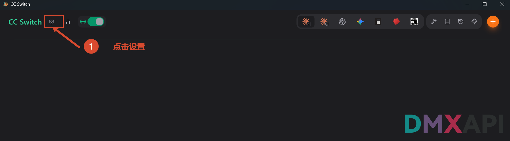
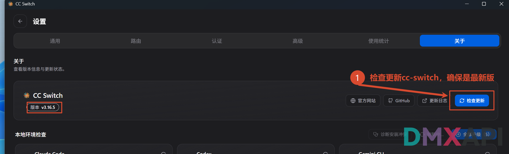
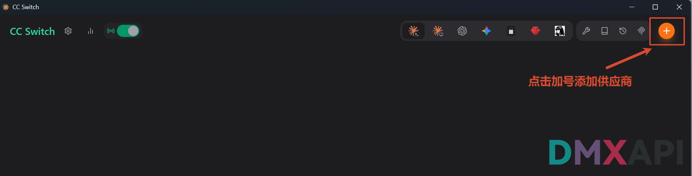
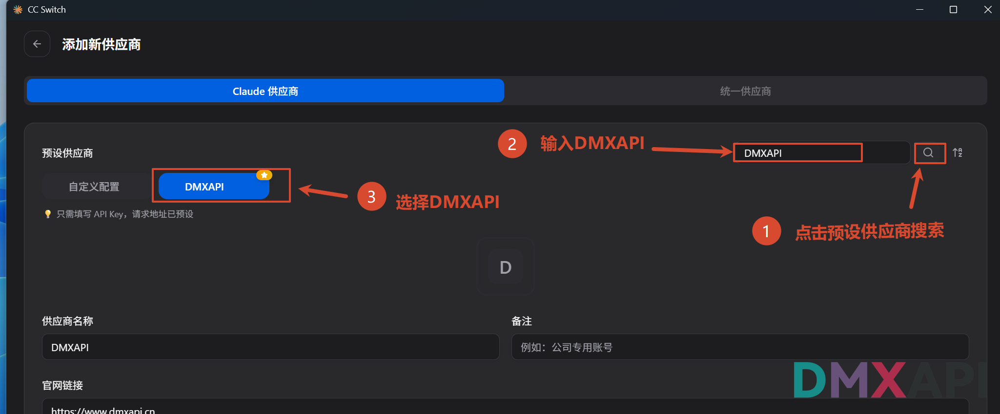
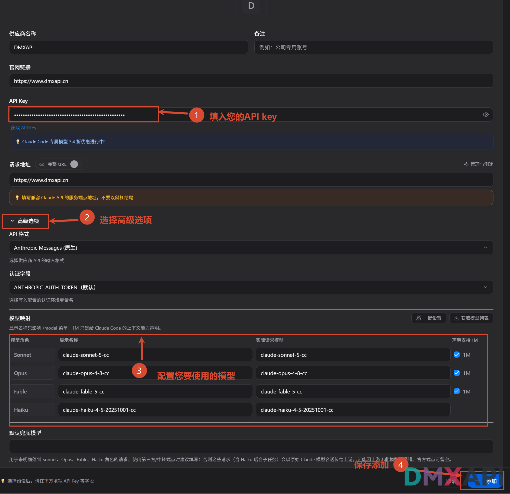
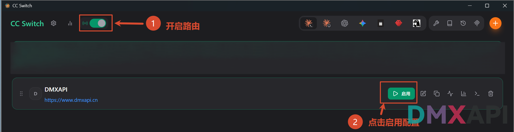

# CC Switch 配置 Claude Code 教程

CC-Switch 是一款面向开发者的多供应商配置切换工具，可在 Claude Code、Codex 等多种客户端之间一键切换不同的 API 厂商与模型。本文介绍如何使用 CC Switch 将 **Claude Code（CLI）** 接入 DMXAPI。

## 环境准备

在开始之前，请先完成以下准备：

- 下载 **CC Switch** 工具：前往 [CC Switch 项目仓库](https://github.com/farion1231/cc-switch) 下载并安装。
- 准备一个 DMXAPI 令牌（API Key），可在 [DMXAPI 控制台](https://www.dmxapi.cn/token) 的「API 令牌」页获取。

## 配置 Claude Code

### 步骤 1：打开设置

打开 CC Switch，按截图中的编号操作：

- ① 点击左上角的 **「设置」** 齿轮图标

### 步骤 2：检查更新

在设置页面切换到 **「关于」** 选项卡：

- ① 点击右侧的 **「检查更新」**，确保 CC Switch 为最新版本

### 步骤 3：添加供应商

回到主界面：

- ① 点击右上角橙色 **「+」** 按钮，准备添加供应商

### 步骤 4：选择预设供应商 DMXAPI

进入「添加新供应商」页面，确认顶部选中 **「Claude 供应商」** 选项卡，然后按编号操作：

- ① 点击预设供应商右侧的 **搜索** 图标
- ② 在搜索框中输入 **DMXAPI**
- ③ 选择 **DMXAPI** 预设

### 步骤 5：填写 API Key 并配置模型

在配置表单中按编号依次操作：

- ① **API Key**：填入您的 DMXAPI 令牌
- ② 展开 **「高级选项」**：**API 格式**选择 **Anthropic Messages (原生)**，**认证字段**保持 **ANTHROPIC_AUTH_TOKEN（默认）**
- ③ 在 **「模型映射」** 区配置您要使用的模型：

- ④ 确认无误后点击右下角的 **「添加」** 保存

::: tip 提示
- 选择 DMXAPI 预设后，**请求地址**已预设为 `https://www.dmxapi.cn`，无需修改，注意不要以斜杠结尾。
:::

### 步骤 6：开启路由并启用配置

回到主界面：

- ① 打开左上角的 **「路由」** 开关
- ② 在 DMXAPI 供应商卡片上点击 **「启用」**

启用后，恭喜你完成配置！接下来启动 Claude Code 验证效果。

## 启动演示

#### 1、重新打开终端，输入 claude 启动

> 重新打开终端，输入 `claude` 后回车启动 Claude Code。

#### 2、信任当前文件夹

> 启动后出现安全提示，选择 `1. Yes, I trust this folder` 回车即可使用 Claude Code。

#### 3、在对话框中输入"你好"，回车

#### 4、模型响应成功，可以开始使用了

  <small>© 2026 DMXAPI CC Switch 配置 Claude Code 教程</small>

