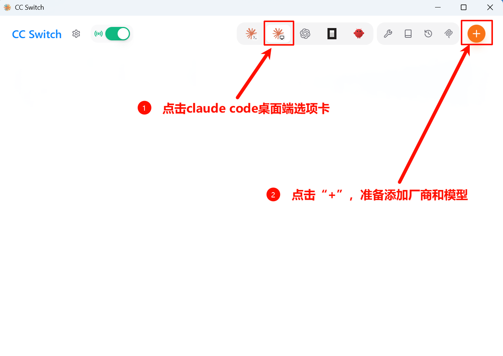
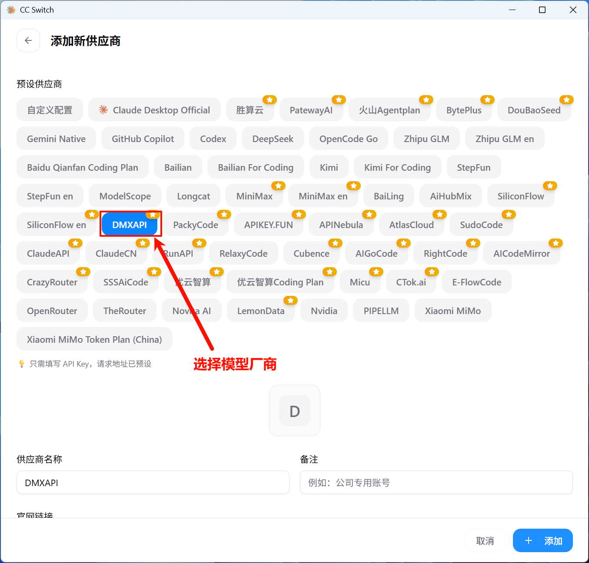
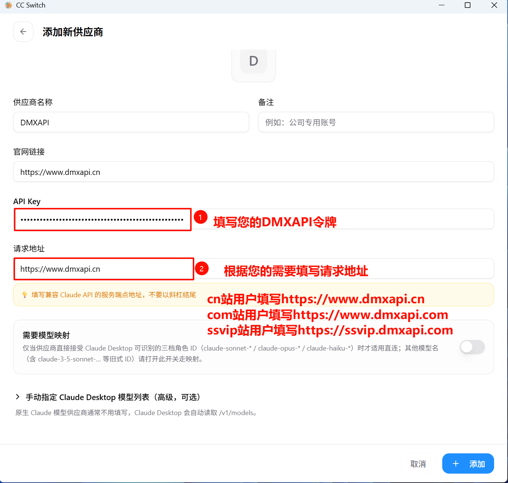
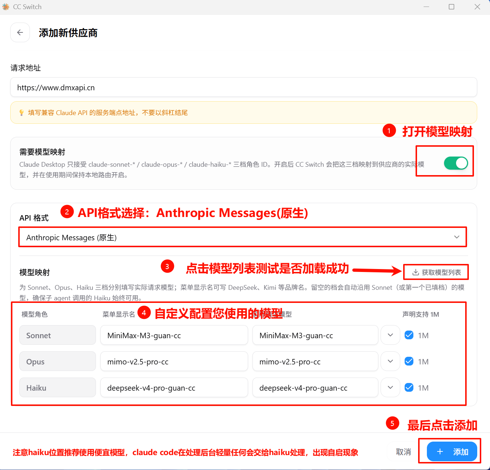
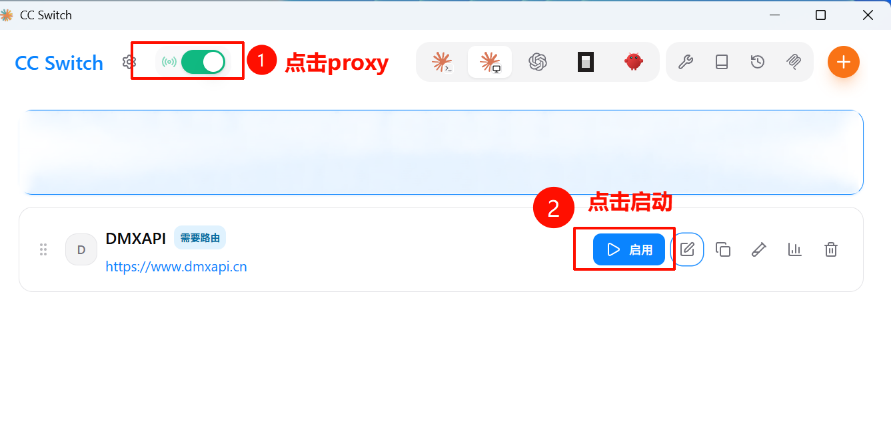
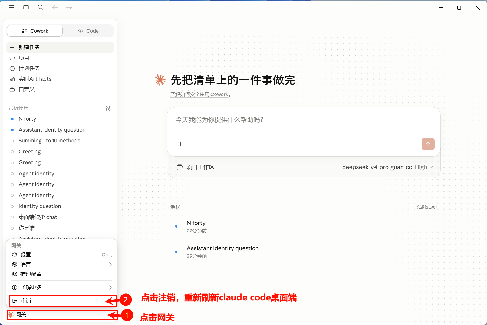
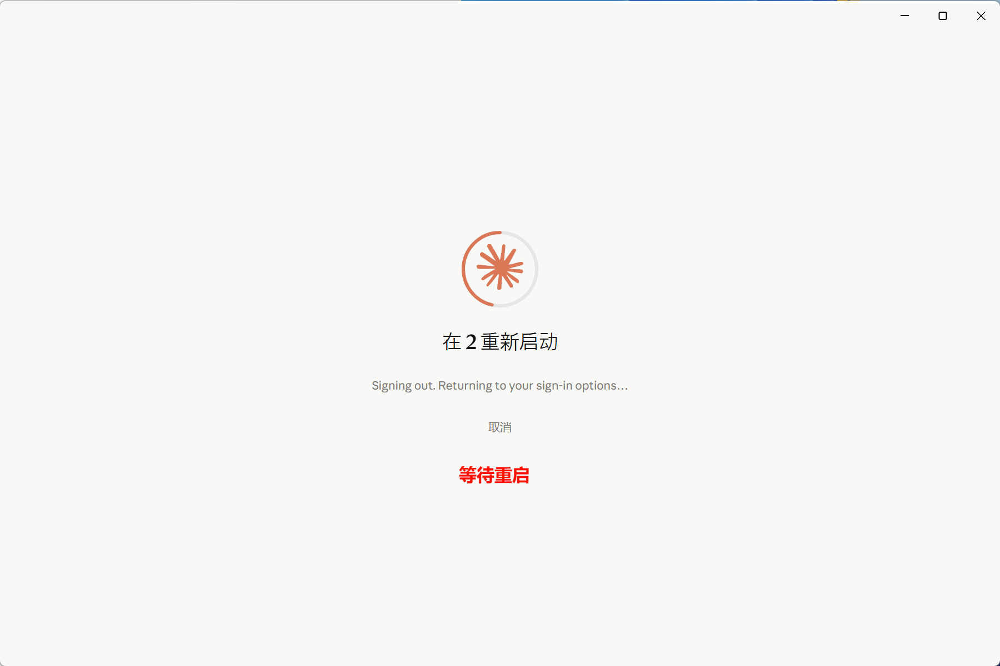
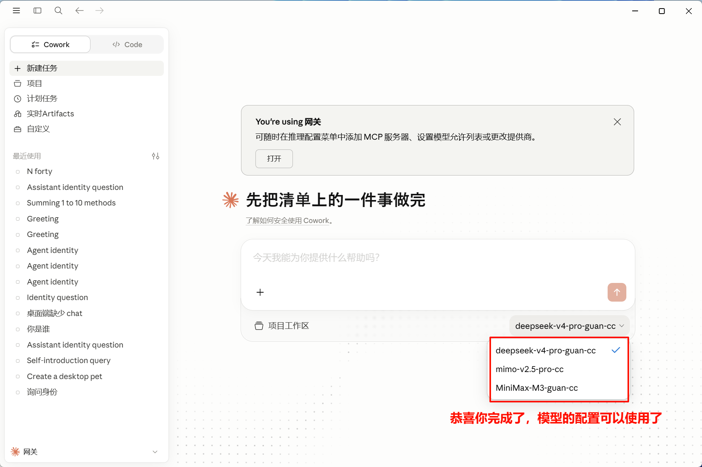

# CC Switch 配置 Claude Code 桌面端教程

CC-Switch 是一款面向开发者的多供应商配置切换工具，可在 Claude Code、Codex 等多种客户端之间一键切换不同的 API 厂商与模型。本文介绍如何使用 CC Switch 将 **Claude Code 桌面端（Claude Code Desktop）** 接入 DMXAPI。

## 环境准备

在开始之前，请先完成以下准备：

- 安装 **Claude Code 桌面端**：前往 [Claude 官网下载页](https://claude.com/download) 下载并安装。
- 下载 **CC Switch** 工具：前往 [CC Switch 项目仓库](https://github.com/farion1231/cc-switch) 下载。
- 准备一个 DMXAPI 令牌（API Key），可在 [DMXAPI 控制台](https://www.dmxapi.cn/token) 的「API 令牌」页获取。

## 配置 Claude Code 桌面端

### 步骤 1：添加供应商

打开 CC Switch，按截图中的编号操作：

- ① 点击顶部的 **Claude Code 桌面端**选项卡
- ② 点击右上角橙色 **「+」** 按钮，准备添加厂商和模型

### 步骤 2：选择模型厂商 DMXAPI

在「添加新供应商」的预设列表中选择 **DMXAPI** 厂商。

### 步骤 3：填写 API Key 和请求地址

在配置表单中按编号填写：

- ① **API Key**：填写你的 DMXAPI 令牌
- ② **请求地址**：根据所在站点选择对应地址
  - cn 站：`https://www.dmxapi.cn`
  - com 站：`https://www.dmxapi.com`
  - ssvip 站：`https://ssvip.dmxapi.com`

### 步骤 4：配置模型映射

在模型映射区按编号依次操作：

- ① 打开 **「需要模型映射」** 开关
- ② **API 格式**选择 **Anthropic Messages(原生)**
- ③ 点击 **「获取模型列表」** 测试是否加载成功
- ④ 为 Sonnet / Opus / Haiku 三档填写要使用的模型
- ⑤ 确认无误后点击 **「添加」**

::: warning 注意
**Haiku 位推荐使用便宜的模型**。Claude Code 在后台处理一些轻量任务时会自动交给 Haiku 模型，可能会自动调用。
:::

### 步骤 5：开启 proxy 并启用供应商

添加完成后：

- ① 点击左上角的 **proxy** 开关
- ② 在 DMXAPI 供应商卡片上点击 **「启用」**

### 步骤 6：切换网关并刷新

回到 Claude Code 桌面端：

- ① 点击左下角的 **「网关」**
- ② 点击 **「注销」**，重新刷新桌面端使配置生效

### 步骤 7：等待桌面端自动重启

注销后，Claude Code 桌面端会自动重启（界面显示「等待重启 / Signing out…」），耐心等待重启完成即可。

### 步骤 8：配置完成，开始使用

桌面端重启后，顶部会出现 **「You're using 网关」** 提示。点击输入框右下角的模型下拉框，即可看到刚配置好的模型，选择后即可开始使用。恭喜你完成配置！

  <small>© 2026 DMXAPI CC Switch 配置 Claude Code 桌面端教程</small>

