# CC Switch 配置 Codex 桌面端教程

CC-Switch 是一款面向开发者的多供应商配置切换工具，可在 Claude Code、Codex 等多种客户端之间一键切换不同的 API 厂商与模型。本文介绍如何使用 CC Switch 将 **Codex 桌面端（ChatGPT Work）** 接入 DMXAPI。

本教程包含三个专题，按您要使用的模型类型选择其中一个进行配置即可：

- **DMXAPI(gpt原生支持)**：使用 GPT-5 系列原生模型（Responses API 直连）
- **DMXAPI(codex专区配置)**：使用 codex 专区模型（`-cdx` 后缀，如 `gpt-5.6-sol-cdx`）
- **DMXAPI(国产模型配置)**：使用国产模型（如 `glm-5.2`），通过 Chat Completions 协议接入

## 环境准备

在开始之前，请先完成以下准备：

- 安装 **Codex 桌面端（ChatGPT Work）**。
- 下载 **CC Switch** 工具：前往 [CC Switch 项目仓库](https://github.com/farion1231/cc-switch) 下载并安装。
- 准备一个 DMXAPI 令牌（API Key），可在 [DMXAPI 控制台](https://www.dmxapi.cn/token) 的「API 令牌」页获取。

## 前置步骤

三个专题的前三步操作相同，先完成以下准备操作。

### 步骤 1：打开设置

打开 CC Switch，按截图中的编号操作：

- ① 点击左上角的 **「设置」** 齿轮图标

### 步骤 2：检查更新

在设置页面切换到 **「关于」** 选项卡：

- ① 点击右侧的 **「检查更新」**，确保 CC Switch 为最新版本

### 步骤 3：选择 Codex 并添加供应商

回到主界面：

- ① 点击顶部的 **Codex** 选项卡
- ② 点击右上角橙色 **「+」** 按钮，准备添加供应商

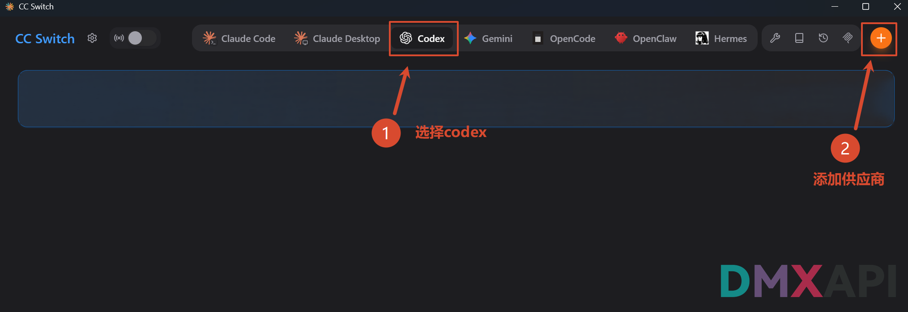

## DMXAPI(gpt原生支持)

本专题适用于直接使用 **GPT-5 系列原生模型**（如 `GPT-5.5`、`GPT-5.4`），上游走 Responses API 直连，无需模型映射。

### 步骤 1：填写供应商信息

在供应商配置表单中按编号依次操作：

- ① **供应商名称**：自定义，例如 `DMXAPI(gpt原生支持)`（名称仅用于区分不同配置）
- ② **API Key**：填入您的 DMXAPI 令牌
- ③ **API 请求地址**：检查为 `https://www.dmxapi.cn/v1`
- ④ 展开 **「高级选项」**，**上游格式**选择 **Responses（原生）**，然后点击 **「获取模型列表」** 检验模型连通性
- ⑤ 确认无误后点击右下角的 **「保存」** 完成配置

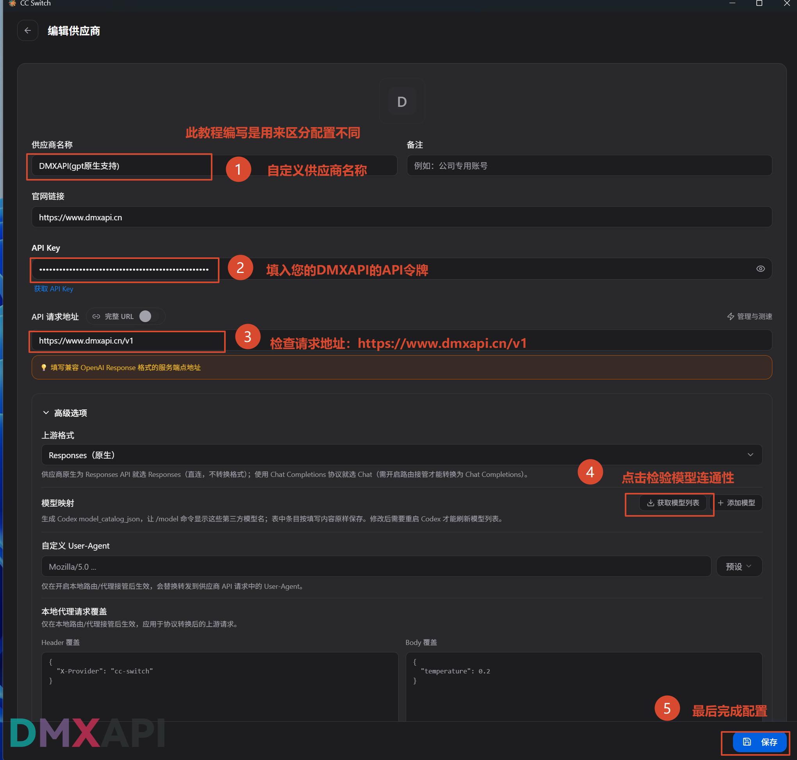

### 步骤 2：启用供应商

回到主界面，在 `DMXAPI(gpt原生支持)` 供应商卡片上：

- ① 点击 **「启用」**

::: warning 注意
启用完成之后，需要 **重启 Codex 桌面端** 才能使配置生效。
:::

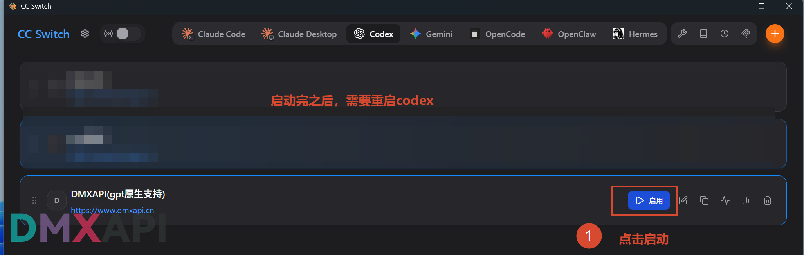

### 步骤 3：开始使用

重启 Codex 桌面端后，点击输入框右下角的 **「模型」** 下拉框，即可选择 `GPT-5.5`、`GPT-5.4` 等模型，并按需调整推理强度，开始使用。

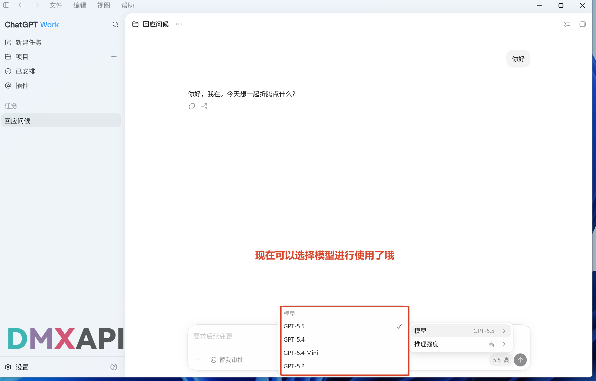

## DMXAPI(codex专区配置)

本专题适用于使用 **codex 专区模型**（`-cdx` 后缀，如 `gpt-5.6-sol-cdx`），需要通过「模型映射」把专区模型加入 Codex 的模型列表。

### 步骤 1：创建带模型限制的令牌

登录 DMXAPI 官网，进入 **工作台 → 令牌** 页面，创建（或编辑已有的）API 密钥：

- ① **名称**：自定义令牌名称，例如 `codex++(gpt-5.6-sol-cdx)`
- ② 打开 **高级设置**，在 **模型限制** 中选定 `gpt-5.6-sol-cdx`（令牌仅能使用该模型，防止误调用其他模型）
- ③ 最后点击 **「保存更改」**

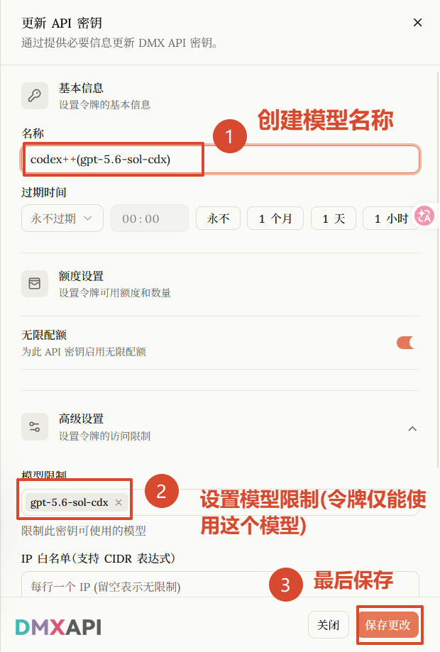

### 步骤 2：填写供应商信息

回到 CC Switch，参考前置步骤 3 再次点击 **「+」** 添加供应商，在配置表单中按编号依次操作：

- ① **供应商名称**：自定义，例如 `DMXAPI(gpt-5.6-sol-cdx)`
- ② **API Key**：填入上一步创建的 DMXAPI 令牌
- ③ **API 请求地址**：检查为 `https://www.dmxapi.cn/v1`
- ④ 展开 **「高级选项」**，**上游格式**选择 **Responses（原生）**
- ⑤ 点击 **「获取模型列表」** 检验模型连通性
- ⑥ 在 **「模型映射」** 区的 **菜单显示名 / 实际请求模型** 中输入专区模型名称 `gpt-5.6-sol-cdx`
- ⑦ **上下文窗口**：填入模型对应的上下文长度，例如 `400000`
- ⑧ 最后点击右下角的 **「保存」**

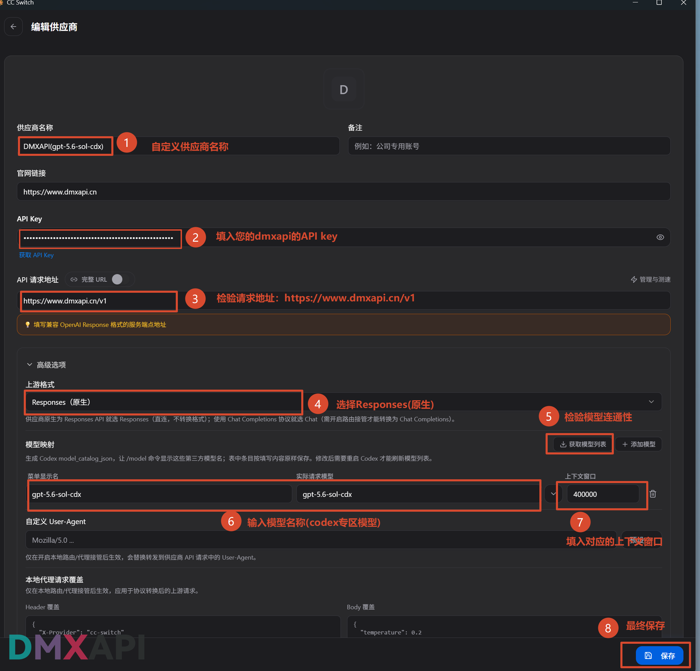

### 步骤 3：启用供应商

回到主界面：

- ① 确认顶部选中 **Codex** 选项卡
- ② 在 `DMXAPI(gpt-5.6-sol-cdx)` 供应商卡片上点击 **「启用」**（启用后显示「使用中」）

启用后重启 Codex 桌面端使配置生效。

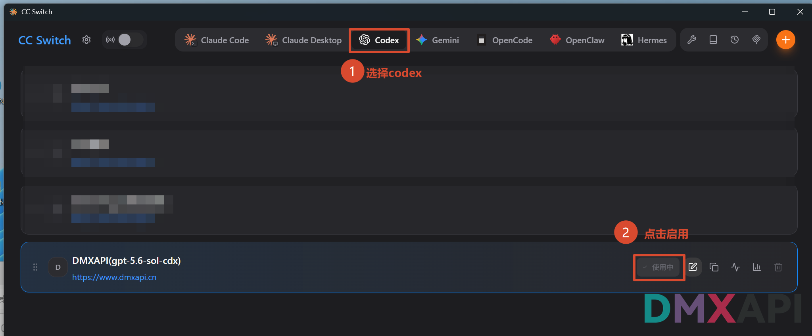

### 步骤 4：开始使用

重启后即可正常对话使用：

- ① 现在可以正常使用了
- ② 在模型选择处选择模型映射即可

::: tip 提示
模型处显示 **「自定义」** 名称是正常现象，不影响使用。
:::

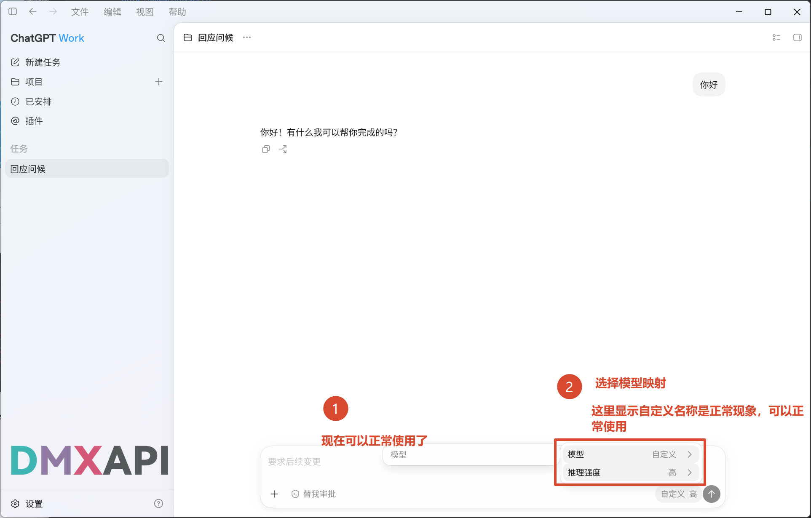

## DMXAPI(国产模型配置)

本专题适用于使用 **国产模型**（如 `glm-5.2`），上游走 **Chat Completions** 协议，需要开启 CC Switch 的本地路由才能转换为 Codex 可用的格式。

### 步骤 1：创建带模型限制的令牌

登录 DMXAPI 官网，进入 **工作台 → 令牌** 页面，点击 **+ 创建 API 密钥**：

- ① **名称**：自定义令牌名称，例如 `codex++(国产模型)`
- ② 打开 **高级设置**
- ③ **模型限制**：选定您要使用的国产模型，例如 `glm-5.2`（令牌仅能使用您选择的模型）
- ④ 最后点击 **「保存更改」**

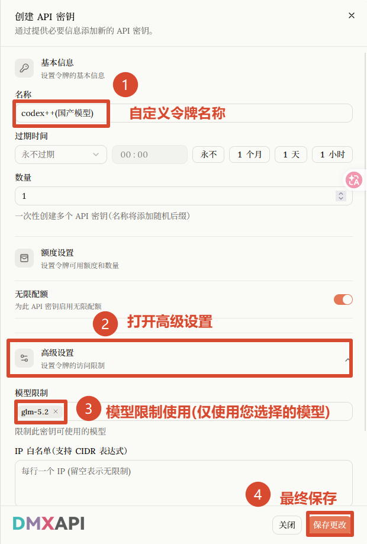

### 步骤 2：填写供应商信息

回到 CC Switch，参考前置步骤 3 再次点击 **「+」** 添加供应商，在配置表单中按编号依次操作：

- ① **供应商名称**：自定义，例如 `DMXAPI(国产模型)`（用来区分不同配置）
- ② **API Key**：填入上一步创建的 DMXAPI 令牌
- ③ **API 请求地址**：检查为 `https://www.dmxapi.cn/v1`
- ④ 展开 **「高级选项」**，**上游格式**选择 **Chat Completions（需开启路由）**
- ⑤ **思考能力**：按需打开 **「支持思考模式」** 和 **「支持思考等级」** 开关
- ⑥ 点击 **「获取模型列表」** 检验连通性
- ⑦ 在 **「模型映射」** 区的 **菜单显示名 / 实际请求模型** 中输入您使用的模型，例如 `glm-5.2`
- ⑧ **上下文窗口**：填入模型对应的上下文长度，例如 `glm-5.2` 为 `1000000`
- ⑨ 最后点击右下角的 **「保存」**

::: warning 注意
开启「支持思考等级」前，请先确认所选模型是否支持思考等级（low/high/max 等思考深度控制），再进行开启。
:::

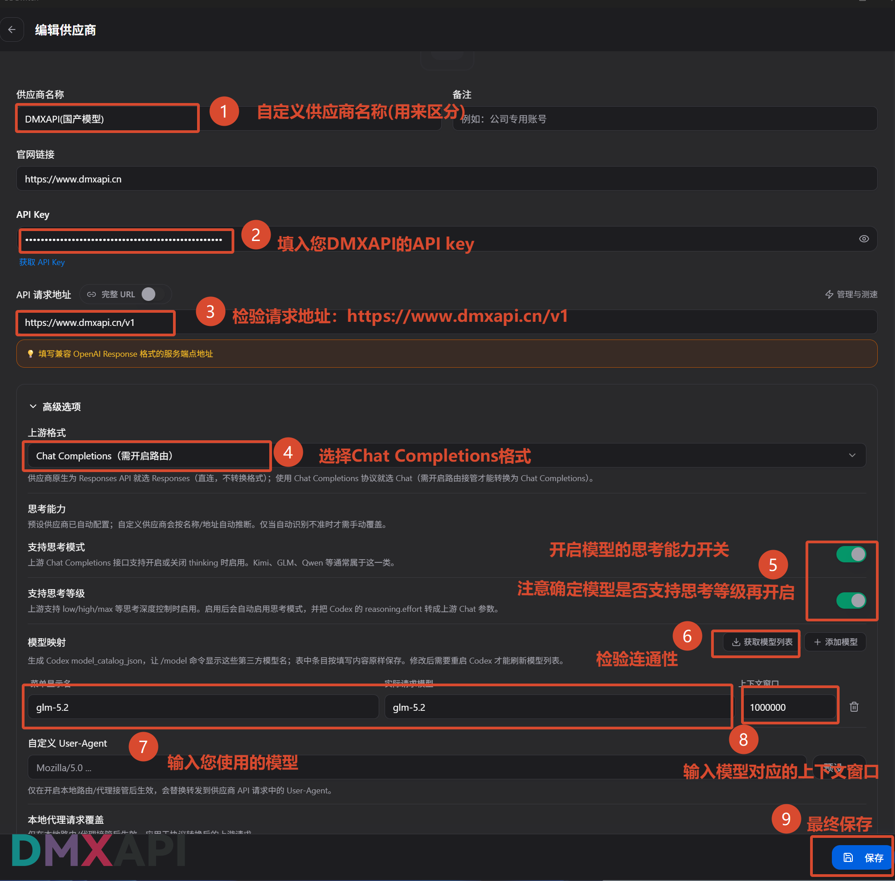

### 步骤 3：开启本地路由并启用供应商

回到主界面：

- ① 确认顶部选中 **Codex** 选项卡
- ② 打开左上角的 **「路由」** 开关（Chat Completions 格式需要开启本地路由）
- ③ 在 `DMXAPI(国产模型)` 供应商卡片上点击 **「启用」**（启用后显示「使用中」，卡片带「需要路由」标签）

启用后重启 Codex 桌面端使配置生效。

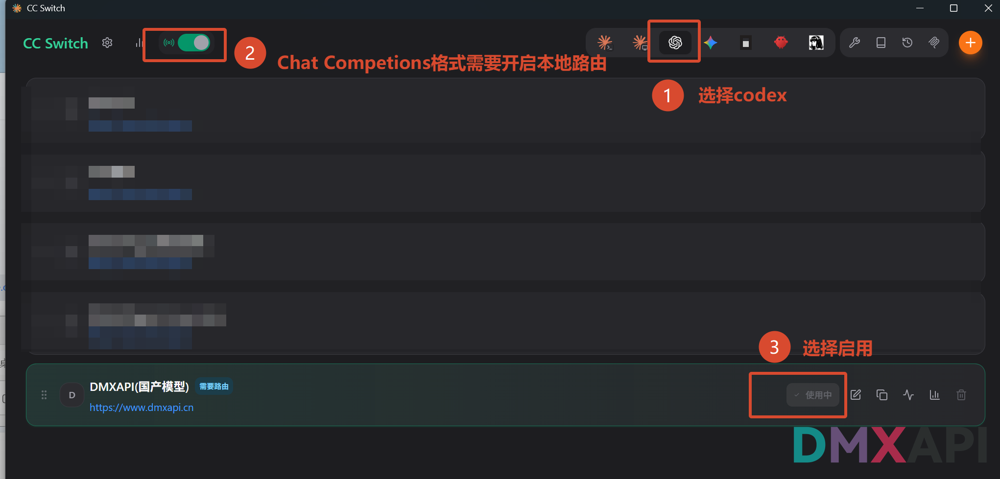

### 步骤 4：开始使用

重启后发送消息测试，模型正常响应即配置成功。

::: tip 提示
这里模型名称显示 **「自定义」** 是正常现象，无需担心，可以正常使用。
:::

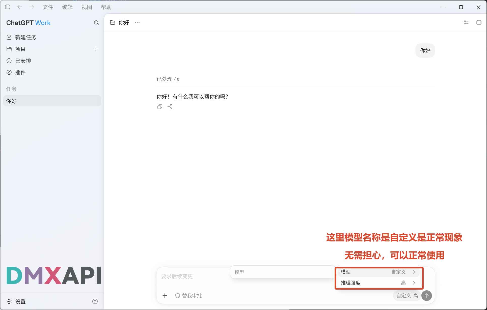

  <small>© 2026 DMXAPI CC Switch 配置 Codex 桌面端教程</small>

