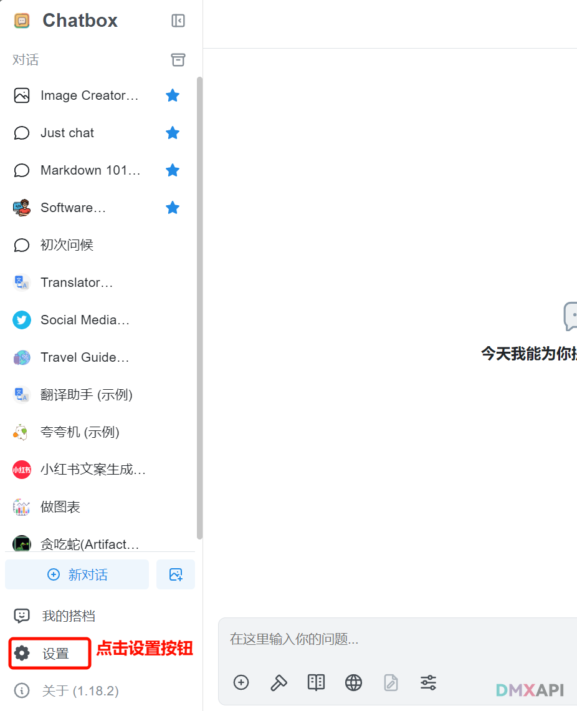
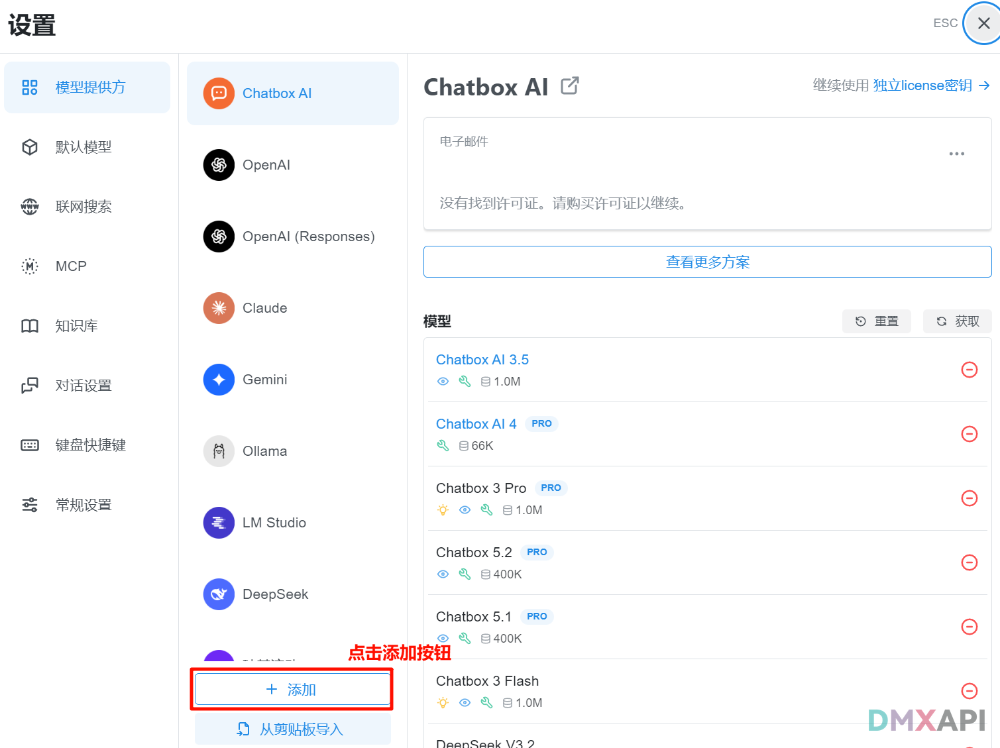
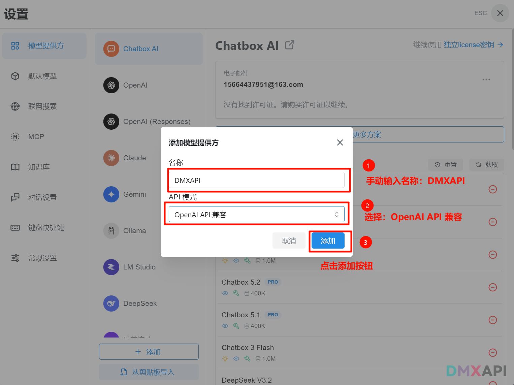
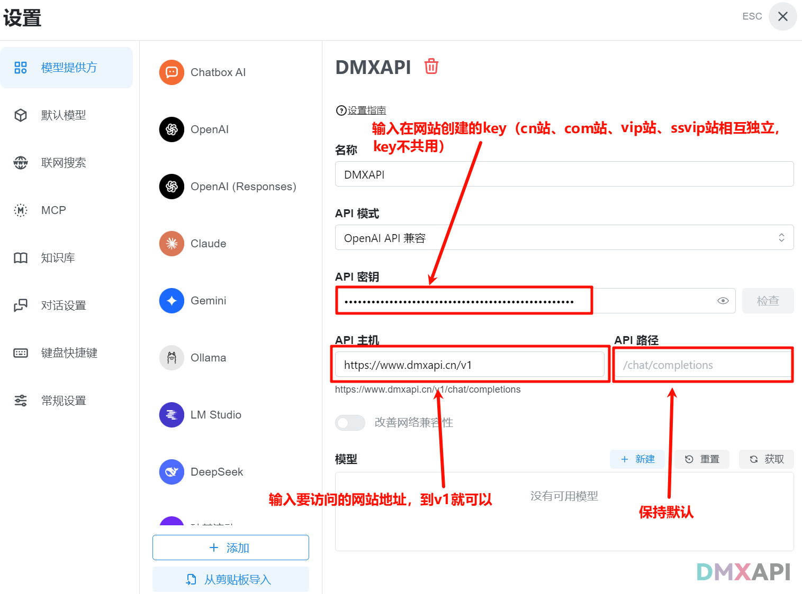
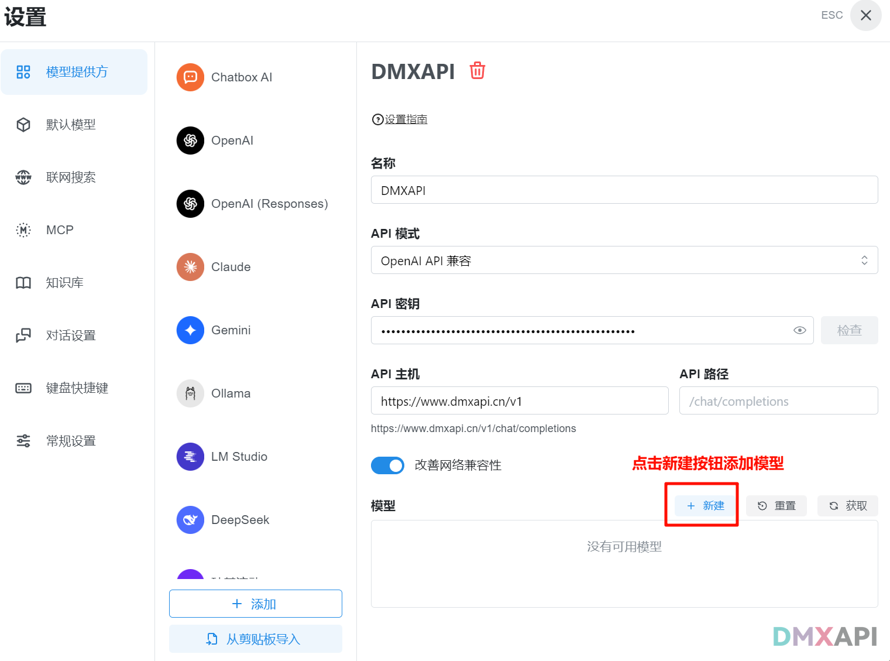
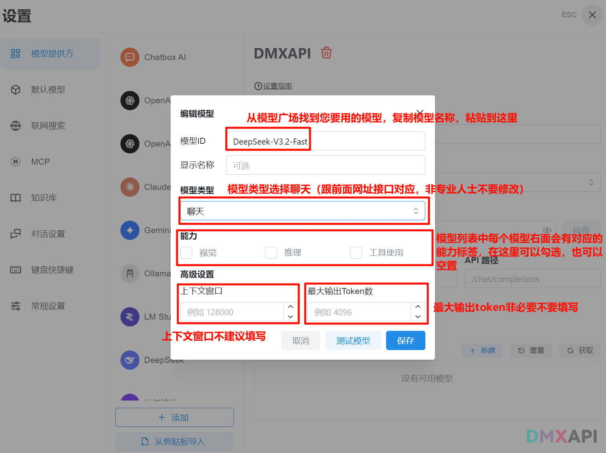
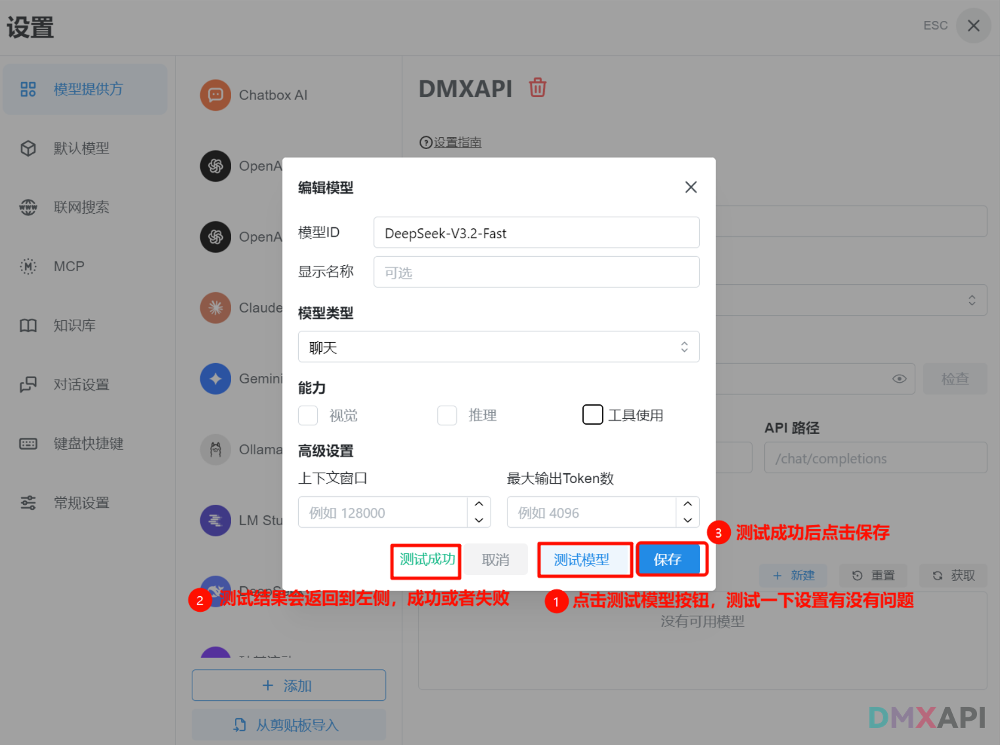
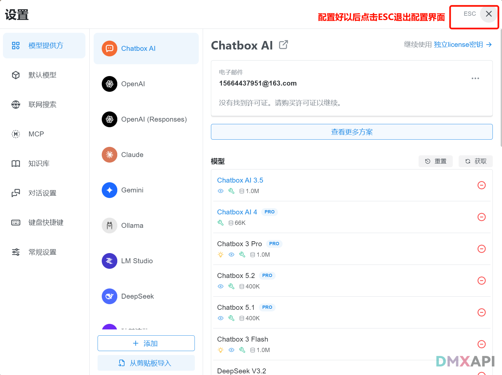
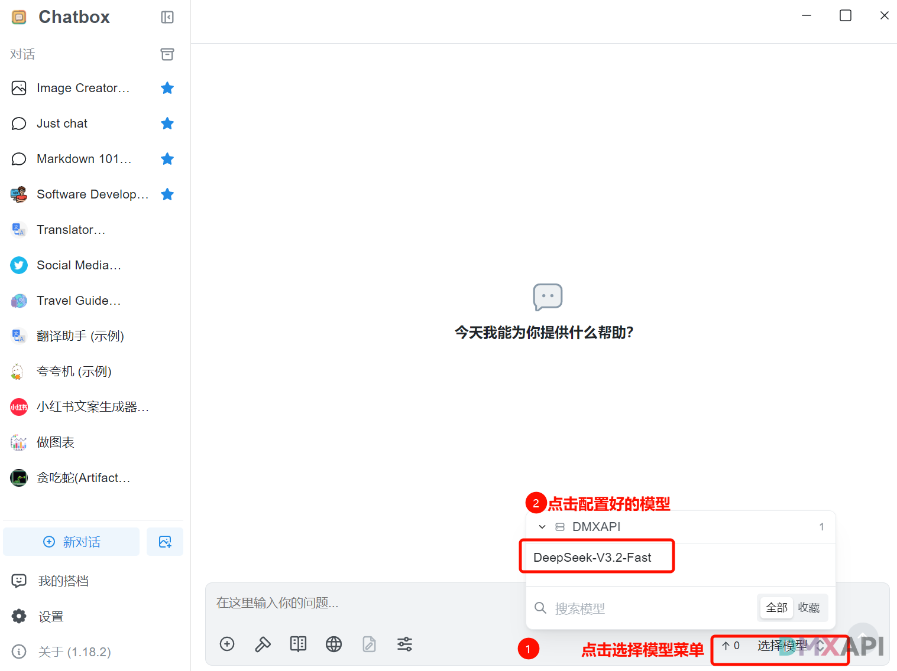
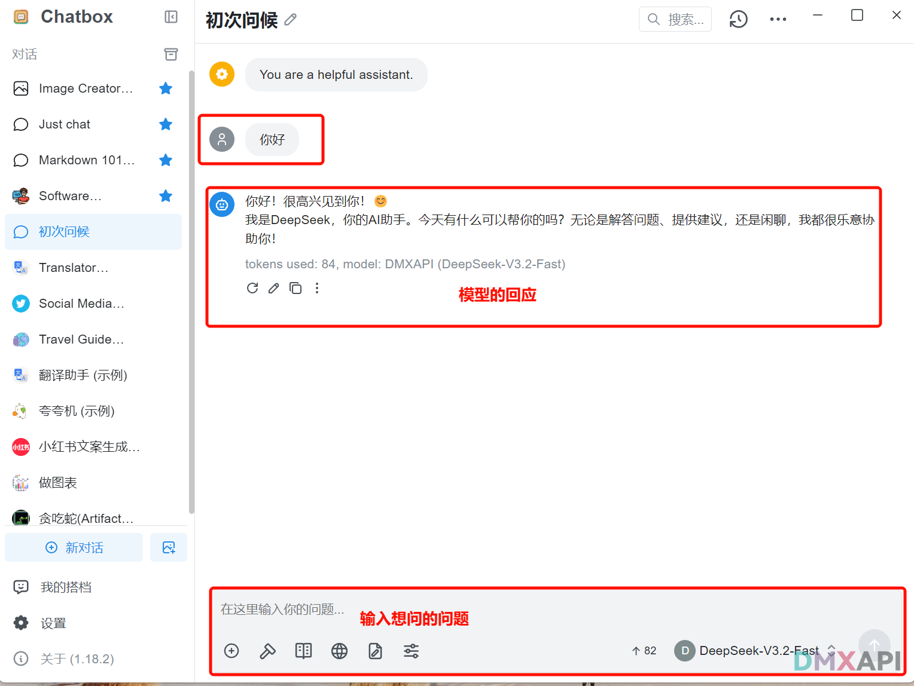

# chatbox 客户端配置方法
Chatbox 是一个开源的聊天框架或平台，旨在帮助开发者快速构建和集成聊天功能。它支持多种功能，如即时消息、语音和视频通话、聊天机器人等，能够轻松集成到网站、移动应用和桌面应用中。

## chatbox 官方网站
首先您需要下载chatbox软件，下载后您需要登录一下才能进行后续的配置，以下是官方网站的链接。
```
https://chatboxai.app/zh
```

## pc端使用方法

### pc端配置说明
详细的配置方法如下：
#### 第一步 点击左下角的设置按钮，进入配置界面

#### 第二步 添加厂商

#### 第三步 添加DMXAPI，选择API模式

#### 第四步 配置URL和key

#### 第五步 点击添加按钮，准备添加模型

#### 第六步 模型的设置

#### 第七步 测试模型是否联通

#### 第八步 返回聊天界面

#### 第九步 选用配置好的模型

#### 第十步 可以开始聊天啦！！



## 移动端使用方法

### 移动端配置说明
#### 第一步 点击设置提供方按钮

#### 第二步 点击添加按钮，设置API厂家

#### 第三步 输入API厂家名称，设置API模式

#### 第四步 输入KEY和URL
::: warning
key和url请在DMXAPI官网获取，cn站、com站、vip站、ssvip站之间互相独立，key不能共用，请分别对应填写。
:::

#### 第五步 点击新建按钮添加新模型

#### 第六步 配置模型参数

#### 第七步 测试模型连通性

#### 第八步 返回聊天界面

#### 第九步 点击选择模型按钮

#### 第十步 选择配置好的模型

#### 第十一步 可以愉快的聊天啦


<p align="center">
  <small>© 2025 DMXAPI chatbox ...</small>
</p>