# chatbox 客户端配置方法
Chatbox 是一个开源的聊天框架或平台，旨在帮助开发者快速构建和集成聊天功能。它支持多种功能，如即时消息、语音和视频通话、聊天机器人等，能够轻松集成到网站、移动应用和桌面应用中。

## chatbox 官方网站
首先您需要下载chatbox软件，下载后您需要登录一下才能进行后续的配置，以下是官方网站的链接。
```
https://chatboxai.app/zh
```

## pc端使用方法

### pc端配置说明
详细的配置方法如下：
#### 第一步 点击左下角的设置按钮，进入配置界面
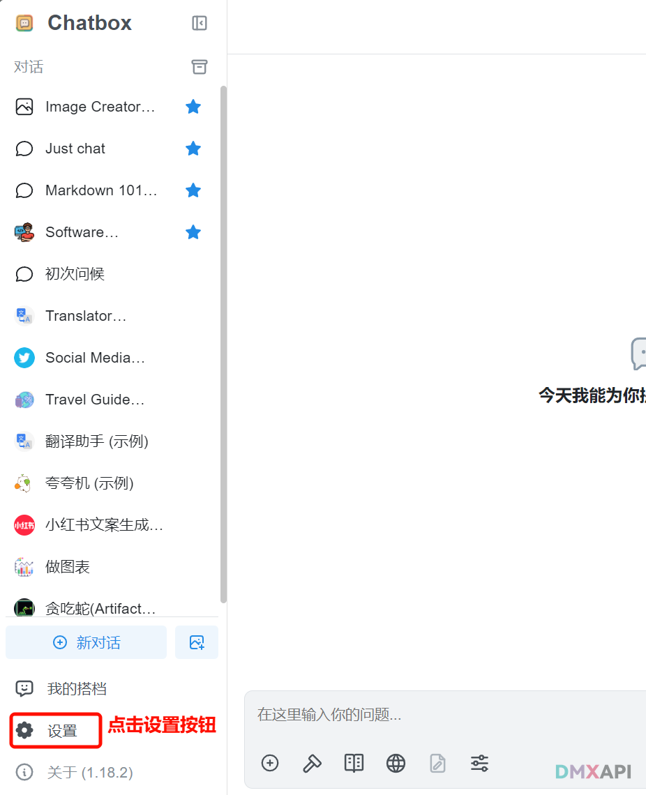
#### 第二步 添加厂商
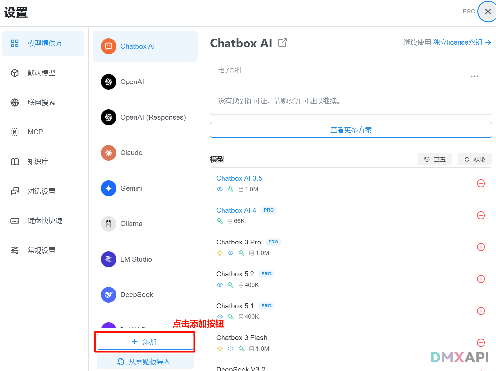
#### 第三步 添加DMXAPI，选择API模式
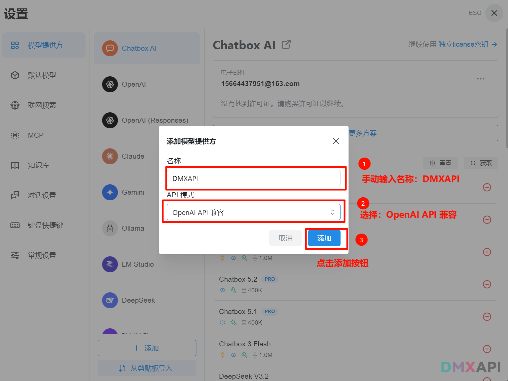
#### 第四步 配置URL和key
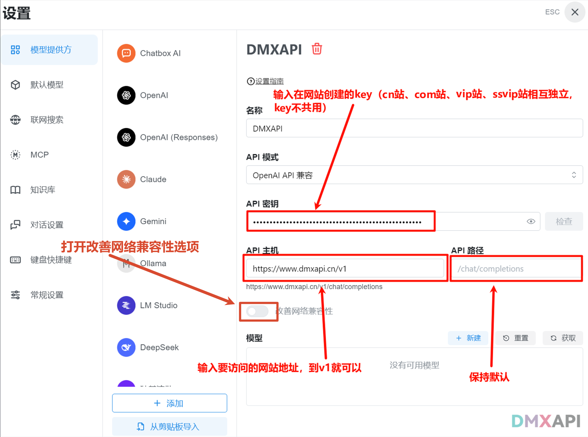
#### 第五步 点击添加按钮，准备添加模型
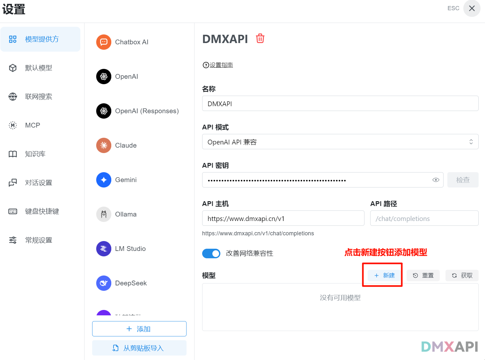
#### 第六步 模型的设置
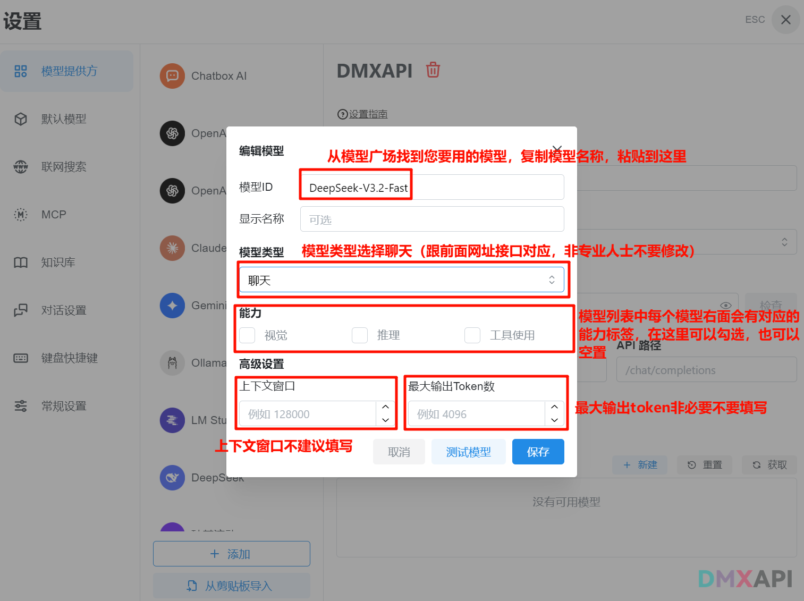
#### 第七步 测试模型是否联通
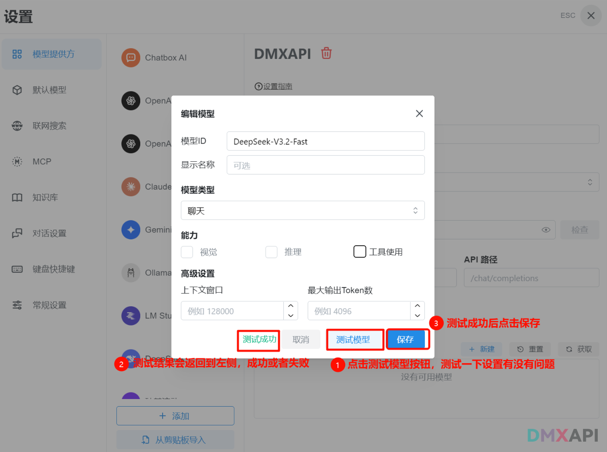
#### 第八步 返回聊天界面
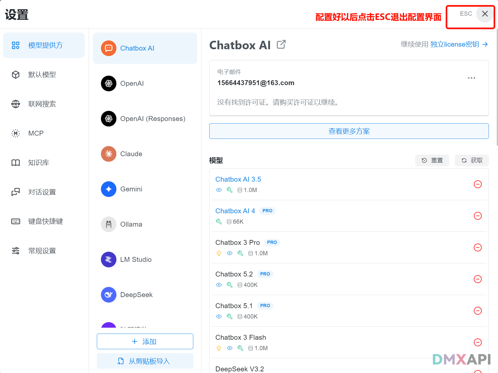
#### 第九步 选用配置好的模型
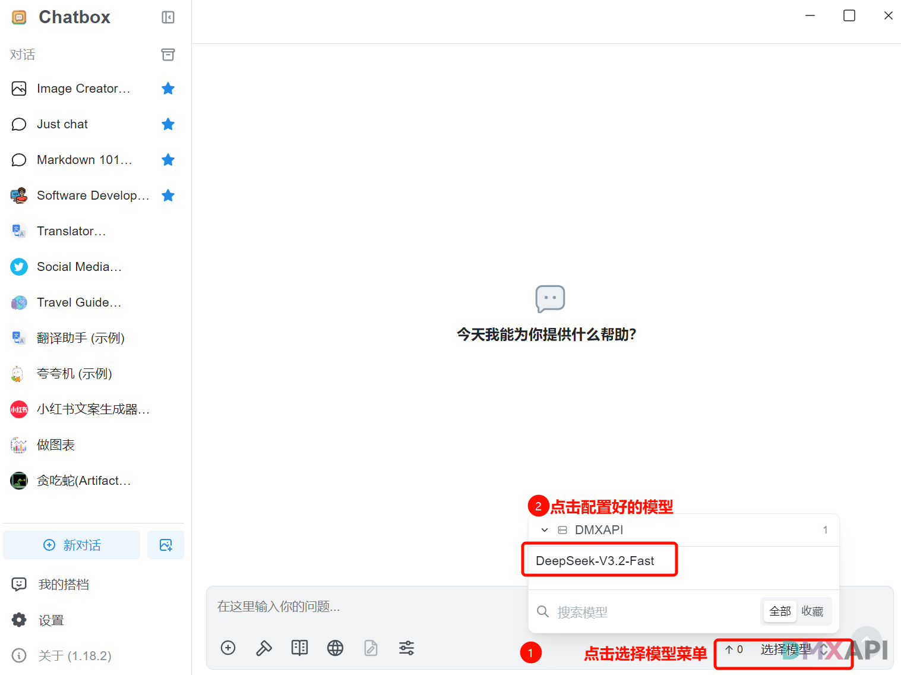
#### 第十步 可以开始聊天啦！！
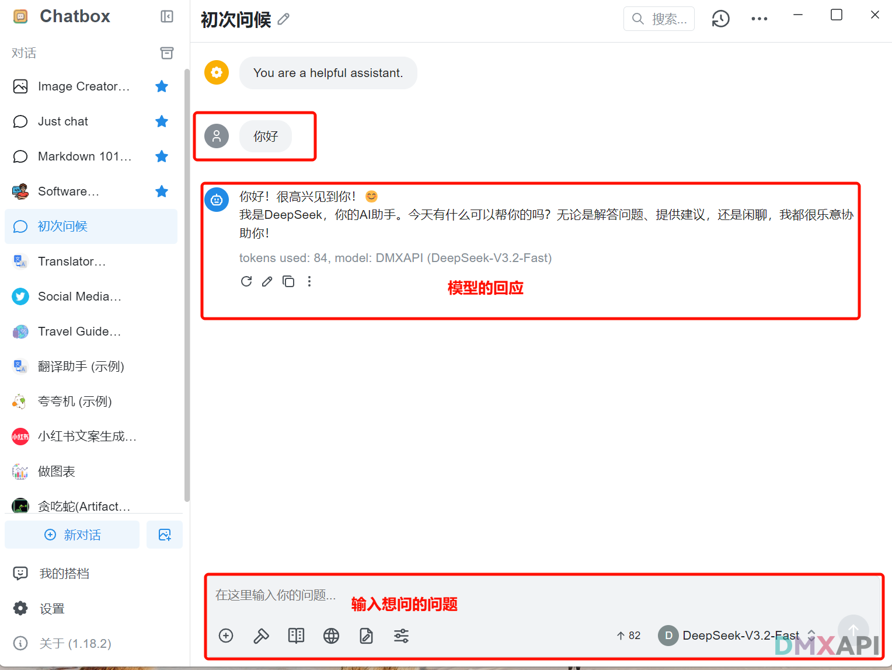


## 移动端使用方法

### 移动端配置说明
#### 第一步 点击设置提供方按钮

#### 第二步 点击添加按钮，设置API厂家

#### 第三步 输入API厂家名称，设置API模式

#### 第四步 输入KEY和URL
::: warning
key和url请在DMXAPI官网获取，cn站、com站、vip站、ssvip站之间互相独立，key不能共用，请分别对应填写。
:::

#### 第五步 点击新建按钮添加新模型

#### 第六步 配置模型参数

#### 第七步 测试模型连通性

#### 第八步 返回聊天界面

#### 第九步 点击选择模型按钮

#### 第十步 选择配置好的模型

#### 第十一步 可以愉快的聊天啦


## Claude 接口配置方法

如果你需要在 Chatbox 中调用 Claude 系列模型（如 `claude-opus-4-7`），并且希望使用 Anthropic 原生消息格式，请按以下步骤添加 **Claude API 兼容** 提供方。

### 第一步 添加新的模型提供方
点击设置 → 模型提供方 → 左下角「+ 添加」按钮，弹出「添加模型提供方」对话框，名称自定义（例如填 `dmx-claude`），「API 模式」下拉选择 **Claude API 兼容**。

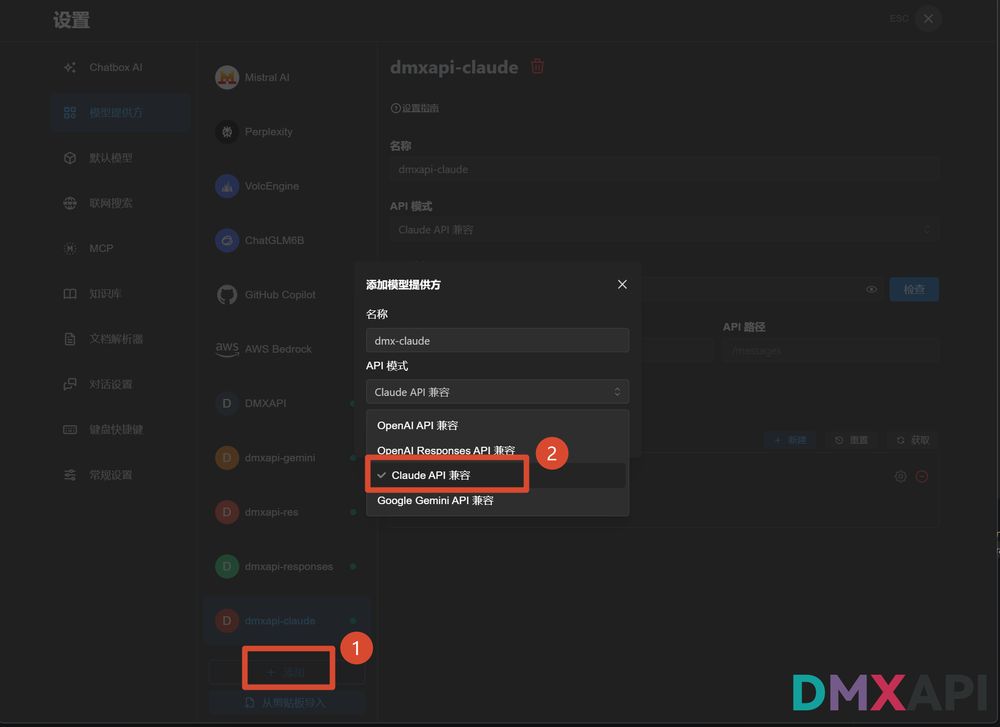

### 第二步 填写认证与接口信息
进入新建好的提供方详情页，按图中四个红色标注依次完成配置：

1. **填入 DMXAPI 令牌**：将你在 DMXAPI 工作台获取的令牌（`sk-` 开头）粘贴到「API 密钥」输入框。
2. **填写正确的 API 主机**：根据你使用的站点填写对应地址，cn 站、com 站、ssvip 站互相独立，密钥与地址必须一一对应。
   - cn 站：`https://www.dmxapi.cn/v1`
   - com 站：`https://www.dmxapi.com/v1`
   - ssvip 站：`https://ssvip.dmxapi.com/v1`
3. **打开「改善网络兼容性」开关**，提升请求成功率与稳定性。
4. **添加需要的模型**：点击「+ 新建」，输入模型 ID（例如 `claude-opus-4-7`、`claude-sonnet-4-6` 等）。

::: warning
API 路径保持默认 `/messages` 即可，无需修改。
:::

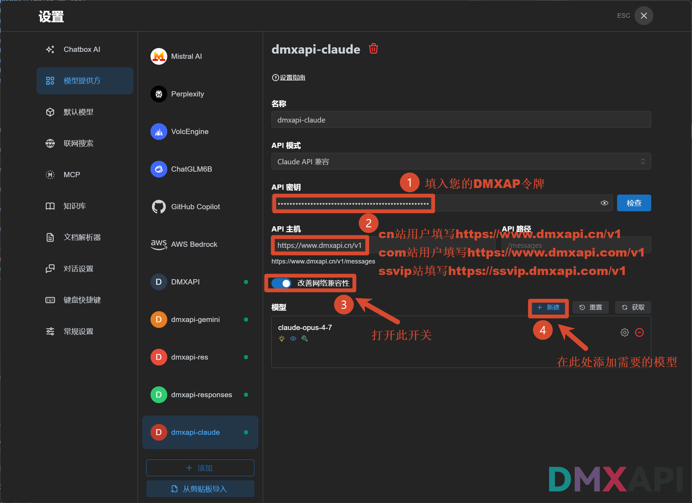

完成后回到聊天界面，在模型选择处选中刚刚添加的 Claude 模型，即可开始对话。

## Gemini 接口配置方法

如果你希望在 Chatbox 中以 Google Gemini 原生格式调用 Gemini 系列模型（如 `gemini-3.1-pro-preview-ssvip`），请按以下步骤添加 **Google Gemini API 兼容** 提供方。

### 第一步 添加新的模型提供方
点击设置 → 模型提供方 → 左下角「+ 添加」按钮，弹出「添加模型提供方」对话框，名称自定义（例如填 `dmx-gemini`），「API 模式」下拉选择 **Google Gemini API 兼容**。

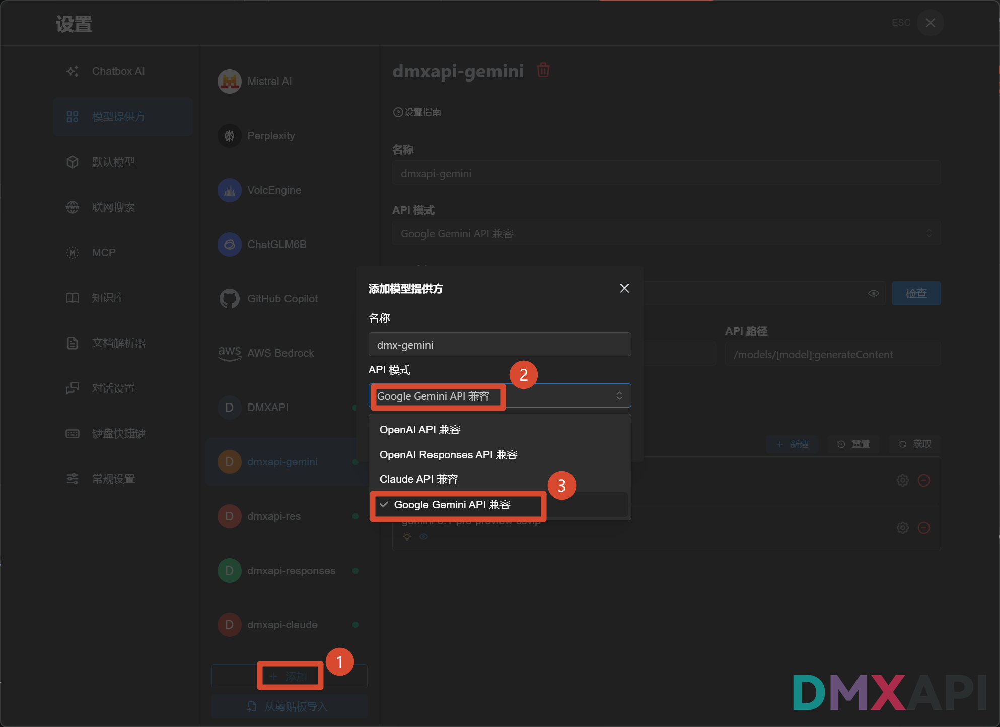

### 第二步 填写认证与接口信息
进入新建好的提供方详情页，按图中三个红色标注依次完成配置：

1. **填入 DMXAPI 令牌**：将你在 DMXAPI 工作台获取的令牌（`sk-` 开头）粘贴到「API 密钥」输入框。
2. **填写正确的 API 主机**（注意 Gemini 模式不需要带 `/v1`）：
   - cn 站：`https://www.dmxapi.cn`
   - com 站：`https://www.dmxapi.com`
   - ssvip 站：`https://ssvip.dmxapi.com`
3. **打开「改善网络兼容性」开关**，提升请求成功率与稳定性。

::: warning
API 路径保持默认 `/models/[model]:generateContent` 即可，无需修改。完成后可点击「+ 新建」手动添加模型 ID，或点击「获取」自动拉取可用模型列表。
:::

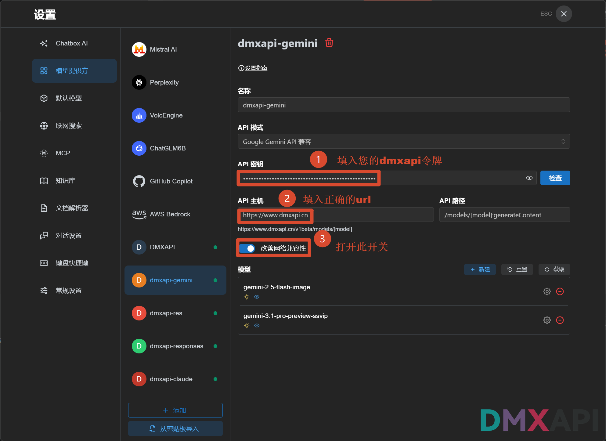

完成后回到聊天界面，在模型选择处选中刚刚添加的 Gemini 模型，即可开始对话。

<p align="center">
  <small>© 2026 DMXAPI chatbox 客户端配置方法</small>
</p>