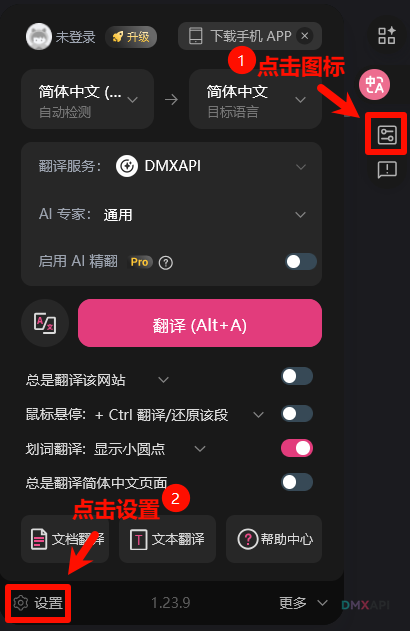
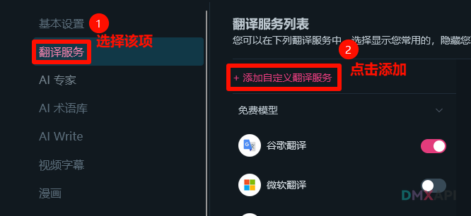
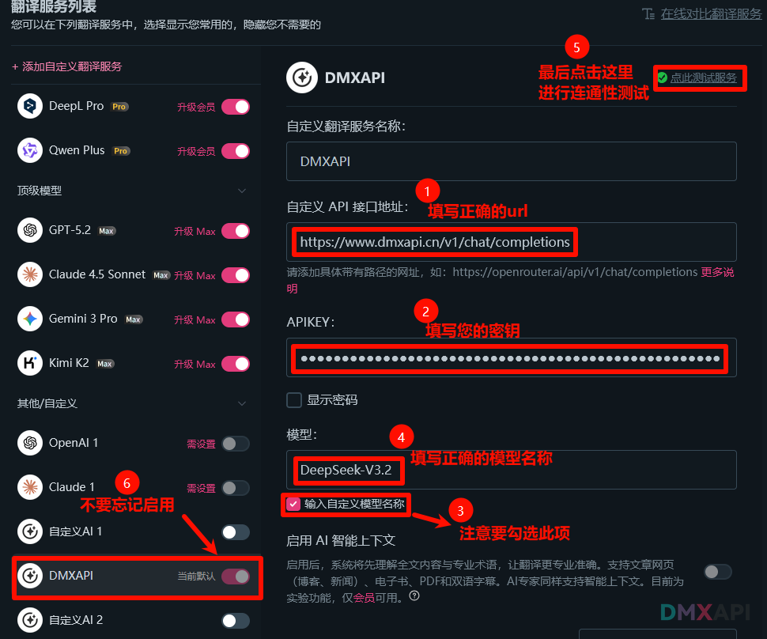
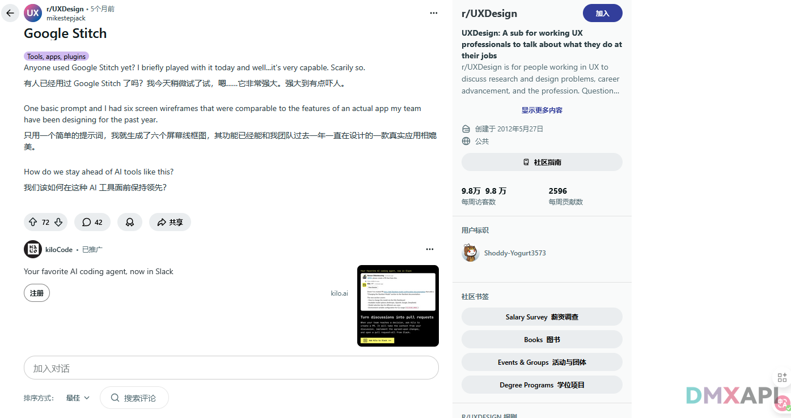
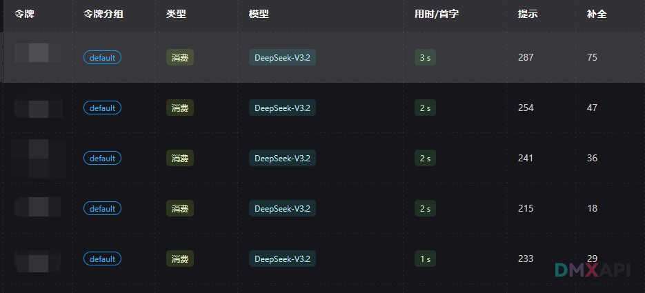

# 沉浸式翻译 配置DMXAPI教程
沉浸式翻译是一款网页翻译插件,可以实时原文/译文对照自动翻译外语网页,支持
100+语言互译,真正帮助你打破信息壁垒!

## 一.打开软件设置

## 二.选择自定义服务
 

## 三.配置相关信息
> 这里我选择配置`DeepSeek-V3.2`模型  

## 四.测试，成功翻译！

### 后台查看模型调用日志
> 成功调用DeepSeek-V3.2

  <small>© 2026 DMXAPI 沉浸式翻译 配置DMXAPI教程</small>

