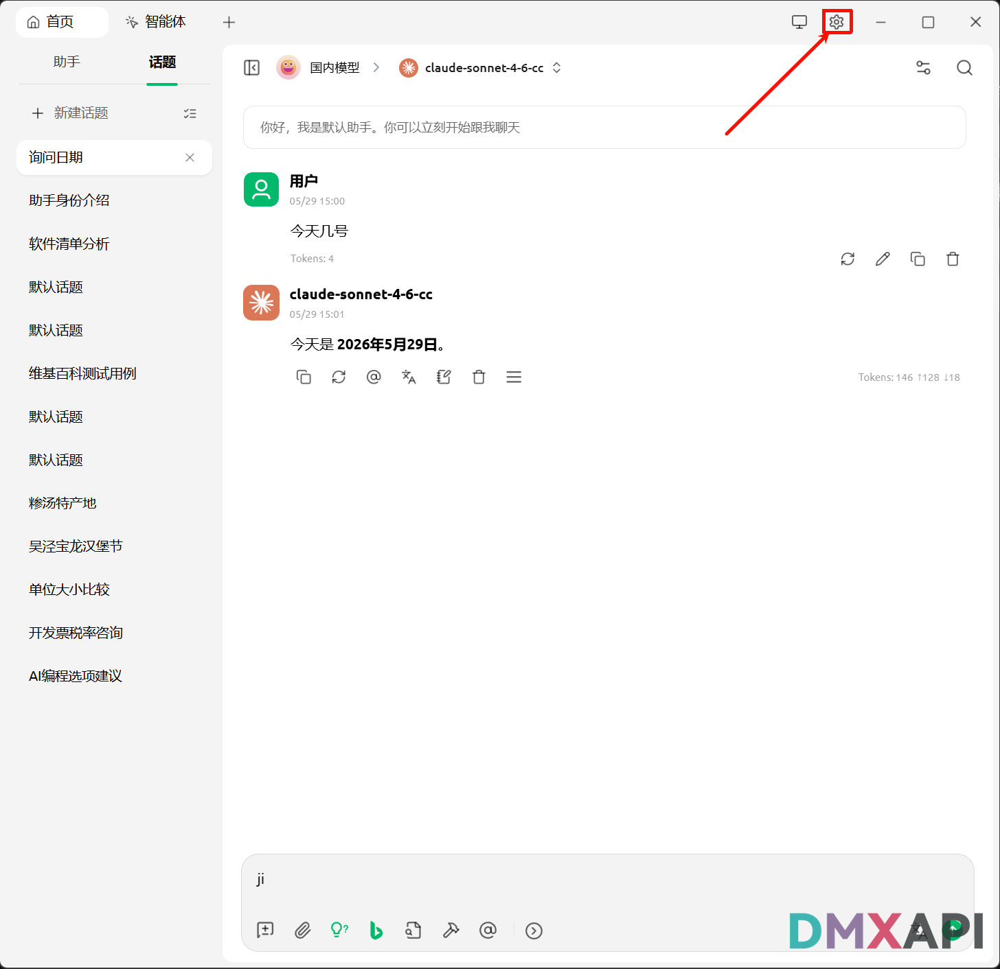
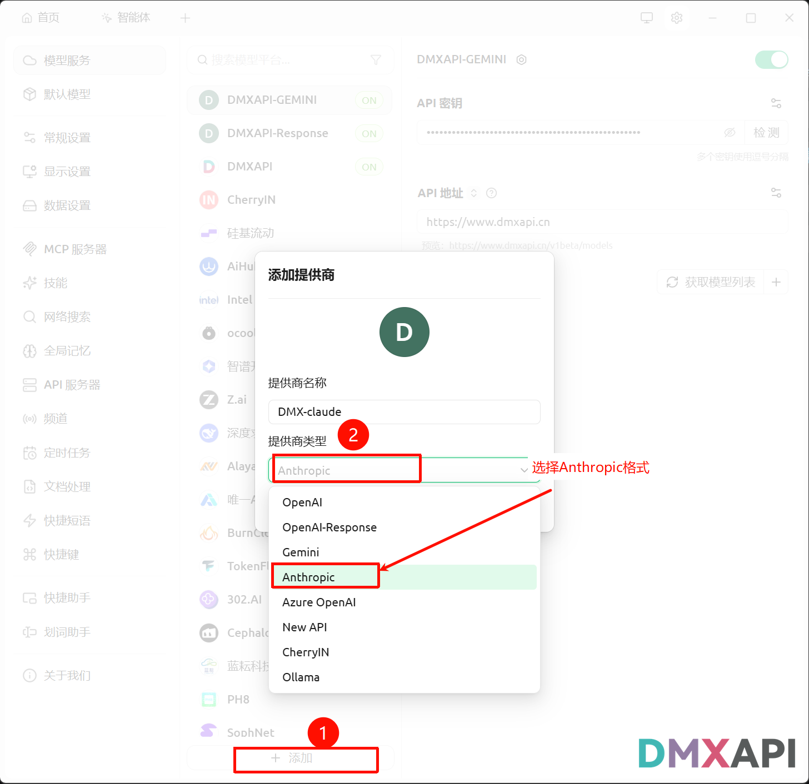
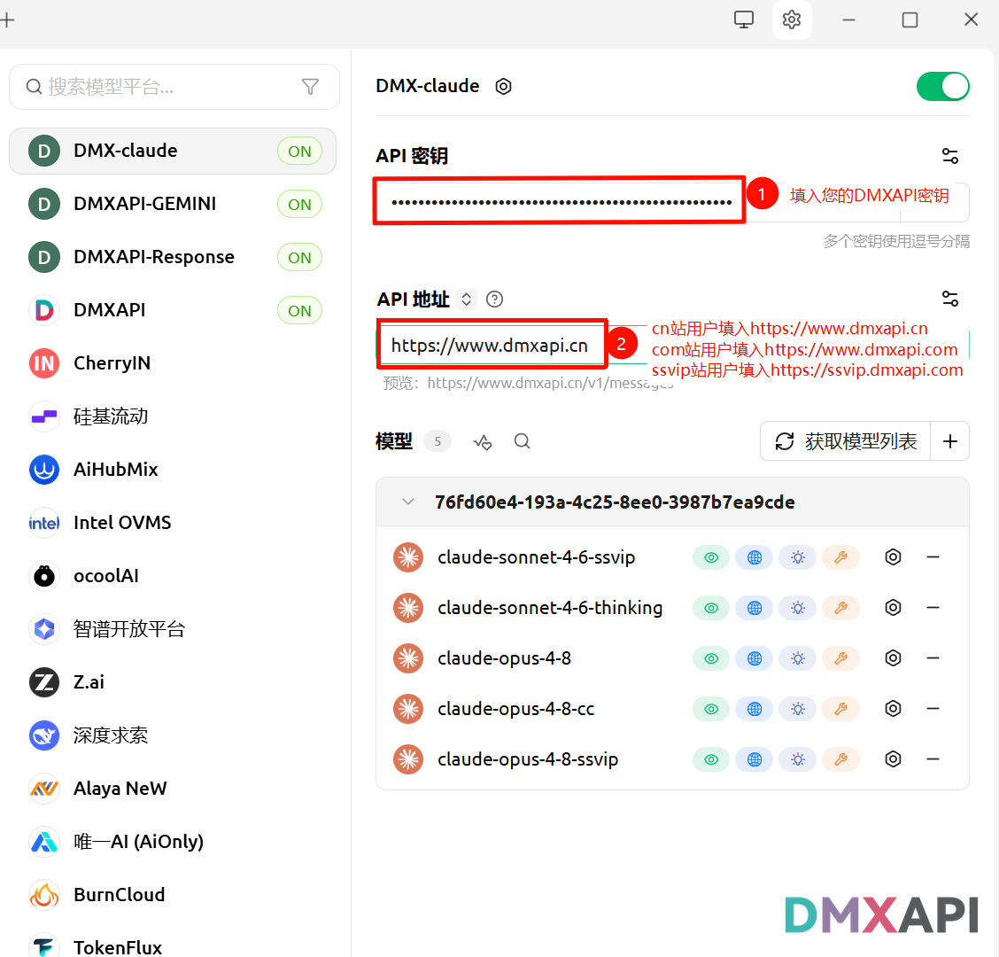
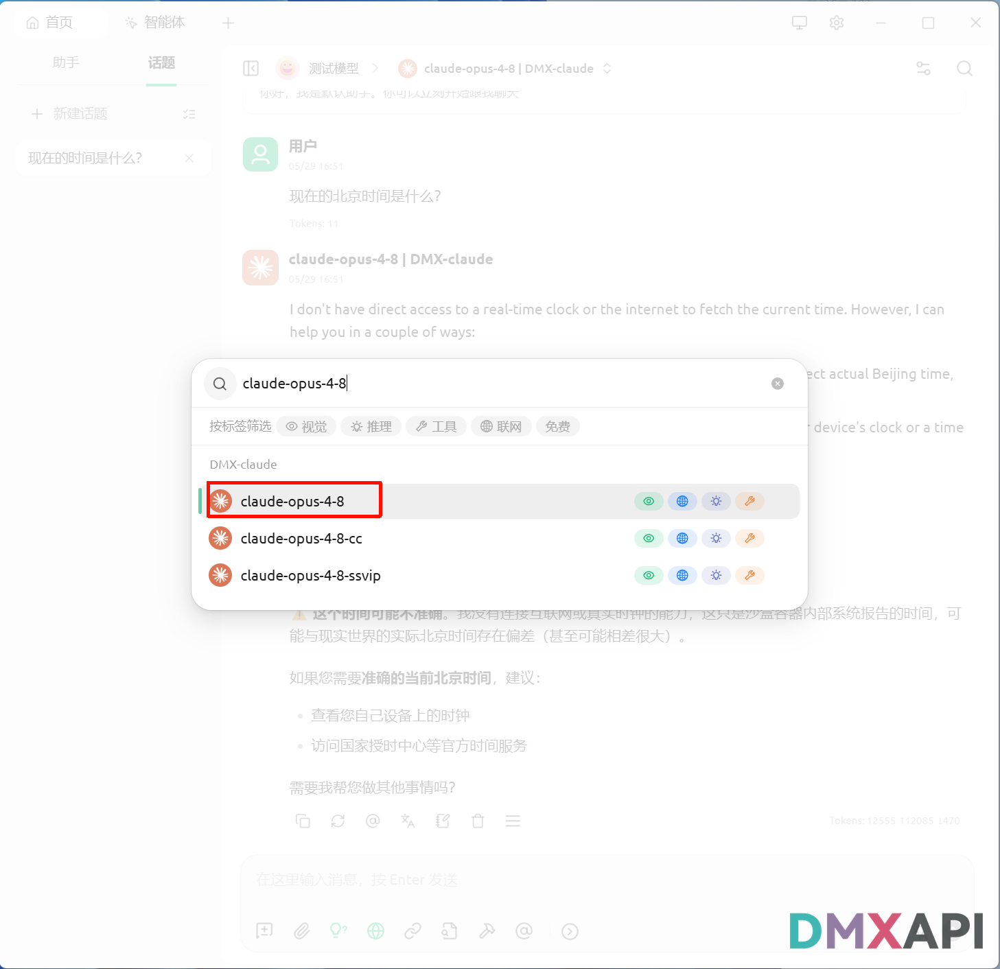
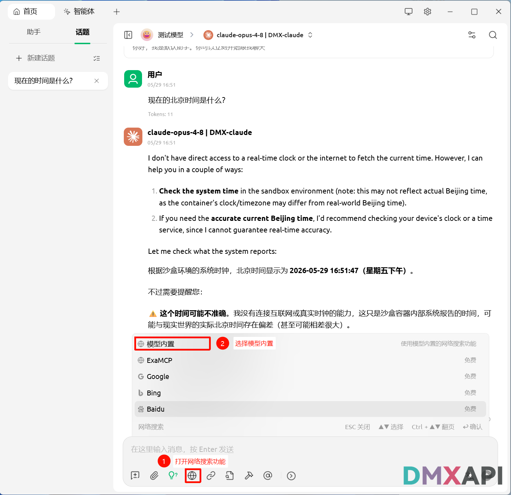
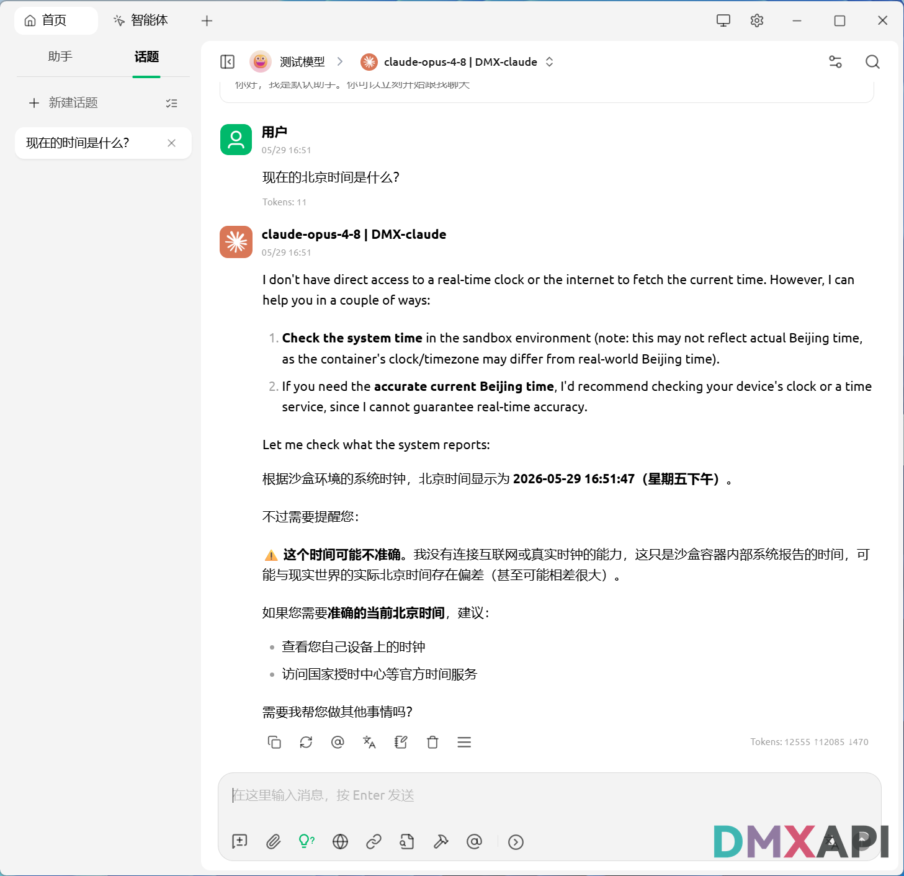

# Cherry Studio 使用 Claude 模型联网搜索

本教程将指导你在 Cherry Studio 中以 Anthropic 格式接入 DMXAPI 的 Claude 模型，并开启联网搜索，让模型实时获取互联网信息。

## ⚙️ 第一步：进入设置

打开 Cherry Studio，点击右上角的设置图标（齿轮），进入设置页面。

## ➕ 第二步：添加提供商并选择 Anthropic 格式

在「模型服务」中点击底部的「+ 添加」，提供商名称填写 `DMX-claude`，提供商类型务必选择 **Anthropic** 格式。

## 🔑 第三步：填写 API 地址与密钥

API 地址填写 `https://www.dmxapi.cn`，API 密钥填入你在 DMXAPI 后台获取的令牌（请妥善保管，勿对外泄露），随后点击「获取模型列表」加载可用模型。

## 🤖 第四步：选择 Claude 模型

在模型搜索框中输入并选择需要使用的 Claude 模型，例如 `claude-opus-4-8`。

## 🌐 第五步：开启联网搜索

打开对话窗口，点击底部的联网搜索按钮启用该功能，模型即可结合实时联网信息作答。

## ✅ 第六步：开始联网对话

发送提问，模型即可结合实时联网信息作答，返回包含当前时间等最新内容的回复。

  <small>© 2026 DMXAPI Cherry Studio 使用 Claude 模型联网搜索</small>

