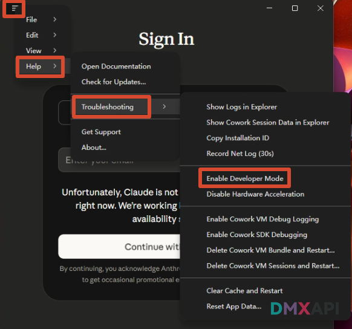
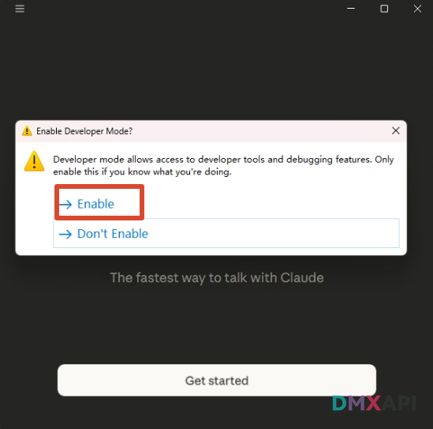
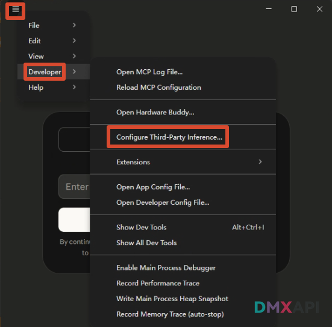
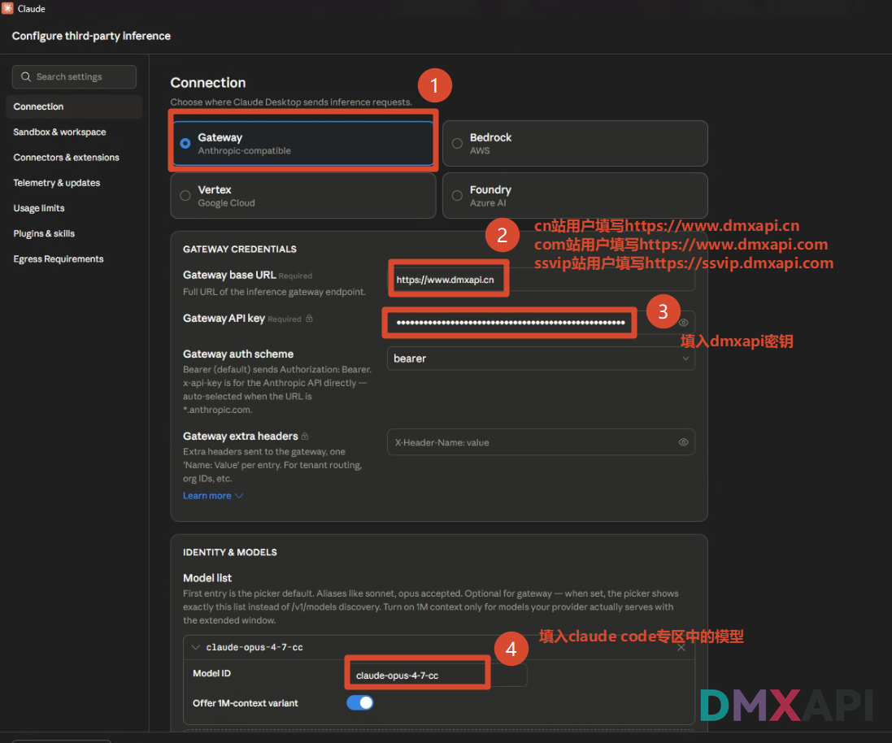
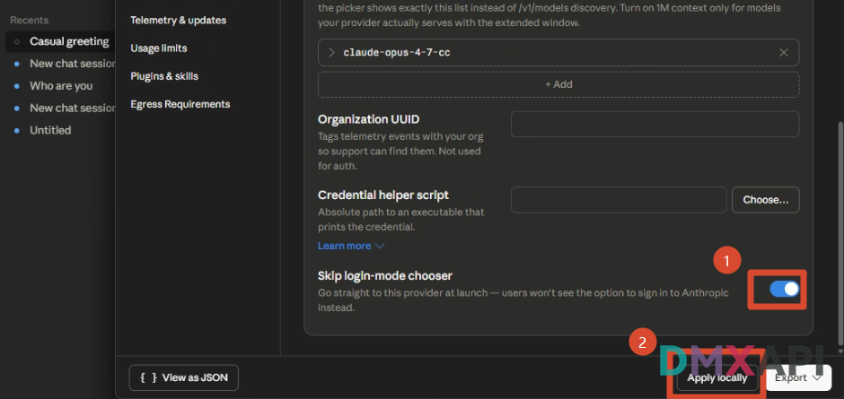
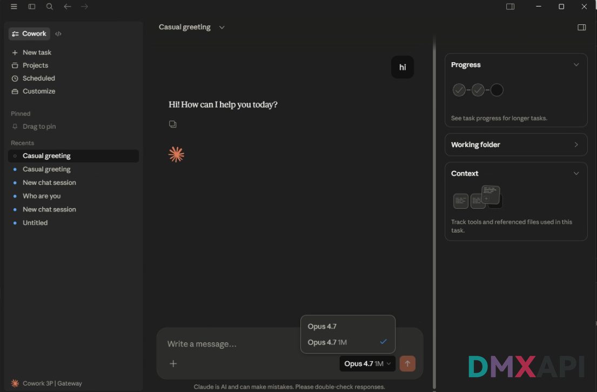

# Claude Code Desktop 配置 DMXAPI 使用教程

Claude Code Desktop 是 Anthropic 推出的桌面端 AI 编程助手，支持通过第三方推理网关接入外部模型。

## 下载安装

前往 Claude 官网下载并安装 Claude Code Desktop，安装完成后启动应用。

👉 **[https://claude.com/download](https://claude.com/download)**

## 启用开发者模式

### 第一步：打开开发者模式入口

点击左上角菜单按钮，依次进入 **Help → Troubleshooting → Enable Developer Mode**。

### 第二步：确认启用开发者模式

在弹出的确认窗口中点击 **Enable**。启用后，应用会开放开发者相关菜单，用于配置第三方推理服务。

## 配置 DMXAPI Gateway

### 第三步：打开第三方推理配置

点击左上角菜单按钮，依次进入 **Developer → Configure Third-Party Inference...**。

### 第四步：填写 Gateway 与模型信息

在配置页面选择 **Gateway**，然后填写 Gateway Base URL、Gateway API Key 和 Model ID。API Key 请填写你的 DMXAPI 令牌，模型 ID 填写 Claude Code 专区中可用的模型名称。

| 字段 | 填写内容 |
|------|----------|
| Gateway Base URL | `https://www.dmxapi.cn` |
| Gateway API Key | 你的 DMXAPI 令牌，可在工作台 → API 令牌处获取 |
| Model ID | Claude Code 专区中的模型 ID，如 `claude-opus-4-7-cc` |

> **Gateway Base URL 说明：**
> - cn 站用户：`https://www.dmxapi.cn`
> - com 站用户：`https://www.dmxapi.com`
> - SSVIP 站用户：`https://ssvip.dmxapi.com`

### 第六步：开启跳过登录并应用配置

在页面底部开启 **Skip login-mode chooser**，然后点击右下角 **Apply locally** 保存到本地。开启后，应用启动时会直接使用当前配置的第三方推理服务。

## 选择模型并测试

### 第七步：切换模型并发送消息

回到 Claude Code Desktop 主界面，点击输入框右侧的模型选择器，选择刚配置的模型。在输入框中发送任意内容（如 `hi`），如果可以正常回复，说明 DMXAPI 已成功接入。

  <small>© 2026 DMXAPI Claude Code Desktop 配置教程</small>

