# OpenClaw（原 clawdbot）配置 DMXAPI 教程

Moltbot 是一款运行在您自己的设备上的个人 AI 助手 。它可以通过您常用的渠道（WhatsApp、Telegram、Slack、Discord、Google Chat、Signal、iMessage、Microsoft Teams、WebChat）以及 BlueBubbles、Matrix、Zalo 和 Zalo Personal 等扩展渠道为您提供帮助。它支持 macOS/iOS/Android 系统，并可渲染由您控制的实时 Canvas 界面。网关只是控制平台，产品本身才是真正的助手。

::: tip 汉化版特性
- 已内置 DMXAPI 配置
- 支持自定义 URL 和 Key
- 支持 Windows 系统
:::

## 开源地址

| 平台 | 地址 |
|------|------|
| CNB 仓库 | https://cnb.cool/dmxapi/openclaw-dmxapi-cn |
| GitHub 仓库 | https://github.com/YeSongYun/openclaw-cn |


## 安装

```bash
# 配置 npm 源
npm config set registry https://npm.cnb.cool/dmxapi/openclaw-cn/-/packages/

# 安装最新版本
npm install -g openclaw-cn@1.2.0
```

::: warning 提示
安装过程中可能会出现警告信息，无需担心，继续进行下一步即可。
:::

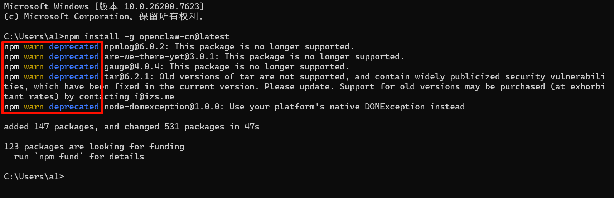


## 配置

### 1. 重置配置（可选）

如果您之前安装过官方版本或旧版汉化版本，建议先执行重置：

```bash
openclaw-cn reset
```

选择 **Full reset（完全重置）**：

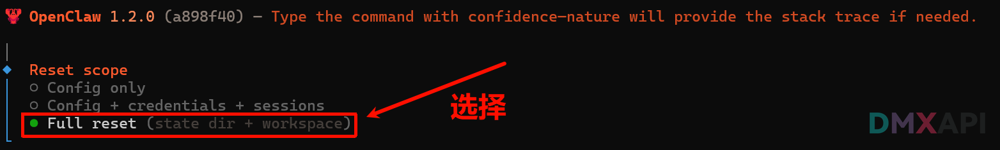

选择 **YES** 确认：

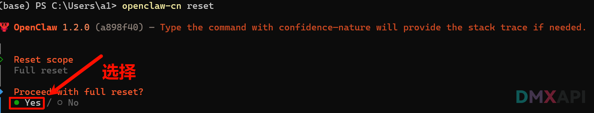

### 2. 开始配置

运行以下指令开始配置：

```bash
openclaw-cn onboard
```

#### 配置步骤

**第 1 步：** 选择 `YES` 继续

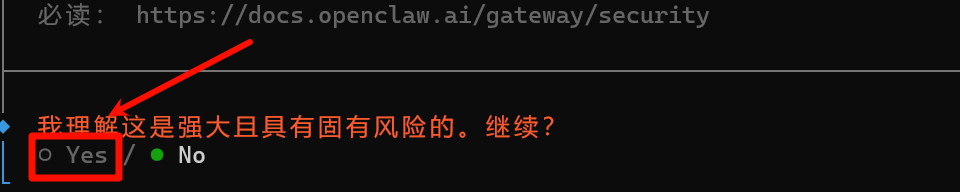

**第 2 步：** 选择 **快速开始**

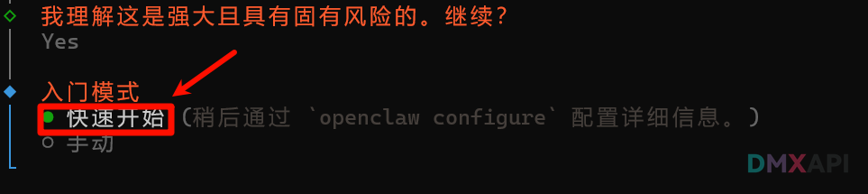

**第 3 步：** 选择 **DMXAPI**

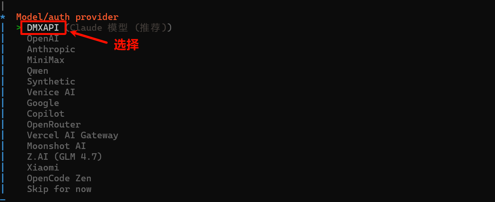

**第 4 步：** 选择 **DMXAPIkey**

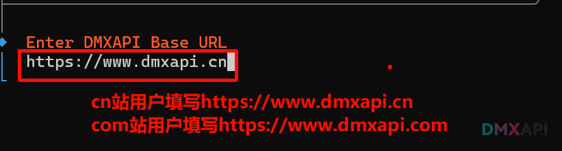

**第 5 步：** 输入您的密钥

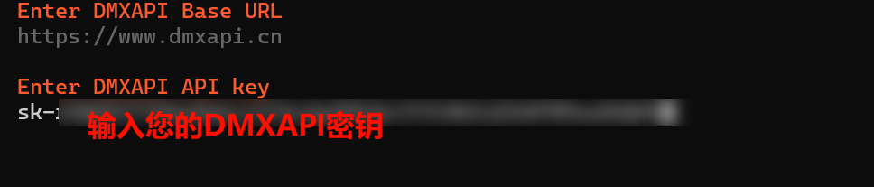

**第 6 步：** 选择 **No**

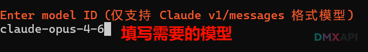

**第 7 步：** 选择 **dmxapi**

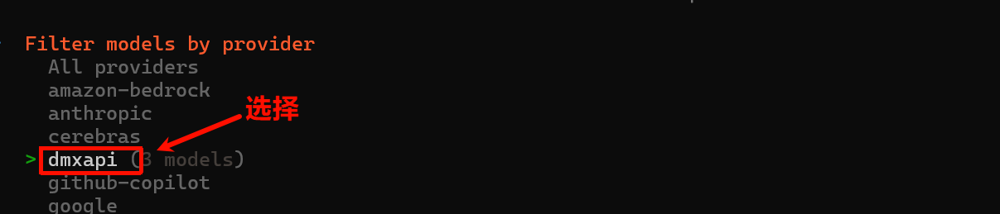

**第 8 步：** 根据需求配置默认模型

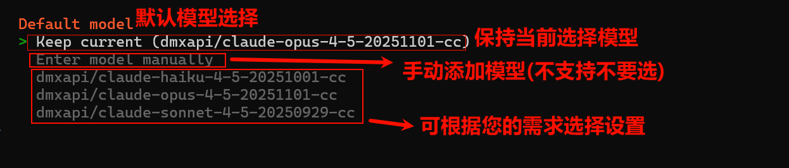

**第 9 步：** 根据需求关联个人账户

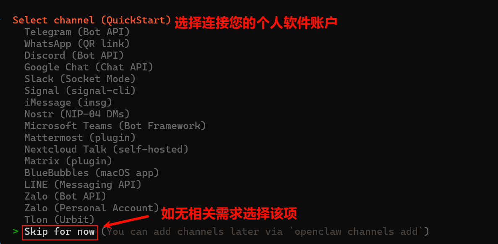

**第 10 步：** 选择 **Yes**

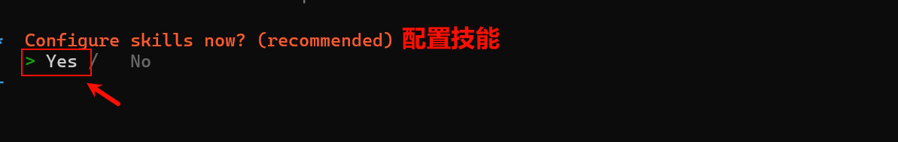

**第 11 步：** 选择 **npm**

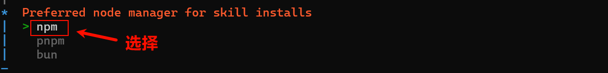

**第 12 步：** 根据需求配置技能选择

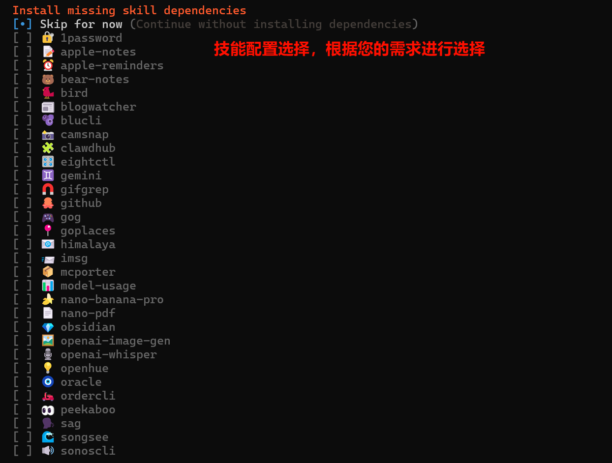

**第 13 步：** 全部选择 **No**

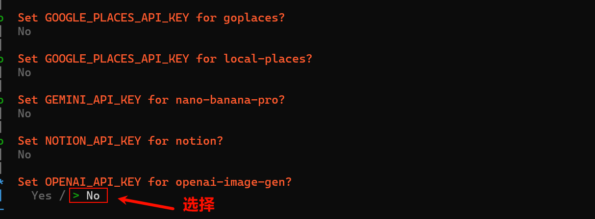

**第 14 步：** hook 功能的配置选择

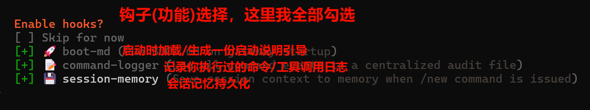

::: info 注意
配置完成后会自动弹出浏览器网页，请不要关闭，下一步会用到。
:::

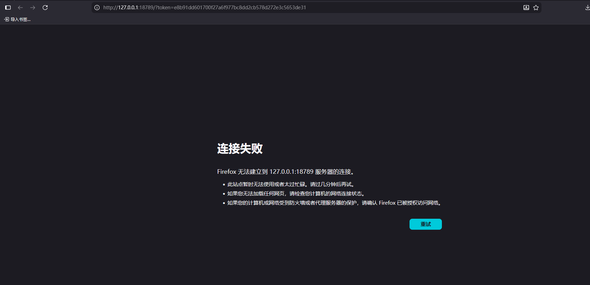


## 启动

```bash
openclaw-cn gateway
```

启动后刷新上一步弹出的浏览器网页：

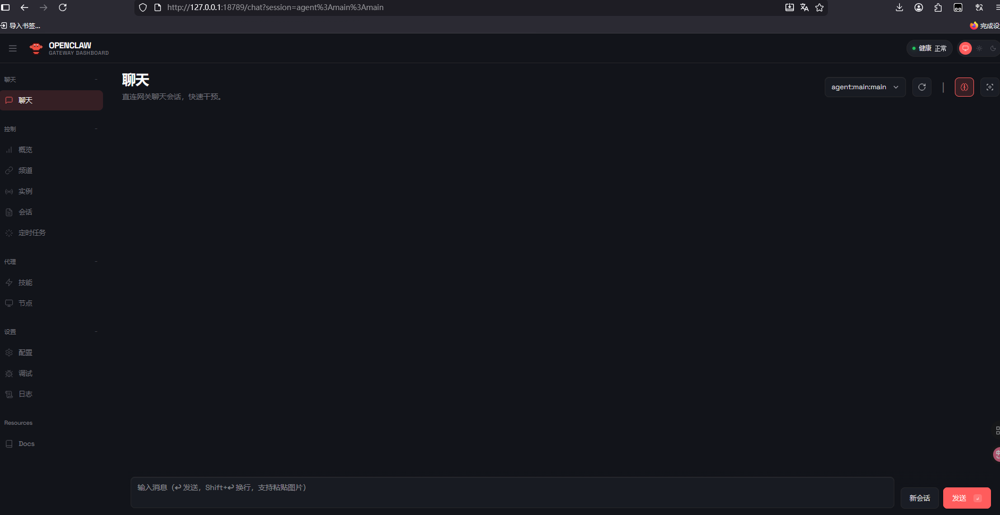


## 测试

在聊天页面输入 `你好`，如收到回复说明配置成功。


## 版本升级

```bash
npm update -g openclaw-cn
```

<p align="center">
  <small>© 2026 OpenClaw（原 clawdbot）配置 DMXAPI 教程</small>
</p>