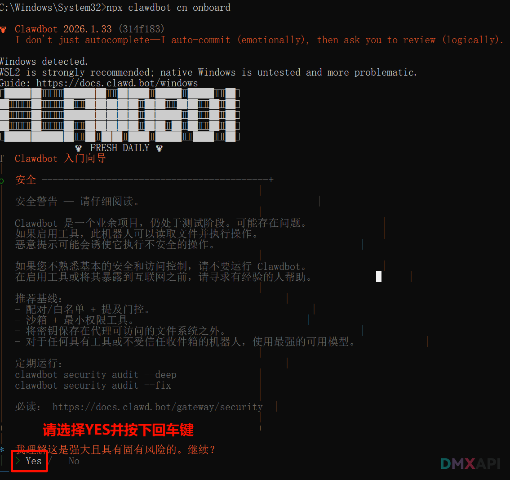
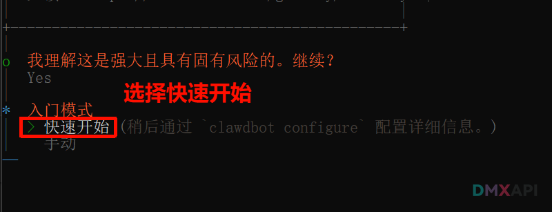
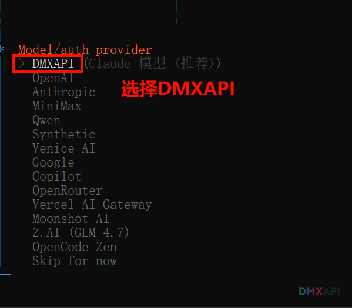
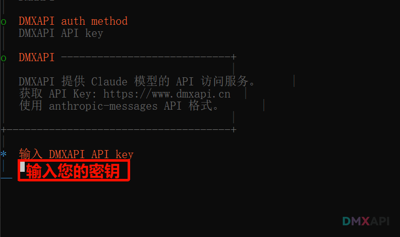
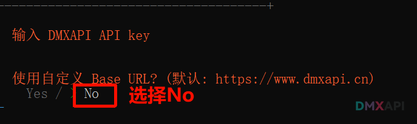
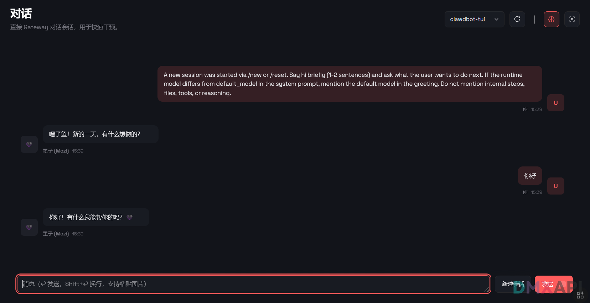

#  OpenClaw（原 clawdbot）配置 DMXAPI 教程

> Moltbot 是一款运行在您自己的设备上的个人 AI 助手 。它可以通过您常用的渠道（WhatsApp、Telegram、Slack、Discord、Google Chat、Signal、iMessage、Microsoft Teams、WebChat）以及 BlueBubbles、Matrix、Zalo 和 Zalo Personal 等扩展渠道为您提供帮助。它支持 macOS/iOS/Android 系统，并可渲染由您控制的实时 Canvas 界面。网关只是控制平台，产品本身才是真正的助手。

::: tip
汉化版本已内置 dmxapi，支持自定义 URL 和 Key
:::

## 开源地址

```text
📦 CNB仓库地址：https://cnb.cool/dmxapi/clawdbot-dmxapi-cn
🐙 GitHub仓库地址：https://github.com/YeSongYun/clawdbot-cn
```

## 安装

```bash
# 配置 npm 源
npm config set registry https://npm.cnb.cool/dmxapi/clawdbot-cn/-/packages/

# 安装最新版本
npm install -g clawdbot-cn@latest
```


## 使用

### 1. 初始化配置

运行向导进行初始化配置：

```bash
npx clawdbot-cn onboard
```

#### 步骤说明

| 步骤 | 操作 |
|------|------|
| 1 | 选择 `YES` 继续 |
| 2 | 选择 **快速开始** |
| 3 | 选择 **DMXAPI** |
| 4 | 输入您的密钥 |
| 5 | 使用默认 Base URL 或自定义 |
| 6 | 根据需求完成后续配置 |

1. 初始化步骤

2. 选择快速开始

3. 选择 DMXAPI

4. 输入密钥

5. 配置 Base URL


### 2. 启动服务

```bash
npx clawdbot-cn gateway
```

### 3. 后续版本升级

```bash
npm update -g clawdbot-cn
```


## 测试

在聊天页面输入 `你好`，如收到回复说明配置成功。



---

<p align="center">
  <small>© 2026 Moltbot（原 clawdbot）配置 DMXAPI 教程 </small>
</p>