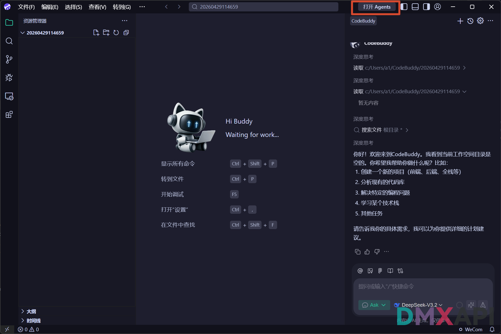
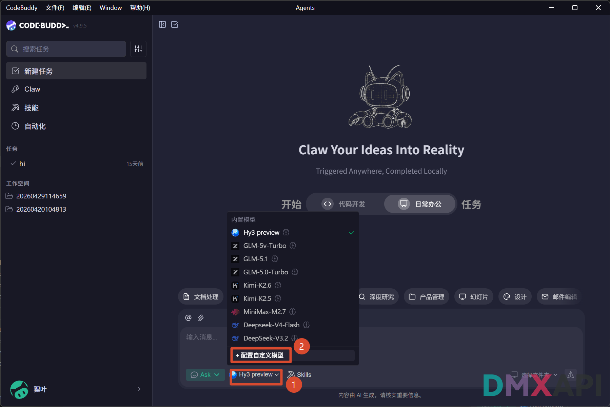
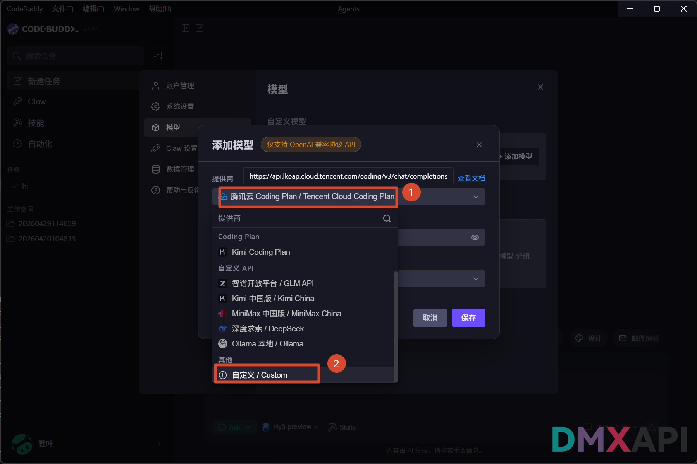
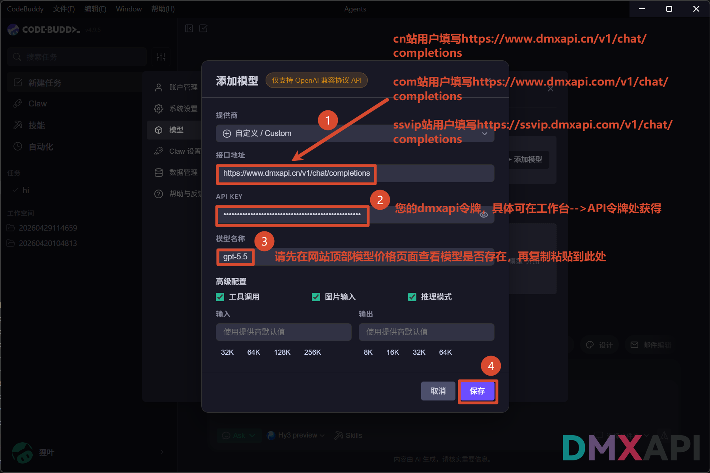
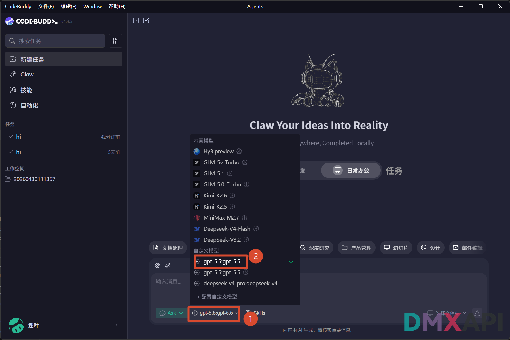
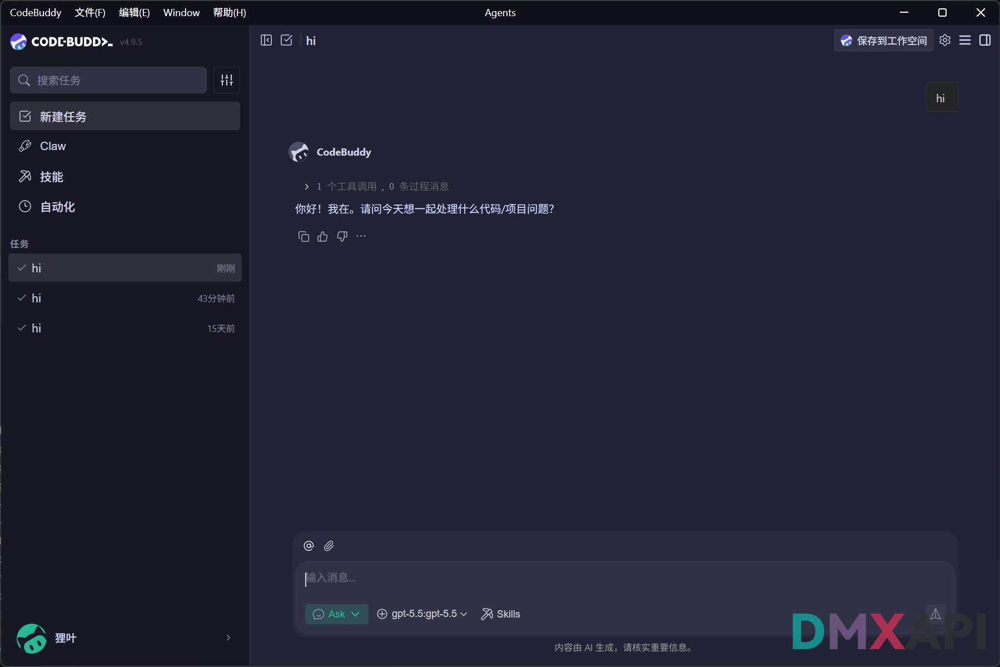
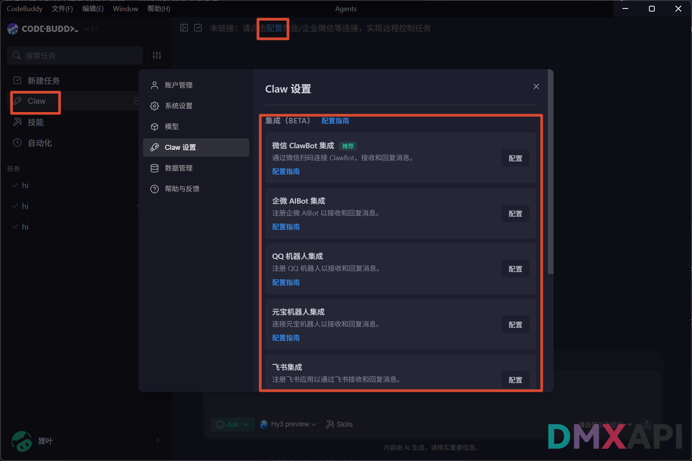

# CodeBuddy Agent 模式配置 DMXAPI 使用教程

CodeBuddy 是腾讯推出的 AI 编程助手，其 **Agent 模式**支持自主规划、多步执行、调用工具，能够端到端完成复杂的代码开发任务。通过配置 DMXAPI 自定义模型，可以在 CodeBuddy Agent 中接入 GPT、Claude、Gemini 等主流模型。

## 下载安装

前往 CodeBuddy 官网下载客户端

👉 **[https://copilot.tencent.com/](https://copilot.tencent.com/)**

## 进入 Agent 模式

点击右上角工具栏中的「**开始 Agents**」按钮，即可打开 CodeBuddy 独立的 Agent 窗口。

## 配置 DMXAPI 模型

### 第一步：打开模型选择器，添加自定义模型

在 CodeBuddy Agent 主界面，点击底部输入框左侧的 ① 模型选择按钮（默认显示当前模型名），展开模型列表后，点击列表底部的 ② **「+ 添加自定义模型」**。

### 第二步：选择自定义提供商

在弹出的「添加模型」对话框中，点击 ① 提供商下拉菜单，在列表底部「其他」分类中选择 ② **「自定义 / Custom」**。

### 第三步：填写 DMXAPI 配置信息

选择「自定义 / Custom」后，按下图填写三项关键配置，完成后点击「**保存**」：

| 字段 | 填写内容 |
|------|----------|
| ① 接口地址 | `https://www.dmxapi.cn/v1/chat/completions` |
| ② API 密钥 | 您的 DMXAPI 令牌，可在工作台 → API 令牌处获取 |
| ③ 模型名称 | 填写要使用的模型 ID，如 `gpt-5.5`，可在模型价格页查询 |

> **接口地址说明：**
> - cn站用户：`https://www.dmxapi.cn/v1/chat/completions`
> - com站用户：`https://www.dmxapi.com/v1/chat/completions`
> - SSVIP站 用户：`https://ssvip.dmxapi.cn/v1/chat/completions`

## 选择模型并测试

### 第四步：切换到自定义模型

回到 Agent 主界面，点击底部 ① 模型选择器，在弹出的下拉列表中找到刚添加的 ② 自定义模型并点击选中。

### 第五步：发送消息测试

在输入框中发送任意内容（如 `hi`），如果 CodeBuddy 正常返回回复，说明 DMXAPI 已成功接入，可以开始使用 Agent 模式进行 AI 编程了。

## 连接手机端（可选）

CodeBuddy Agent 内置 **Claw** 功能，支持将 Agent 能力接入微信 ClawBot、企微 AIBot、QQ 机器人、元宝机器人、飞书等渠道，实现用手机远程触发、控制 Agent 执行任务。

点击左侧导航栏「**Claw**」，在顶部提示栏点击「**配置**」，进入「Claw 设置」页面，在各集成入口旁点击「配置」，按「配置指南」完成绑定。

  <small>© 2026 DMXAPI CodeBuddy 配置教程</small>

