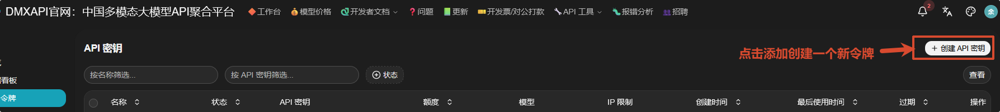
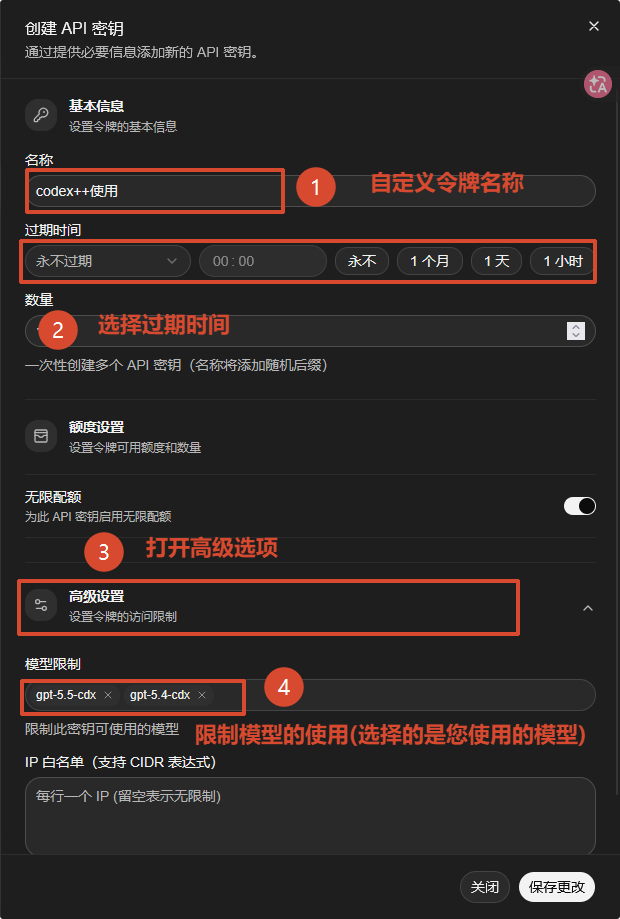
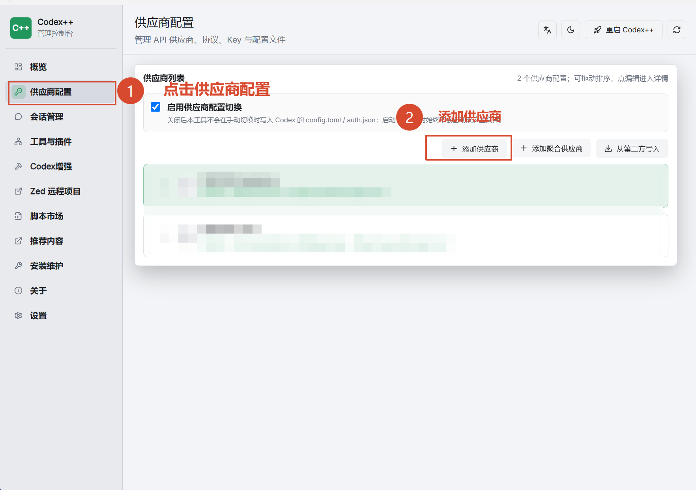
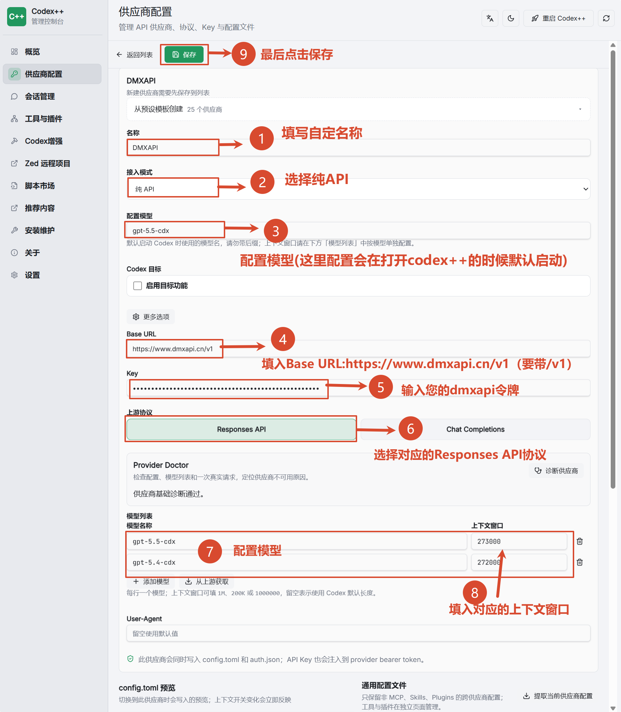
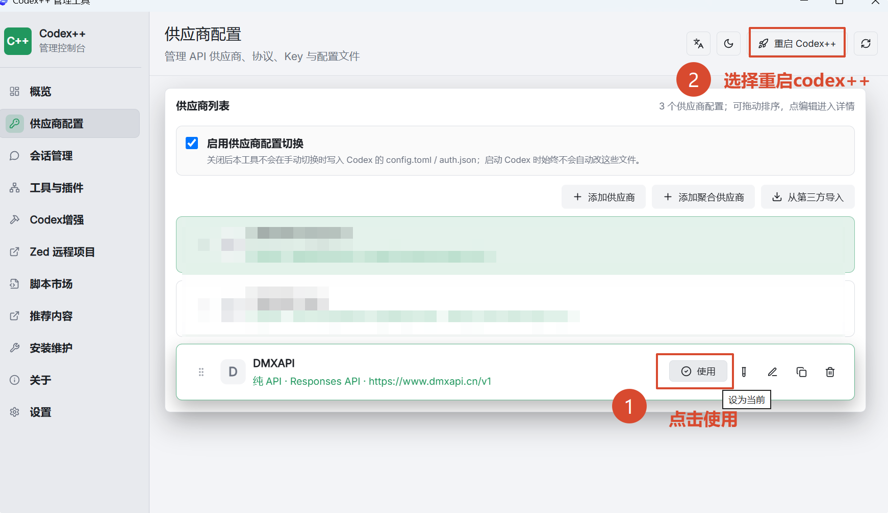
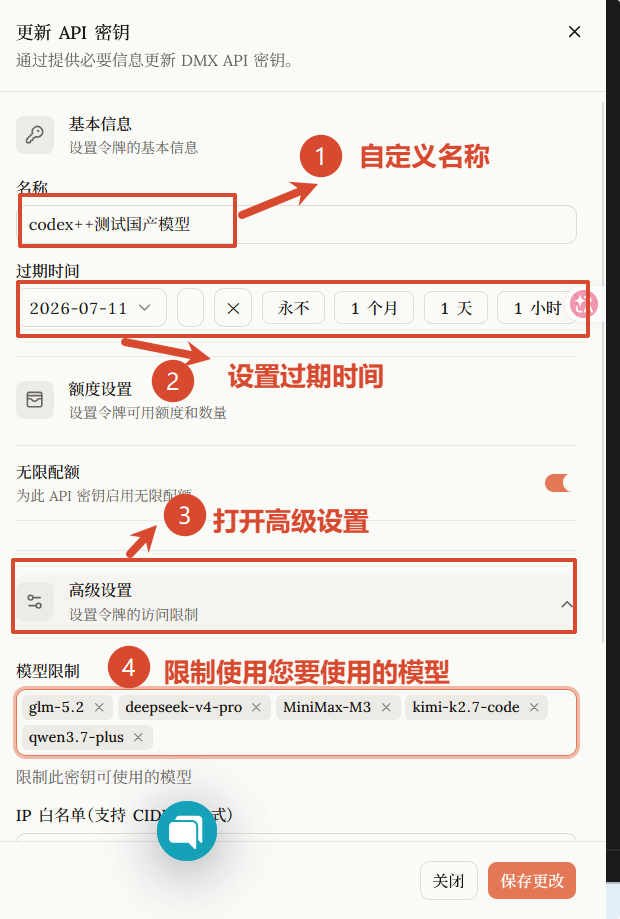
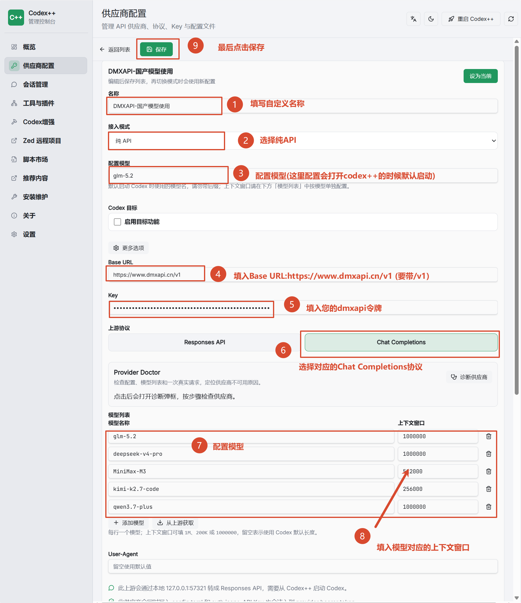
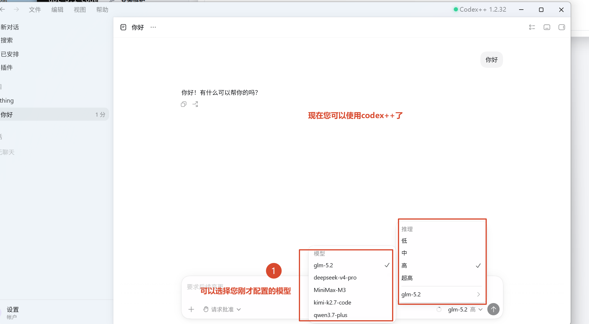

# Codex++ 配置 DMXAPI 教程

Codex++ 是一款 Codex 管理控制台工具，可视化管理 API 供应商、协议、Key 与配置文件（`config.toml` / `auth.json`），支持多供应商配置与一键切换，并内置会话管理、工具与插件、脚本市场等能力。

本教程演示如何在 Codex++ 中接入 DMXAPI。

## 一、创建 DMXAPI API 令牌

### 1. 进入官网创建 API 密钥

登录 DMXAPI 官网，进入 **工作台 → 令牌** 页面，点击右上角 **+ 创建 API 密钥**。

### 2. 填写令牌信息

在「创建 API 密钥」弹窗中依次设置：

1. **名称**：自定义令牌名称，例如 `codex++使用`
2. **过期时间**：按需选择（永不 / 1 个月 / 1 天 / 1 小时）
3. 打开 **高级设置**
4. **模型限制**：选择您要使用的模型，例如 `gpt-5.5-cdx`、`gpt-5.4-cdx`

填写完成后点击 **保存更改**。

## 二、在 Codex++ 中添加 DMXAPI 供应商

### 1. 打开供应商配置

打开 Codex++ 管理控制台：

1. 点击左侧菜单 **供应商配置**
2. 点击 **+ 添加供应商**

### 2. 填写供应商信息

在供应商编辑页面依次配置：

1. **名称**：自定义供应商名称，例如 `DMXAPI`
2. **接入模式**：选择 **纯 API**
3. **配置模型**：填写默认启动模型，例如 `gpt-5.5-cdx`（打开 Codex++ 时默认使用该模型，请勿带后缀）
4. **Base URL**：`https://www.dmxapi.cn/v1`（注意要带 `/v1`）
5. **Key**：填写您的 DMXAPI 令牌
6. **上游协议**：选择 **Responses API**
7. **模型列表**：添加要使用的模型，例如 `gpt-5.5-cdx`、`gpt-5.4-cdx`
8. **上下文窗口**：填入对应模型的上下文长度，例如 `273000`、`272000`（留空表示使用 Codex 默认长度）
9. 最后点击上方 **保存**

## 三、启用供应商并重启

回到供应商列表：

1. 在 **DMXAPI** 供应商条目上点击 **使用**（设为当前）
2. 点击右上角 **重启 Codex++** 使配置生效

## 四、（可选）接入国产模型（Chat Completions 协议）

除了 Responses API 协议的模型，Codex++ 还可以通过 **Chat Completions** 协议接入 DMXAPI 的国产模型（如 `glm-5.2`、`deepseek-v4-pro`、`MiniMax-M3`、`kimi-k2.7-code`、`qwen3.7-plus` 等）。

### 1. 创建国产模型令牌

与第一步相同，在 DMXAPI 官网创建（或更新）一个 API 密钥：

1. **名称**：自定义令牌名称，例如 `codex++测试国产模型`
2. **过期时间**：按需设置
3. 打开 **高级设置**
4. **模型限制**：选择您要使用的国产模型，例如 `glm-5.2`、`deepseek-v4-pro`、`MiniMax-M3`、`kimi-k2.7-code`、`qwen3.7-plus`

填写完成后点击 **保存更改**。

### 2. 添加国产模型供应商

再次 **添加供应商**，依次配置：

1. **名称**：自定义供应商名称，例如 `DMXAPI-国产模型使用`
2. **接入模式**：选择 **纯 API**
3. **配置模型**：填写默认启动模型，例如 `glm-5.2`
4. **Base URL**：`https://www.dmxapi.cn/v1`（注意要带 `/v1`）
5. **Key**：填写您的 DMXAPI 令牌
6. **上游协议**：选择 **Chat Completions**
7. **模型列表**：添加要使用的国产模型
8. **上下文窗口**：填入模型对应的上下文长度，例如 `glm-5.2`/`deepseek-v4-pro`/`qwen3.7-plus` 为 `1000000`、`MiniMax-M3` 为 `512000`、`kimi-k2.7-code` 为 `256000`
9. 最后点击上方 **保存**

保存后同样在供应商列表中点击 **使用**（设为当前）并 **重启 Codex++**。

::: tip 提示
Chat Completions 上游会通过本地端口转成 Responses API，需要从 Codex++ 启动 Codex 才能生效。
:::

## 五、开始使用

配置生效后即可开始对话。在聊天输入框的模型选择处，可以选择您刚才配置的模型（如 `glm-5.2`、`deepseek-v4-pro`、`MiniMax-M3`、`kimi-k2.7-code`、`qwen3.7-plus`），并可按需调整推理力度（低 / 中 / 高 / 超高）。

可以开始用起来啦！！！！

---

  <small>© 2026 DMXAPI Codex++ 配置</small>

