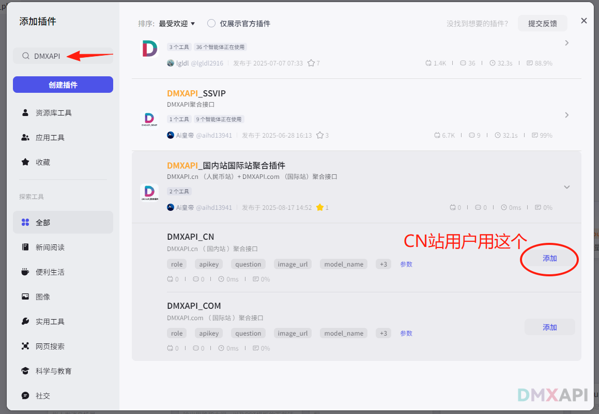
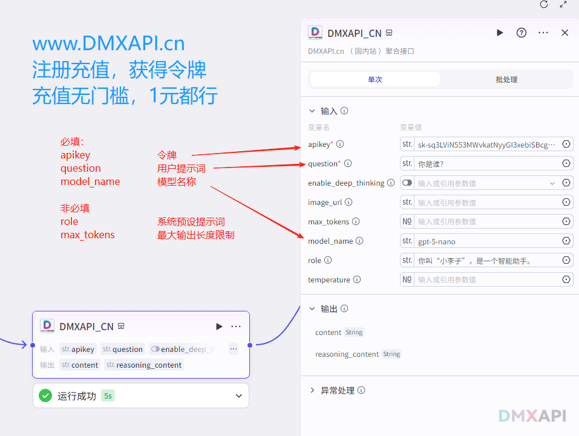
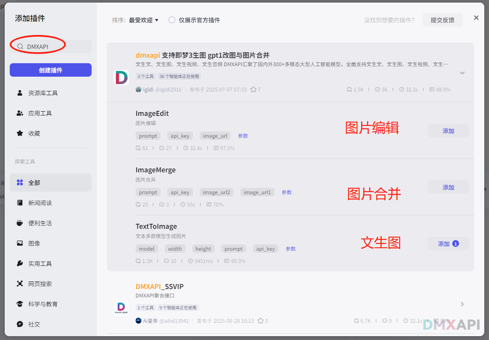
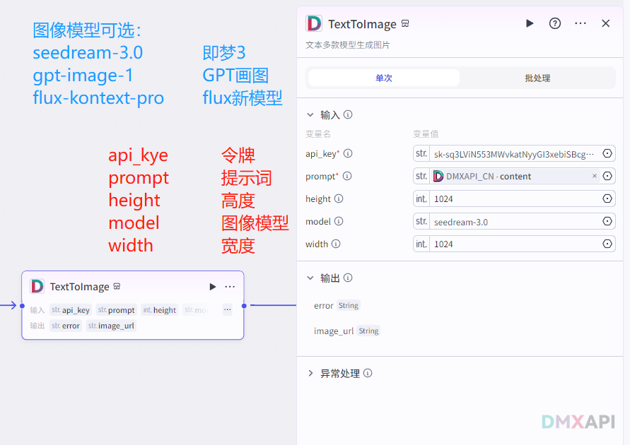
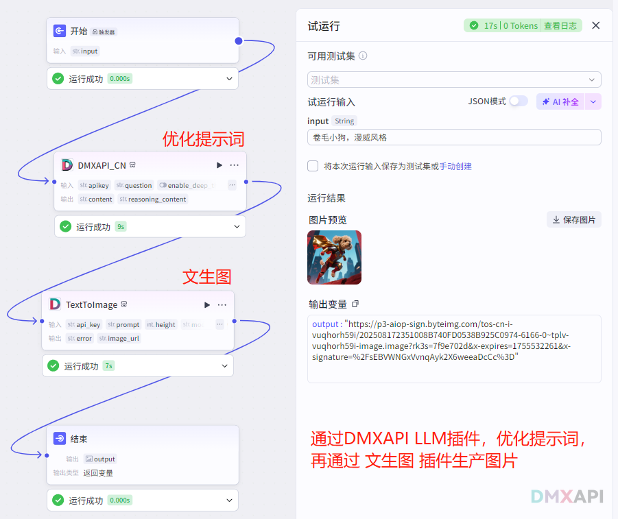

# 扣子插件(coze插件)配置指南

## 扣子coze插件安装
在 Coze 插件市场搜索 "DMXAPI" 可以找到对应的插件。包括 LLM纯文本插件 和 图片模型插件。

### 预先准备
- 注册登录 www.DMXAPI.cn 
- 充值：充值无门槛，1元都行
- 顶部菜单 工作台，再到 令牌页面，点击令牌进行复制，一会需要填入扣子插件里。

## LLM纯文本插件配置

## 图片模型插件 TextToImage
模型：即梦3  `seedream-3.0`
在插件市场搜索`DMXAP`,找到对应插件点击`添加`

### 添加插件后，设置对应参数即可使用

### 因为插件输出的是图片URL，所以在`结束`节点，需要选择`图片`类型，并把图片URL传入，就可以正常显示图片。

### 最终显示图片结果

## 图片编辑/多图合并 插件
设置基本和文生图插件类似，参加设置即可。

  <small>© 2025 DMXAPI 扣子插件(coz...</small>

