# Dify 客户端配置方法

**Dify** 是一款开源的 AI 应用开发平台，提供可视化的工作流编排、RAG 检索增强、Agent 智能体构建等功能，帮助开发者快速构建和部署大模型应用。

## 第一步  打开模型供应商配置界面

> 请点击用户头像，然后点击设置

## 第二步  选择安装所需的供应商
> 请注意选择DMXAPI支持的供应商
> 目前共支持四种供应商:
> - OpenAI
> - Anthropic
> - Gemini
> - Open-API-compatible
### 1. 请在此处安装模型供应商

### 2. 各模型供应商的介绍

## 第三步  API 密钥授权配置
### OpenAI相应配置
#### 1. 点击设置
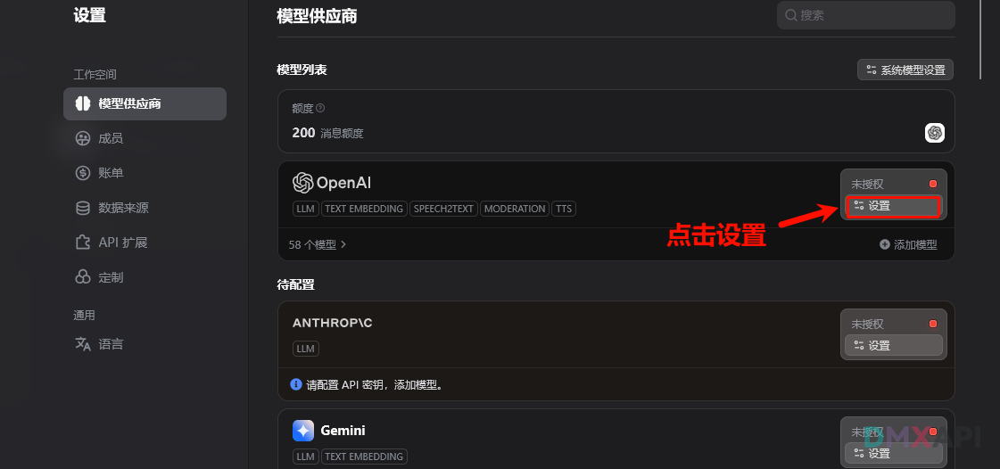
#### 2. 进行相关配置
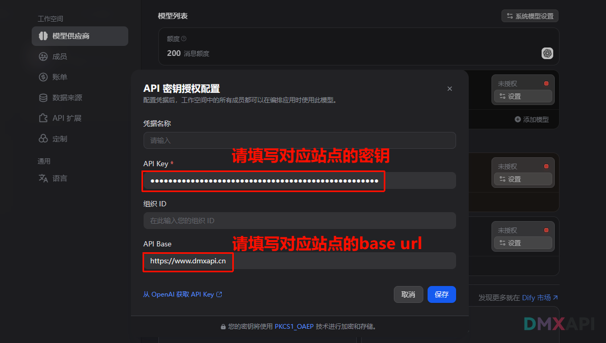
### Anthrop相应配置
#### 1. 点击设置
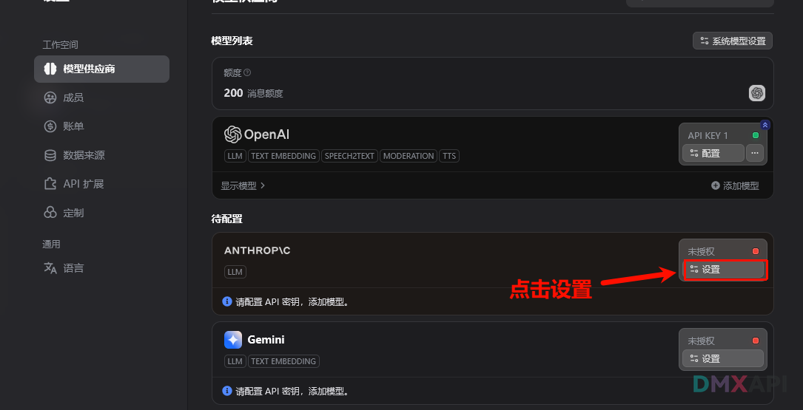
#### 2. 进行相关配置
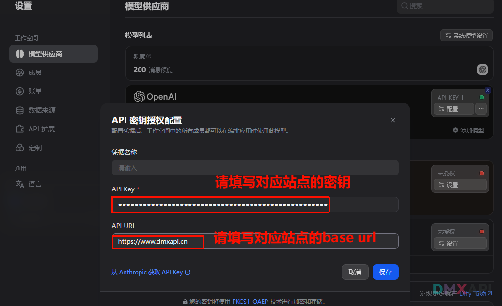

### Gemini相应配置
#### 1. 点击设置
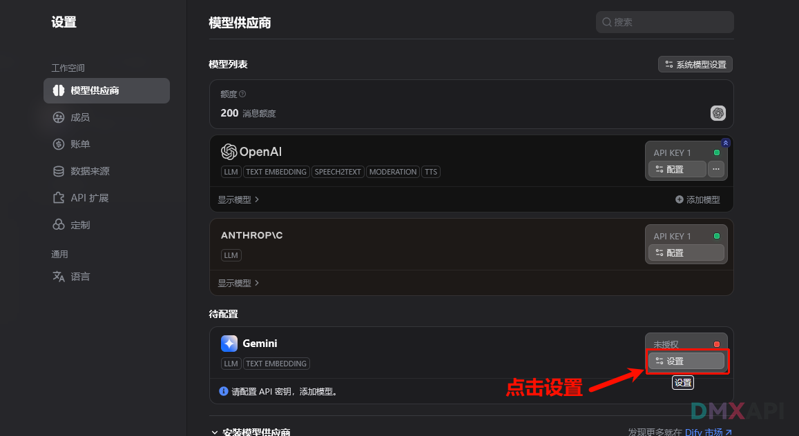
#### 2. 进行相关配置
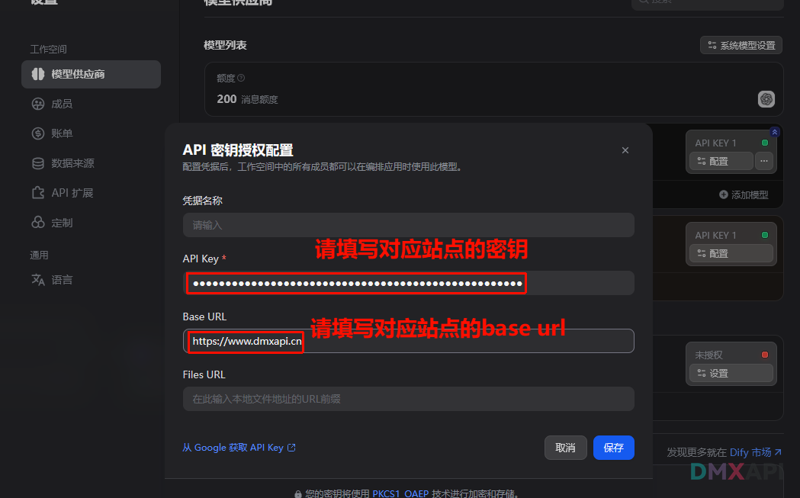

### Open-API-compatible相应配置
#### 1. 点击添加模型
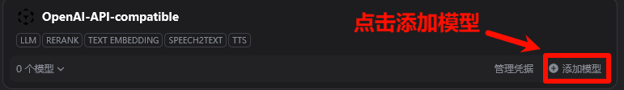
#### 2. 点击添加新模型
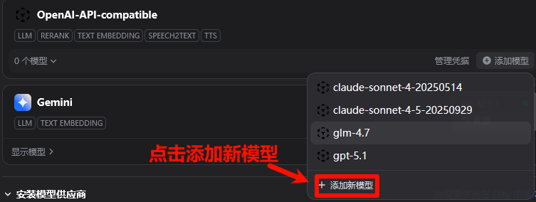
#### 3. 进行相关配置填写
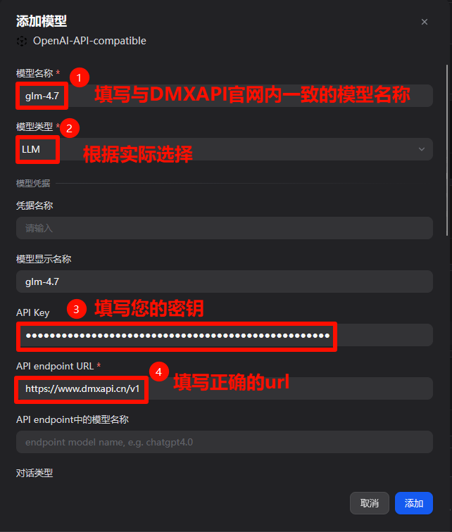
#### 4. 填写模型上下文长度
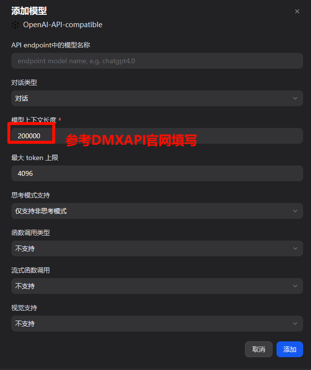

## 第四步  简单的测试
:::warning 注意
测试时请一定记住，填写模型名称时，一定要和DMXAPI网站上列出的模型名称一致！  
具体请点击：[DMXAPI模型列表](https://www.dmxapi.cn/rmb)
:::
### OpenAI测试
> 使用`gpt-5-2`模型进行测试
#### 1. 输入"你好"
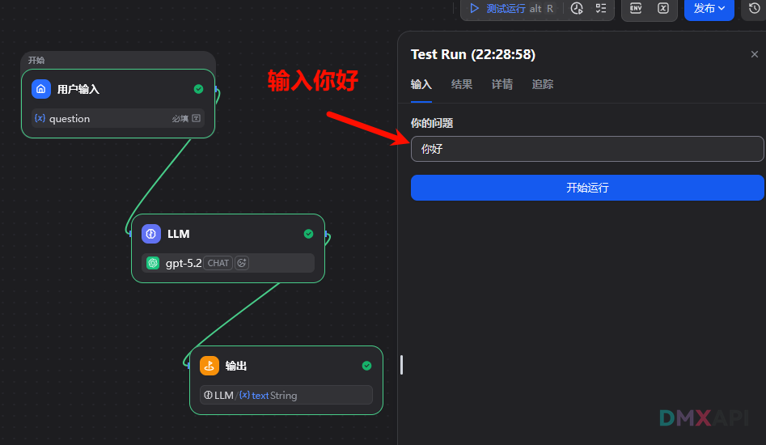
#### 2. 成功运行！
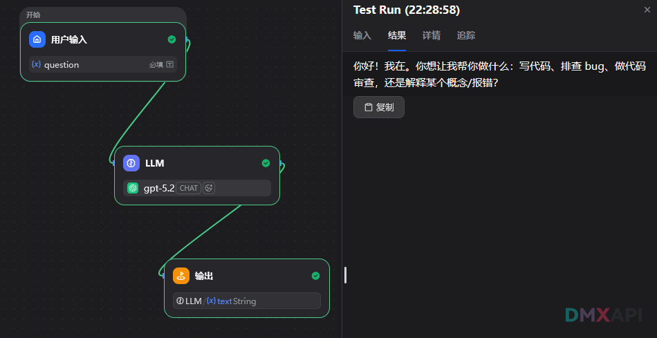

### Anthrop测试
> 使用`claude-sonnet-4-5-20250929`模型进行测试
#### 1. 输入"你好"

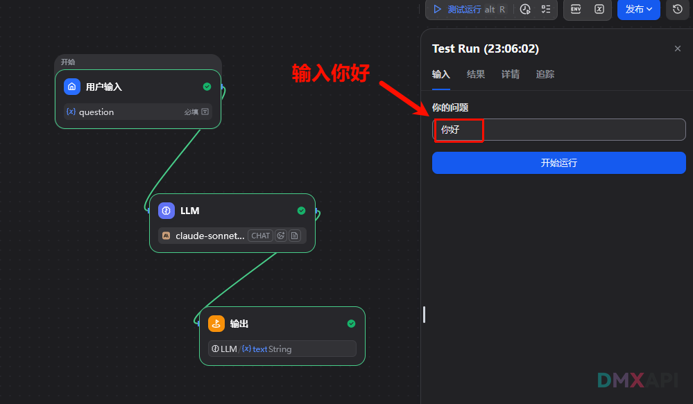
#### 2. 成功运行！
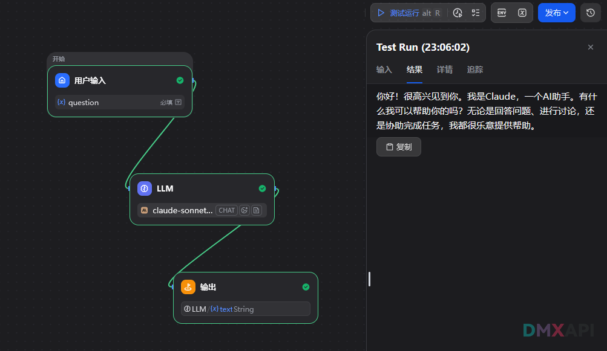

### Gemini测试
> 使用`gemini-3-pro-preview`模型进行测试
#### 1. 输入"你好"
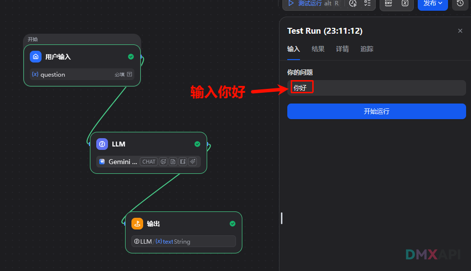
#### 2. 成功运行
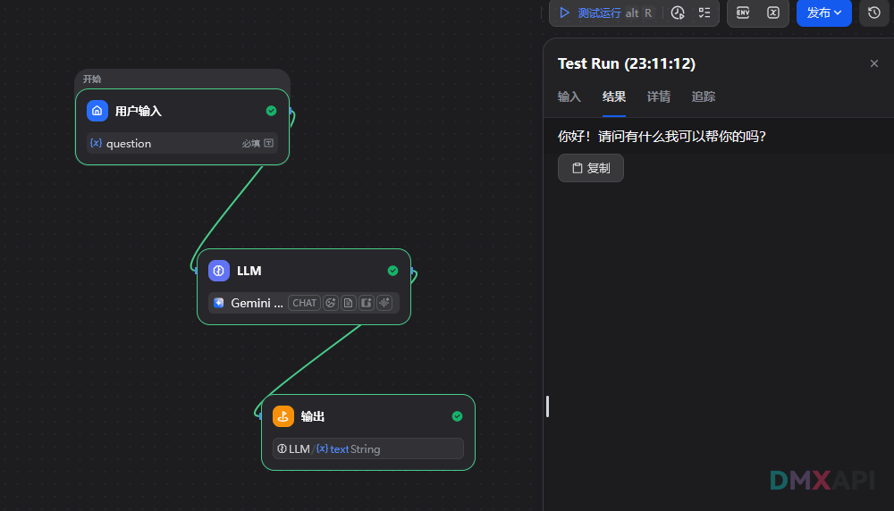

### Open-API-compatible测试
> 使用`glm-4.7`模型进行测试
#### 1. 输入"你好"
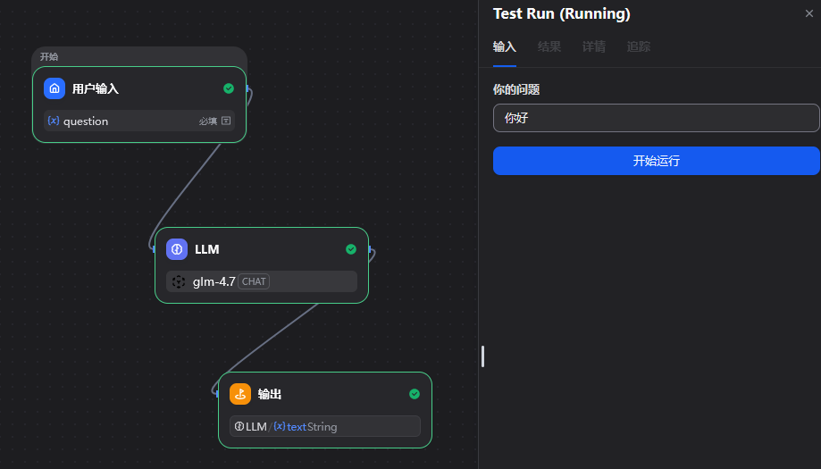
#### 2. 成功运行
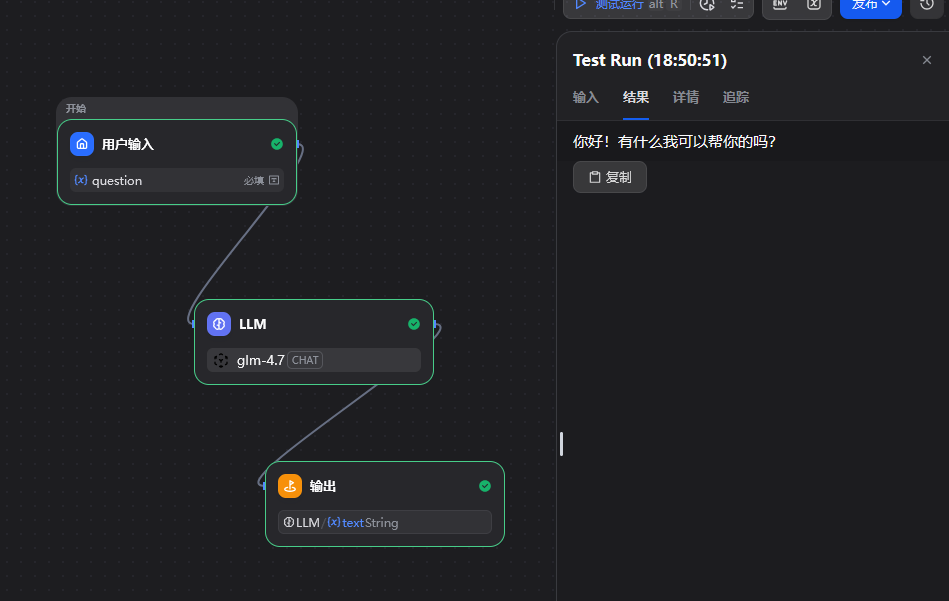

  <small>© 2025 DMXAPI Dify接入</small>

