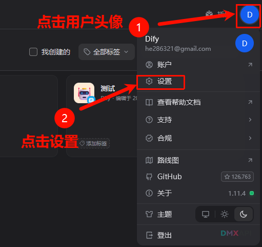
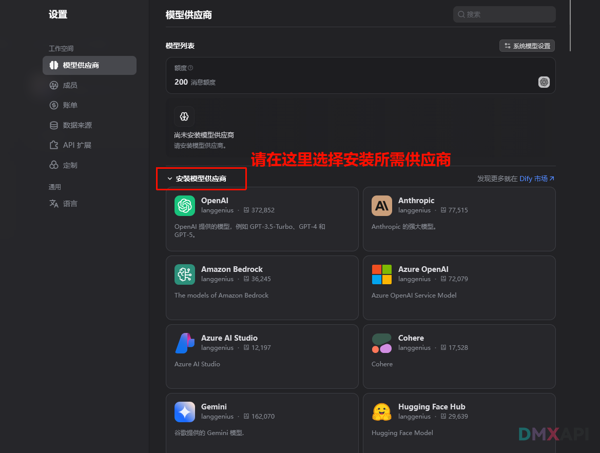
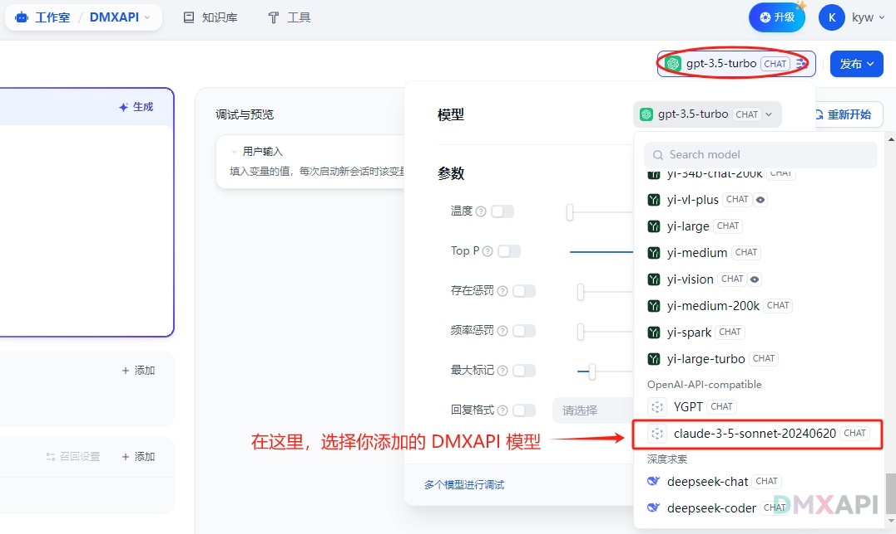

# Dify 客户端配置方法

见：http://dify.DMXAPI.cn   按这个教程，看图操作就行

## 第一步：选择 openai兼容 供应商配置

## 第二步：注意 URL 需要根据注册网站配置

如果你的令牌是 cn 站，dify里 `Url` 需要填 `https://www.dmxapi.cn/v1`

如果你的令牌是 com 站，dify里 `Url` 需要填 `https://www.dmxapi.com/v1`

## 第三步： 选择模型 开始使用

  <small>© 2025 DMXAPI Dify接入</small>

