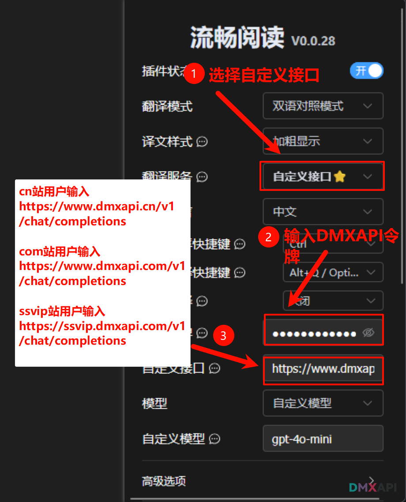
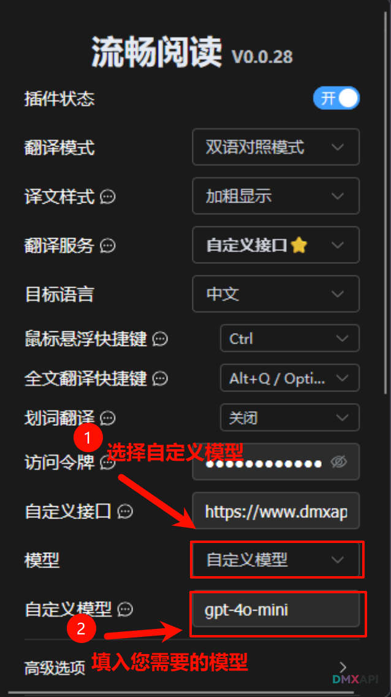

# Fluent Read 配置 DMXAPI 教程

Fluent Read（流畅阅读）是一款开源的沉浸式浏览器翻译插件，支持双语对照模式，让所有人都能拥有母语般的阅读体验。本教程介绍如何将其接入 DMXAPI，使用任意大模型进行翻译。

## 一. 打开插件设置，选择自定义接口

打开 Fluent Read 插件设置页，将**翻译服务**切换为**自定义接口 ⭐**，然后在**访问令牌**处填入您的 DMXAPI Key，并在**自定义接口**处填入对应的接口地址。

> **接口地址说明（按注册站点选择）**
>
> | 站点 | 接口地址 |
> |---|---|
> | cn 站 | `https://www.dmxapi.cn/v1/chat/completions` |
> | com 站 | `https://www.dmxapi.com/v1/chat/completions` |
> | ssvip 站 | `https://ssvip.dmxapi.com/v1/chat/completions` |

## 二. 选择自定义模型

将**模型**下拉框选为**自定义模型**，然后在**自定义模型**输入框中填入您想使用的模型名称（例如 `gpt-4o-mini`、`deepseek-v3` 等）。

## 三. 完成配置

保存设置后，即可使用 DMXAPI 提供的模型进行网页翻译。您可以在 [DMXAPI 模型列表](https://www.dmxapi.cn/rmb) 中查看所有支持的模型名称。

  <small>© 2026 DMXAPI Fluent Read 配置教程</small>

