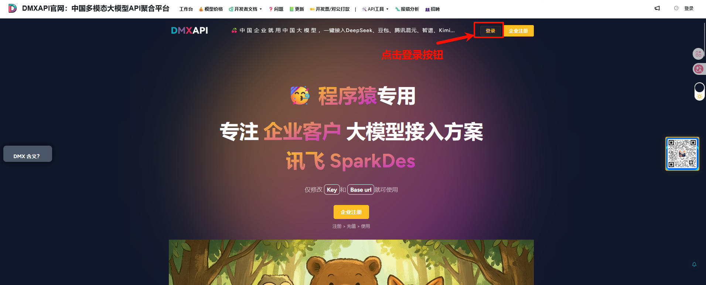
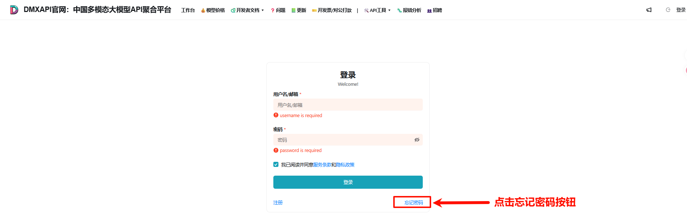
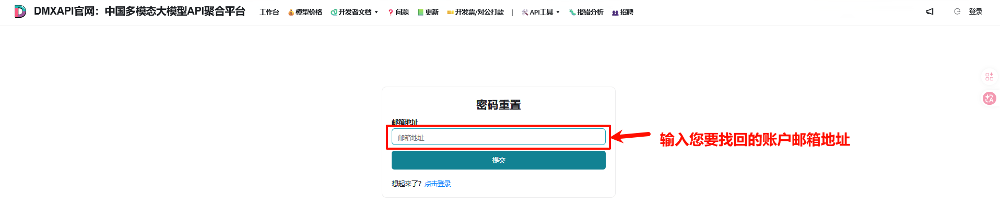
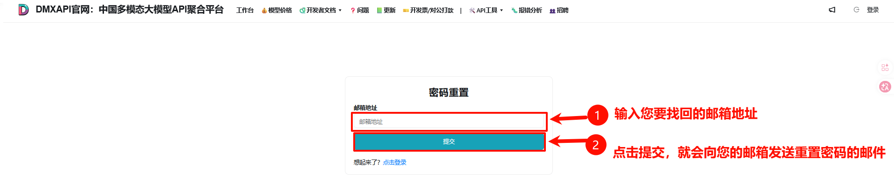
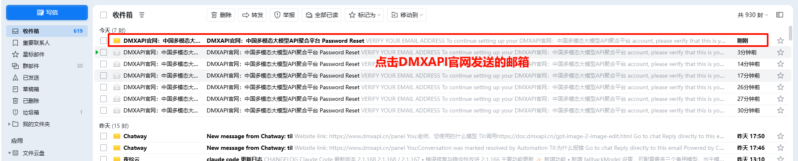
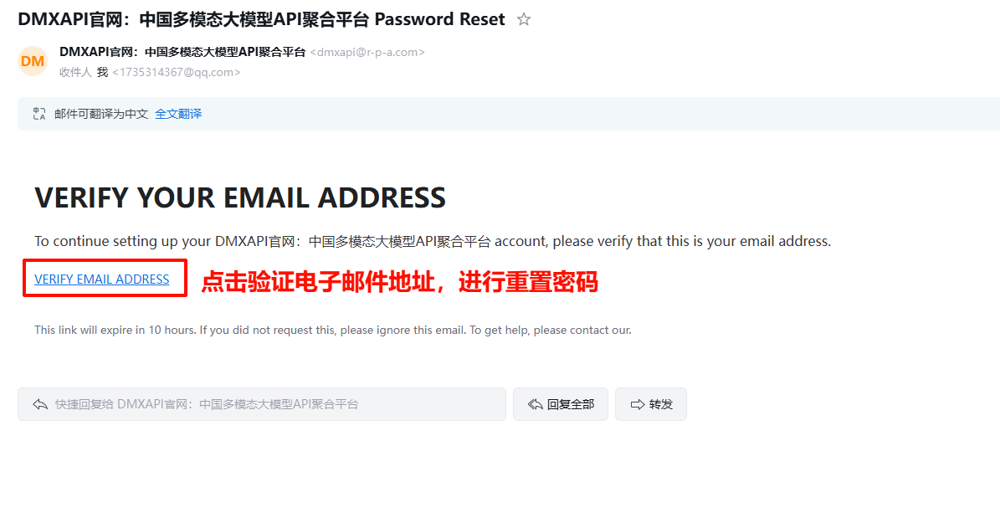
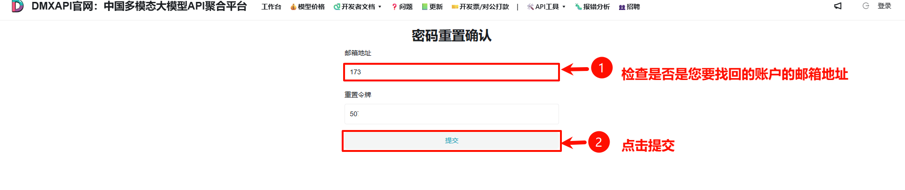
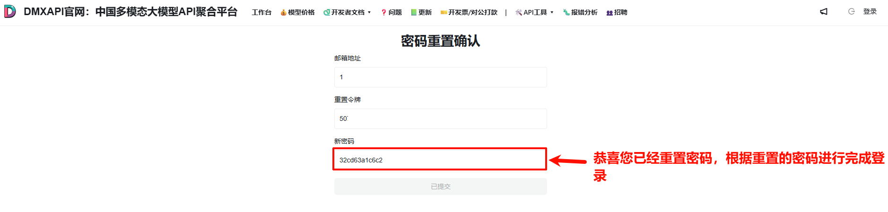

# DMXAPI 重置密码教程

忘记账户密码时，可以通过绑定的邮箱验证身份并重置密码。本文介绍在 DMXAPI 官网找回密码的完整流程。

## 重置方法

### 1. 打开官网，点击登录

打开 [DMXAPI 官网](https://www.dmxapi.cn/)，点击右上角的「登录」按钮。

### 2. 点击「忘记密码」

在登录页面，点击右下角的「忘记密码」按钮。

### 3. 输入账户邮箱地址

进入「密码重置」页面，输入你要找回的账户邮箱地址。

### 4. 提交，发送重置邮件

点击「提交」，系统会向该邮箱发送一封重置密码的邮件。

### 5. 打开邮箱中的重置邮件

登录你的邮箱，找到 DMXAPI 官网发来的「Password Reset」邮件并打开。

### 6. 点击验证邮箱地址

在邮件中点击「VERIFY EMAIL ADDRESS」验证邮箱地址，进行密码重置。

:::tip 提示
该验证链接 10 小时内有效，请尽快完成验证。如果不是你本人操作，可忽略此邮件。
:::

### 7. 核对邮箱并提交

跳转到「密码重置确认」页面，核对邮箱地址是否为你要找回的账户，确认无误后点击「提交」。

### 8. 重置完成，使用新密码登录

系统会生成一个新密码，复制该新密码即可登录账户，密码找回完成。登录后建议前往工作台自行修改为常用密码。

---

  <small>© 2026 DMXAPI 重置密码教程</small>

