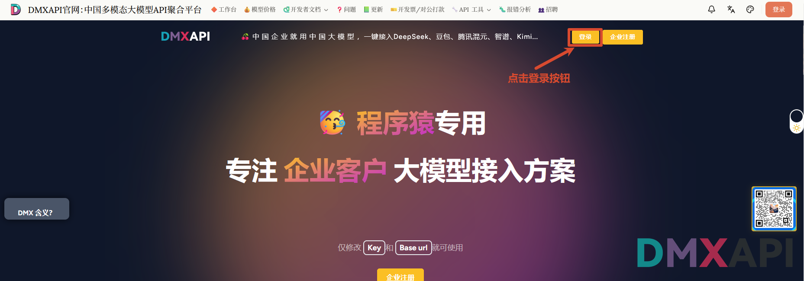
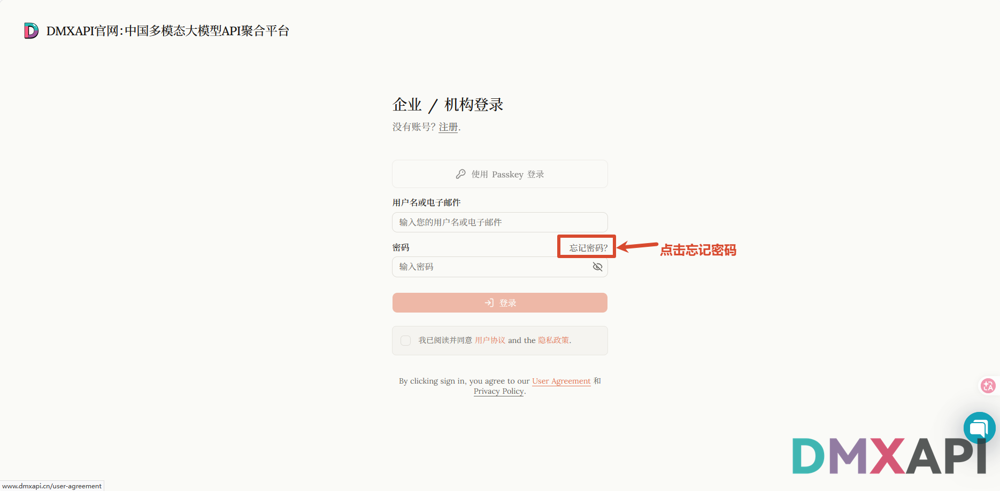
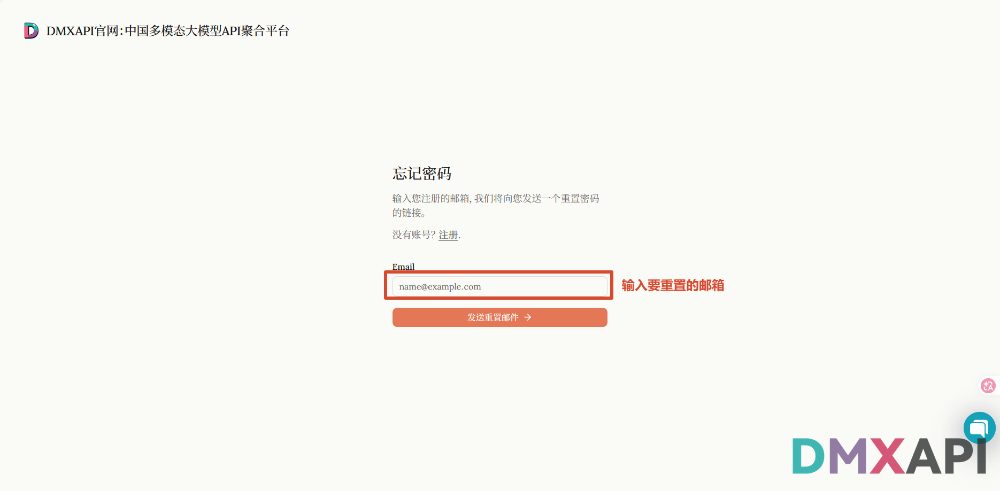
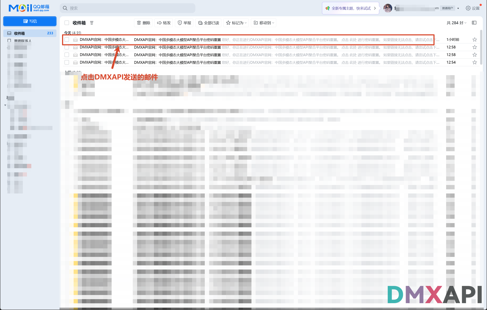
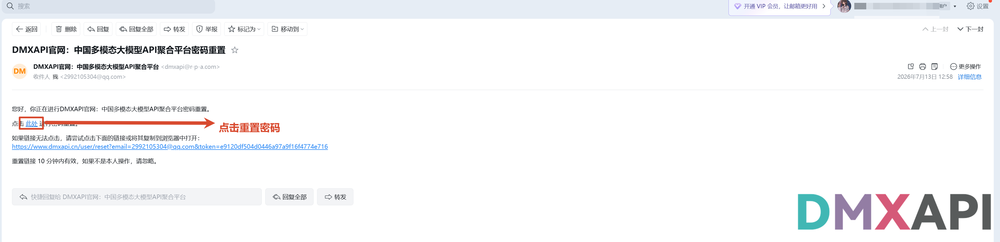
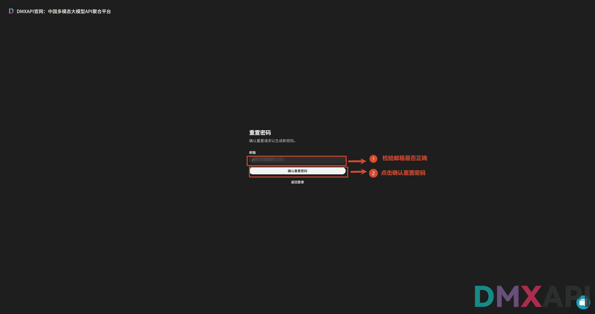
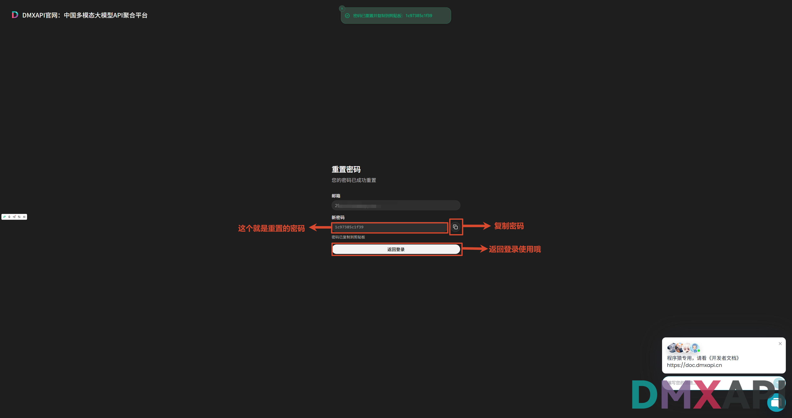
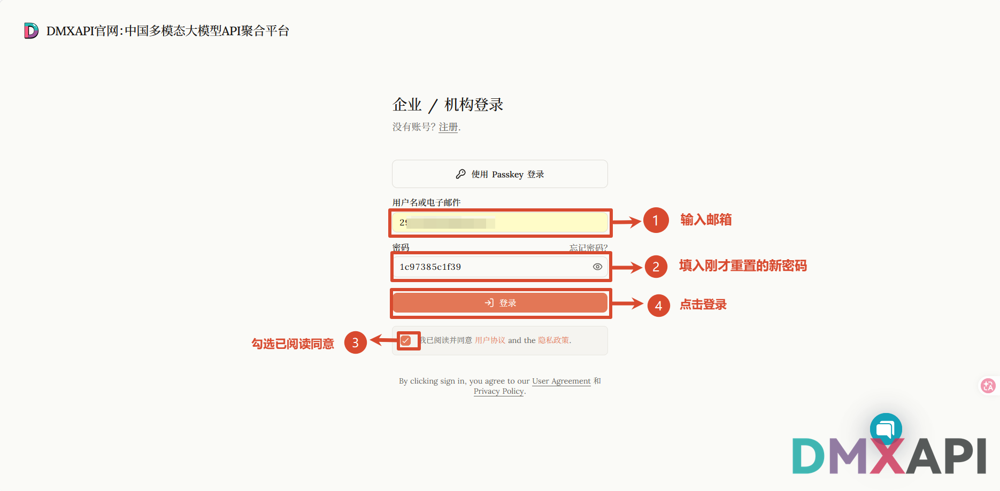
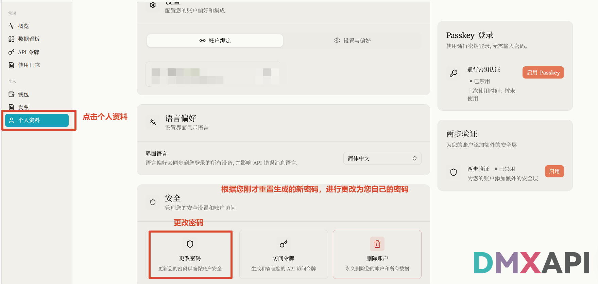
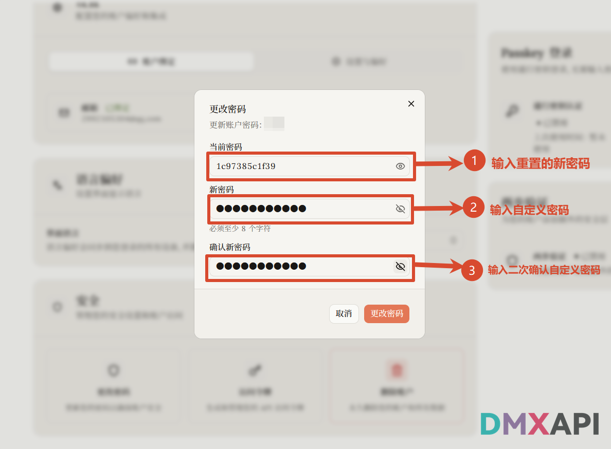

# DMXAPI 重置密码教程

忘记账户密码时，可以通过绑定的邮箱验证身份并重置密码。本文介绍在 DMXAPI 官网找回密码，并改回自己常用密码的完整流程。

## 重置方法

### 1. 打开官网，点击登录

打开 [DMXAPI 官网](https://www.dmxapi.cn/)，点击右上角的「登录」按钮。

### 2. 点击「忘记密码」

在登录页面，点击「密码」输入框右上方的「忘记密码?」。

### 3. 输入邮箱并发送重置邮件

进入「忘记密码」页面，输入你要找回账户的注册邮箱，点击「发送重置邮件」，系统会向该邮箱发送一封重置密码的邮件。

### 4. 打开邮箱中的重置邮件

登录你的邮箱，找到 DMXAPI 官网发来的「密码重置」邮件并打开。

### 5. 点击邮件中的重置链接

在邮件正文中点击「此处」进行密码重置。如果链接无法点击，可复制邮件中的完整链接到浏览器打开。

:::tip 提示
该重置链接 10 分钟内有效，请尽快完成操作。如果不是你本人操作，可忽略此邮件。
:::

### 6. 核对邮箱并确认重置

跳转到「重置密码」确认页面，核对邮箱地址是否为你要找回的账户，确认无误后点击「确认重置密码」。

### 7. 复制系统生成的新密码

重置成功后，系统会自动生成一个新密码并复制到剪贴板（也可点击输入框右侧的复制按钮再次复制）。请先妥善保存该密码，然后点击「返回登录」。

### 8. 使用新密码登录

回到登录页面，输入账户邮箱，填入刚才重置生成的新密码，勾选「我已阅读并同意用户协议和隐私政策」，点击「登录」。

### 9. 进入个人资料，准备更改密码

登录成功后进入工作台，点击左侧菜单的「个人资料」，在「安全」区域点击「更改密码」，将系统生成的随机密码改成你自己常用的密码。

### 10. 设置你自己的新密码

在弹出的「更改密码」窗口中：

1. 「当前密码」填入刚才重置生成的新密码；
2. 「新密码」输入你自定义的密码（至少 8 个字符）；
3. 「确认新密码」再次输入同样的自定义密码。

最后点击「更改密码」完成设置。之后即可使用你自己设置的密码登录 DMXAPI 账户，密码找回完成。

---

  <small>© 2026 DMXAPI 重置密码教程</small>

