# Hermes Agent 配置教程

Hermes Agent 是由 Nous Research 开发的开源 AI 智能体，支持对接任意 OpenAI 兼容接口。


## 安装 Hermes Agent

**Windows**：管理员身份运行 PowerShell，输入以下指令：

```powershell
irm https://raw.githubusercontent.com/NousResearch/hermes-agent/main/scripts/install.ps1 | iex
```

**Linux / macOS / WSL2**：在终端（Terminal）中输入以下命令：

```bash
curl -fsSL https://raw.githubusercontent.com/NousResearch/hermes-agent/main/scripts/install.sh | bash
```

脚本会自动检测并安装所需依赖

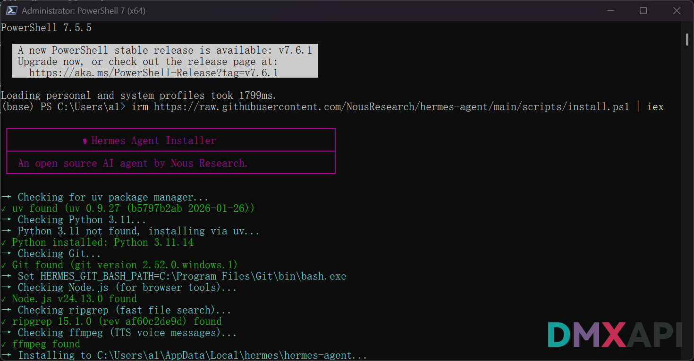

---

## 配置 Hermes Agent

安装完成后，打开命令行（无需管理员权限），运行：

```
hermes setup
```

进入 **Hermes Agent Setup Wizard** 配置向导。

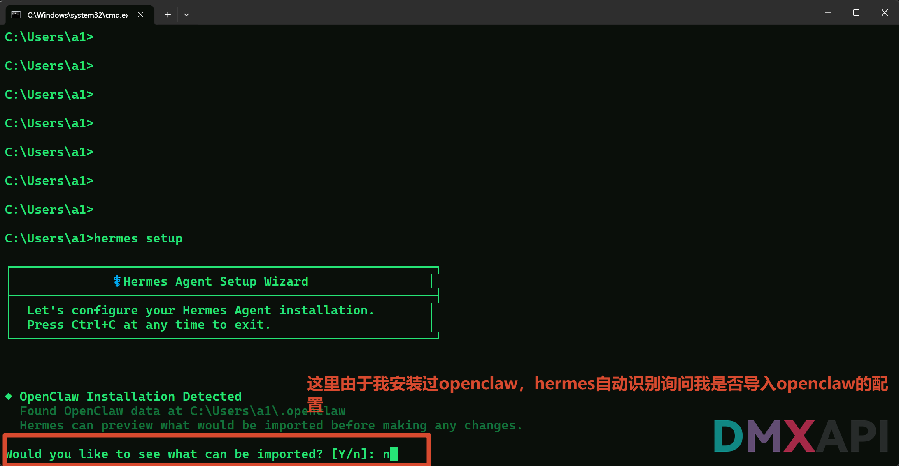

> 如果本机曾安装过 OpenClaw，Hermes 会自动检测并询问是否导入配置，输入 `n` 跳过即可。

---

### 第一步：选择配置模式

选择 **1（Quick setup）** 快速配置，按回车确认。

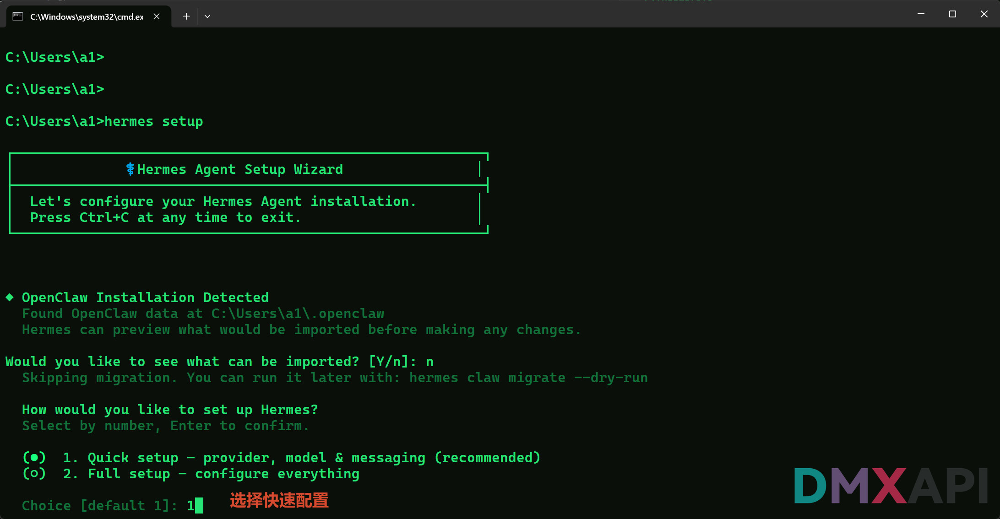

---

### 第二步：选择 AI 提供商

在提供商列表中选择 **35（custom - direct API）**，使用自定义 OpenAI 兼容接口。

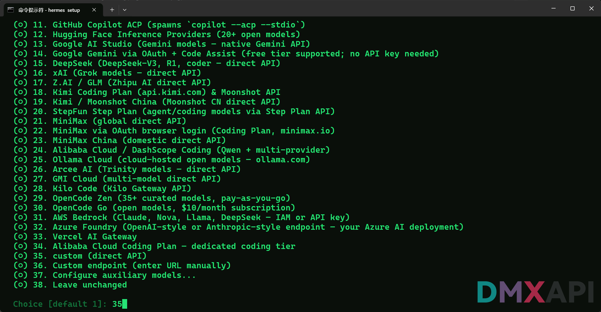

---

### 第三步：填写 API Base URL

根据您的账号类型填写对应的接口地址：

- **cn 站用户**：`https://www.dmxapi.cn/v1`
- **com 站用户**：`https://www.dmxapi.com/v1`
- **ssvip 站用户**：`https://ssvip.dmxapi.com/v1`

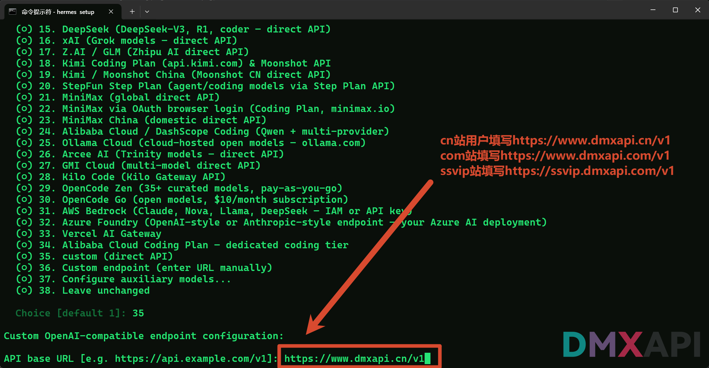

---

### 第四步：填写 API Key

将您的 DMXAPI 令牌粘贴到 `API key` 字段，Hermes 会自动隐藏显示。

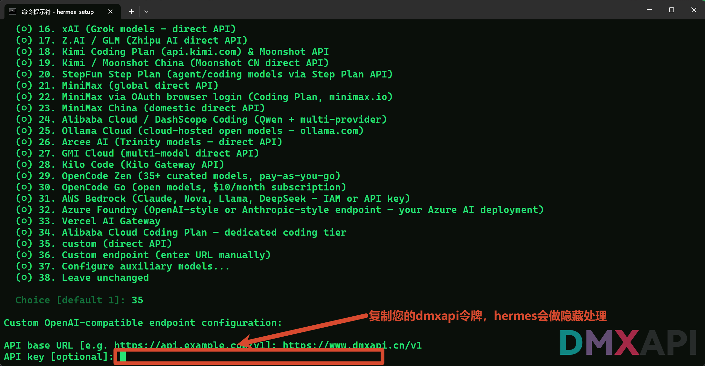

---

### 第五步：选择模型

在模型列表中输入您需要使用的模型名称，例如 `gpt-5.5`。

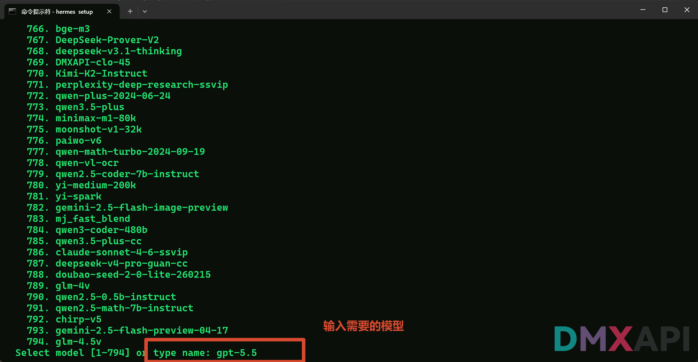

---

### 第六步：设置上下文长度

填写模型支持的上下文长度（token 数），或直接回车留空让 Hermes 自动检测。

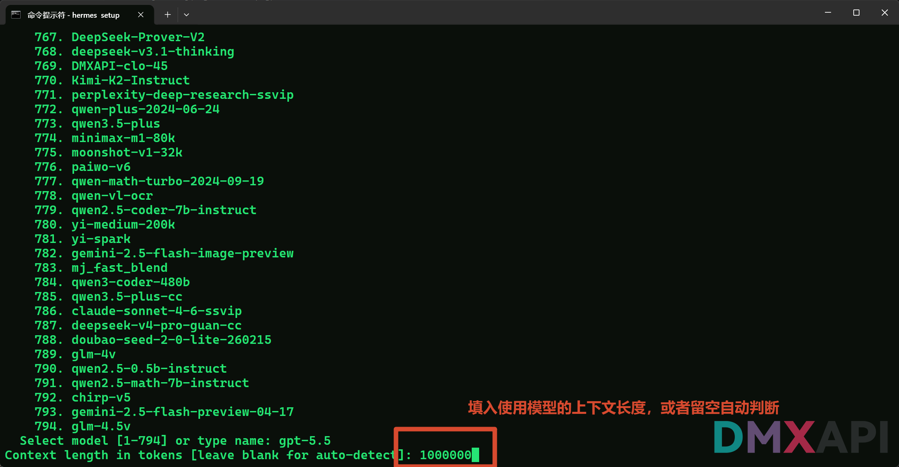

---

### 第七步：自定义提供商名称

为该配置起一个名称，例如 `DMXAPI`，方便后续识别。

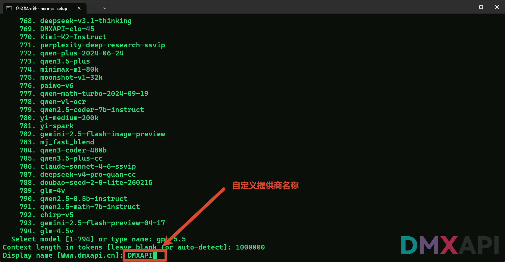

---

### 第八步：选择终端后端

选择 **1（Local）** 在本机直接运行。

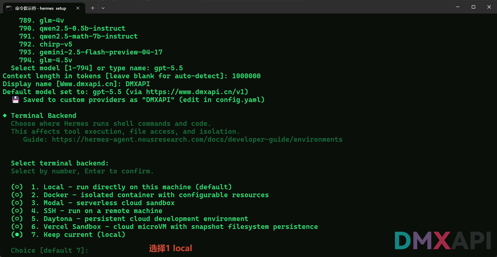

---

### 第九步：跳过消息平台配置

选择 **2（Skip）** 跳过 Telegram / Discord 等聊天平台的绑定，后续可通过 `hermes setup gateway` 单独配置。

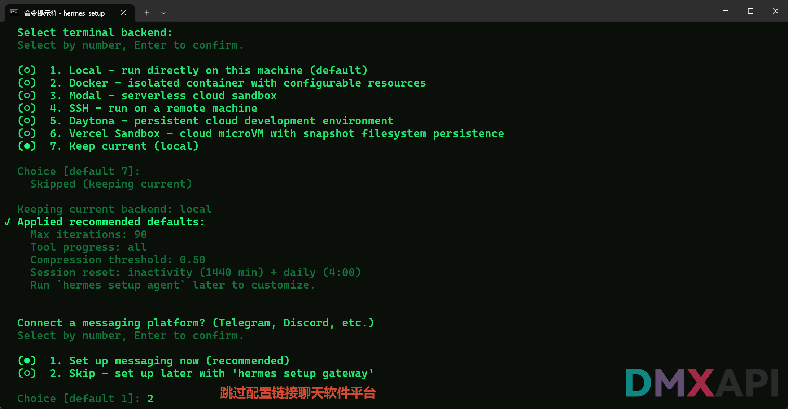

---

## 开始使用

```
Hi! What can I help you with today?
```

直接在提示符下输入您的问题或任务即可开始使用。

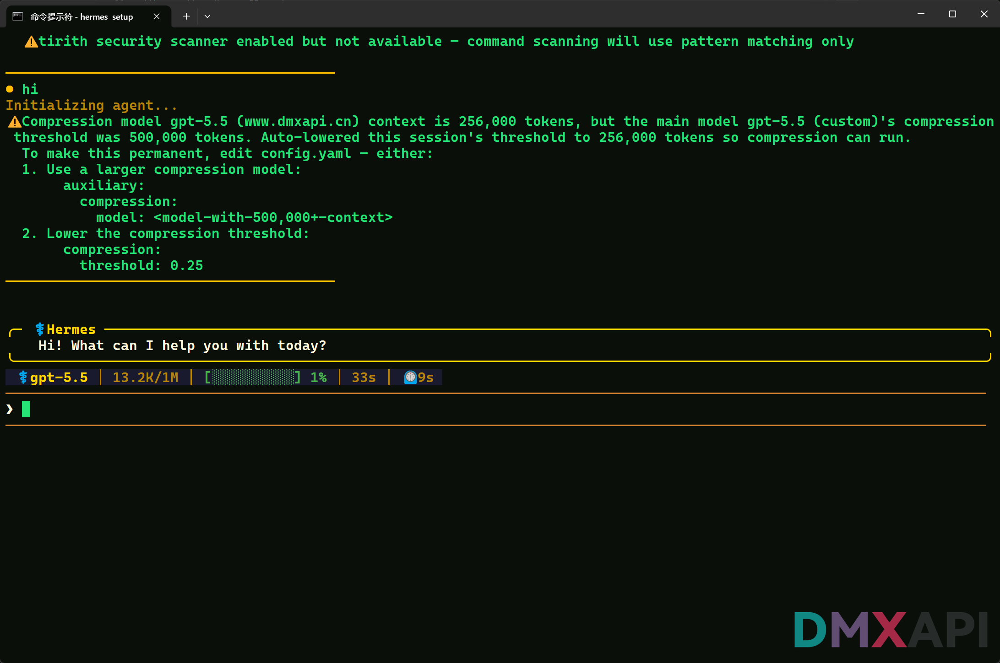
