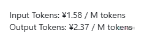

# tokens计费规则

## 通用规则

- **计价货币与站点**

| 计价货币 | 站点 | 固定汇率 |
| --- | --- | --- |
| 人民币 | `www.DMXAPI.cn` | — |
| 美元 | `www.DMXAPI.com` | ¥5 = $1 |
| 美元 | `ssvip.DMXAPI.com` | ¥7.3 = $1 |

- **计价精度**：价格计算保留小数点后 6 位，四舍五入。

## 计费模式

### 1. 按次计费

- 每次请求计费一次

### 2. 按量计费

- 基于输入/输出 `tokens` 数量计费



- 示例含义：输入为 1.58 元/百万 tokens，输出为 2.37 元/百万 tokens  
- M 表示百万（1,000,000）
- 核心公式：

```text
费用 = (输入 tokens / 1,000,000 × 输入价格) + (输出 tokens / 1,000,000 × 输出价格)
```

## 特殊计费项

- 对缓存/音频/推理/图片等场景采用特殊调整：

```text
实际 tokens = 原始 tokens + 特殊 tokens
```

::: tip 说明
所有的 token 计费均为模型在返回参数中提供的数值，本站依赖模型提供的 token 数进行校准计费。
:::

## 示例计算

**假设条件**

- `MiniMax-M2` 模型：输入 ￥1.659/M tokens，输出 ￥6.636/M tokens
- 实际模型价格请参照 [模型价格](https://www.dmxapi.cn/rmb)

**请求参数**

- 输入 `8,888` tokens，输出 `6,666` tokens

**计算过程**

- 输入部分：`8,888 / 1,000,000 × 1.659 = ￥0.014744`
- 输出部分：`6,666 / 1,000,000 × 6.636 = ￥0.044232`
- 合计费用：`￥0.058976`

---

<p align="center">
  <small>© 2025 DMXAPI 价格说明</small>
</p>
