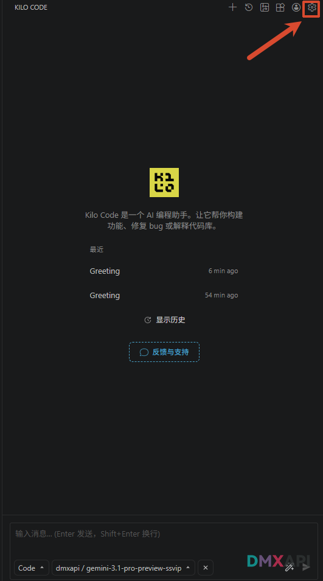
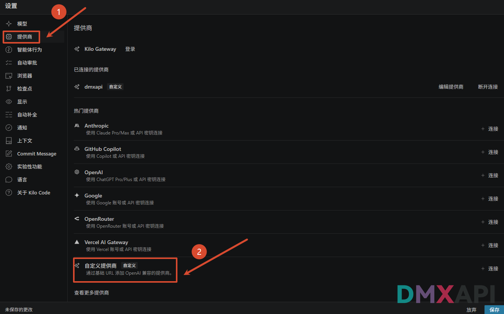
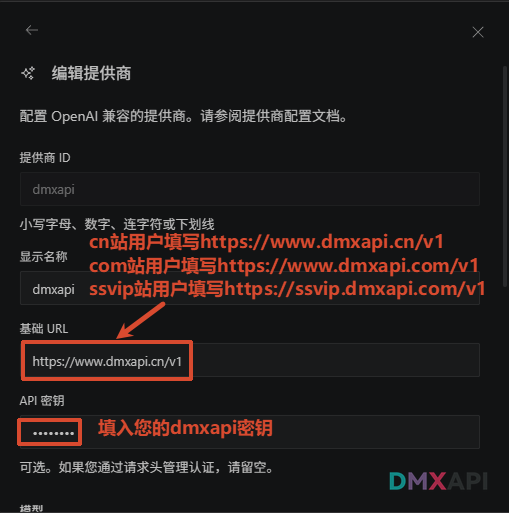
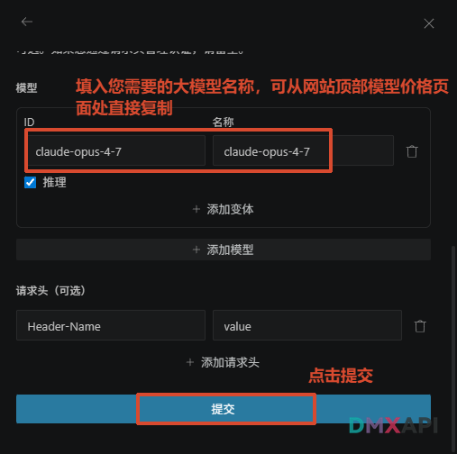
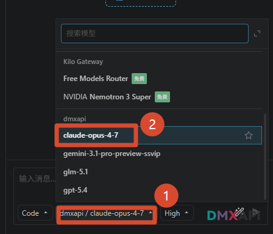
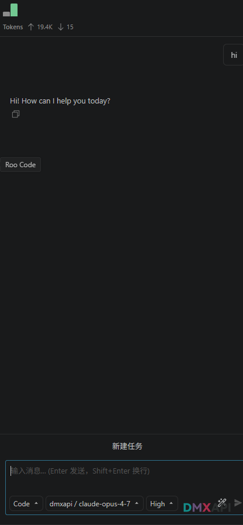

# Kilo Code 插件 客户端配置方法

Kilo Code 是一款运行在 VSCode 中的开源 AI 编程助手，可以帮助你构建新功能、修复 bug 或解释代码库。

## 第一步 打开 Kilo Code 设置

在 VSCode 中打开 Kilo Code 插件主界面，点击右上角的 ⚙️ 设置按钮进入配置页面。

## 第二步 选择自定义提供商

在"设置 → 提供商"页面中，找到并点击底部的「自定义提供商」（通过基础 URL 添加 OpenAI 兼容的提供商）。

## 第三步 填写基础 URL 和 API 密钥

在"编辑提供商"页面中填写以下信息：

- **提供商 ID / 显示名称**：自定义即可，如 `dmxapi`
- **基础 URL**：根据您所使用的站点填写
  - cn 站用户填写 `https://www.dmxapi.cn/v1`
  - com 站用户填写 `https://www.dmxapi.com/v1`
  - ssvip 站用户填写 `https://ssvip.dmxapi.com/v1`
- **API 密钥**：填入您的 DMXAPI 密钥

::: warning
cn 站、com 站、ssvip 站之间互相独立，key 不能共用，请按您使用的站点分别对应填写。
:::

## 第四步 添加模型并提交

在"模型"一栏填入您需要使用的大模型名称（ID 与名称相同），模型名称可从 DMXAPI 网站顶部的「模型价格」页面处直接复制。填写完成后点击下方的「提交」按钮。

## 第五步 选择配置好的模型

返回聊天界面，点击输入框下方的模型选择下拉框，在 dmxapi 提供商列表中选中刚刚配置好的模型。

## 第六步 开始使用

模型选择完成后即可在输入框中发送消息，验证配置是否成功，开始愉快地使用 Kilo Code 编程助手。

  <small>© 2026 DMXAPI Kilo Code 插件配置教程</small>

