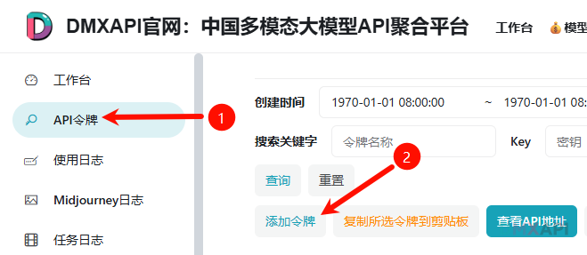
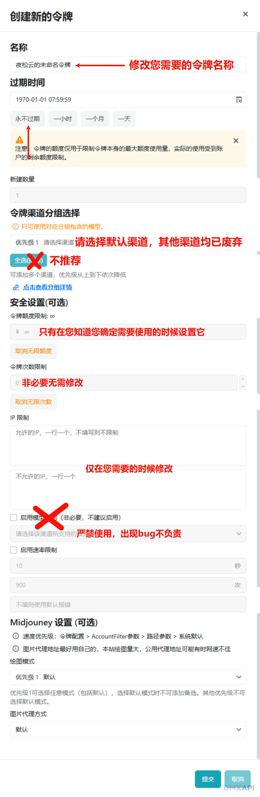

# 令牌管理指南

## 令牌概述

令牌（Key）是访问 DMXAPI 服务的凭证，与 OpenAI 官方 API Key 不同。

## 创建令牌

1. 登录 [www.dmxapi.cn](https://www.dmxapi.cn)
2. 进入 `工作台` → `令牌管理`



3. 点击 `添加令牌`



### 配置说明

| 配置项 | 说明 |
| :------ | :---- |
| 令牌名称 | 可自定义名称，例如：DMXAPI、项目名称、使用者姓名、场景名称或模型名称 |
| 过期时间 | 可设置令牌在指定时间失效，例如公开站可设为 1 天有效期；默认永久有效 |
| 渠道分组 | 推荐选择 `default` 分组，其他分组为定制客户使用，误选造成的额外消耗需自行承担 |
| IP 限制 | 展示使用该令牌的 IP，可配置白名单或黑名单 |
| 模型限制 | 实验性功能，不建议启用 |
| 速率限制 | 可设定周期内的最大请求次数 |
| Midjourney 设置 | 保持默认即可，不建议调整 |

## 常见问题

### 如何找到我的令牌？

登录后进入 `工作台` → `令牌管理`。

### 为什么 API 调用失败？

请确认 Base URL 设置为 `https://www.dmxapi.cn`。

- com 站请设置为 `https://www.dmxapi.com`
- ssvip 站请设置为 `https://ssvip.dmxapi.com`

### 能否用 `.env` 存储 API Key？

```python
# 示例 Python 代码
import os
from openai import OpenAI

# 从环境变量读取配置
client = OpenAI(
    api_key=os.getenv("DMX_API_KEY"),  # 从 .env 读取的 API Key
    base_url="https://www.dmxapi.cn"   # 设置正确的 Base URL
)
```

### 有并发限制吗？

DMXAPI 不会硬性限制。所有模型账号由全体用户共享，高峰时段可能出现 429 或 500 错误。

### 令牌支持哪些模型？

支持 GPT、Claude、Gemini 等主流模型。

---

<p align="center">
  <small>© 2025 DMXAPI 令牌管理指南</small>
</p>
