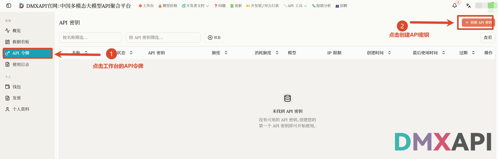
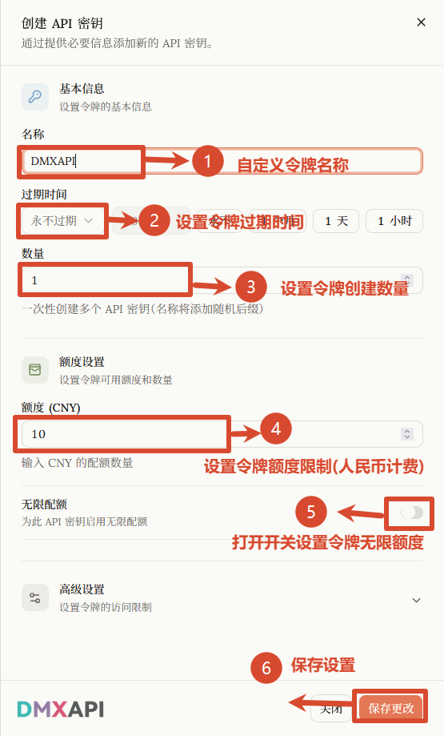
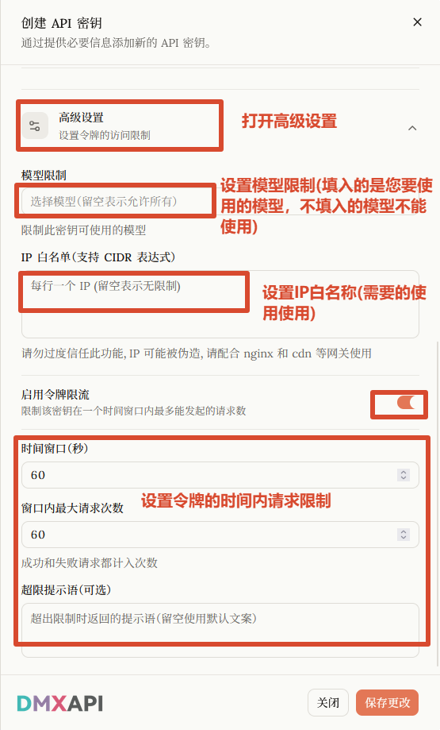
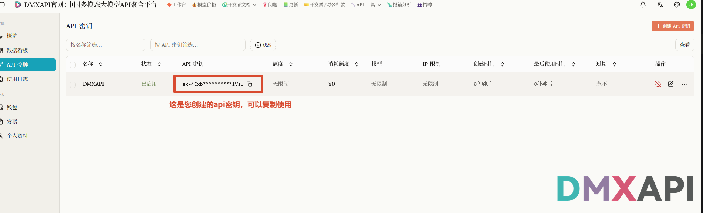

# 令牌管理指南

## 令牌概述

令牌（Key）是访问 DMXAPI 服务的凭证，与 OpenAI 官方 API Key 不同。

## 创建令牌

1. 登录 [www.dmxapi.cn](https://www.dmxapi.cn)
2. 进入 `工作台` → `API 令牌`，点击右上角的 `+ 创建 API 密钥`



3. 在弹出的「创建 API 密钥」窗口中，填写基本信息与额度设置：

   1. **名称**：自定义令牌名称；
   2. **过期时间**：设置令牌过期时间，默认永不过期，也可选择 1 天、1 小时等快捷选项；
   3. **数量**：设置令牌创建数量，一次性创建多个时名称将自动添加随机后缀；
   4. **额度 (CNY)**：设置令牌额度限制，人民币计费；
   5. **无限配额**：打开开关后该令牌不受额度限制；
   6. 点击 `保存更改` 完成创建。



4. 如需限制令牌的访问范围，可展开 `高级设置`：



5. 保存后返回列表页，即可看到您创建的 API 密钥，点击密钥旁的复制按钮即可复制使用。



### 配置说明

| 配置项 | 说明 |
| :------ | :---- |
| 名称 | 可自定义名称，例如：DMXAPI、项目名称、使用者姓名、场景名称或模型名称 |
| 过期时间 | 可设置令牌在指定时间失效，例如公开站可设为 1 天有效期；默认永不过期 |
| 数量 | 一次性创建多个 API 密钥，名称将自动添加随机后缀 |
| 额度 (CNY) | 令牌可用额度，人民币计费；打开「无限配额」开关则不受额度限制 |
| 模型限制 | 高级设置项。填入的是您要使用的模型，不填入的模型不能使用；留空表示允许所有模型 |
| IP 白名单 | 高级设置项。每行一个 IP，支持 CIDR 表达式，留空表示无限制；IP 可能被伪造，请配合 nginx、cdn 等网关使用 |
| 令牌限流 | 高级设置项。开启后可设置时间窗口（秒）内的最大请求次数，成功和失败请求都计入；超限提示语可选，留空使用默认文案 |

## 常见问题

### 如何找到我的令牌？

登录后进入 `工作台` → `API 令牌`。

### 为什么 API 调用失败？

请确认 Base URL 设置为 `https://www.dmxapi.cn`。

- com 站请设置为 `https://www.dmxapi.com`
- ssvip 站请设置为 `https://ssvip.dmxapi.com`

### 能否用 `.env` 存储 API Key？

```python
# 示例 Python 代码
import os
from openai import OpenAI

# 从环境变量读取配置
client = OpenAI(
    api_key=os.getenv("DMX_API_KEY"),  # 从 .env 读取的 API Key
    base_url="https://www.dmxapi.cn"   # 设置正确的 Base URL
)
```

### 有并发限制吗？

DMXAPI 不会硬性限制。所有模型账号由全体用户共享，高峰时段可能出现 429 或 500 错误。

### 令牌支持哪些模型？

支持使用模型广场中所有的模型。

模型广场地址：[https://www.dmxapi.cn/rmb](https://www.dmxapi.cn/rmb)

---

<p align="center">
  <small>© 2026 DMXAPI 令牌管理指南</small>
</p>
