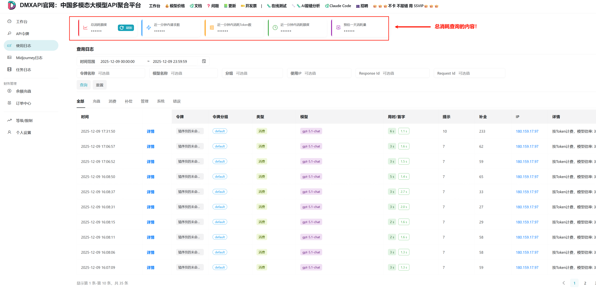

# 总消耗 日志查询

## 总消耗查询内容在DMXAPI的位置



## 接口地址
```
https://www.dmxapi.cn/api/log/self/stat
```

## 代码示例
```python
"""
================================================================================
                           API 总消耗统计查询工具
================================================================================
功能描述: 查询 dmxapi.cn 平台的 API 使用统计数据，包括总消耗额度、
         请求频率(RPM)、Token消耗(TPM)、消息数量(MPM)等指标。
使用方法:
    1. 配置 SYSTEM_TOKEN 和 USER_ID
    2. 运行脚本: python 总消耗查询.py
    3. 查看统计结果

返回数据说明:
    - quota : 总消耗额度
    - rpm   : Requests Per Minute  - 每分钟请求数
    - tpm   : Tokens Per Minute    - 每分钟 Token 消耗数
    - mpm   : Messages Per Minute  - 每分钟消息数

================================================================================
"""
import requests
from datetime import datetime
# ==============================================================================
#                               配置信息区域
# ==============================================================================

# API 接口地址 - 个人统计数据查询端点
URL = "https://www.dmxapi.cn/api/log/self/stat"

# ------------------------------------------------------------------------------
# 认证信息配置 (请替换为你自己的信息)
# ------------------------------------------------------------------------------
# SYSTEM_TOKEN: 系统令牌，用于 API 认证
#               获取方式: 登录 dmxapi.cn -> 个人设置 -> API 令牌
SYSTEM_TOKEN = "sk-********************"  # 替换为你的系统令牌

# USER_ID: 用户唯一标识
#          获取方式: 登录 dmxapi.cn -> 个人设置 -> 用户 ID
USER_ID = "**********"  # 替换为你的用户 ID

# ------------------------------------------------------------------------------
# 时间范围配置
# ------------------------------------------------------------------------------
# QUERY_MODE: 查询模式选择
#   "today"      - 查询今天的数据
#   "yesterday"  - 查询昨天的数据
#   "week"       - 查询最近7天的数据
#   "month"      - 查询最近30天的数据
#   "custom"     - 自定义时间范围（需要设置下方的 CUSTOM_START 和 CUSTOM_END）
QUERY_MODE = "today"

# 自定义时间范围（仅当 QUERY_MODE = "custom" 时生效）
# 格式: "YYYY-MM-DD" 或 "YYYY-MM-DD HH:MM:SS"
CUSTOM_START = "2025-01-01 00:00:00"
CUSTOM_END = "2025-01-01 23:59:59"


# ==============================================================================
#                               核心功能函数
# ==============================================================================

def get_stat_data(start_timestamp: int, end_timestamp: int, stat_type: int = 0,
                  token_name: str = "", token_group: str = "", model_name: str = ""):
    """
    获取 API 总消耗统计数据

    通过调用 /api/log/self/stat 接口，查询指定时间范围内的 API 使用统计信息。

    Args:
        start_timestamp (int): 查询开始时间的 Unix 时间戳 (秒)
                               例如: 1702080000 表示 2023-12-09 00:00:00
        end_timestamp (int):   查询结束时间的 Unix 时间戳 (秒)
                               例如: 1702166399 表示 2023-12-09 23:59:59
        stat_type (int):       统计类型，默认为 0 (全部统计)
        token_name (str):      按令牌名称筛选 (空字符串表示不筛选)
        token_group (str):     按令牌分组筛选 (空字符串表示不筛选)
        model_name (str):      按模型名称筛选 (空字符串表示不筛选)

    Returns:
        dict: 包含统计数据的字典，结构如下:
              {
                  "quota": int,  # 总消耗额度 
                  "rpm": int,    # 每分钟请求数
                  "tpm": int,    # 每分钟 Token 数
                  "mpm": int     # 每分钟消息数
              }
              请求失败时返回空字典 {}

    Raises:
        无异常抛出，错误信息通过 print 输出
    """
    # -------------------------------------------------------------------------
    # 构建请求头 - 使用 Token 认证
    # -------------------------------------------------------------------------
    headers = {
        "Accept": "application/json",              # 期望返回 JSON 格式
        "Authorization": f"{SYSTEM_TOKEN}", # Token 认证
        "Rix-Api-User": USER_ID,                   # 用户标识头
    }

    # -------------------------------------------------------------------------
    # 构建查询参数
    # -------------------------------------------------------------------------
    params = {
        "type": stat_type,                    # 统计类型
        "token_name": token_name,             # 令牌名称筛选
        "token_group": token_group,           # 令牌分组筛选
        "model_name": model_name,             # 模型名称筛选
        "start_timestamp": start_timestamp,   # 开始时间戳
        "end_timestamp": end_timestamp        # 结束时间戳
    }

    # -------------------------------------------------------------------------
    # 发送 GET 请求
    # -------------------------------------------------------------------------
    response = requests.get(URL, headers=headers, params=params)

    # 检查 HTTP 状态码
    if response.status_code != 200:
        print(f"请求失败: HTTP {response.status_code}")
        return {}

    # -------------------------------------------------------------------------
    # 解析响应数据
    # -------------------------------------------------------------------------
    result = response.json()

    # 检查业务状态
    if not result.get("success"):
        print(f"接口返回错误: {result.get('message', '未知错误')}")
        return {}

    return result.get("data", {})


def print_stat(data: dict, start_time: datetime, end_time: datetime):
    """
    格式化输出统计数据

    将 API 返回的统计数据以美观的表格形式输出到控制台。

    Args:
        data (dict):           API 返回的统计数据字典
                               必须包含: quota, rpm, tpm, mpm 字段
        start_time (datetime): 查询开始时间
        end_time (datetime):   查询结束时间

    Returns:
        None: 直接输出到控制台

    输出格式:
        ==================================================
                      API 总消耗统计
        ==================================================
        查询时间: YYYY-MM-DD HH:MM 至 YYYY-MM-DD HH:MM
        --------------------------------------------------
          总消耗额度: X.XXXX
          原始值: XXXXXXXX
        --------------------------------------------------
          每分钟请求数 (RPM): XXX
          每分钟Token数 (TPM): XXXXXXX
          每分钟消息数 (MPM): XXXXXXX
        ==================================================
    """
    # -------------------------------------------------------------------------
    # 输出表头
    # -------------------------------------------------------------------------
    print("=" * 50)
    print("              API 总消耗统计")
    print("=" * 50)
    print(f"查询时间: {start_time.strftime('%Y-%m-%d %H:%M')} 至 {end_time.strftime('%Y-%m-%d %H:%M')}")
    print("-" * 50)

    # -------------------------------------------------------------------------
    # 数据为空时的处理
    # -------------------------------------------------------------------------
    if not data:
        print("  没有数据")
        print("=" * 50)
        return

    # -------------------------------------------------------------------------
    # 提取并转换数据
    # -------------------------------------------------------------------------
    quota = data.get("quota", 0)           # 原始额度值
    actual_quota = quota / 500000          # 转换为实际额度

    # -------------------------------------------------------------------------
    # 输出统计结果
    # -------------------------------------------------------------------------
    print(f"  总消耗额度: {actual_quota:.4f}")
    print(f"  原始值: {quota}")
    print("-" * 50)
    print(f"  每分钟请求数 (RPM): {data.get('rpm', 0)}")
    print(f"  每分钟Token数 (TPM): {data.get('tpm', 0)}")
    print(f"  每分钟消息数 (MPM): {data.get('mpm', 0)}")
    print("=" * 50)


def get_time_range(mode: str) -> tuple:
    """
    根据查询模式获取时间范围

    Args:
        mode (str): 查询模式
                    - "today": 今天
                    - "yesterday": 昨天
                    - "week": 最近7天
                    - "month": 最近30天
                    - "custom": 自定义时间范围

    Returns:
        tuple: (start_timestamp, end_timestamp, start_time, end_time)
    """
    from datetime import timedelta

    now = datetime.now()
    today = now.replace(hour=0, minute=0, second=0, microsecond=0)

    if mode == "today":
        start_time = today
        end_time = today.replace(hour=23, minute=59, second=59)
    elif mode == "yesterday":
        start_time = today - timedelta(days=1)
        end_time = start_time.replace(hour=23, minute=59, second=59)
    elif mode == "week":
        start_time = today - timedelta(days=6)
        end_time = now
    elif mode == "month":
        start_time = today - timedelta(days=29)
        end_time = now
    elif mode == "custom":
        try:
            if len(CUSTOM_START) == 10:
                start_time = datetime.strptime(CUSTOM_START, "%Y-%m-%d")
            else:
                start_time = datetime.strptime(CUSTOM_START, "%Y-%m-%d %H:%M:%S")

            if len(CUSTOM_END) == 10:
                end_time = datetime.strptime(CUSTOM_END, "%Y-%m-%d").replace(hour=23, minute=59, second=59)
            else:
                end_time = datetime.strptime(CUSTOM_END, "%Y-%m-%d %H:%M:%S")
        except ValueError as e:
            print(f"时间格式错误: {e}")
            print("请使用格式: YYYY-MM-DD 或 YYYY-MM-DD HH:MM:SS")
            exit(1)
    else:
        print(f"未知的查询模式: {mode}")
        print("支持的模式: today, yesterday, week, month, custom")
        exit(1)

    return int(start_time.timestamp()), int(end_time.timestamp()), start_time, end_time


# ==============================================================================
#                               主程序入口
# ==============================================================================

if __name__ == "__main__":
    """
    主程序执行流程:

    1. 根据配置的查询模式获取时间范围
    2. 调用 API 获取统计数据
    3. 格式化输出统计结果
    """

    # -------------------------------------------------------------------------
    # Step 1: 根据配置获取时间范围
    # -------------------------------------------------------------------------
    start_timestamp, end_timestamp, start_time, end_time = get_time_range(QUERY_MODE)

    # -------------------------------------------------------------------------
    # Step 2: 显示查询信息
    # -------------------------------------------------------------------------
    print(f"查询模式: {QUERY_MODE}")
    print(f"查询时间范围: {start_time.strftime('%Y-%m-%d %H:%M:%S')} 至 {end_time.strftime('%Y-%m-%d %H:%M:%S')}")
    print()

    # -------------------------------------------------------------------------
    # Step 3: 调用 API 获取数据并输出
    # -------------------------------------------------------------------------
    data = get_stat_data(start_timestamp, end_timestamp)
    print_stat(data, start_time, end_time)


```
## 返回示例
```json
==================================================
              API 总消耗统计
==================================================
查询时间: 2025-12-09 00:00 至 2025-12-09 23:59
--------------------------------------------------
  总消耗额度: 0.0997
  原始值: 49853
--------------------------------------------------
  每分钟请求数 (RPM): 0
  每分钟Token数 (TPM): 0
  每分钟消息数 (MPM): 0
==================================================
```


<p align="center">
  <small>© 2025 DMXAPI 总消耗 日志查询 🍌</small>
</p>