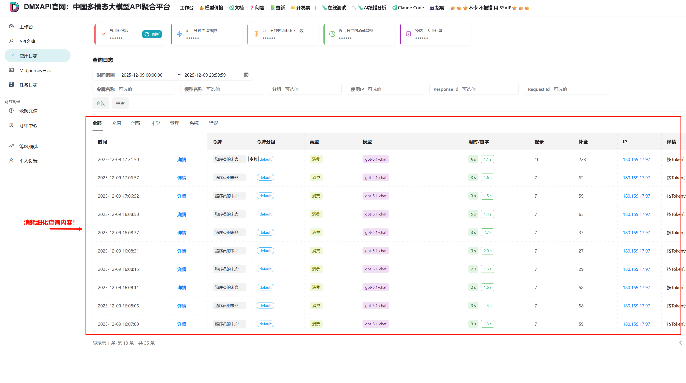

# 消耗细化 日志查询

## 总消耗查询内容在DMXAPI的位置



## 接口地址
```
https://www.dmxapi.cn/api/log/    
```
## 代码示例
```python
import requests
from datetime import datetime

# 配置信息
URL = "https://www.dmxapi.cn/api/log/self"

# 认证信息 - 请替换为你自己的信息
SYSTEM_TOKEN = "*********************"  # 替换为你的系统令牌
USER_ID = "**********"  # 在 个人设置 中获得

# 每页显示条数
PAGE_SIZE = 10

# ============== 时间配置 ==============
# 查询模式选择：
#   "today"      - 查询今天的数据
#   "yesterday"  - 查询昨天的数据
#   "week"       - 查询最近7天的数据
#   "month"      - 查询最近30天的数据
#   "custom"     - 自定义时间范围（需要设置下方的 CUSTOM_START 和 CUSTOM_END）
QUERY_MODE = "today"

# 自定义时间范围（仅当 QUERY_MODE = "custom" 时生效）
# 格式: "YYYY-MM-DD" 或 "YYYY-MM-DD HH:MM:SS"
CUSTOM_START = "2025-01-01 00:00:00"
CUSTOM_END = "2025-01-01 23:59:59"
# =====================================


def get_log_detail(start_timestamp: int, end_timestamp: int, page: int = 1,
                   page_size: int = PAGE_SIZE, log_type: int = 0,
                   token_name: str = "", token_group: str = "",
                   model_name: str = "", ip: str = "",
                   response_id: str = "", request_id: str = ""):
    """
    获取消耗明细日志数据

    Args:
        start_timestamp: 开始时间戳
        end_timestamp: 结束时间戳
        page: 页码，从1开始
        page_size: 每页条数
        log_type: 日志类型，0为全部，2为消耗日志
        token_name: 令牌名称筛选
        token_group: 令牌分组筛选
        model_name: 模型名称筛选
        ip: IP地址筛选
        response_id: 响应ID筛选
        request_id: 请求ID筛选

    Returns:
        dict: 包含日志数据的字典
    """
    headers = {
        "Accept": "application/json",
        "Authorization": f"{SYSTEM_TOKEN}",
        "Rix-Api-User": USER_ID,
    }

    params = {
        "p": page,
        "page_size": page_size,
        "type": log_type,
        "token_name": token_name,
        "token_group": token_group,
        "model_name": model_name,
        "start_timestamp": start_timestamp,
        "end_timestamp": end_timestamp,
        "ip": ip,
        "response_id": response_id,
        "request_id": request_id
    }

    response = requests.get(URL, headers=headers, params=params)

    if response.status_code != 200:
        print(f"请求失败: {response.status_code}")
        return {}

    result = response.json()

    if not result.get("success"):
        print(f"接口返回错误: {result.get('message')}")
        return {}

    return result.get("data", {})


def get_all_logs(start_timestamp: int, end_timestamp: int, max_pages: int = 100):
    """
    获取所有日志数据（分页获取）

    Args:
        start_timestamp: 开始时间戳
        end_timestamp: 结束时间戳
        max_pages: 最大获取页数

    Returns:
        list: 所有日志条目列表
    """
    all_items = []
    page = 1

    while page <= max_pages:
        data = get_log_detail(start_timestamp, end_timestamp, page=page)
        if not data:
            break

        items = data.get("items", [])
        if not items:
            break

        all_items.extend(items)

        # 检查是否还有更多数据
        total = data.get("total", 0)
        if len(all_items) >= total:
            break

        page += 1
        print(f"已获取 {len(all_items)}/{total} 条记录...")

    return all_items


def print_log_detail(data: dict):
    """格式化输出日志明细"""
    if not data:
        print("没有数据")
        return

    items = data.get("items", [])
    page = data.get("page", 1)
    page_size = data.get("page_size", PAGE_SIZE)
    total = data.get("total", 0)

    print(f"分页信息: 第 {page} 页 | 每页 {page_size} 条 | 共 {total} 条记录")
    print("-" * 120)

    if not items:
        print("  暂无消耗记录")
        return

    print(f"{'序号':>4}  {'模型名称':<25} {'消耗额度':>10} {'输入Token':>10} {'输出Token':>10} {'耗时(ms)':>8} {'请求时间':<20}")
    print("-" * 120)

    for idx, item in enumerate(items, 1):
        model = item.get('model_name', 'N/A')[:23]
        quota = item.get('quota', 0) / 500000
        prompt_tokens = item.get('prompt_tokens', 0)
        completion_tokens = item.get('completion_tokens', 0)
        use_time = item.get('use_time', 0)
        created_at = item.get('created_at', 0)
        time_str = datetime.fromtimestamp(created_at).strftime('%Y-%m-%d %H:%M:%S') if created_at else 'N/A'

        print(f"{idx:>4}  {model:<25} {quota:>10.6f} {prompt_tokens:>10} {completion_tokens:>10} {use_time:>8} {time_str:<20}")


def analyze_logs(items: list) -> dict:
    """
    分析日志数据

    Returns:
        dict: 包含分析结果的字典
    """
    if not items:
        return {}

    # 按模型分组统计
    model_stats = {}
    total_prompt_tokens = 0
    total_completion_tokens = 0

    for item in items:
        model = item.get('model_name', 'unknown')
        quota = item.get('quota', 0) / 500000
        prompt_tokens = item.get('prompt_tokens', 0)
        completion_tokens = item.get('completion_tokens', 0)

        total_prompt_tokens += prompt_tokens
        total_completion_tokens += completion_tokens

        if model not in model_stats:
            model_stats[model] = {
                'total_quota': 0,
                'count': 0,
                'prompt_tokens': 0,
                'completion_tokens': 0
            }

        model_stats[model]['total_quota'] += quota
        model_stats[model]['count'] += 1
        model_stats[model]['prompt_tokens'] += prompt_tokens
        model_stats[model]['completion_tokens'] += completion_tokens

    # 计算总消耗
    total_consumption = sum(stats['total_quota'] for stats in model_stats.values())

    # 按消耗排序
    sorted_models = sorted(model_stats.items(), key=lambda x: x[1]['total_quota'], reverse=True)

    return {
        'total_consumption': total_consumption,
        'model_count': len(model_stats),
        'request_count': len(items),
        'total_prompt_tokens': total_prompt_tokens,
        'total_completion_tokens': total_completion_tokens,
        'model_stats': dict(sorted_models)
    }


def save_analysis_report(analysis: dict, items: list, start_time: datetime, end_time: datetime, filepath: str = "消耗细化报告.txt"):
    """
    保存分析报告到文件

    Args:
        analysis: 分析结果
        items: 原始数据
        start_time: 开始时间
        end_time: 结束时间
        filepath: 保存路径
    """
    import os

    # 获取脚本所在目录
    script_dir = os.path.dirname(os.path.abspath(__file__))
    full_path = os.path.join(script_dir, filepath)

    with open(full_path, 'w', encoding='utf-8') as f:
        f.write("=" * 70 + "\n")
        f.write("                      API 消耗细化分析报告\n")
        f.write("=" * 70 + "\n\n")

        f.write(f"报告生成时间: {datetime.now().strftime('%Y-%m-%d %H:%M:%S')}\n")
        f.write(f"查询时间范围: {start_time.strftime('%Y-%m-%d %H:%M')} 至 {end_time.strftime('%Y-%m-%d %H:%M')}\n\n")

        f.write("-" * 70 + "\n")
        f.write("【总体统计】\n")
        f.write("-" * 70 + "\n")
        f.write(f"  总消耗额度: {analysis.get('total_consumption', 0):.4f}\n")
        f.write(f"  使用模型数: {analysis.get('model_count', 0)}\n")
        f.write(f"  请求总次数: {analysis.get('request_count', 0)}\n")
        f.write(f"  总输入Token: {analysis.get('total_prompt_tokens', 0):,}\n")
        f.write(f"  总输出Token: {analysis.get('total_completion_tokens', 0):,}\n\n")

        f.write("-" * 70 + "\n")
        f.write("【各模型消耗明细】\n")
        f.write("-" * 70 + "\n")

        model_stats = analysis.get('model_stats', {})
        for i, (model, stats) in enumerate(model_stats.items(), 1):
            percentage = (stats['total_quota'] / analysis['total_consumption'] * 100) if analysis['total_consumption'] > 0 else 0
            f.write(f"\n  {i}. {model}\n")
            f.write(f"     消耗额度: {stats['total_quota']:.4f} ({percentage:.1f}%)\n")
            f.write(f"     请求次数: {stats['count']}\n")
            f.write(f"     输入Token: {stats['prompt_tokens']:,}\n")
            f.write(f"     输出Token: {stats['completion_tokens']:,}\n")
            f.write(f"     平均每次: {stats['total_quota'] / stats['count']:.6f}\n")

        f.write("\n" + "-" * 70 + "\n")
        f.write("【详细记录】\n")
        f.write("-" * 70 + "\n")
        f.write(f"{'序号':>4}  {'模型名称':<25} {'额度':>10} {'输入':>8} {'输出':>8} {'时间':<20}\n")
        f.write("-" * 70 + "\n")

        for i, item in enumerate(items, 1):
            model = item.get('model_name', 'N/A')[:23]
            quota = item.get('quota', 0) / 500000
            prompt = item.get('prompt_tokens', 0)
            completion = item.get('completion_tokens', 0)
            created_at = item.get('created_at', 0)
            time_str = datetime.fromtimestamp(created_at).strftime('%Y-%m-%d %H:%M:%S') if created_at else 'N/A'
            f.write(f"{i:>4}  {model:<25} {quota:>10.6f} {prompt:>8} {completion:>8} {time_str:<20}\n")

        f.write("\n" + "=" * 70 + "\n")

    print(f"\n分析报告已保存至: {full_path}")


def get_time_range(mode: str) -> tuple:
    """
    根据查询模式获取时间范围

    Args:
        mode: 查询模式 ("today", "yesterday", "week", "month", "custom")

    Returns:
        tuple: (start_timestamp, end_timestamp, start_time, end_time)
    """
    from datetime import timedelta

    now = datetime.now()
    today = now.replace(hour=0, minute=0, second=0, microsecond=0)

    if mode == "today":
        start_time = today
        end_time = today.replace(hour=23, minute=59, second=59)
    elif mode == "yesterday":
        start_time = today - timedelta(days=1)
        end_time = start_time.replace(hour=23, minute=59, second=59)
    elif mode == "week":
        start_time = today - timedelta(days=6)
        end_time = now
    elif mode == "month":
        start_time = today - timedelta(days=29)
        end_time = now
    elif mode == "custom":
        try:
            if len(CUSTOM_START) == 10:
                start_time = datetime.strptime(CUSTOM_START, "%Y-%m-%d")
            else:
                start_time = datetime.strptime(CUSTOM_START, "%Y-%m-%d %H:%M:%S")

            if len(CUSTOM_END) == 10:
                end_time = datetime.strptime(CUSTOM_END, "%Y-%m-%d").replace(hour=23, minute=59, second=59)
            else:
                end_time = datetime.strptime(CUSTOM_END, "%Y-%m-%d %H:%M:%S")
        except ValueError as e:
            print(f"时间格式错误: {e}")
            print("请使用格式: YYYY-MM-DD 或 YYYY-MM-DD HH:MM:SS")
            exit(1)
    else:
        print(f"未知的查询模式: {mode}")
        print("支持的模式: today, yesterday, week, month, custom")
        exit(1)

    return int(start_time.timestamp()), int(end_time.timestamp()), start_time, end_time


if __name__ == "__main__":
    import time

    # 根据配置获取时间范围
    start_timestamp, end_timestamp, start_time, end_time = get_time_range(QUERY_MODE)

    print(f"查询模式: {QUERY_MODE}")
    print(f"查询时间范围: {start_time.strftime('%Y-%m-%d %H:%M:%S')} 至 {end_time.strftime('%Y-%m-%d %H:%M:%S')}")
    print()

    # 获取第一页数据预览
    data = get_log_detail(start_timestamp, end_timestamp)
    print_log_detail(data)

    # 获取所有数据并分析
    total = data.get("total", 0)
    if total > 0:
        print(f"\n正在获取全部 {total} 条记录...")
        all_items = get_all_logs(start_timestamp, end_timestamp)

        if all_items:
            print("\n正在生成分析报告...")
            analysis = analyze_logs(all_items)

            print(f"\n【快速统计】")
            print(f"  总消耗: {analysis['total_consumption']:.4f}")
            print(f"  模型数: {analysis['model_count']}")
            print(f"  请求数: {analysis['request_count']}")
            print(f"  总输入Token: {analysis['total_prompt_tokens']:,}")
            print(f"  总输出Token: {analysis['total_completion_tokens']:,}")

            # 保存到文件
            save_analysis_report(analysis, all_items, start_time, end_time)
            
```
## 返回示例
```json
查询时间范围: 2025-12-09 00:00:00 至 2025-12-09 23:59:59

分页信息: 第 1 页 | 每页 10 条 | 共 35 条记录
------------------------------------------------------------------------------------------------------------------------
  序号  模型名称                            消耗额度    输入Token    输出Token   耗时(ms) 请求时间
------------------------------------------------------------------------------------------------------------------------
   1  gpt-5.1-chat                0.011712         10        233        6 2025-12-09 17:31:50
   2  gpt-5.1-chat                0.003144          7         62        3 2025-12-09 17:06:57
   3  gpt-5.1-chat                0.002994          7         59        3 2025-12-09 17:06:52
   4  gpt-5.1-chat                0.003294          7         65        5 2025-12-09 16:08:50
   5  gpt-5.1-chat                0.001694          7         33        3 2025-12-09 16:08:37
   6  gpt-5.1-chat                0.001394          7         27        3 2025-12-09 16:08:31
   7  gpt-5.1-chat                0.001494          7         29        2 2025-12-09 16:08:15
   8  gpt-5.1-chat                0.002944          7         58        2 2025-12-09 16:08:11
   9  gpt-5.1-chat                0.002944          7         58        3 2025-12-09 16:08:06
  10  gpt-5.1-chat                0.002994          7         59        3 2025-12-09 16:07:09

正在获取全部 35 条记录...
已获取 10/35 条记录...
已获取 20/35 条记录...
已获取 30/35 条记录...

正在生成分析报告...

【快速统计】
  总消耗: 0.0997
  模型数: 3
  请求数: 35
  总输入Token: 247
  总输出Token: 1,971

```


<p align="center">
  <small>© 2025 DMXAPI 消耗细化 日志查询 🍌</small>
</p>