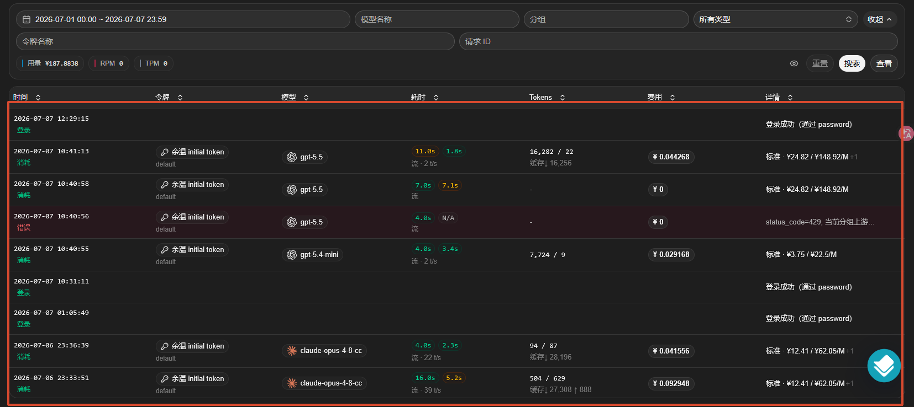

# 消耗细化 日志查询

## 总消耗查询内容在DMXAPI的位置



## 接口地址
```
https://www.dmxapi.cn/api/log/self  
```
## 代码示例
```python
import requests
from datetime import datetime

# ===== 只需修改这里 =====

# 认证信息
SYSTEM_TOKEN = "YOUR_SYSTEM_TOKEN"  # 系统令牌，获取路径：登录DMXAPI → 工作台 → 个人设置 → 更多选项 → 系统令牌
USER_ID = "YOUR_USER_ID"  # 用户 ID，获取路径：登录DMXAPI → 工作台 → 个人设置

# 时间范围
# 可选值："today"（今天）、"yesterday"（昨天）、"week"（最近7天）、"month"（最近30天）、"custom"（自定义）
QUERY_MODE = "today"

# 自定义时间范围（仅当 QUERY_MODE = "custom" 时生效）
# 格式："YYYY-MM-DD" 或 "YYYY-MM-DD HH:MM:SS"
CUSTOM_START = "2025-01-01 00:00:00"
CUSTOM_END = "2025-01-01 23:59:59"

# 每页显示条数
PAGE_SIZE = 50

# 筛选条件（留空表示不筛选，查询全部）
TOKEN_NAME = ""      # 按令牌名称筛选，例如 "我的令牌A"
MODEL_NAME = ""      # 按模型名称筛选，例如 "gpt-5.4"、"claude-sonnet-4-20250514"
IP_FILTER = ""       # 按 IP 地址筛选，例如 "192.168.1.1"

# ========================

# 以下为自动处理逻辑，无需修改
URL = "https://www.dmxapi.cn/api/log/self"


def get_log_detail(start_timestamp: int, end_timestamp: int, page: int = 1,
                   page_size: int = PAGE_SIZE, log_type: int = 0,
                   token_name: str = TOKEN_NAME, token_group: str = "",
                   model_name: str = MODEL_NAME, ip: str = IP_FILTER,
                   response_id: str = "", request_id: str = ""):
    """获取消耗明细日志数据"""
    headers = {
        "Accept": "application/json",
        "Authorization": f"{SYSTEM_TOKEN}",
        "Dmx-Api-User": USER_ID,
    }

    params = {
        "p": page,
        "page_size": page_size,
        "type": log_type,
        "token_name": token_name,
        "token_group": token_group,
        "model_name": model_name,
        "start_timestamp": start_timestamp,
        "end_timestamp": end_timestamp,
        "ip": ip,
        "response_id": response_id,
        "request_id": request_id
    }

    response = requests.get(URL, headers=headers, params=params)

    if response.status_code != 200:
        print(f"请求失败: {response.status_code}")
        return {}

    result = response.json()

    if not result.get("success"):
        print(f"接口返回错误: {result.get('message')}")
        return {}

    return result.get("data", {})


def get_all_logs(start_timestamp: int, end_timestamp: int, max_pages: int = 100):
    """
    获取所有日志数据（分页获取）

    Args:
        start_timestamp: 开始时间戳
        end_timestamp: 结束时间戳
        max_pages: 最大获取页数

    Returns:
        list: 所有日志条目列表
    """
    all_items = []
    page = 1

    while page <= max_pages:
        data = get_log_detail(start_timestamp, end_timestamp, page=page)
        if not data:
            break

        items = data.get("items", [])
        if not items:
            break

        all_items.extend(items)

        # 检查是否还有更多数据
        total = data.get("total", 0)
        if len(all_items) >= total:
            break

        page += 1
        print(f"已获取 {len(all_items)}/{total} 条记录...")

    return all_items


def print_log_detail(data: dict):
    """格式化输出日志明细"""
    if not data:
        print("没有数据")
        return

    items = data.get("items", [])
    page = data.get("page", 1)
    page_size = data.get("page_size", PAGE_SIZE)
    total = data.get("total", 0)

    print(f"分页信息: 第 {page} 页 | 每页 {page_size} 条 | 共 {total} 条记录")
    print("-" * 120)

    if not items:
        print("  暂无消耗记录")
        return

    print(f"{'序号':>4}  {'模型名称':<25} {'消耗(元)':>10} {'输入Token':>10} {'输出Token':>10} {'耗时(ms)':>8} {'请求时间':<20}")
    print("-" * 120)

    for idx, item in enumerate(items, 1):
        model = item.get('model_name', 'N/A')[:23]
        quota = item.get('quota', 0) / 500000
        prompt_tokens = item.get('prompt_tokens', 0)
        completion_tokens = item.get('completion_tokens', 0)
        use_time = item.get('use_time', 0)
        created_at = item.get('created_at', 0)
        time_str = datetime.fromtimestamp(created_at).strftime('%Y-%m-%d %H:%M:%S') if created_at else 'N/A'

        print(f"{idx:>4}  {model:<25} {quota:>10.6f} {prompt_tokens:>10} {completion_tokens:>10} {use_time:>8} {time_str:<20}")


def analyze_logs(items: list) -> dict:
    """
    分析日志数据

    Returns:
        dict: 包含分析结果的字典
    """
    if not items:
        return {}

    # 按模型分组统计
    model_stats = {}
    total_prompt_tokens = 0
    total_completion_tokens = 0

    for item in items:
        model = item.get('model_name', 'unknown')
        quota = item.get('quota', 0) / 500000
        prompt_tokens = item.get('prompt_tokens', 0)
        completion_tokens = item.get('completion_tokens', 0)

        total_prompt_tokens += prompt_tokens
        total_completion_tokens += completion_tokens

        if model not in model_stats:
            model_stats[model] = {
                'total_quota': 0,
                'count': 0,
                'prompt_tokens': 0,
                'completion_tokens': 0
            }

        model_stats[model]['total_quota'] += quota
        model_stats[model]['count'] += 1
        model_stats[model]['prompt_tokens'] += prompt_tokens
        model_stats[model]['completion_tokens'] += completion_tokens

    # 计算总消耗
    total_consumption = sum(stats['total_quota'] for stats in model_stats.values())

    # 按消耗排序
    sorted_models = sorted(model_stats.items(), key=lambda x: x[1]['total_quota'], reverse=True)

    return {
        'total_consumption': total_consumption,
        'model_count': len(model_stats),
        'request_count': len(items),
        'total_prompt_tokens': total_prompt_tokens,
        'total_completion_tokens': total_completion_tokens,
        'model_stats': dict(sorted_models)
    }


def save_analysis_report(analysis: dict, items: list, start_time: datetime, end_time: datetime, filepath: str = "消耗细化报告.txt"):
    """
    保存分析报告到文件

    Args:
        analysis: 分析结果
        items: 原始数据
        start_time: 开始时间
        end_time: 结束时间
        filepath: 保存路径
    """
    import os

    # 获取脚本所在目录
    script_dir = os.path.dirname(os.path.abspath(__file__))
    full_path = os.path.join(script_dir, filepath)

    with open(full_path, 'w', encoding='utf-8') as f:
        f.write("=" * 70 + "\n")
        f.write("                      API 消耗细化分析报告\n")
        f.write("=" * 70 + "\n\n")

        f.write(f"报告生成时间: {datetime.now().strftime('%Y-%m-%d %H:%M:%S')}\n")
        f.write(f"查询时间范围: {start_time.strftime('%Y-%m-%d %H:%M')} 至 {end_time.strftime('%Y-%m-%d %H:%M')}\n\n")

        f.write("-" * 70 + "\n")
        f.write("【总体统计】\n")
        f.write("-" * 70 + "\n")
        f.write(f"  总消耗额度: {analysis.get('total_consumption', 0):.4f}\n")
        f.write(f"  使用模型数: {analysis.get('model_count', 0)}\n")
        f.write(f"  请求总次数: {analysis.get('request_count', 0)}\n")
        f.write(f"  总输入Token: {analysis.get('total_prompt_tokens', 0):,}\n")
        f.write(f"  总输出Token: {analysis.get('total_completion_tokens', 0):,}\n\n")

        f.write("-" * 70 + "\n")
        f.write("【各模型消耗明细】\n")
        f.write("-" * 70 + "\n")

        model_stats = analysis.get('model_stats', {})
        for i, (model, stats) in enumerate(model_stats.items(), 1):
            percentage = (stats['total_quota'] / analysis['total_consumption'] * 100) if analysis['total_consumption'] > 0 else 0
            f.write(f"\n  {i}. {model}\n")
            f.write(f"     消耗额度: {stats['total_quota']:.4f} ({percentage:.1f}%)\n")
            f.write(f"     请求次数: {stats['count']}\n")
            f.write(f"     输入Token: {stats['prompt_tokens']:,}\n")
            f.write(f"     输出Token: {stats['completion_tokens']:,}\n")
            f.write(f"     平均每次: {stats['total_quota'] / stats['count']:.6f}\n")

        f.write("\n" + "-" * 70 + "\n")
        f.write("【详细记录】\n")
        f.write("-" * 70 + "\n")
        f.write(f"{'序号':>4}  {'模型名称':<25} {'额度':>10} {'输入':>8} {'输出':>8} {'时间':<20}\n")
        f.write("-" * 70 + "\n")

        for i, item in enumerate(items, 1):
            model = item.get('model_name', 'N/A')[:23]
            quota = item.get('quota', 0) / 500000
            prompt = item.get('prompt_tokens', 0)
            completion = item.get('completion_tokens', 0)
            created_at = item.get('created_at', 0)
            time_str = datetime.fromtimestamp(created_at).strftime('%Y-%m-%d %H:%M:%S') if created_at else 'N/A'
            f.write(f"{i:>4}  {model:<25} {quota:>10.6f} {prompt:>8} {completion:>8} {time_str:<20}\n")

        f.write("\n" + "=" * 70 + "\n")

    print(f"\n分析报告已保存至: {full_path}")


def get_time_range(mode: str) -> tuple:
    """
    根据查询模式获取时间范围

    Args:
        mode: 查询模式 ("today", "yesterday", "week", "month", "custom")

    Returns:
        tuple: (start_timestamp, end_timestamp, start_time, end_time)
    """
    from datetime import timedelta

    now = datetime.now()
    today = now.replace(hour=0, minute=0, second=0, microsecond=0)

    if mode == "today":
        start_time = today
        end_time = today.replace(hour=23, minute=59, second=59)
    elif mode == "yesterday":
        start_time = today - timedelta(days=1)
        end_time = start_time.replace(hour=23, minute=59, second=59)
    elif mode == "week":
        start_time = today - timedelta(days=6)
        end_time = now
    elif mode == "month":
        start_time = today - timedelta(days=29)
        end_time = now
    elif mode == "custom":
        try:
            if len(CUSTOM_START) == 10:
                start_time = datetime.strptime(CUSTOM_START, "%Y-%m-%d")
            else:
                start_time = datetime.strptime(CUSTOM_START, "%Y-%m-%d %H:%M:%S")

            if len(CUSTOM_END) == 10:
                end_time = datetime.strptime(CUSTOM_END, "%Y-%m-%d").replace(hour=23, minute=59, second=59)
            else:
                end_time = datetime.strptime(CUSTOM_END, "%Y-%m-%d %H:%M:%S")
        except ValueError as e:
            print(f"时间格式错误: {e}")
            print("请使用格式: YYYY-MM-DD 或 YYYY-MM-DD HH:MM:SS")
            exit(1)
    else:
        print(f"未知的查询模式: {mode}")
        print("支持的模式: today, yesterday, week, month, custom")
        exit(1)

    return int(start_time.timestamp()), int(end_time.timestamp()), start_time, end_time


if __name__ == "__main__":
    import time

    # 根据配置获取时间范围
    start_timestamp, end_timestamp, start_time, end_time = get_time_range(QUERY_MODE)

    print(f"查询模式: {QUERY_MODE}")
    print(f"查询时间范围: {start_time.strftime('%Y-%m-%d %H:%M:%S')} 至 {end_time.strftime('%Y-%m-%d %H:%M:%S')}")
    print()

    # 获取第一页数据预览
    data = get_log_detail(start_timestamp, end_timestamp)
    print_log_detail(data)

    # 获取所有数据并分析
    total = data.get("total", 0)
    if total > 0:
        print(f"\n正在获取全部 {total} 条记录...")
        all_items = get_all_logs(start_timestamp, end_timestamp)

        if all_items:
            print("\n正在生成分析报告...")
            analysis = analyze_logs(all_items)

            print(f"\n【快速统计】")
            print(f"  总消耗: {analysis['total_consumption']:.4f} 元")
            print(f"  模型数: {analysis['model_count']}")
            print(f"  请求数: {analysis['request_count']}")
            print(f"  总输入Token: {analysis['total_prompt_tokens']:,}")
            print(f"  总输出Token: {analysis['total_completion_tokens']:,}")

            # 各模型消耗排行
            print(f"\n【各模型消耗排行】")
            model_stats = analysis.get('model_stats', {})
            for i, (model, stats) in enumerate(model_stats.items(), 1):
                percentage = (stats['total_quota'] / analysis['total_consumption'] * 100) if analysis['total_consumption'] > 0 else 0
                print(f"  {i}. {model}")
                print(f"     消耗: {stats['total_quota']:.4f} 元 ({percentage:.1f}%) | 请求: {stats['count']} 次 | 输入: {stats['prompt_tokens']:,} | 输出: {stats['completion_tokens']:,}")

            # 保存到文件
            save_analysis_report(analysis, all_items, start_time, end_time)
```
## 返回示例
```json
查询模式: today
查询时间范围: 2026-07-07 00:00:00 至 2026-07-07 23:59:59

分页信息: 第 1 页 | 每页 50 条 | 共 128 条记录
------------------------------------------------------------------------------------------------------------------------
  序号  模型名称                           消耗(元)    输入Token    输出Token   耗时(ms) 请求时间                
------------------------------------------------------------------------------------------------------------------------
   1  gpt-4.1                     0.007540        730          6        1 2026-07-07 11:58:47 
   2  claude-opus-4-8-cc          0.055548        106        840       18 2026-07-07 11:58:46 
   3  claude-opus-4-8-cc          0.038670       1991        225        6 2026-07-07 11:58:06 
   4  gpt-4.1                     0.002640        240          6        3 2026-07-07 11:58:00 
   5  claude-opus-4-8-cc          0.014830        100        185        4 2026-07-07 11:57:57 
   6  claude-opus-4-8-cc          0.035368       1965        177        5 2026-07-07 11:56:00 
   7  gpt-4.1                     0.002460        218          7        2 2026-07-07 11:55:44 
   8  claude-opus-4-8-cc          0.032204       1800        159        4 2026-07-07 11:55:42 
   9  claude-opus-4-8-cc          0.062868         94         83        5 2026-07-07 11:55:11 
  10  gpt-4.1                     0.008220        782         10        2 2026-07-07 11:52:42 
  11  claude-opus-4-8-cc          0.061718        227        913       16 2026-07-07 11:52:39 
  12  claude-opus-4-8-cc          0.029784       1815        117        3 2026-07-07 11:52:23 
  13  claude-haiku-4-5-202510     0.002586       1029          1        1 2026-07-07 11:52:12 
  14  claude-haiku-4-5-202510     0.039100      15635          1        2 2026-07-07 11:52:11 
  15  claude-haiku-4-5-202510     0.000182         68          1        4 2026-07-07 11:52:10 
  16  claude-haiku-4-5-202510     0.000296        113          1        4 2026-07-07 11:52:10 
  17  claude-haiku-4-5-202510     0.040972      16384          1        3 2026-07-07 11:52:09 
  18  claude-haiku-4-5-202510     0.000330        127          1        3 2026-07-07 11:52:09 
  19  claude-haiku-4-5-202510     0.001996        793          1        3 2026-07-07 11:52:09 
  20  claude-haiku-4-5-202510     0.000080         27          1        3 2026-07-07 11:52:09 
  21  claude-haiku-4-5-202510     0.000372        144          1        2 2026-07-07 11:52:08 
  22  claude-haiku-4-5-202510     0.000948        374          1        2 2026-07-07 11:52:08 
  23  claude-haiku-4-5-202510     0.000682        268          1        2 2026-07-07 11:52:08 
  24  claude-haiku-4-5-202510     0.000182         68          1        2 2026-07-07 11:52:08 
  25  claude-haiku-4-5-202510     0.002586       1029          1        2 2026-07-07 11:52:08 
  26  claude-haiku-4-5-202510     0.000500        195          1        2 2026-07-07 11:52:08 
  27  claude-haiku-4-5-202510     0.001300        515          1        2 2026-07-07 11:52:08 
  28  claude-haiku-4-5-202510     0.008928       3566          1        1 2026-07-07 11:52:07 
  29  claude-opus-4-8-cc          0.065806          2         72        5 2026-07-07 11:52:06 
  30  claude-opus-4-8-cc          0.083054          2        352        7 2026-07-07 11:52:01 
  31  claude-opus-4-8-cc          0.066228          2        151        7 2026-07-07 11:51:54 
  32  claude-opus-4-8-cc          0.067986          2        143        5 2026-07-07 11:51:03 
  33  claude-opus-4-8-cc          0.066610          2        179        5 2026-07-07 11:50:58 
  34  claude-opus-4-8-cc          0.694286          2        394        8 2026-07-07 11:50:52 
  35  claude-haiku-4-5-202510     0.001756        587         23        1 2026-07-07 11:50:45 
  36  glm-5.2-cc                  0.221536      26945         58       13 2026-07-07 11:42:49 
  37                              0.000000          0          0        0 2026-07-07 11:41:02 
  38  glm-5.2-cc                  0.060980        214         55        8 2026-07-07 11:40:17 
  39  glm-5.2-cc                  0.065956        140        263       16 2026-07-07 11:38:14 
  40  glm-5.2-cc                  0.230500      27957        185       14 2026-07-07 11:37:31 
  41  glm-5.2-cc                  0.000132         13          1        1 2026-07-07 11:36:22 
  42  gpt-4.1                     0.001930        165          7        1 2026-07-07 11:27:19 
  43  glm-5.2-cc                  0.005072         42         96        2 2026-07-07 11:27:17 
  44  gpt-4.1                     0.010140        990          6        2 2026-07-07 11:23:16 
  45  claude-opus-4-8-cc          0.064438          2       1000       18 2026-07-07 11:23:04 
  46  gpt-4.1                     0.010890       1061          7        2 2026-07-07 11:18:07 
  47  gpt-4.1                     0.000000          0          0        0 2026-07-07 11:18:06 
  48  claude-opus-4-8-cc          0.092728       1907       1113       22 2026-07-07 11:18:05 
  49  gpt-4.1                     0.001120         92          5        2 2026-07-07 11:11:52 
  50  MiniMax-M2.7-free           0.000000         42         30        2 2026-07-07 11:11:50 

正在获取全部 128 条记录...
已获取 50/128 条记录...
已获取 100/128 条记录...

正在生成分析报告...

【快速统计】
  总消耗: 7.7343 元
  模型数: 13
  请求数: 128
  总输入Token: 176,406
  总输出Token: 68,502

【各模型消耗排行】
  1. kling-v3
     消耗: 3.5550 元 (46.0%) | 请求: 1 次 | 输入: 0 | 输出: 45,000
  2. claude-opus-4-8-cc
     消耗: 3.3174 元 (42.9%) | 请求: 45 次 | 输入: 67,318 | 输出: 21,957
  3. glm-5.2-cc
     消耗: 0.5842 元 (7.6%) | 请求: 6 次 | 输入: 55,311 | 输出: 658
  4. claude-haiku-4-5-20251001-cc
     消耗: 0.1028 元 (1.3%) | 请求: 17 次 | 输入: 40,922 | 输出: 39
  5. gpt-4.1
     消耗: 0.1024 元 (1.3%) | 请求: 20 次 | 输入: 9,766 | 输出: 119
  6. gpt-5.5
     消耗: 0.0582 元 (0.8%) | 请求: 4 次 | 输入: 1,770 | 输出: 96
  7. DMXAPI-gemini-3.1-pro-preview
     消耗: 0.0133 元 (0.2%) | 请求: 1 次 | 输入: 2 | 输出: 222
  8. DMXAPI-deepseek-v4-flash
     消耗: 0.0006 元 (0.0%) | 请求: 19 次 | 输入: 384 | 输出: 91
  9. deepseek-v4-flash
     消耗: 0.0004 元 (0.0%) | 请求: 3 次 | 输入: 10 | 输出: 214
  10. 
     消耗: 0.0000 元 (0.0%) | 请求: 2 次 | 输入: 0 | 输出: 0
  11. MiniMax-M2.7-free
     消耗: 0.0000 元 (0.0%) | 请求: 2 次 | 输入: 923 | 输出: 106
  12. kimi-k2.7-code-free
     消耗: 0.0000 元 (0.0%) | 请求: 4 次 | 输入: 0 | 输出: 0
  13. kling-v3-get-all
     消耗: 0.0000 元 (0.0%) | 请求: 4 次 | 输入: 0 | 输出: 0

分析报告已保存至: c:\Users\Y\Desktop\文档制作\01.平台接口管理\5.日志查询\2.消耗细化查询\消耗细化报告.txt
```


<p align="center">
  <small>© 2025 DMXAPI 消耗细化 日志查询 🍌</small>
</p>