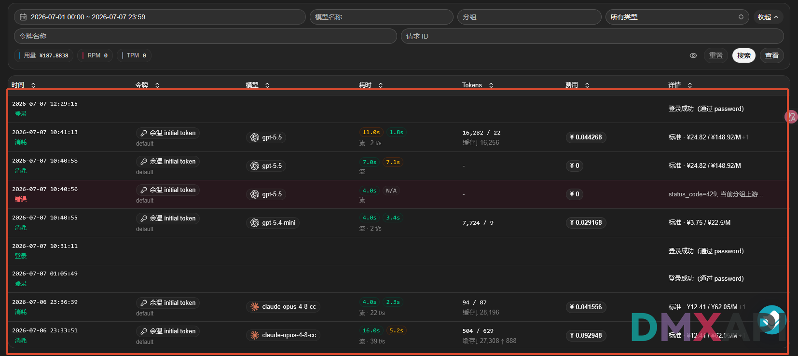

# 消耗细化查询

获取当前账号指定时间范围内的 API 消费日志，包括令牌、模型、Token、人民币消耗、耗时和请求 ID。请求发送到 DMXAPI 代理平台的管理接口；脚本通过一次请求获取全部匹配记录，并生成包含汇总表和逐条详情的 TXT 报告。

## 总消耗查询内容在DMXAPI的位置



## 接口地址

| 接口 | 请求方式 | URL |
|------|---------|-----|
| 查询当前用户的消耗明细 | GET | `https://www.dmxapi.cn/api/log/self` |

:::warning 访问凭证安全
请使用个人访问令牌调用接口，不要在公开代码、截图、日志或客户端输出中暴露真实令牌。本文以连续星号表示已脱敏令牌，运行代码前必须替换为自己的令牌。
:::

## 代码示例
| 查询模式 | 开始时间 | 截止时间 |
|------|------|------|
| `today` | 今天 `00:00:00` | 今天 `23:59:59` |
| `yesterday` | 昨天 `00:00:00` | 昨天 `23:59:59` |
| `week` | 6 天前 `00:00:00` | 今天 `23:59:59` |
| `month` | 29 天前 `00:00:00` | 今天 `23:59:59` |
| `custom` | `CUSTOM_START_TIME` | `CUSTOM_END_TIME` |

### 请求代码

安装依赖：

```powershell
pip install requests
```

```python
from datetime import datetime, timedelta

import requests


# 只需修改这里
ACCESS_TOKEN = "***********************************************"  # 当前账号的个人访问令牌
QUERY_MODE = "month"  # 默认最近 30 天；也可选 today、yesterday、week、custom
CUSTOM_START_TIME = "2026-08-03 00:00:00"  # custom 模式的开始时间
CUSTOM_END_TIME = "2026-08-03 23:59:59"  # custom 模式的结束时间
QUOTA_PER_CNY = 500_000  # 多少原始额度等于 1 元；如站点配置不同，请同步修改
MODEL_NAME = ""  # 模型名称；留空表示不筛选，含 % 时支持通配匹配
TOKEN_NAME = ""  # 令牌名称；留空表示不筛选
REQUEST_ID = ""  # DMXAPI 请求 ID；留空表示不筛选
OUTPUT_FILE = "consumption_report.txt"

# 下面无需修改
BASE_URL = "https://www.dmxapi.cn"
TERMINAL_PREVIEW_LIMIT = 100


def parse_local_time(value: str, end_of_day: bool = False) -> datetime:
    now = datetime.now().astimezone()
    if len(value) == 10:
        parsed = datetime.strptime(value, "%Y-%m-%d")
        if end_of_day:
            parsed = parsed.replace(hour=23, minute=59, second=59)
    else:
        parsed = datetime.strptime(value, "%Y-%m-%d %H:%M:%S")
    return parsed.replace(tzinfo=now.tzinfo)


def get_time_range() -> tuple[datetime, datetime]:
    now = datetime.now().astimezone()
    today = now.replace(hour=0, minute=0, second=0, microsecond=0)
    end_of_today = today.replace(hour=23, minute=59, second=59)

    if QUERY_MODE == "today":
        start_time = today
        end_time = end_of_today
    elif QUERY_MODE == "yesterday":
        start_time = today - timedelta(days=1)
        end_time = end_of_today - timedelta(days=1)
    elif QUERY_MODE == "week":
        start_time = today - timedelta(days=6)
        end_time = end_of_today
    elif QUERY_MODE == "month":
        start_time = today - timedelta(days=29)
        end_time = end_of_today
    elif QUERY_MODE == "custom":
        start_time = parse_local_time(CUSTOM_START_TIME)
        end_time = parse_local_time(CUSTOM_END_TIME, end_of_day=True)
    else:
        raise ValueError("QUERY_MODE 仅支持 today、yesterday、week、month、custom")

    if end_time < start_time:
        raise ValueError("结束时间不能早于开始时间")
    if end_time - start_time > timedelta(days=366):
        raise ValueError("查询时间跨度不能超过 366 天")
    return start_time, end_time


def fetch_all_logs(
    start_timestamp: int,
    end_timestamp: int,
) -> dict:
    headers = {
        "Accept": "application/json",
        "Authorization": f"Bearer {ACCESS_TOKEN}",
    }
    params = {
        "p": 1,
        "page_size": -1,
        "type": 2,
        "start_timestamp": start_timestamp,
        "end_timestamp": end_timestamp,
    }
    filters = {
        "model_name": MODEL_NAME,
        "token_name": TOKEN_NAME,
        "request_id": REQUEST_ID,
    }
    params.update({key: value for key, value in filters.items() if value})

    response = requests.get(
        f"{BASE_URL}/api/log/self",
        headers=headers,
        params=params,
    )
    response.raise_for_status()

    result = response.json()
    if not result.get("success"):
        raise RuntimeError(result.get("message") or "查询消费日志失败")

    return result["data"]


if QUOTA_PER_CNY <= 0:
    raise ValueError("QUOTA_PER_CNY 必须大于 0")

start_time, end_time = get_time_range()
print("正在单次获取指定时间范围内的全部日志...")
data = fetch_all_logs(
    start_timestamp=int(start_time.timestamp()),
    end_timestamp=int(end_time.timestamp()),
)
logs = data.get("items", [])
total = data.get("total", len(logs))
total_cny = sum(item.get("quota", 0) for item in logs) / QUOTA_PER_CNY
print(f"已获取 {len(logs)} 条日志")

separator = "-" * 120


def build_summary(report_logs: list[dict], matched_total: int) -> str:
    summary_lines = [
        f"查询模式: {QUERY_MODE}",
        f"查询时间范围: {start_time:%Y-%m-%d %H:%M:%S} 至 {end_time:%Y-%m-%d %H:%M:%S}",
        "获取方式: 单次全量查询",
        f"记录总数: {matched_total}",
        f"时间范围内总消耗: ¥{total_cny:.6f}",
        "",
        separator,
        f"{'序号':>4}  {'模型名称':<30} {'消耗(元)':>12} {'输入Token':>12} "
        f"{'输出Token':>12} {'耗时(s)':>9} {'请求时间':<20}",
        separator,
    ]

    for index, item in enumerate(report_logs, start=1):
        created_at = item.get("created_at", 0)
        created_at_summary = (
            datetime.fromtimestamp(created_at).astimezone().strftime("%Y-%m-%d %H:%M:%S")
            if created_at
            else "无记录"
        )
        model_name = str(item.get("model_name", ""))[:28]
        prompt_tokens = item.get("prompt_tokens", 0)
        completion_tokens = item.get("completion_tokens", 0)
        quota_cny = item.get("quota", 0) / QUOTA_PER_CNY
        summary_lines.append(
            f"{index:>4}  {model_name:<30} {quota_cny:>12.6f} "
            f"{prompt_tokens:>12} {completion_tokens:>12} "
            f"{item.get('use_time', 0):>9} {created_at_summary:<20}"
        )

    return "\n".join(summary_lines) + "\n"


def build_details(report_logs: list[dict]) -> str:
    detail_lines = ["详细内容", separator]
    for index, item in enumerate(report_logs, start=1):
        created_at = item.get("created_at", 0)
        created_at_detail = (
            datetime.fromtimestamp(created_at).astimezone().strftime("%Y-%m-%d %H:%M:%S %z")
            if created_at
            else "无记录"
        )
        prompt_tokens = item.get("prompt_tokens", 0)
        completion_tokens = item.get("completion_tokens", 0)
        quota_cny = item.get("quota", 0) / QUOTA_PER_CNY
        detail_lines.extend(
            [
                f"序号：{index}",
                f"请求时间：{created_at_detail}",
                f"令牌名称：{item.get('token_name', '')}",
                f"模型名称：{item.get('model_name', '')}",
                f"输入 Token：{prompt_tokens}",
                f"输出 Token：{completion_tokens}",
                f"总 Token：{prompt_tokens + completion_tokens}",
                f"消耗金额（人民币）：¥{quota_cny:.6f}",
                f"请求耗时：{item.get('use_time', 0)} 秒",
                f"流式请求：{'是' if item.get('is_stream') else '否'}",
                f"使用分组：{item.get('group', '')}",
                f"DMXAPI 请求 ID：{item.get('request_id', '')}",
                separator,
            ]
        )

    return "\n".join(detail_lines) + "\n"


report_text = build_summary(logs, total) + "\n" + build_details(logs)
with open(OUTPUT_FILE, "w", encoding="utf-8") as file:
    file.write(report_text)

terminal_logs = logs[:TERMINAL_PREVIEW_LIMIT]
print(build_summary(terminal_logs, total), end="")
if len(logs) > TERMINAL_PREVIEW_LIMIT:
    print(
        f"终端仅显示汇总表前 {TERMINAL_PREVIEW_LIMIT} 条，共 {total} 条；"
        f"全部汇总及详细日志请查看 {OUTPUT_FILE}"
    )

print(f"完整报告已保存到 {OUTPUT_FILE}")
```


## 返回示例

终端先显示单次查询状态，然后只输出汇总表，不输出逐条详细日志。命中记录不超过 `100` 条时显示全部汇总；超过 `100` 条时显示汇总表前 `100` 条，并提示打开 TXT 查看全部汇总和详细日志。以下示例为节省篇幅只展示第一条；`use_time` 在源码中以秒记录，因此汇总表使用 `耗时(s)`，不标成毫秒。

```text
正在单次获取指定时间范围内的全部日志...
已获取 128 条日志

查询模式: month
查询时间范围: 2026-07-12 00:00:00 至 2026-08-10 23:59:59
获取方式: 单次全量查询
记录总数: 128
时间范围内总消耗: ¥3.456789

------------------------------------------------------------------------------------------------------------------------
  序号  模型名称                           消耗(元)      输入Token      输出Token   耗时(s) 请求时间
------------------------------------------------------------------------------------------------------------------------
   1  gemini-3.5-flash                    0.019456          225          398         5 2026-08-03 22:04:43
终端仅显示汇总表前 100 条，共 128 条；全部汇总及详细日志请查看 consumption_report.txt
完整报告已保存到 consumption_report.txt
```
<p align="center">
  <small>© 2026 DMXAPI 消耗细化查询</small>
</p>
