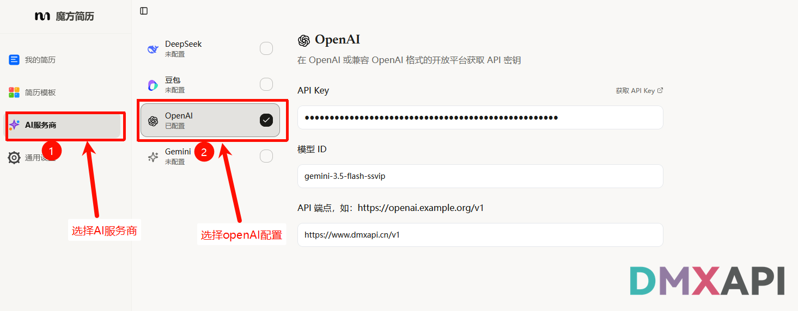
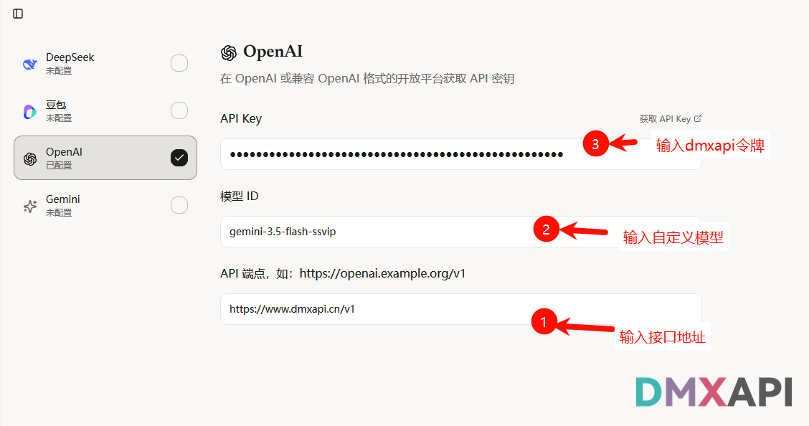
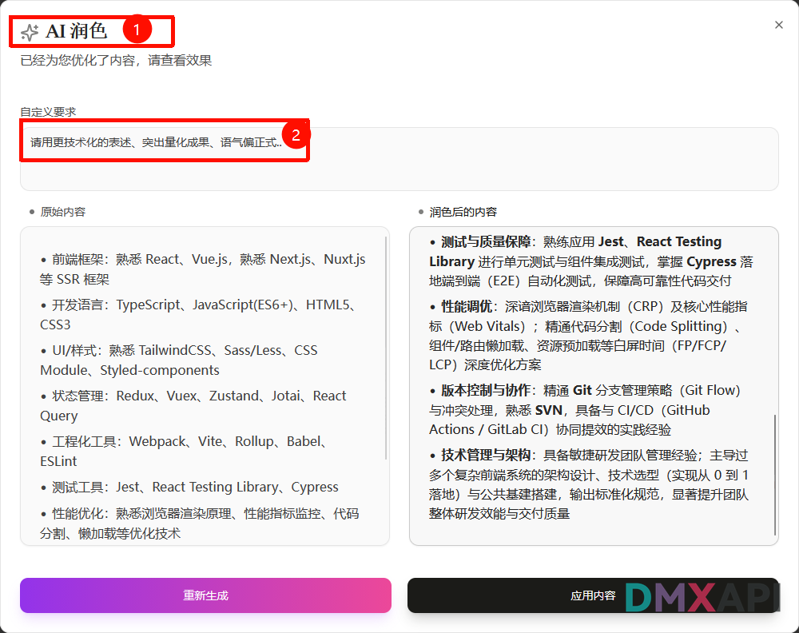

# 魔方简历 (MagicV) 配置教程

本教程将指导你在魔方简历中配置 DMXAPI 服务，借助 AI 模型在线润色简历内容。魔方简历面向中英文双语简历、外企求职及海外留学求职人群，提供专业排版与 ATS 友好度优化。访问入口：[https://magicv.art/zh](https://magicv.art/zh)。

## 🤖 第一步：选择 AI 服务商

进入魔方简历的 AI 设置页面，将 **AI 服务商** 切换为 **OpenAI**。

## 🔑 第二步：填写 API Key 与自定义接口

在 **API Key** 处填入你的 DMXAPI Key，在 **自定义接口** 处填入对应站点的接口地址。所有支持的模型名称可在 [DMXAPI 模型列表](https://www.dmxapi.cn/rmb) 中查看。

| 站点 | 接口地址 |
|---|---|
| cn 站 | `https://www.dmxapi.cn/v1` |

## ✅ 第三步：保存并完成配置

确认信息无误后点击保存，即可使用 DMXAPI 提供的模型对简历内容进行在线 AI 润色。

  <small>© 2026 DMXAPI 魔方简历 配置教程</small>

