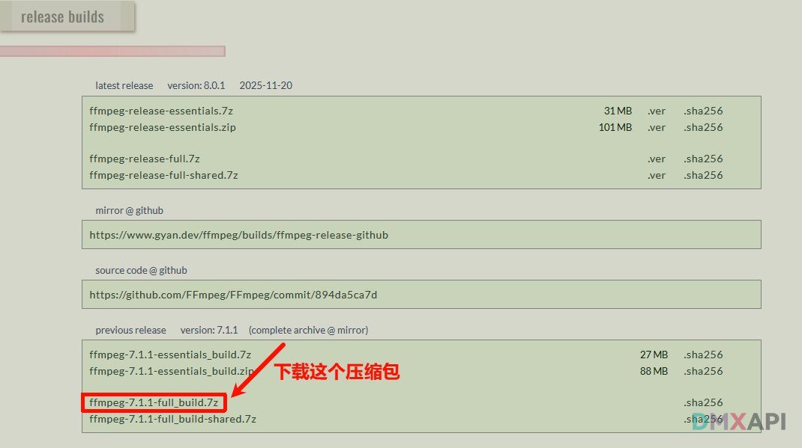
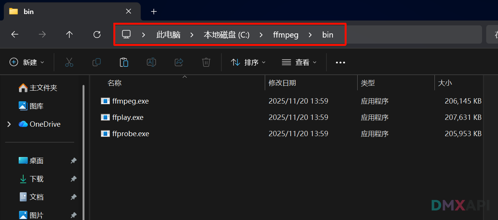
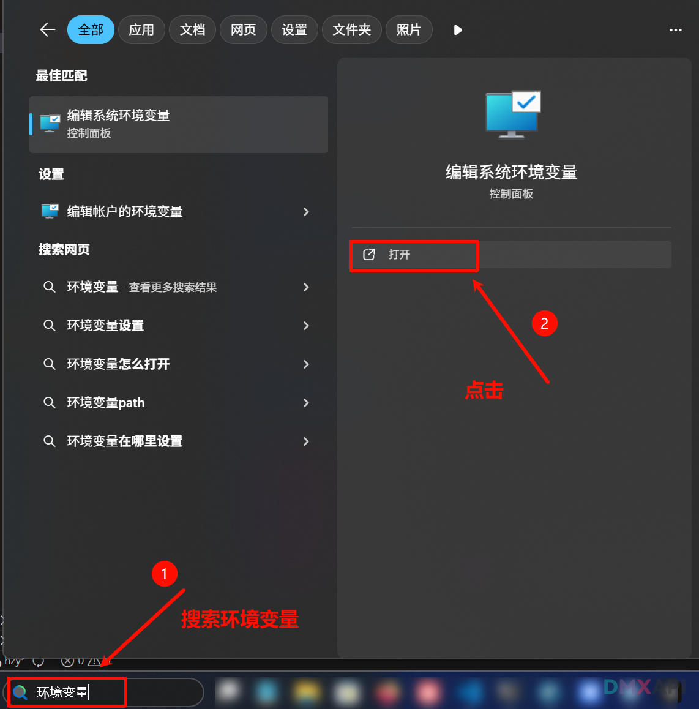
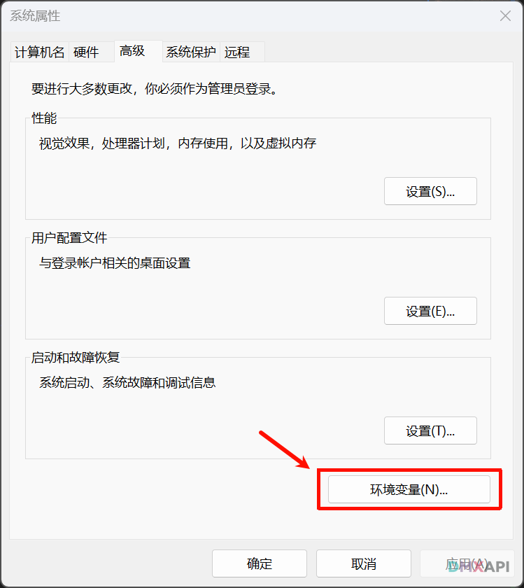
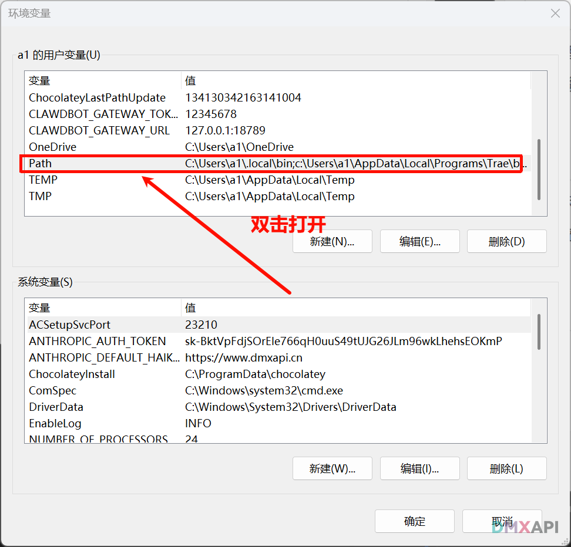
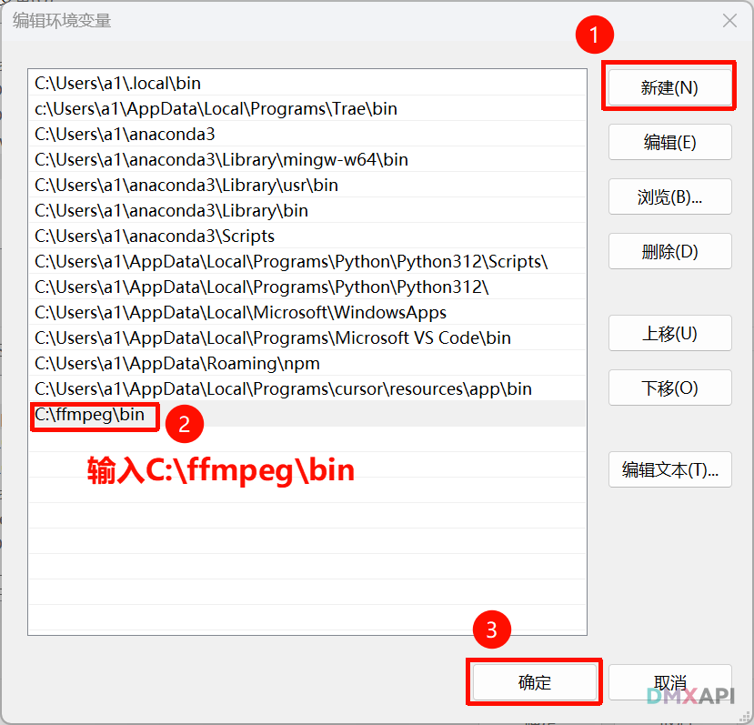
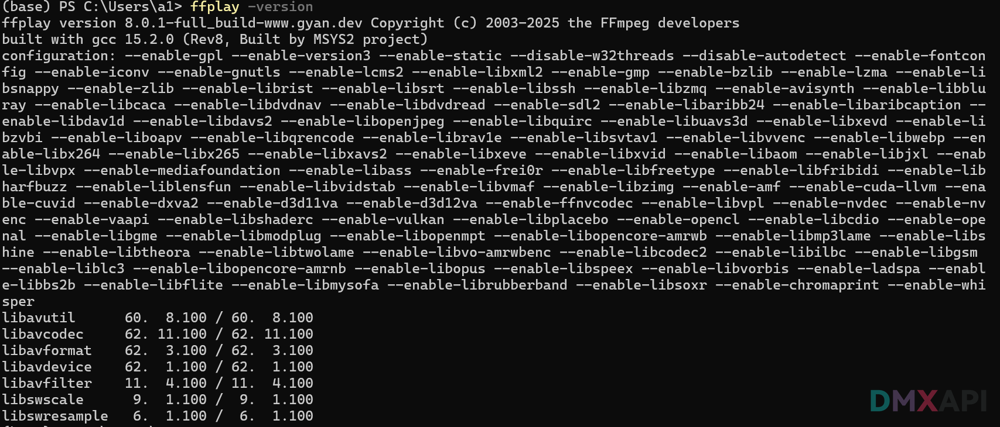

# MiniMax-Music-2.5 AI音乐大模型API使用文档（流式输出）
MiniMax Music 2.5 聚焦解决 AI 音乐创作的两大核心难题：可控性与真实度。模型支持段落级强控制，可在生成前通过标签精确规划整首歌的结构与情绪走向，覆盖 Intro、Bridge、Interlude、Build-up、Hook 等在内的 14 种段落变体；同时在“物理级高保真”上全面提升人声、风格与混音质量，带来更自然的咬字与中英文衔接、更细腻的转音与颤音、更贴合风格的自动混音，并提供 100+ 乐器音色与更清晰的人声/伴奏分离，适配流行成品、影视配乐、游戏声场与品牌音效等专业工作流。

## 请求地址

```
https://www.dmxapi.cn/v1/responses
```

## 模型名称

- `music-2.5`


## 流式输出前的ffempg下载与安装

::: tip 提示
流式输出需要依赖 FFmpeg 的 `ffplay` 组件进行实时播放。如果你只使用非流式输出，可以跳过此步骤。
:::

### 第1步：下载

打开浏览器访问 FFmpeg 官方构建页面：
`https://www.gyan.dev/ffmpeg/builds/`

下载 ffmpeg-7.1.1-essentials_build.7z(最新版本)



### 第2步：解压

把下载的压缩包解压到 ``C:\ffmpeg``,若解压后有嵌套文件夹（如 C:\ffmpeg\ffmpeg-8.0.1-full_build\ffmpeg-8.0.1-full_build\bin）,请把 bin 文件夹移到 C:\ffmpeg\ 下面。
如下图所示：



### 第3步：配置 PATH

1. 按 Win + S，搜索 "环境变量"，点击 "编辑系统环境变量"

   

2. 点击右下角 "环境变量" 按钮

   

3. 在上方 "用户变量" 中找到 Path，双击打开

   

4. 点击 "新建"，输入：C:\ffmpeg\bin

   

5. 点 确定 → 确定 → 确定

### 第4步：验证

关闭所有终端窗口，重新打开一个新的 PowerShell，执行：

```bash
ffplay -version
```

看到版本号就说明成功了。



### 如果您安装了claude code或者其他编程工具，可以让其辅助帮您安装，更加快捷


## 示例代码

```python
import json
import os
import shutil
import subprocess
import sys
import requests
from requests.exceptions import ReadTimeout, ChunkedEncodingError, ConnectionError

URL = "https://www.dmxapi.cn/v1/responses"
API_KEY = "sk-*********************************" # 请替换为你的 DMXAPI 密钥

payload = {
    "model": "music-2.5",

    # 【input】: 音乐的描述，用于指定风格、情绪和场景。例如"流行音乐, 难过, 适合在下雨的晚上"。
    # 注意：对于 music-2.5：可选，长度限制为 [0, 2000] 个字符。对于非 music-2.5 模型：必填，长度限制为 [10, 2000] 个字符
    "input": "独立民谣,忧郁,内省,渴望,独自漫步,咖啡馆",

    # 【lyrics】:歌曲的歌词。使用 \n 分隔每行。你可以在歌词中加入 [Intro], [Verse], [Pre Chorus], [Chorus], [Interlude],
    # [Bridge], [Outro], [Post Chorus], [Transition], [Break], [Hook], [Build Up], [Inst], [Solo] 等结构标签来优化生成的音乐结
    # 构。长度限制：对于 music-2.5：[1, 3500] 个字符。对于非 music-2.5 模型：[10, 3500] 个字符
    "lyrics": "[verse]\n街灯微亮晚风轻抚\n影子拉长独自漫步\n旧外套裹着深深忧郁\n不知去向渴望何处\n[chorus]\n推开木门香气弥漫\n熟悉的角落陌生人看",

    # 【audio_setting】: 音频输出配置
    # 子属性为：
    # sample_rate: 采样率。可选值：16000, 24000, 32000, 44100
    # bitrate: 比特率。可选值：32000, 64000, 128000, 256000
    # format: 音频编码格式。可选值：mp3 , wav , pcm
    "audio_setting": {"sample_rate": 44100, "bitrate": 256000, "format": "mp3"},

    "stream": True,   # 是否使用流式传输，默认为 false
    
}

def _is_executable(path: str) -> bool:
    return bool(path) and os.path.isfile(path) and os.access(path, os.X_OK)

def find_ffplay_path() -> str | None:
    env_path = os.getenv("FFPLAY_PATH")
    if env_path and _is_executable(env_path):
        return env_path
    which_path = shutil.which("ffplay")
    if which_path and _is_executable(which_path):
        return which_path
    if os.name == "nt":
        for p in [
            r"C:\ffmpeg\bin\ffplay.exe",
            r"C:\Program Files\ffmpeg\bin\ffplay.exe",
            r"C:\Program Files (x86)\ffmpeg\bin\ffplay.exe",
        ]:
            if _is_executable(p):
                return p
    return None

def start_ffplay_mp3() -> subprocess.Popen[bytes] | None:
    ffplay_path = find_ffplay_path()
    if not ffplay_path:
        print("未检测到 ffplay：无法播放。请安装 FFmpeg 或设置 FFPLAY_PATH。")
        return None
    args = [ffplay_path, "-hide_banner", "-nodisp", "-autoexit", "-loglevel", "error", "-f", "mp3", "-i", "pipe:0"]
    proc = subprocess.Popen(
        args,
        stdin=subprocess.PIPE,
        stdout=subprocess.DEVNULL,
        stderr=None if os.getenv("FFPLAY_DEBUG") == "1" else subprocess.DEVNULL,
    )
    print(f"已启动 ffplay：{ffplay_path}")
    return proc

def hex_audio_to_bytes(hex_str: str) -> bytes:
    s = (hex_str or "").strip()
    if not s:
        return b""
    s = "".join(s.split())
    if s.startswith(("0x", "0X")):
        s = s[2:]
    # 只保留十六进制字符，避免混入其它符号导致 fromhex 报错
    s = "".join(ch for ch in s if ch in "0123456789abcdefABCDEF")
    if len(s) % 2 == 1:
        s = s[:-1]
    return bytes.fromhex(s)

def iter_sse_data_strings(resp: requests.Response):
    """逐条产出 SSE 的 data 内容（支持多行 data: 拼接）。"""
    data_lines = []
    for line in resp.iter_lines(decode_unicode=True):
        if line is None:
            continue
        line = line.rstrip("\r")
        if line == "":
            if data_lines:
                yield "\n".join(data_lines).strip()
            data_lines = []
            continue
        if line.startswith("data:"):
            data_lines.append(line[5:].strip())
    if data_lines:
        yield "\n".join(data_lines).strip()

def extract_audio_hex(obj: dict) -> str:
    """
    兼容两种返回：
    A) 旧：{"data":{"audio":"...hex...","status":1}}
    B) 新：{"type":"response.output_text.delta","delta":"...hex..."} 或 text
    """
    # A)
    data = obj.get("data")
    if isinstance(data, dict) and isinstance(data.get("audio"), str) and data["audio"].strip():
        return data["audio"]

    # B)
    if isinstance(obj.get("delta"), str) and obj["delta"].strip():
        return obj["delta"]
    if isinstance(obj.get("text"), str) and obj["text"].strip():
        return obj["text"]

    return ""

def is_done(obj: dict) -> bool:
    # 旧格式：status==2
    data = obj.get("data")
    if isinstance(data, dict) and data.get("status") == 2:
        return True
    # 新格式：type 里包含 done/completed
    t = obj.get("type")
    return isinstance(t, str) and (t.endswith(".done") or "completed" in t)

def safe_close_ffplay(proc: subprocess.Popen[bytes] | None):
    if not proc:
        return
    try:
        if proc.stdin:
            try:
                proc.stdin.close()
            except Exception:
                pass
        try:
            proc.wait(timeout=300)
        except Exception:
            pass
    except Exception:
        pass

def main():
    headers = {
        "Content-Type": "application/json",
        "Authorization": f"{API_KEY}",
        "Accept": "text/event-stream",
        "Accept-Encoding": "identity",
        "Cache-Control": "no-cache",
        "Pragma": "no-cache",
        "Connection": "close",
    }

    ffplay_proc = start_ffplay_mp3()

    try:
        print("正在请求 API...")
        # 关键：read timeout 设为 None，避免 600 秒没数据就报错
        with requests.post(URL, headers=headers, json=payload, stream=True, timeout=(10, None)) as resp:
            print("响应状态码:", resp.status_code)
            resp.raise_for_status()
            print("Content-Type:", resp.headers.get("Content-Type", ""))

            for data_str in iter_sse_data_strings(resp):
                if not data_str:
                    continue
                if data_str == "[DONE]":
                    break

                try:
                    obj = json.loads(data_str)
                except Exception:
                    continue

                # 流式打印（每块一个）
                print(json.dumps(obj, indent=2, ensure_ascii=False))
                print()

                # 播放
                audio_hex = extract_audio_hex(obj)
                if audio_hex and ffplay_proc and ffplay_proc.stdin and ffplay_proc.poll() is None:
                    audio_bytes = hex_audio_to_bytes(audio_hex)
                    if audio_bytes:
                        try:
                            ffplay_proc.stdin.write(audio_bytes)
                            ffplay_proc.stdin.flush()
                        except Exception:
                            ffplay_proc = None

                if is_done(obj):
                    break

    except (ChunkedEncodingError, ConnectionError) as e:
        print(f"连接/流被中断：{e}（将尽量播放已收到部分）")
    except ReadTimeout as e:
        print(f"读取超时：{e}（可将 timeout 的 read 部分设为 None）")
    except Exception as e:
        print(f"请求出错: {e}")
    finally:
        safe_close_ffplay(ffplay_proc)

if __name__ == "__main__":
    main()
```

---

## 返回示例

```json
响应状态码: 200
Content-Type: text/event-stream

{
  "response": {
    "created_at": 1770635705,
    "id": "resp_1f4523b9a8a945c78f42833e2848c589",
    "model": "music-2.5",
    "object": "response",
    "output": [],
    "status": "in_progress"
  },
  "sequence_number": 0,
  "type": "response.created"
}

{
  "response": {
    "created_at": 1770635705,
    "id": "resp_1f4523b9a8a945c78f42833e2848c589",
    "model": "music-2.5",
    "object": "response",
    "output": [],
    "status": "in_progress"
  },
  "sequence_number": 1,
  "type": "response.in_progress"
}

{
  "item": {
    "content": [],
    "id": "msg_e9d8f60a43314ff2ac169fac60de1e89",
    "role": "assistant",
    "status": "in_progress",
    "type": "message"
  },
  "output_index": 0,
  "sequence_number": 2,
  "type": "response.output_item.added"
}

{
  "content_index": 0,
  "item_id": "msg_e9d8f60a43314ff2ac169fac60de1e89",
  "output_index": 0,
  "part": {
    "text": "",
    "type": "output_text"
  },
  "sequence_number": 3,
  "type": "response.content_part.added"
}

{
  "content_index": 0,
  "delta": "4944330400...",
  "item_id": "msg_e9d8f60a43314ff2ac169fac60de1e89",
  "output_index": 0,
  "sequence_number": 4,
  "type": "response.output_text.delta"
}

{
  "content_index": 0,
  "delta": "fffbd244f2...",
  "item_id": "msg_e9d8f60a43314ff2ac169fac60de1e89",
  "output_index": 0,
  "sequence_number": 5,
  "type": "response.output_text.delta"
}

{
  "content_index": 0,
  "delta": "fffbd244e8...",
  "item_id": "msg_e9d8f60a43314ff2ac169fac60de1e89",
  "output_index": 0,
  "sequence_number": 6,
  "type": "response.output_text.delta"
}

{
  "content_index": 0,
  "delta": "fffbd244f9...",
  "item_id": "msg_e9d8f60a43314ff2ac169fac60de1e89",
  "output_index": 0,
  "sequence_number": 7,
  "type": "response.output_text.delta"
}

{
  "content_index": 0,
  "delta": "fffbd244fa...",
  "item_id": "msg_e9d8f60a43314ff2ac169fac60de1e89",
  "output_index": 0,
  "sequence_number": 8,
  "type": "response.output_text.delta"
}

{
  "content_index": 0,
  "delta": "fffbd244eb...",
  "item_id": "msg_e9d8f60a43314ff2ac169fac60de1e89",
  "output_index": 0,
  "sequence_number": 9,
  "type": "response.output_text.delta"
}

{
  "content_index": 0,
  "delta": "fffbd244f5...",
  "item_id": "msg_e9d8f60a43314ff2ac169fac60de1e89",
  "output_index": 0,
  "sequence_number": 10,
  "type": "response.output_text.delta"
}

{
  "content_index": 0,
  "delta": "fffbd244e9...",
  "item_id": "msg_e9d8f60a43314ff2ac169fac60de1e89",
  "output_index": 0,
  "sequence_number": 11,
  "type": "response.output_text.delta"
}

{
  "content_index": 0,
  "delta": "fffbd24451...",
  "item_id": "msg_e9d8f60a43314ff2ac169fac60de1e89",
  "output_index": 0,
  "sequence_number": 12,
  "type": "response.output_text.delta"
}

{
  "content_index": 0,
  "delta": "4944330400...",
  "item_id": "msg_e9d8f60a43314ff2ac169fac60de1e89",
  "output_index": 0,
  "sequence_number": 13,
  "type": "response.output_text.delta"
}

{
  "content_index": 0,
  "item_id": "msg_e9d8f60a43314ff2ac169fac60de1e89",
  "output_index": 0,
  "sequence_number": 14,
  "text": "4944330400...",
  "type": "response.output_text.done"
}

```

<p align="center">
  <small>© 2026 DMXAPI music-2.5 音乐模型</small>
</p>
