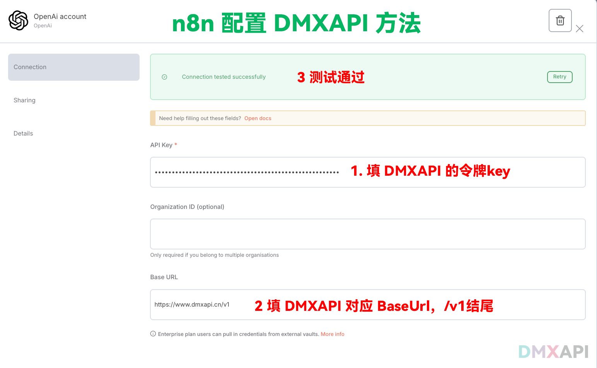

# n8n 自定义模型接入 DMXAPI 配置方法

## n8n介绍
N8N 是一款开源的工作流自动化工具，旨在帮助用户通过连接不同的应用程序和服务来实现任务自动化。它支持低代码/无代码的方式，使用户能够通过拖拽节点来构建复杂的自动化流程，而无需编写大量代码。N8N 的核心功能是提供一个灵活的平台，允许用户自定义和扩展工作流，以满足各种自动化需求.

:::warning 注意：
请选择 openai account
使用 gpt / gemini / claude 都在 openai account 里进行设置
:::

## 配置说明

  <small>© 2025 DMXAPI N8N配置</small>

