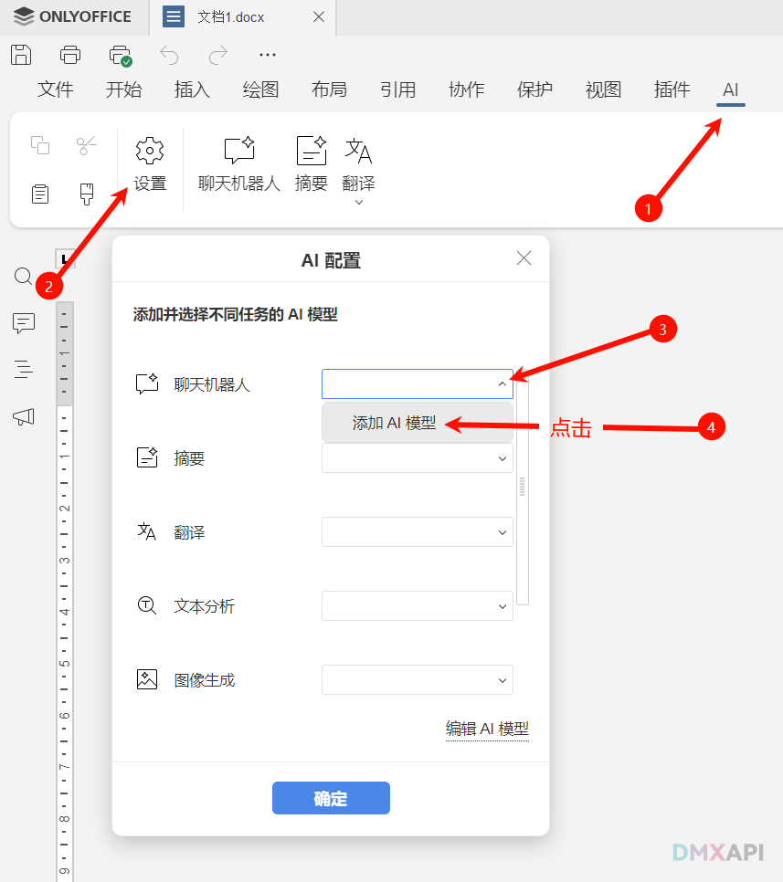
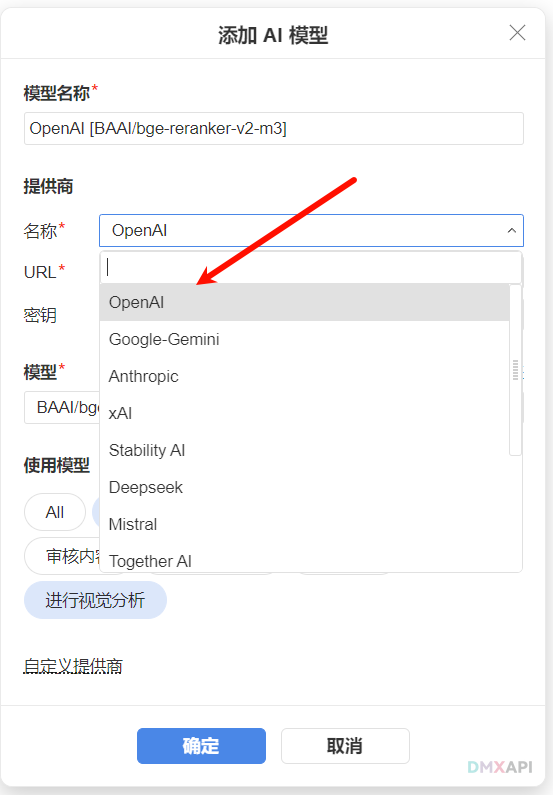
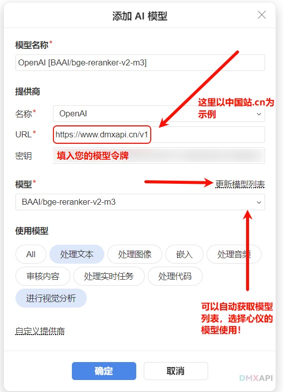

# ONLYOFFICE使用教程
## 第一步：安装ONLYOFFICE
ONLYOFFICE 是一个功能强大的办公套件，提供了文档编辑、电子表格、演示文稿等功能。  

下载地址：[ONLYOFFICE 下载](https://www.onlyoffice.com/zh/download-desktop)

## 第二步：启动ONLYOFFICE
安装完成后，从开始菜单或桌面图标启动ONLYOFFICE。

## 第三步：配置dmxapi
### 1.打开ai设置

### 2.配置dmxapi

### 3.配置完成

>然后就可以在ONLYOFFICE中使用dmxapi为您提供的ai服务啦！

  <small>© 2025 DMXAPI ONLYOFFI...</small>

