# OpenClaw 官方版本配置 DMXAPI 文档

OpenClaw 是一款开源的 Claude Desktop 替代品，支持通过 MCP（Model Context Protocol）连接各类 AI 服务。本文档将指导你如何安装 OpenClaw 并使用配置插件快速接入 DMXAPI。

## 一、安装 OpenClaw

使用 npm 全局安装 OpenClaw：

```bash
npm install -g openclaw
```

## 二、初始化 OpenClaw

安装完成后，运行初始化命令：

```bash
openclaw onboard
```

命令执行后会进入交互式初始化向导，通过方向键选择选项、回车确认，按照提示逐步完成配置。

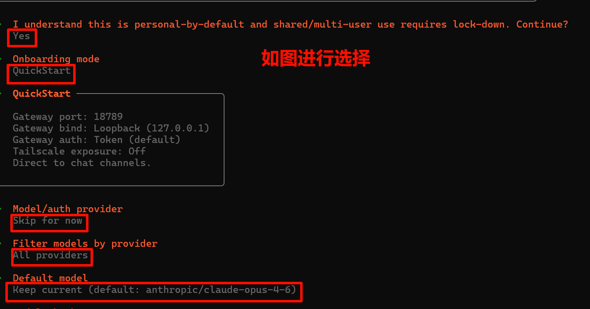
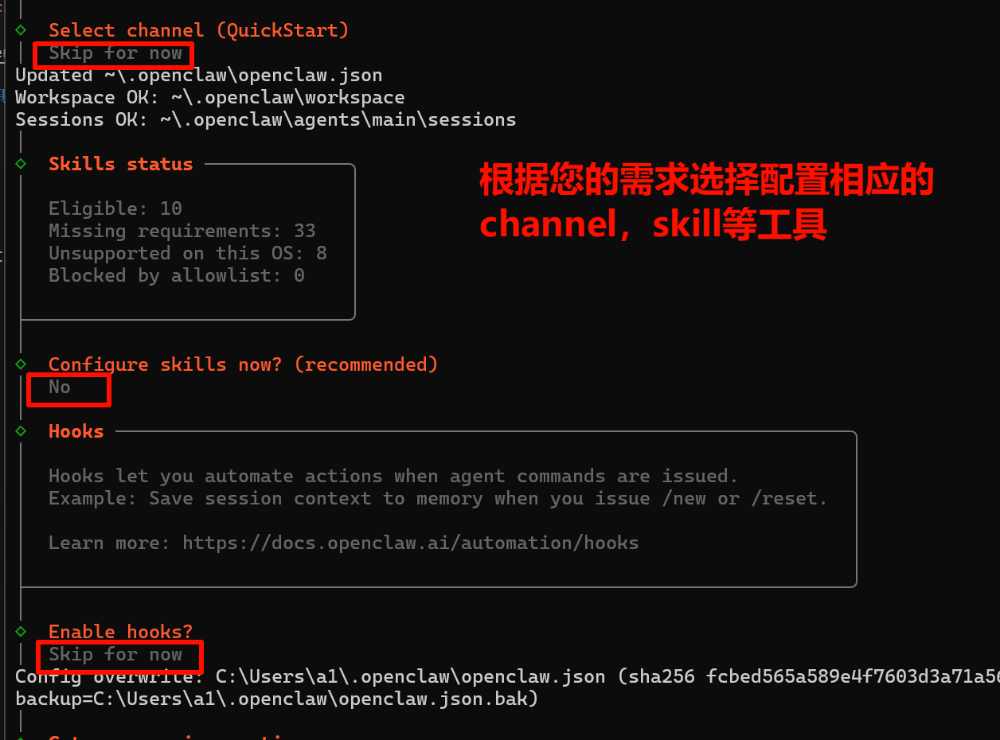

## 三、配置插件

为了简化 DMXAPI 的配置流程，我们提供了开源的配置插件工具：

- **CNB仓库地址**：https://cnb.cool/dmxapi/openclaw_config
- **GitHub仓库地址**：https://github.com/YeSongYun/openclaw_config

## 四、使用配置插件

### 第一步 选择最新版本

进入仓库后，访问配置插件的发布页面，选择最新版本：

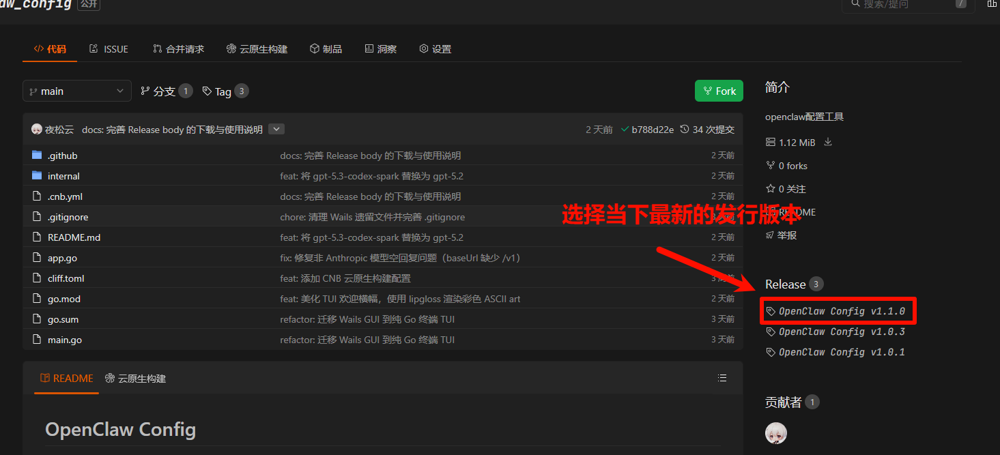

### 第二步 下载对应操作系统的文件

根据你的操作系统下载相应的文件：

| 平台 | 文件名 |
|------|--------|
| Windows x64 | `openclaw-config-windows-amd64.exe` |
| macOS Apple Silicon（M系列） | `openclaw-config-macos-arm64` |
| macOS Intel | `openclaw-config-macos-amd64` |
| Linux x64 | `openclaw-config-linux-amd64` |
| Linux ARM64 | `openclaw-config-linux-arm64` |

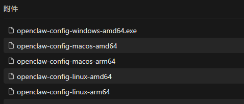

### 第三步 运行配置工具

::: tip
以 Windows 操作系统为例
:::

在下载好的配置文件所在的目录下，打开终端运行下面的指令：

```bash
.\openclaw-config-windows-amd64.exe
```

**运行指令**

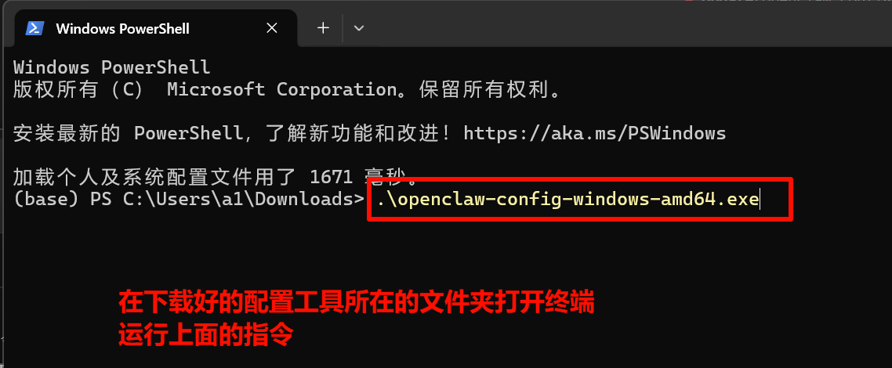

**填写配置信息**

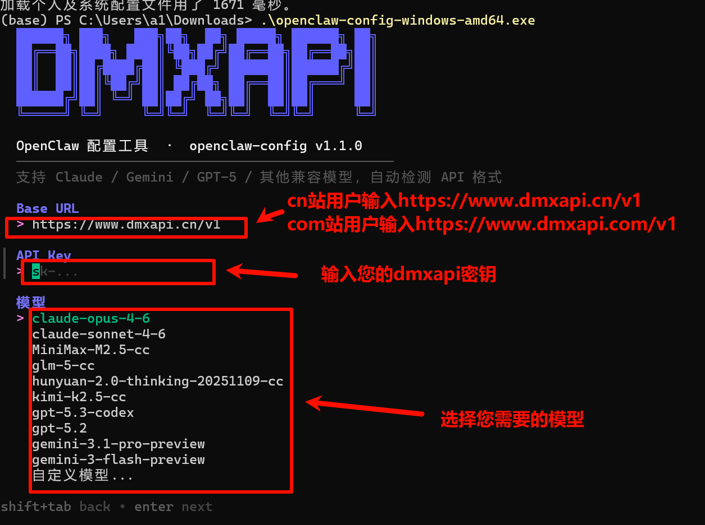

**自动保存配置**

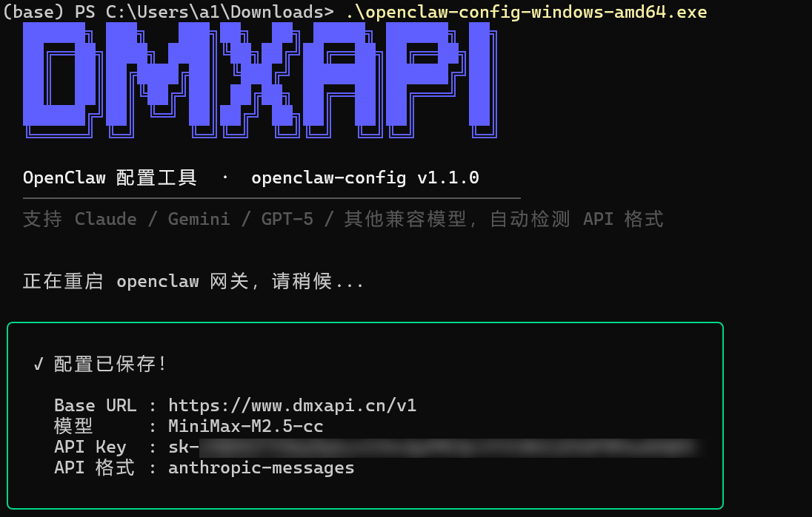

### 第四步 启动网关

```bash
openclaw gateway
```

复制链接到浏览器中打开：

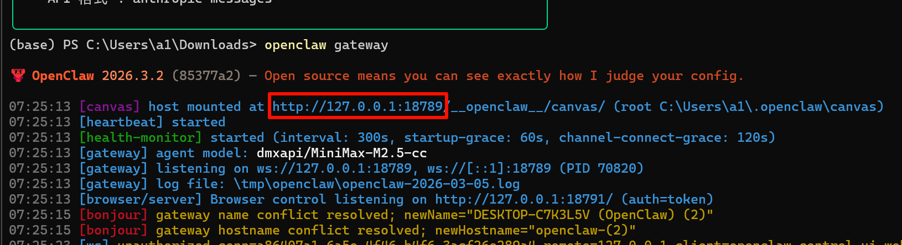

### 第五步 简单测试

输入"你好"进行测试：

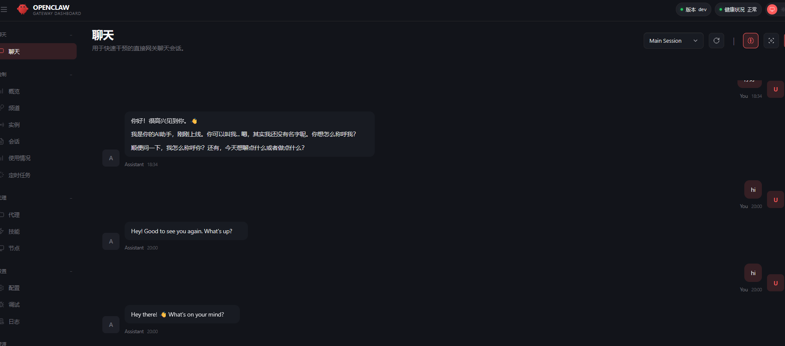


## 五、接入飞书私聊与群聊

::: tip 前置条件
已安装 OpenClaw 2026.3.2 及以上版本，且拥有飞书账号及创建企业自建应用的权限。
:::

### 飞书开放平台配置

**第一步 创建企业自建应用**

1. 打开 [飞书开放平台](https://open.feishu.cn)，登录账号
2. 点击「创建企业自建应用」，填写应用名称和描述
3. 创建完成后，进入「凭证与基础信息」页面，记录 **App ID**（格式：`cli_xxx`）和 **App Secret**

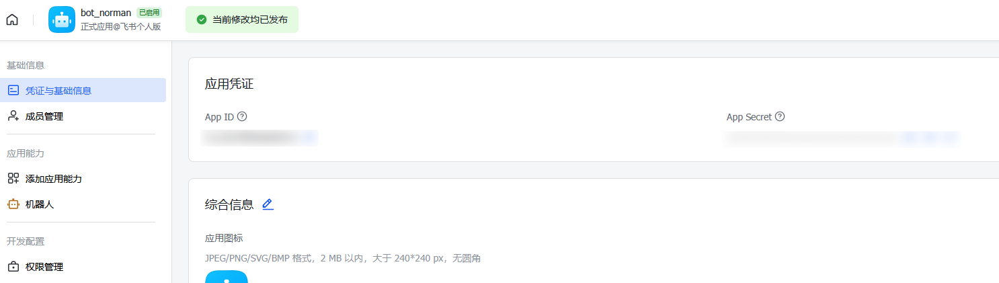

**第二步 添加机器人能力**

1. 左侧菜单点击「应用能力」
2. 点击「添加应用能力」，找到**机器人**，点击「添加」

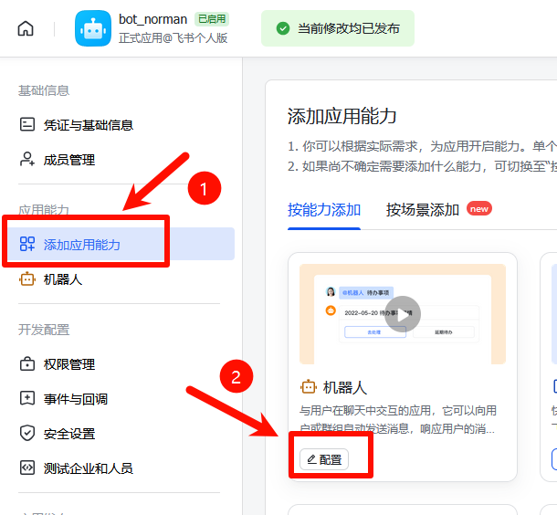

**第三步 开通权限**

左侧菜单点击「权限管理」，搜索并开通以下权限：

| 权限 | 说明 |
|------|------|
| `contact:contact.base:readonly`（应用身份） | 解析机器人自身 open_id，缺少会导致无法识别 @ |
| `im:message` | 发送单聊和群组消息 |
| `im:message.p2p_msg:readonly` | 读取用户发给机器人的私信 |
| `im:message:send_as_bot` | 以机器人身份回复消息 |
| `im:message.group_at_msg:readonly` | 接收群聊中 @ 机器人的消息（免审权限） |

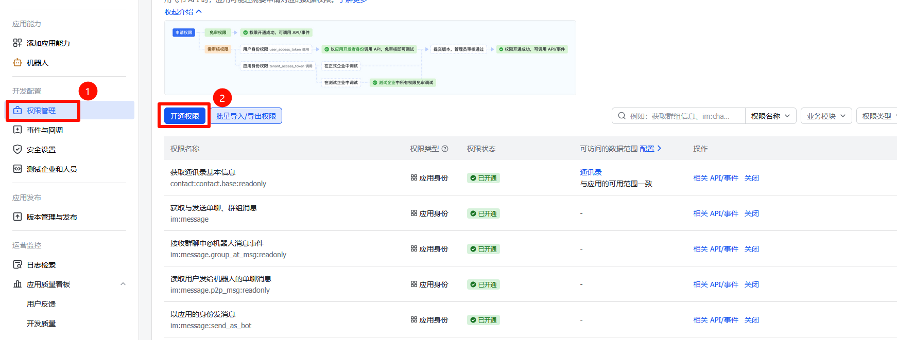

**第四步 订阅消息事件**

1. 左侧菜单点击「事件与回调」
2. 订阅方式选择**「使用长连接接收事件」**
3. 在「已添加事件」中点击「添加事件」，添加以下事件：
   - `im.message.receive_v1`（接收消息）

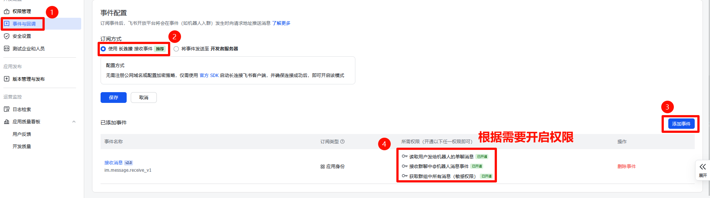

::: tip
暂时不要点保存，等 OpenClaw 连接成功后再保存
:::

**第五步 发布应用**

左侧菜单点击「版本管理与发布」→ 点击「创建版本」，填写版本号（如 `1.0.0`）→ 点击「申请发布」，管理员审批通过后生效。

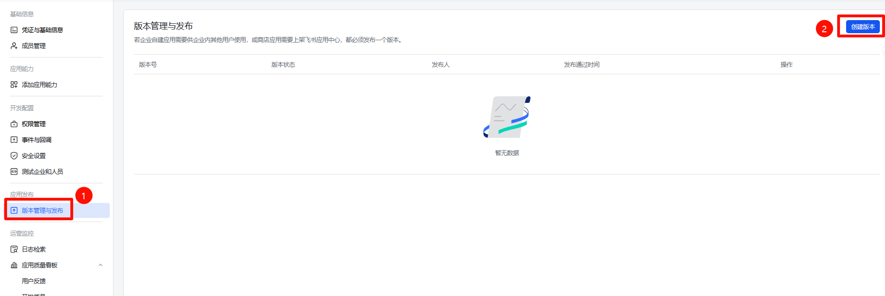
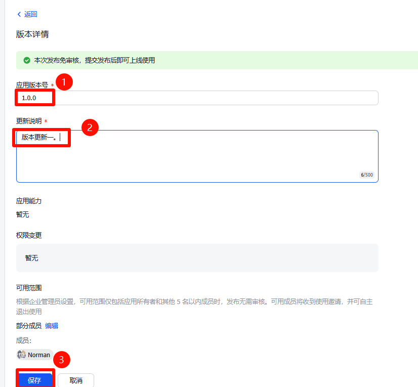

### OpenClaw 配置

**第一步 启动网关**

```bash
openclaw gateway
```

**第二步 添加飞书渠道**

新开一个终端窗口，运行：

```bash
openclaw channels add
```

按照提示依次操作：

| 提示 | 填写内容 |
|------|----------|
| Configure chat channels now? | 选 `Yes` |
| Select a channel | 选 `Feishu/Lark (飞书)` |
| Enter Feishu App Secret | 填写飞书应用的 App Secret |
| Enter Feishu App ID | 填写飞书应用的 App ID（`cli_xxx`） |
| Feishu connection mode | 直接回车，选默认 `WebSocket` |
| Which Feishu domain | 选 `Feishu (feishu.cn) - China`（国内版） |
| Group chat policy | 根据需求选择；只需私聊可选 `Disabled`，指定群可选 `Allowlist` |
| Group chat allowlist (chat_ids) | 仅 `Allowlist` 时需要，填写群 ID（`oc_xxx`） |
| Select a channel | 选 `Finished` |
| Configure DM access policies now? | 选 `Yes` |
| Feishu DM policy | 选 `Pairing`（推荐）或 `Open` |
| Add display names for these accounts? | 直接回车跳过 |
| Bind configured channel accounts to agents now? | 选 `Yes`，绑定到 Agent |
| Route feishu account "default" to agent | 选 `main (default)` |

填写完成后提示 `Channels updated.` 即写入成功。

::: tip 如何获取群聊 ID
在飞书客户端中，进入目标群聊 → 点击右上角「···」→「设置」→ 下拉到最后，群聊 ID（`oc_xxx`）显示在页面中，复制填入即可。
:::

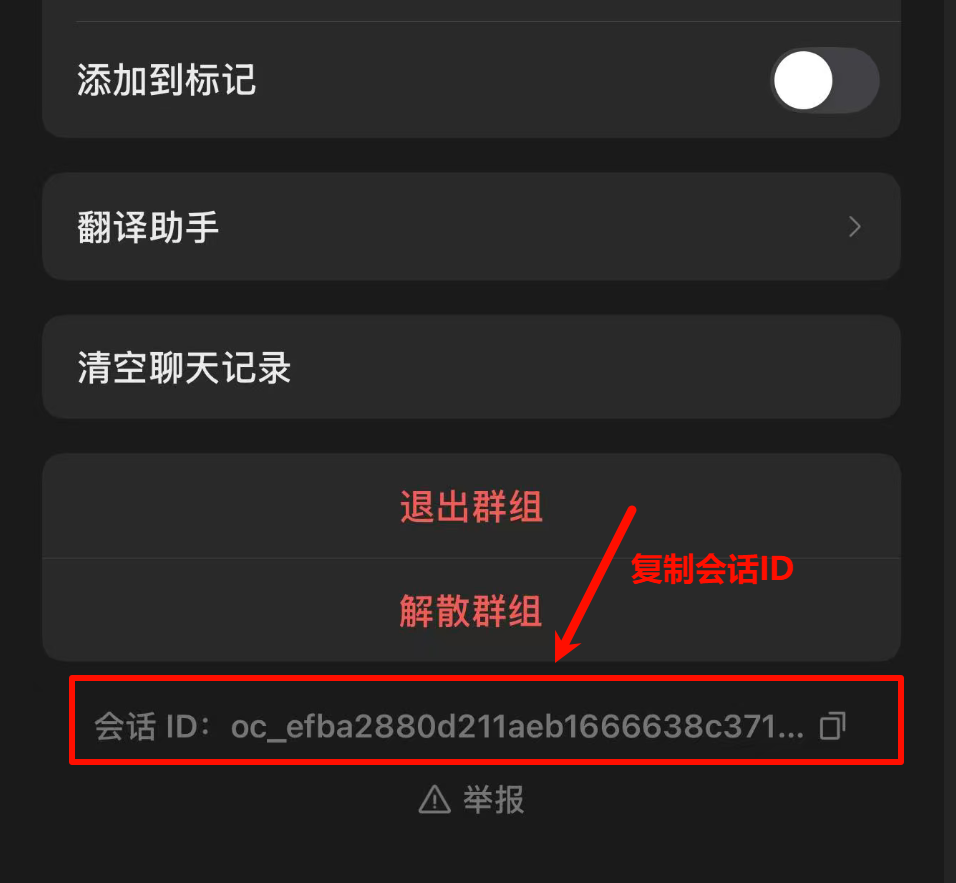

**第三步 重启网关**

```bash
openclaw gateway restart
```

**第四步 确认连接成功**

观察网关日志，出现以下内容即为连接成功：

```
[feishu] feishu[default]: bot open_id resolved: ou_xxxxxxxx
[feishu] feishu[default]: WebSocket client started
```

::: tip
如果 open_id 显示 `unknown`，说明 `contact:contact.base:readonly` 权限未开通，回到飞书开放平台开通后重新发布应用版本。
:::

---

### 回到飞书保存长连接配置

长连接建立成功后，回到「事件与回调」页面，确认订阅方式为「使用长连接接收事件」，点击**「保存」**。

此时应该不再提示"未检测到应用连接信息"，保存成功即完成配置。

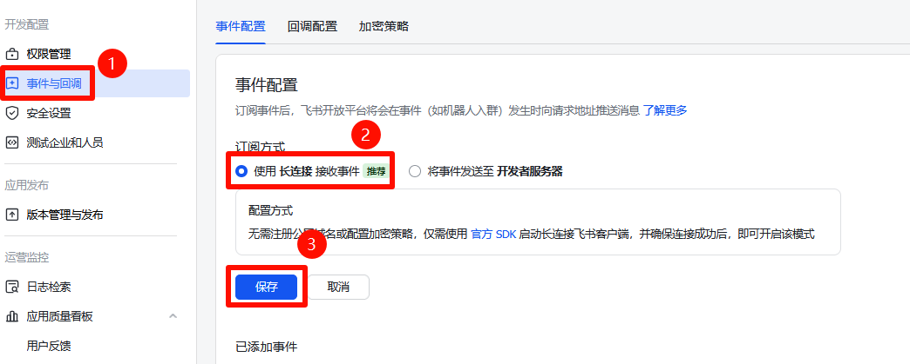

::: warning
保存后记得再次发布应用版本，新权限和事件订阅才会正式生效。
:::

### 验证

- **私聊**：在飞书中搜索应用名称，找到机器人直接发消息
- **群聊**：在群中 @ 机器人发消息

配置成功后，与机器人对话效果如下：

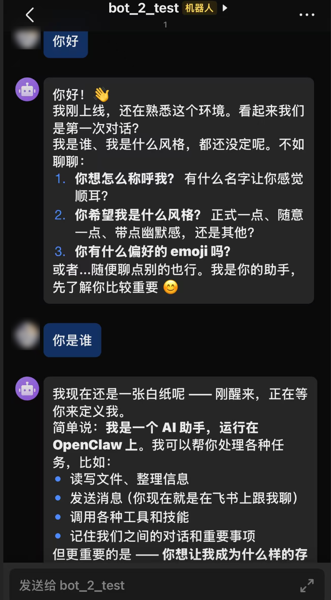


<!-- ### 常见问题

| 现象 | 原因 | 解决方法 |
|------|------|----------|
| 飞书保存报"未检测到连接" | OpenClaw 未启动或飞书渠道未添加 | 先确认网关已启动并添加渠道后再保存 |
| `bot open_id resolved: unknown` | 联系人权限未开通 | 开通 `contact:contact.base:readonly`（应用身份）并重新发布 |
| 私信没有反应 | `dmPolicy` 未配置或 `allowFrom` 缺失 | 设置 `dmPolicy: open` 并添加 `allowFrom: ["*"]` |
| 群里 @ 没有反应 | 未开通群消息权限或未配置 `groupPolicy` | 开通 `im:message.group_at_msg:readonly`，配置 `groupPolicy` |
| 插件冲突警告 | `extensions` 目录存在旧版外部插件 | 删除 `C:\Users\用户名\.openclaw\extensions\feishu\` 文件夹 | -->


<p align="center">
  <small>© 2026 DMXAPI OpenClaw 配置文档</small>
</p>
