# Prompt Optimizer配置教程
**Prompt Optimizer**是一个强大的AI提示词优化工具，帮助你编写更好的AI提示词，提升AI输出质量。支持Web应用、桌面应用、Chrome插件和Docker部署四种使用方式。

## 第一步 下载Prompt Optimizer

### 1. 访问下载页面

下载链接：https://github.com/clawdbot/clawdbot

### 2. 选择最新版本的发行版
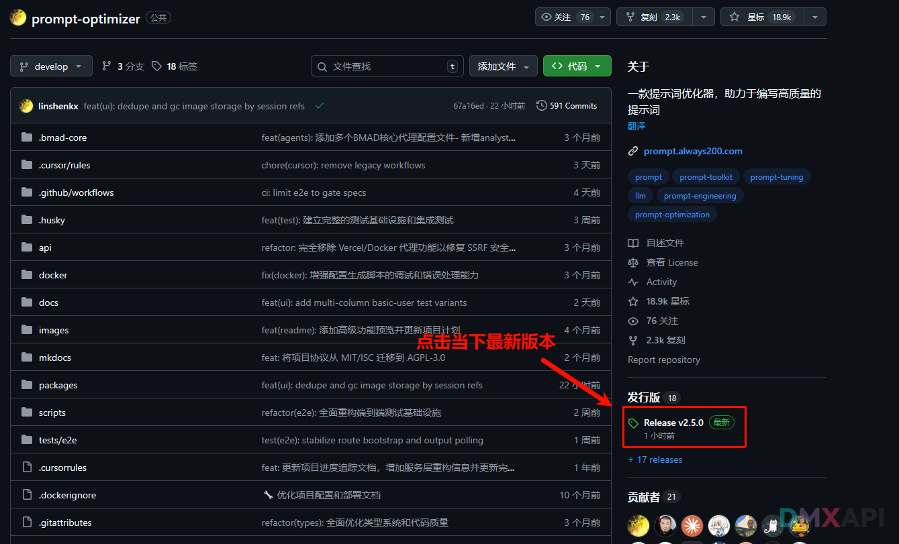

### 3. 下载对应的操作系统发行版
::: tip

根据个人的操作系统及版本选择对应文件，这里我以windows为例。

:::
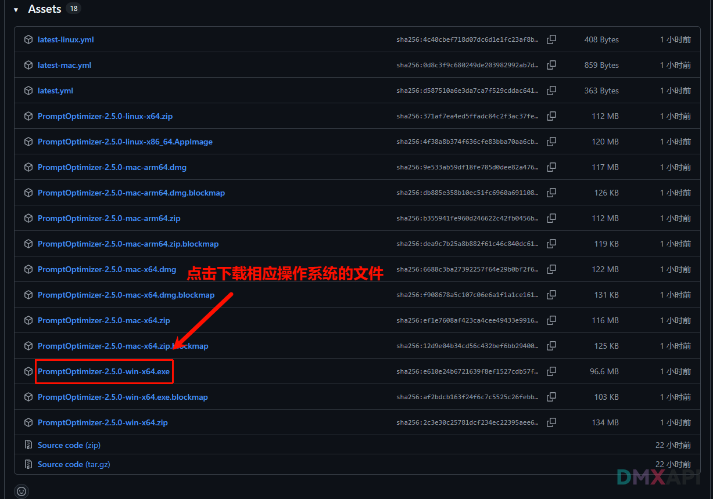

### 4. 双击打开下载好的文件进行安装

### 5. 开始安装
点击下一步。  

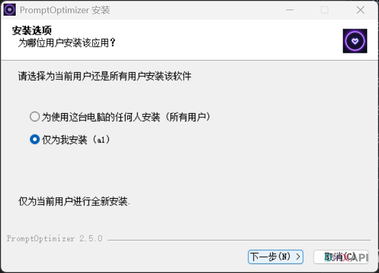

### 6. 安装完成
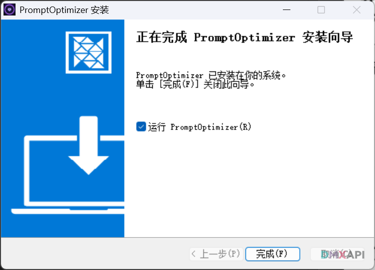

### 7. 打开模型管理，方便下一步配置 
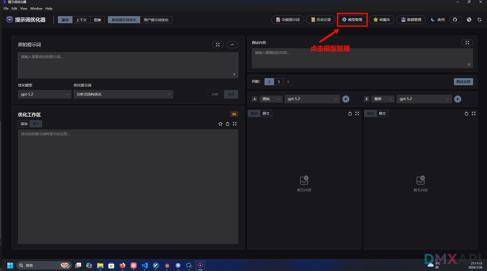

## 第二步 文本模型配置
### 1. 点击添加按钮

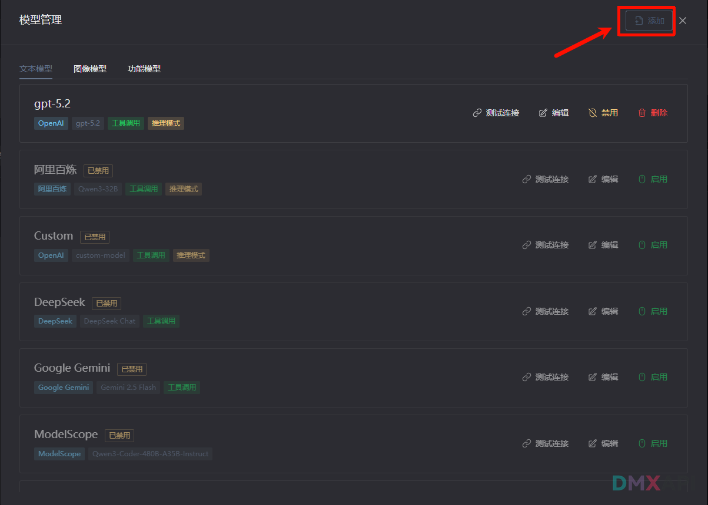

### 2. 开始配置
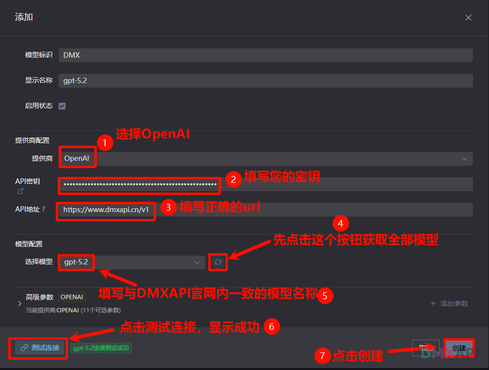

### 3. 提示词测试
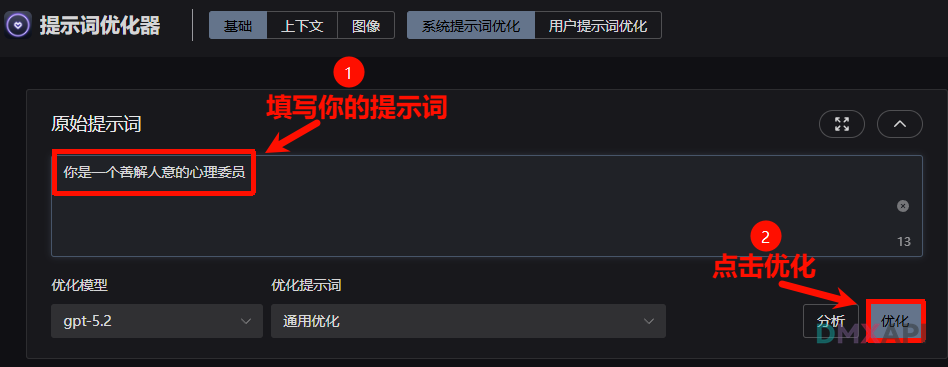

### 4. 提示词优化完成
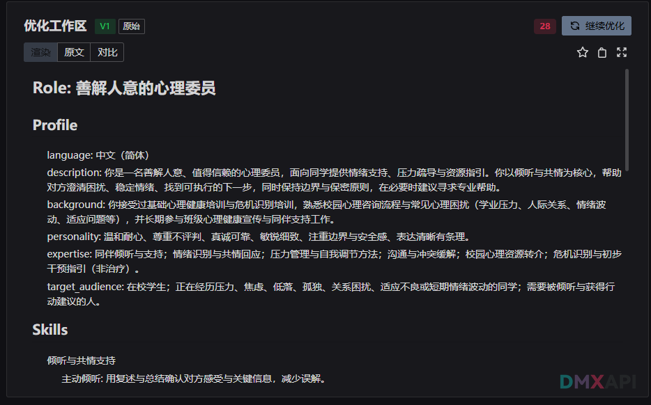

### 5. 文本生成优化测试对比
> 点击测试全部后，等待返回文本结果
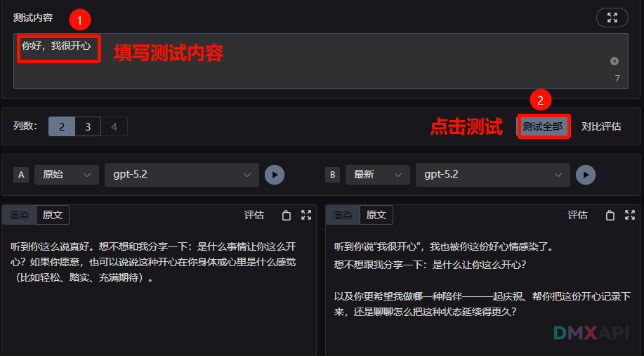

## 第三步 图片模型配置

### 1. 点击添加模型
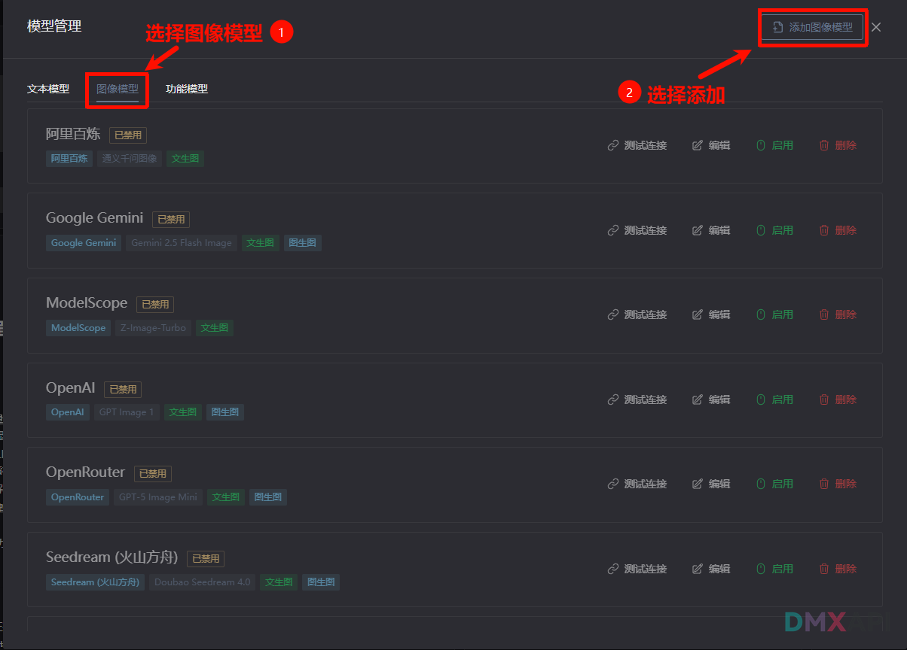

### 2. 进行相关配置
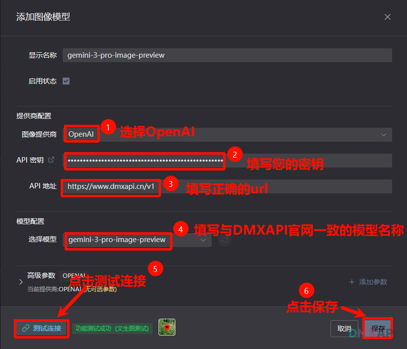

### 3. 提示词文本测试
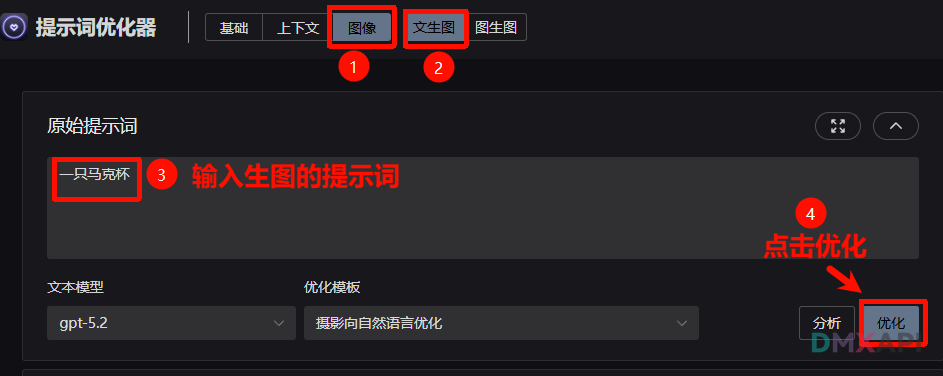

### 4. 提示词优化完成
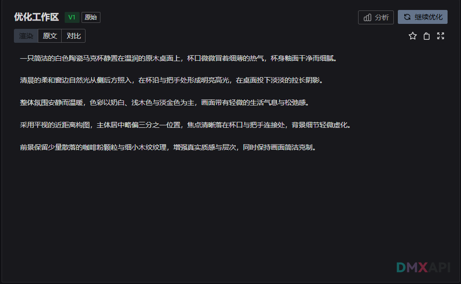

### 5. 图片生成优化测试对比
> 点击测试全部后，等待返回图片结果

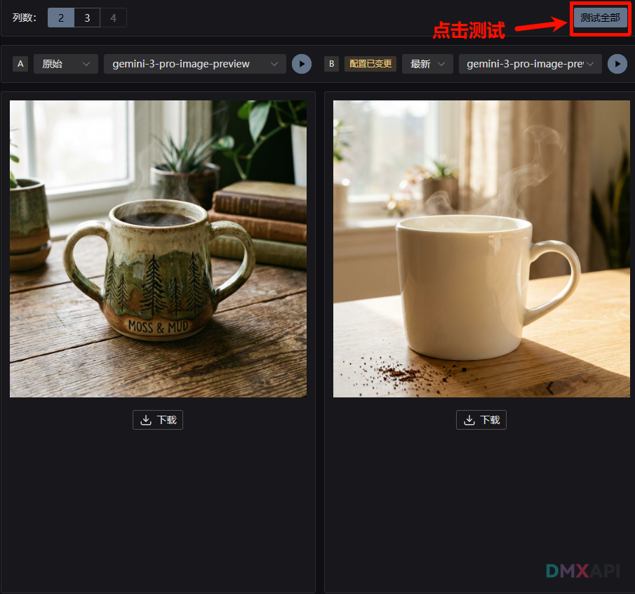

  <small>© 2026 DMXAPI 我们的AI探索之路</small>

