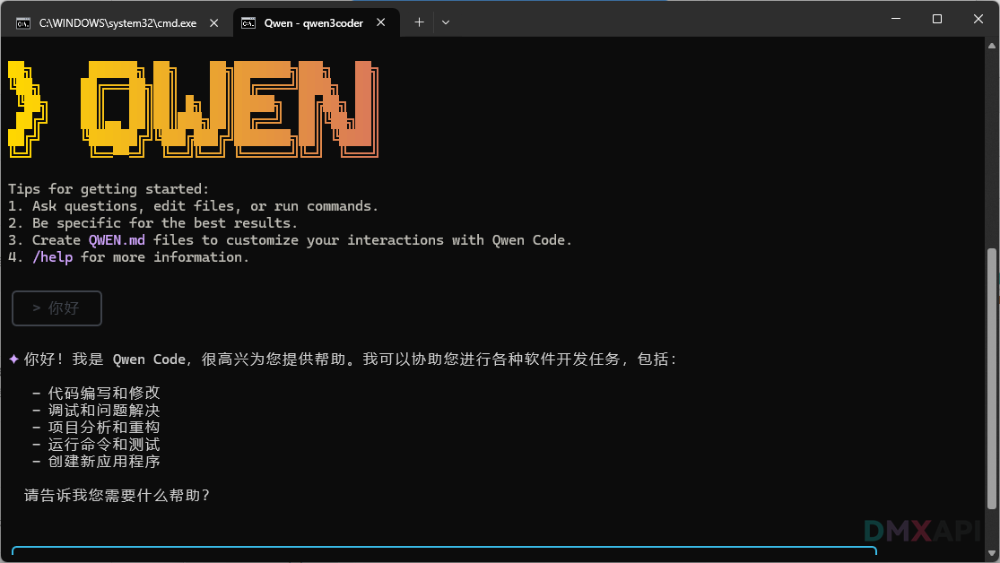
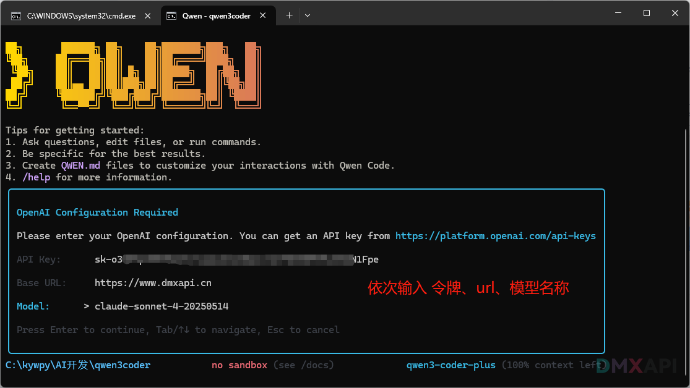

# Qwen Coder 安装配置教程

## Qwen Code 简介
我们更推荐使用 Qwen3 Code，无需任何验证即可使用。
Qwen Code 是一款基于 Gemini CLI 改造的命令行 AI 工作流工具，专为 Qwen3-Coder 模型优化，提供增强的解析器支持与工具功能

### 主要功能
- 代码理解与编辑 - 突破传统上下文窗口限制，可查询和编辑超大规模代码库
- 工作流自动化 - 自动化处理拉取请求（Pull Requests）、复杂变基（Rebases）等操作任务
- 增强解析器 - 专为 Qwen-Coder 模型适配的解析器，实现深度优化 安装



## 环境要求
- **操作系统**: Windows 10/11, macOS 10.15+, Ubuntu 20.04+ 或 Debian 10+
- **Node.js**: v18以上版本
- **Git**:   https://git-scm.com/downloads/

## 安装 Node.js
### Windows
```bash
# 下载安装 Node.js
# 验证版本
node --version
```

### Ubuntu/Debian
```bash
curl -fsSL https://deb.nodesource.com/setup_lts.x | sudo bash -
sudo apt-get install -y nodejs
# 查看版本 验证安装成功
node --version
```

### macOS
```bash
sudo xcode-select --install
/bin/bash -c "$(curl -fsSL https://raw.githubusercontent.com/Homebrew/install/HEAD/install.sh)"
brew install node
# 查看版本 验证安装成功
node --version
```


## 安装 Qwen Code
安装命令：
```
npm install -g @qwen-code/qwen-code
```
运行结束后使用 `qwen --version` 查看版本并确认安装成功。

## 配置方法

### Linux 配置
官方文档介绍的配置方式：项目目录中创建 .qwen/.env 或 .env 文件（建议使用 .qwen/.env 文件，以隔离其他环境变量与其他工具的配置），设置以下信息（api key、url、model）：
```bash
export OPENAI_API_KEY="DMXAPI的令牌"
export OPENAI_BASE_URL="https://www.dmxapi.cn/v1"
export OPENAI_MODEL="这里填模型名称"
```

### windows 配置
```bash
set OPENAI_API_KEY=DMXAPI的令牌
set OPENAI_BASE_URL=https://www.dmxapi.cn/v1
set OPENAI_MODEL=这里填模型名称
```

## 运行
在终端运行 `qwen` 启动 Qwen Code
```bash
qwen
```



如果没有设置过，会需要填写设置，根据提示操作就可以使用了。

## 注意
Qwen Code 的 BaseUrl 需要带上 /v1；而 Claude Code 设置 Base url  是不需要的。

<p align="center">
  <small>© 2025 DMXAPI Qwen Cod...</small>
</p>