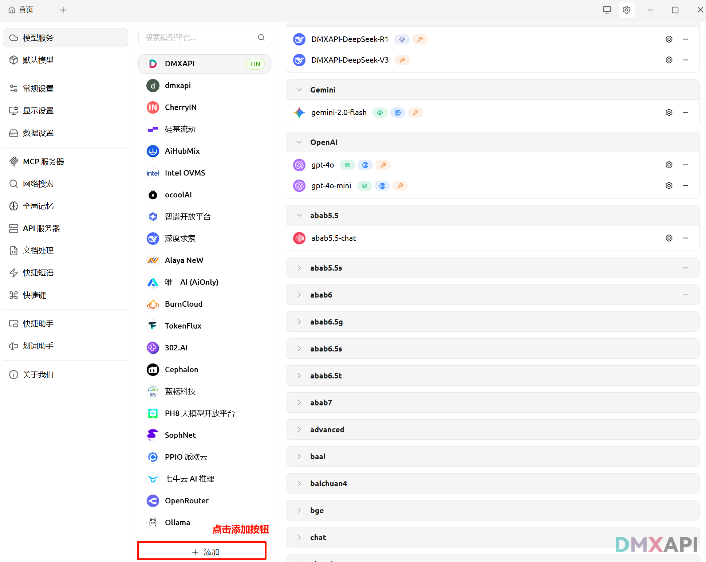
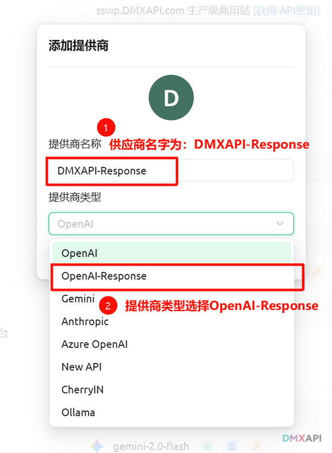
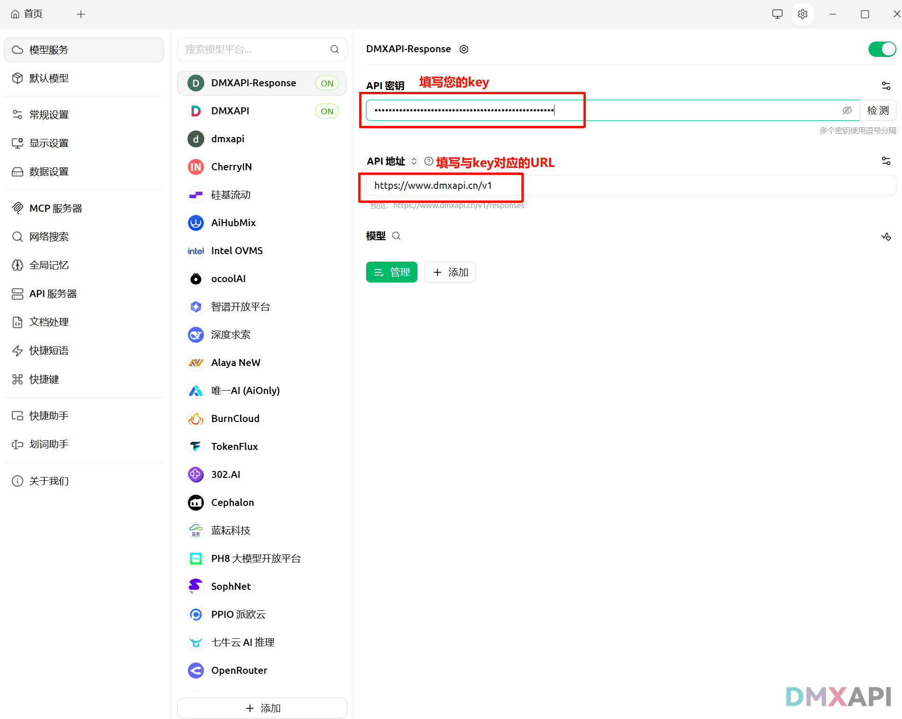
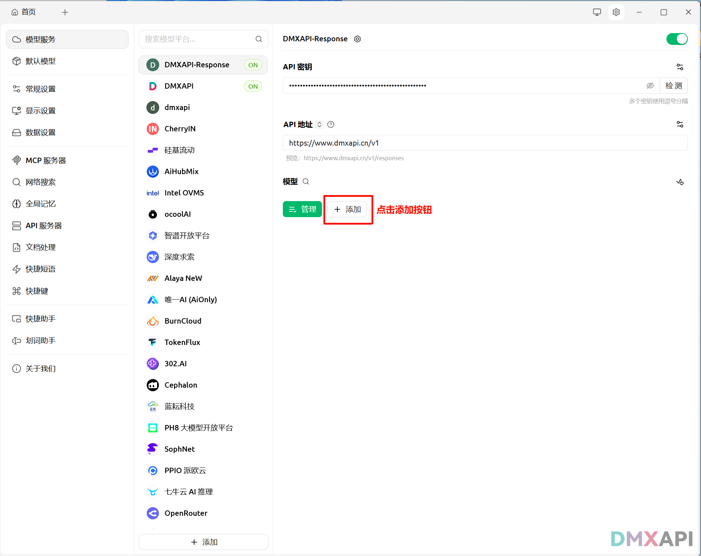
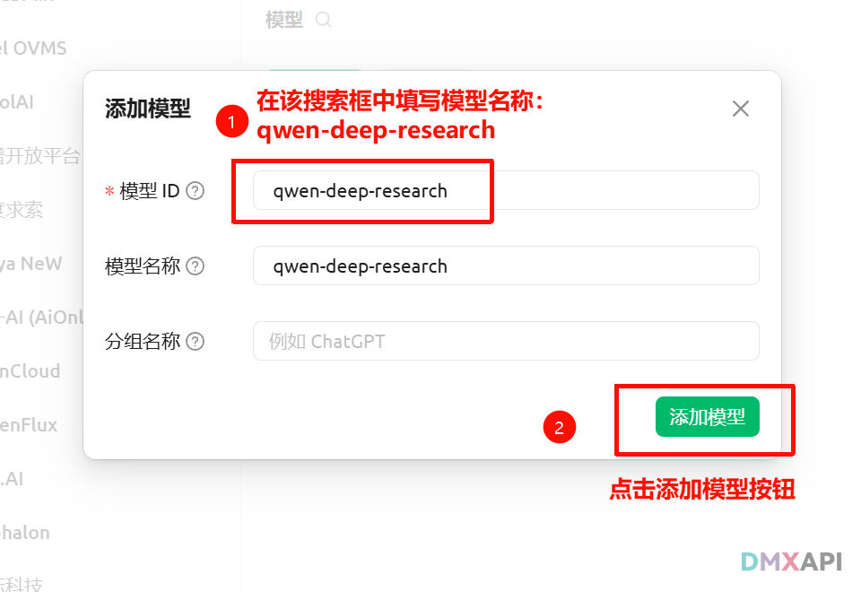
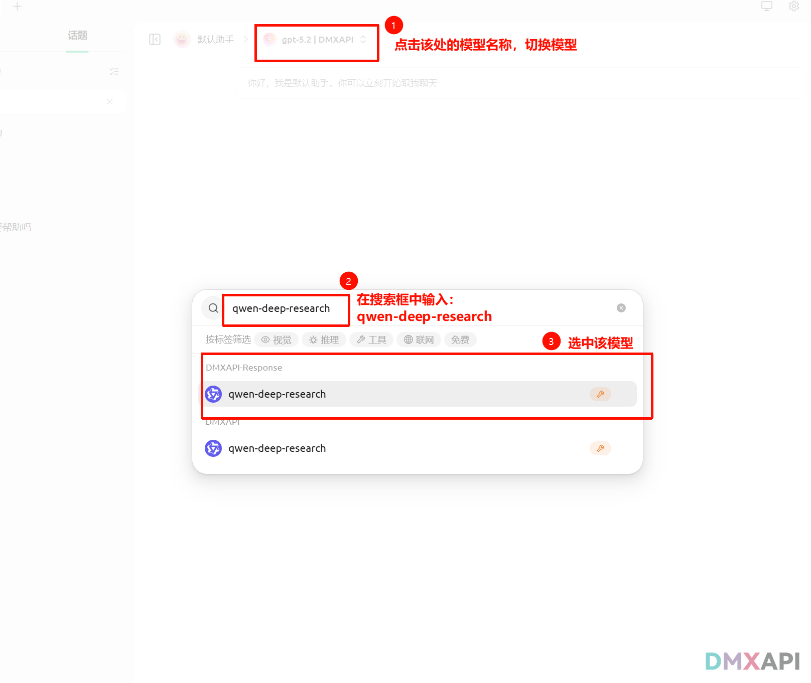
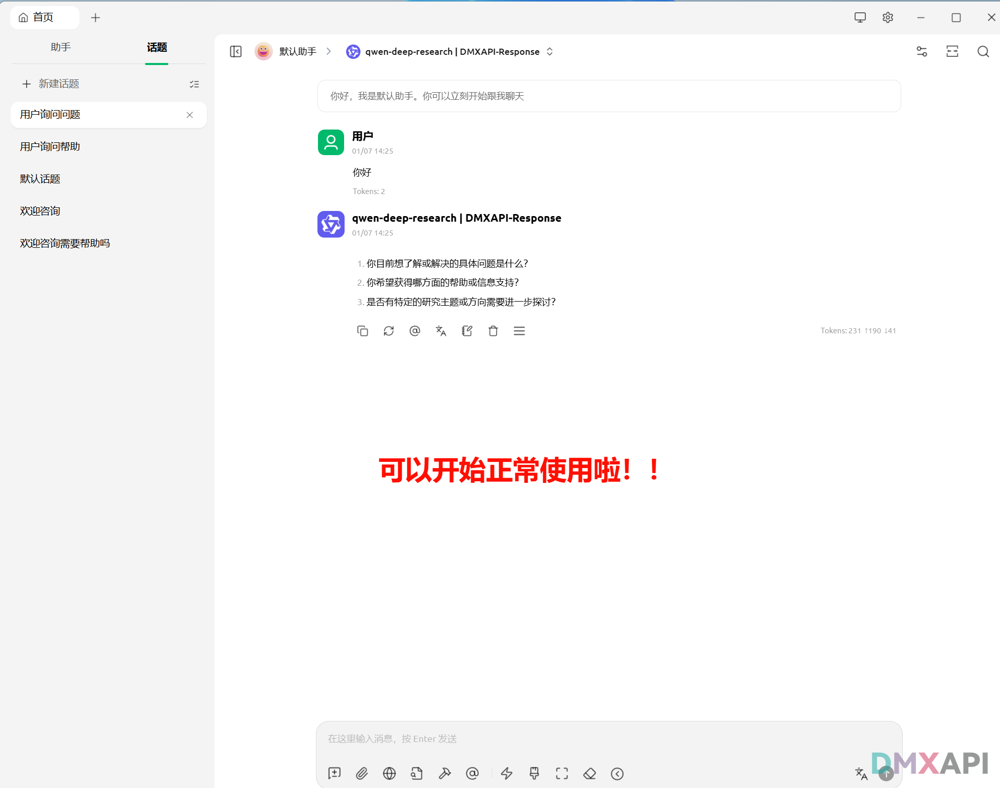

# qwen-deep-research 深入研究模型 API 文档

qwen-deep-research是一个专门用来深入讨论复杂问题的AI模型，它会像研究员一样先和你厘清问题，再给出精准答案。

## 📍 请求地址
```
https://www.dmxapi.cn/v1/responses
```

## 🎯 模型名称

`qwen-deep-research` 

## 💻 第一步（模型反问确认） 调用示例
用户消息用于发起初始的研究请求，提出一个较为宽泛的研究主题。
```python
import requests
import json

# ============================================================================
# 配置部分 - API 连接信息
# ============================================================================

# DMXAPI 的 URL 地址
url = "https://www.dmxapi.cn/v1/responses"

# API 密钥 - 用于身份验证和访问控制
api_key = "sk-****************************************"  # 请替换为你的API密钥

# ============================================================================
# 请求头配置 - 设置内容类型和授权信息
# ============================================================================

headers = {
    "Content-Type": "application/json",      # 指定请求体为 JSON 格式
    "Authorization": f"{api_key}",    # token 认证方式
}

# ============================================================================
# 请求参数配置 - AI 模型与输入内容
# ============================================================================
data = {
  "model": "qwen-deep-research",
  "input": [
    {
      "role": "user",
      "content": [
        {
          "type": "input_text",
          "text": "2026年春节是哪一天"
        }
      ]
    }
  ],
  "store": false,
  "include": [
    "reasoning.encrypted_content"
  ],
  "stream": true
}
# ============================================================================
# 发送请求并处理流式响应
# ============================================================================

# 发送 POST 请求到 API 服务器，启用流式响应模式
response = requests.post(url, headers=headers, json=data, stream=True)

# 处理流式响应 - 打印原始输出内容
try:
    # 逐行读取响应流并打印原始内容
    for line in response.iter_lines():
        if line:
            line_text = line.decode('utf-8')
            print(line_text)

except KeyboardInterrupt:
    # 用户中断 - 当用户按 Ctrl+C 时优雅退出
    print("\n\n用户中断了请求")

except Exception as e:
    # 其他异常 - 捕获并显示任何意外错误
    print(f"\n\n发生错误: {e}")

# 最后换行 - 确保输出格式整洁
print()

```

## 💻 第二步（深入研究）调用示例

用户消息用于回答模型提出的澄清式问题，帮助模型聚焦研究方向，进行更具针对性的深入分析。

```python
import requests

# ============================================================================
# 配置部分 - API 连接信息
# ============================================================================

# DMXAPI 的 URL 地址
url = "https://www.dmxapi.cn/v1/responses"

# API 密钥 - 用于身份验证和访问控制
api_key = "sk-****************************************"  # ⚠️ 请替换为你的API密钥

# ============================================================================
# 请求头配置 - 设置内容类型和授权信息
# ============================================================================
headers = {
    "Content-Type": "application/json",      # 指定请求体为 JSON 格式
    "Authorization": f"Bearer {api_key}",    # Bearer token 认证方式
}

# ============================================================================
# 请求参数配置 - AI 模型与输入内容
# ============================================================================
data = {
  "model": "qwen-deep-research",
  "input": [
    {
      "role": "user",
      "content": [
        {
          "type": "input_text",
          "text": "2026年春节是哪一天"
        }
      ]
    },
    {
      "role": "assistant",
      "content": [
        {
          "type": "output_text",
          "text": "您是想了解2026年春节的具体公历日期，还是也包括农历信息及相关节庆时间范围？  \n2. 您查询2026年春节的日期是出于日程安排、活动规划，还是有其他研究或记录目的？  \n3. 是否需要同时提供春节前后的相关节日（如除夕、元宵节）的具体日期？"
        }
      ]
    },
    {
      "role": "user",
      "content": [
        {
          "type": "input_text",
          "text": "只告诉我2026年春节的日期就可以了"
        }
      ]
    }
  ],
  "store": False,
  "include": [
    "reasoning.encrypted_content"
  ],
  "stream": True
}

# ============================================================================
# 发送请求并处理流式响应
# ============================================================================

# 发送 POST 请求到 API 服务器,启用流式响应模式
response = requests.post(url, headers=headers, json=data, stream=True)

# ----------------------------------------------------------------------------
# 处理流式响应 - 打印原始输出内容
# ----------------------------------------------------------------------------
try:
    # 逐行读取响应流并打印原始内容
    for line in response.iter_lines():
        if line:
            # 解码并打印原始行内容
            line_text = line.decode('utf-8')
            print(line_text)

# ----------------------------------------------------------------------------
# 异常处理
# ----------------------------------------------------------------------------
except KeyboardInterrupt:
    # 处理用户中断 - 当用户按 Ctrl+C 时优雅退出
    print("\n\n⚠️ 用户中断了请求")

except Exception as e:
    # 处理其他异常 - 捕获并显示任何意外错误
    print(f"\n\n❌ 发生错误: {e}")

# 最后换行 - 确保输出格式整洁
print()
```

## 🚀qwen-deep-research  模型在cherry studio中的使用方法
1、点击添加按钮准备添加供应商



2、添加供应商



3、填写URL和key



4、点击添加按钮，准备添加模型


5、添加模型



6、返回聊天界面


7、切换聊天模型



8、测试通过，可以开始聊天啦！！！




## 📚 阿里官方网站
```
https://help.aliyun.com/zh/model-studio/qwen-deep-research-api
```

---

<p align="center">
  <small>© 2025 DMXAPI qwen-deep-research 深入研究模型</small>
</p>