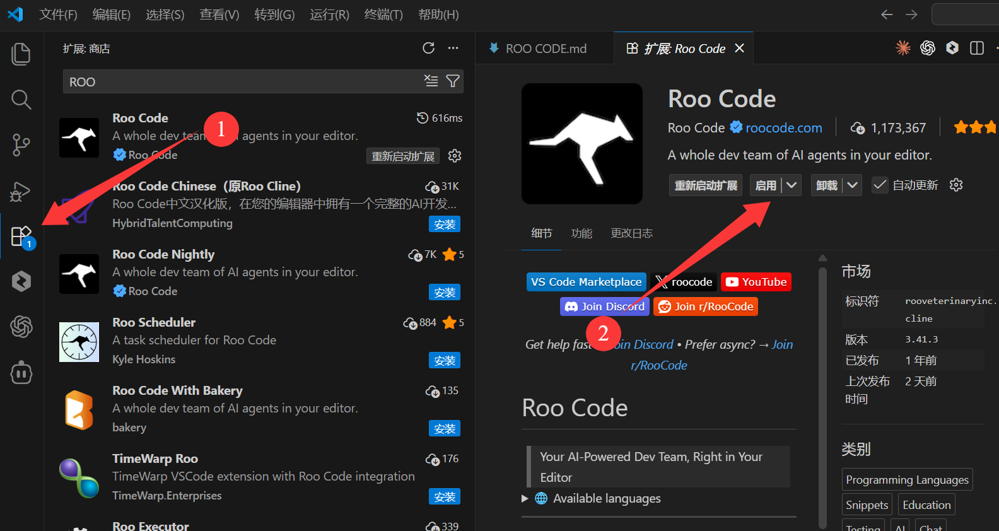
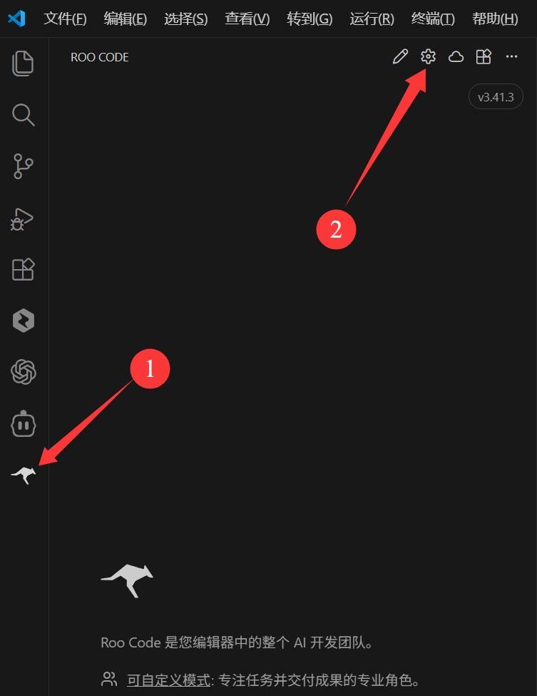
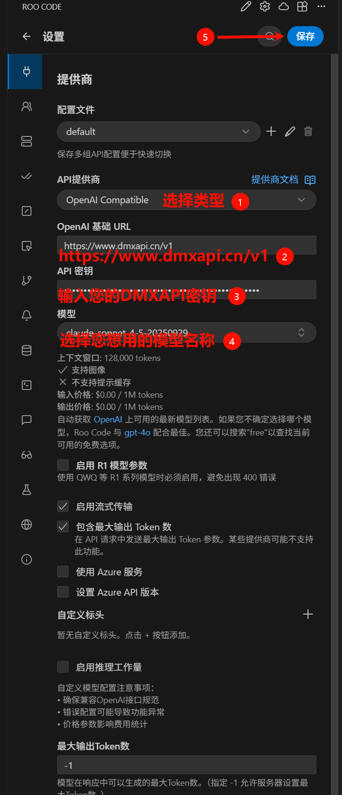
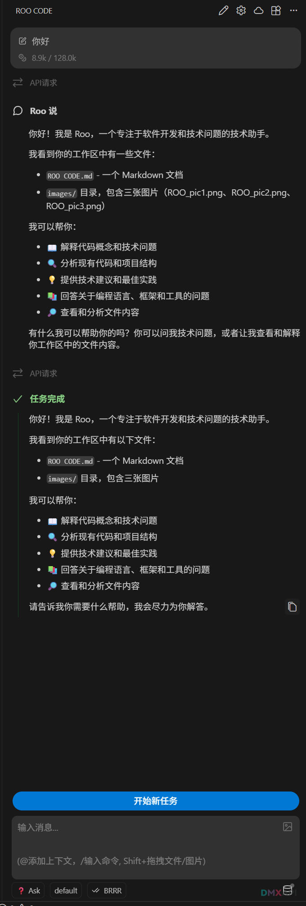

# VSCode ROO CODE 配置方法

**Roo Code** (原 Rover) 是一款基于 AI 大模型的 VSCode 编程辅助插件，支持多种主流模型 (Claude、OpenAI、Gemini 等)，提供代码生成、解释、重构、调试等功能，帮助开发者提升编程效率。

:::warning 注意
编程插件 tokens 消耗量很大，请注意 tokens 消耗并设置合理的限制
:::

## 功能特性

- **智能代码生成**：根据自然语言描述生成代码
- **代码解释**：解释复杂代码逻辑
- **代码重构**：优化代码结构和性能
- **Bug 修复**：自动定位并修复代码问题
- **单元测试**：生成测试用例
- **多模型支持**：灵活切换不同 AI 模型

## 第一步 安装插件

在 VSCode 扩展商店中搜索 **Roo Code** 并安装：

## 第二步 打开设置

安装完成后，在侧边栏找到 Roo Code 图标并进入设置：

## 第三步 配置 API

在设置中填写你的 API 配置信息：

| 配置项 | 说明 |
|--------|------|
| API 提供商 | 选择`OpenAI Compatible` |
| 基础 URL | https://www.dmxapi.cn/v1 |
| API Key | 您的DMXAPI密钥 |
| Model | 您要用的模型 |

## 第四步 开始使用

配置完成后，即可开始使用 Roo Code 进行编程辅助：

  <small>© 2025 DMXAPI Dify接入</small>

