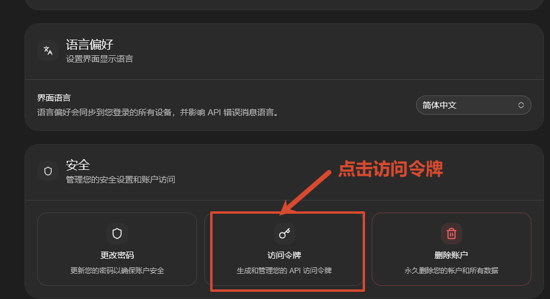
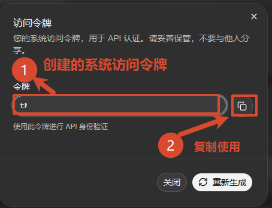
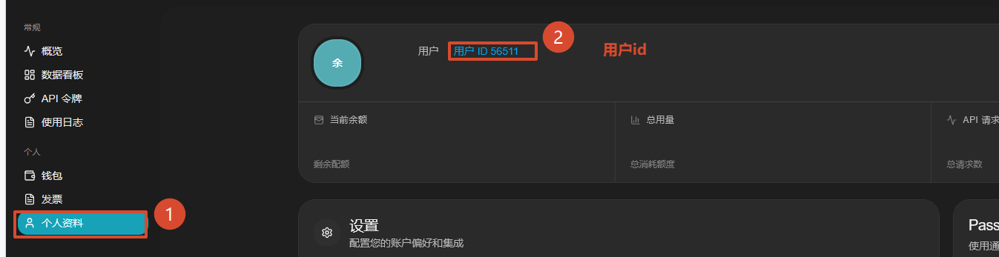

# 系统令牌的创建和用户 ID 的查找

调用平台管理接口时需要两个关键参数：**系统令牌（SYSTEM_TOKEN）** 和 **用户 ID（USER_ID）**。本文演示如何在 DMXAPI 后台获取这两个参数。

## 查询网址
```
https://www.dmxapi.cn/profile
```

## 一、创建系统令牌

### 1. 进入访问令牌管理

登录 DMXAPI 后进入 **个人设置**，在「安全」卡片中点击 **访问令牌**（生成和管理您的 API 访问令牌）。



### 2. 复制系统访问令牌

在弹出的「访问令牌」窗口中：

1. 查看已创建的系统访问令牌；
2. 点击令牌右侧的复制按钮，将令牌复制备用。



:::tip 提示
系统令牌用于 API 身份验证，请妥善保管，不要与他人分享。若需更换，可点击窗口右下角的「重新生成」。
:::

## 二、查看用户 ID

点击左侧菜单的 **个人资料**，页面顶部的「用户 ID」即为你的 USER_ID。



<p align="center">
  <small>© 2025 DMXAPI  系统令牌的创建和用户ID的查找 </small>
</p>
