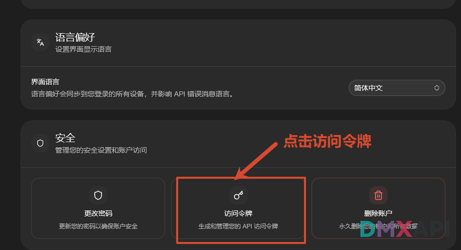
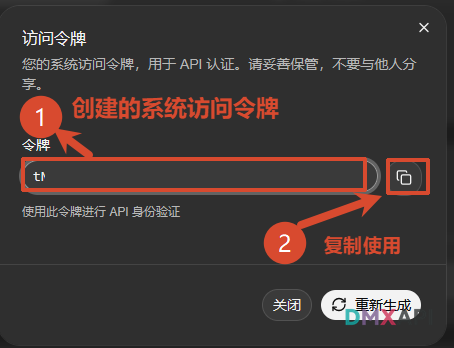
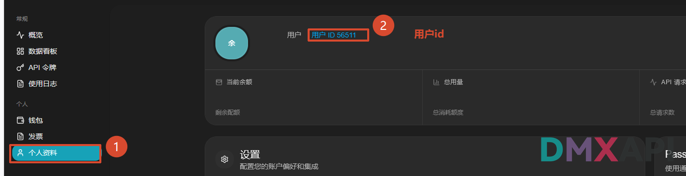

# 系统令牌的创建和用户 ID 的查找

调用平台管理接口时需要两个关键参数：**系统令牌（SYSTEM_TOKEN）** 和 **用户 ID（USER_ID）**。本文演示如何在 DMXAPI 后台获取这两个参数。

::: warning 不要混用
系统访问令牌用于账户管理接口，不是调用模型使用的 `sk-...` API Key。
:::

## 查询网址
```
https://www.dmxapi.cn/profile
```

## 一、创建系统令牌

### 1. 进入访问令牌管理

登录 DMXAPI 后进入 **个人设置**，在「安全」卡片中点击 **访问令牌**（生成和管理您的 API 访问令牌）。



### 2. 复制系统访问令牌

在弹出的「访问令牌」窗口中：

1. 查看已创建的系统访问令牌；
2. 点击令牌右侧的复制按钮，将令牌复制备用。



:::tip 提示
系统令牌用于 API 身份验证，请妥善保管，不要与他人分享。若需更换，可点击窗口右下角的「重新生成」。
:::

## 普通令牌管理接口认证头

创建、列表、搜索、更新和删除令牌时，使用下面的认证头：

```http
Authorization: Bearer YOUR_SYSTEM_TOKEN
Dmx-Api-User: YOUR_USER_ID
Content-Type: application/json
```

其中 `Authorization` 和 `Dmx-Api-User` 用于认证；`Content-Type` 只在 POST、PUT 等请求携带 JSON 请求体时添加，普通 GET 请求无需添加。模型统计、日志查询等其他平台端点可能使用不同的认证值格式，应以对应接口页面的示例为准。

本文的入门示例允许你在本机脚本顶部直接填写这两个值，省去先配置环境变量的步骤。请只在可信的本机临时使用，不要截图、分享、提交到 Git 仓库，也不要放进网页前端代码。

生产环境、团队共享脚本或需要长期保存的程序，仍建议使用真正的环境变量或密钥管理服务。若系统令牌已经泄露，请立即在后台重新生成。

## 二、查看用户 ID

点击左侧菜单的 **个人资料**，页面顶部的「用户 ID」即为你的 USER_ID。



<p align="center">
  <small>© 2026 DMXAPI 系统令牌的创建和用户 ID 的查找</small>
</p>
