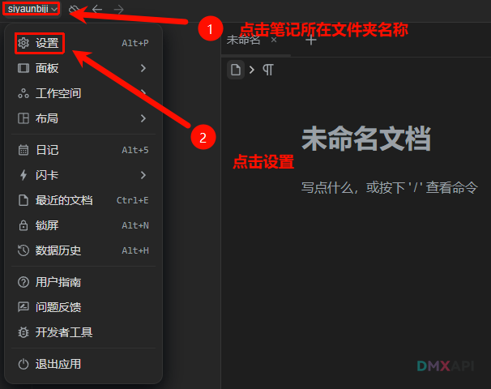
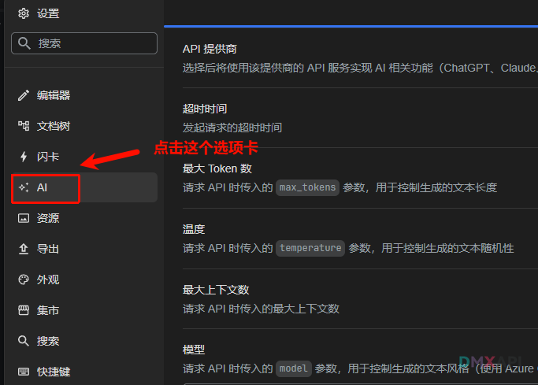
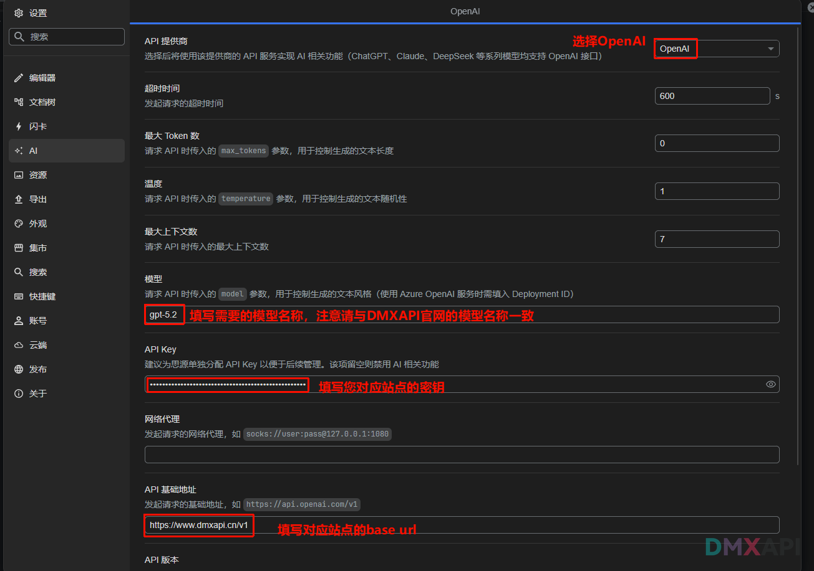
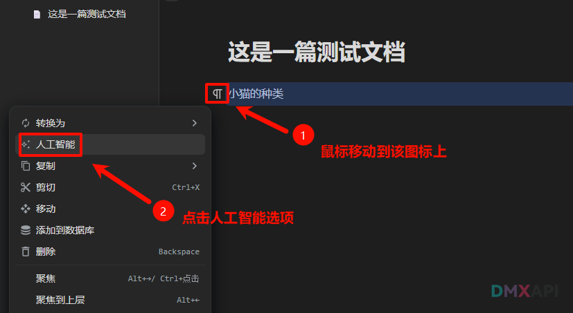
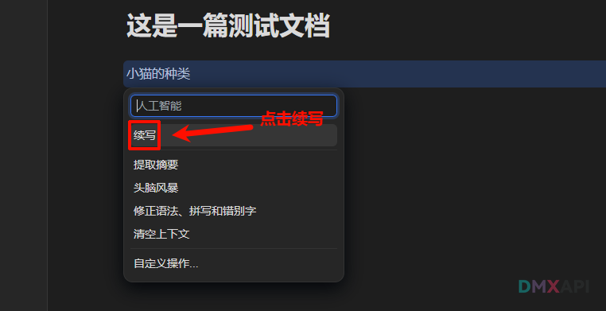
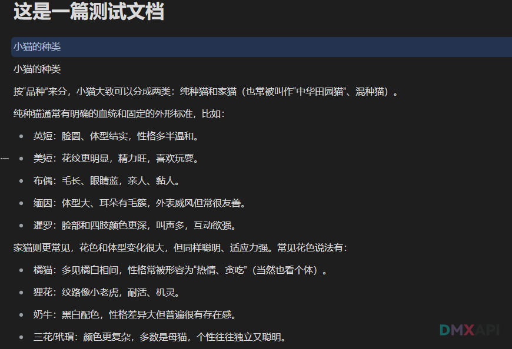

# 思源笔记配置方法

思源笔记是一款开源的个人知识管理软件，采用块级编辑器设计，支持双向链接、标签管理和 Markdown 编辑。通过集成 AI 功能，可以实现智能续写、摘要生成等写作辅助。

## 第一步 打开思源笔记设置
::: warning 💡 在思源笔记中打开「设置」界面
:::

## 第二步 点击左侧 AI 选项卡
::: warning 💡 在左侧菜单栏中点击「AI」选项卡
:::

## 第三步 相关配置填写

::: warning 💡 填写 API 密钥、模型名称和基础地址后保存配置   
  - 模型名称必须与 [DMXAPI 模型列表](https://www.dmxapi.cn/rmb) 完全一致
  - **CN 站用户**：API 基础地址填写 `https://www.dmxapi.cn/v1`
:::

## 第四步 进行测试
### 1. 输入一段文字后，选择「人工智能」选项

### 2. 在弹出的菜单中点击「续写」

### 3. 等待片刻，AI 将自动续写文本内容

  <small>© 2026 DMXAPI 思源笔记配置</small>

