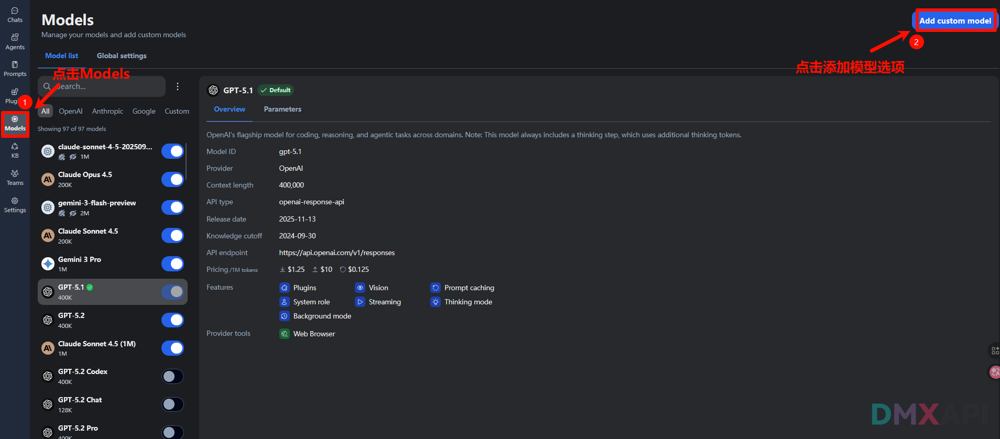
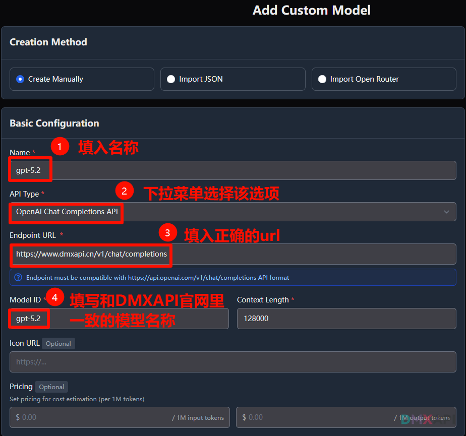
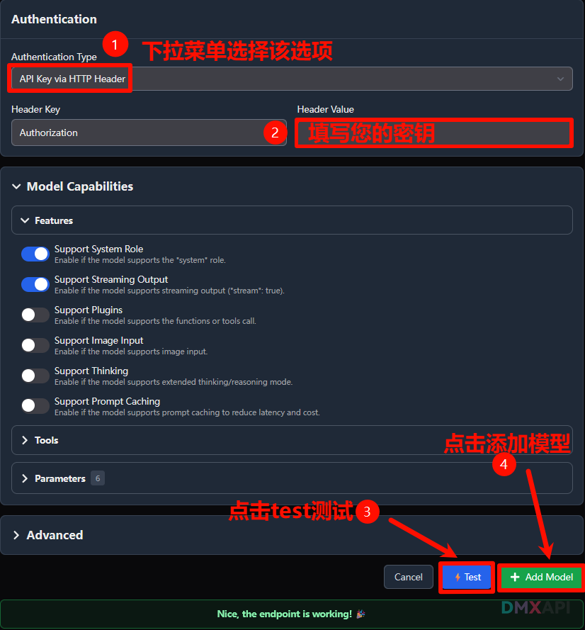
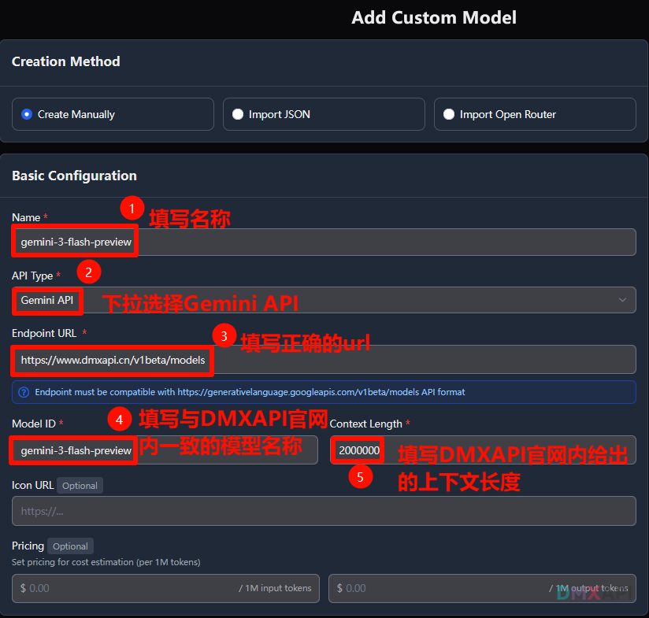
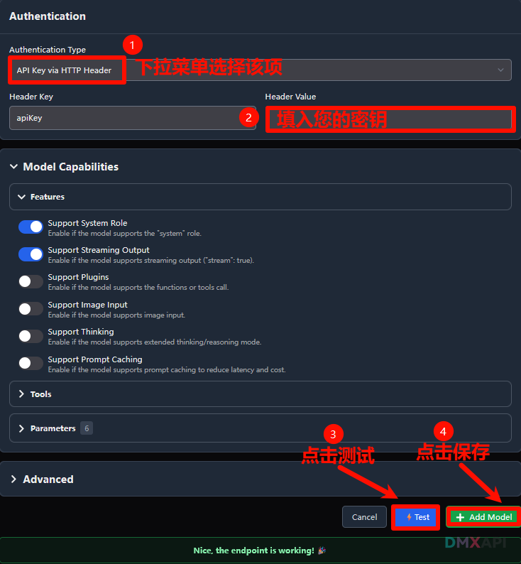
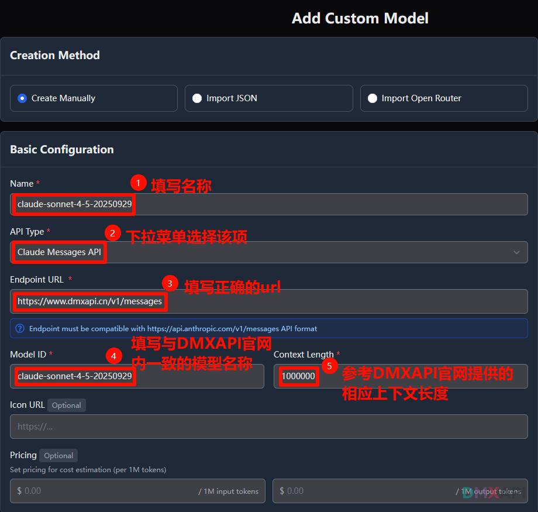
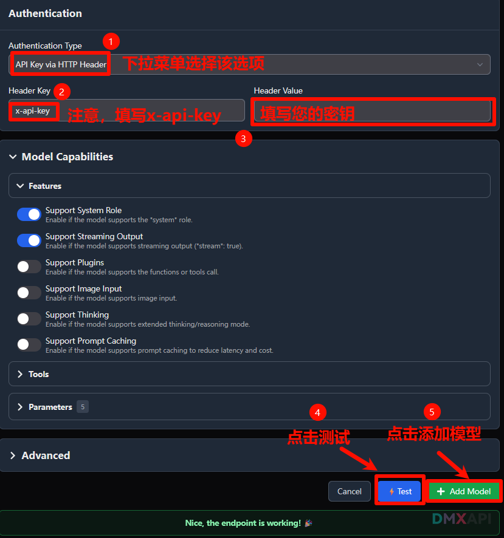

# TypingMind配置方法
**TypingMind** 是一个专用的聊天界面，旨在让您更轻松、更灵活、更高效地使用 ChatGPT、Claude、Gemini 等大型语言模型 (LLM) 或开源模型。您无需在不同的应用程序或网站之间切换，只需连接您自己的 API 密钥，即可在一个统一的平台上访问所有内容。
## 打开模型配置页面

## OpenAI相关配置
#### 1.填写模型名称和url

#### 2.填写key并保存模型

#### 3.简单测试

## Gemini相关配置

#### 1.填写模型名称和url

#### 2.填写key并保存模型

#### 3.简单测试

## Claude相关配置

#### 1.填写模型名称和url
  

#### 2.填写key并保存模型

#### 3.简单测试

